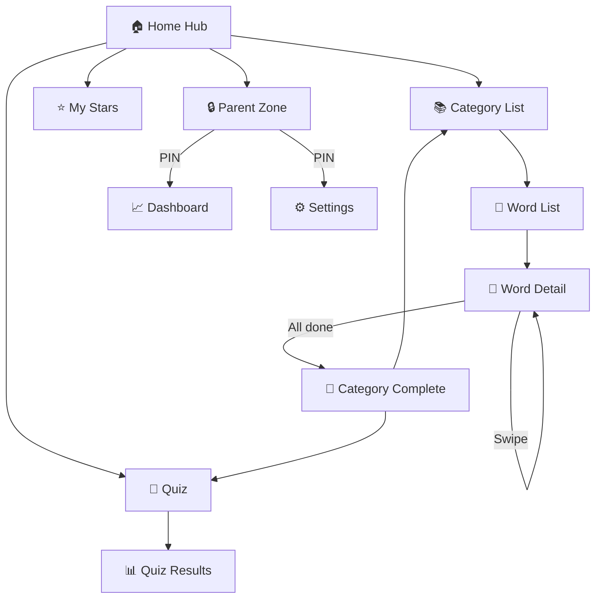
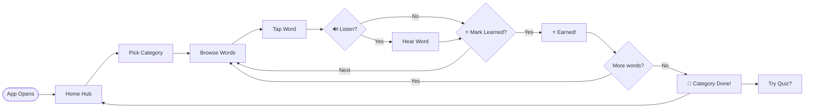
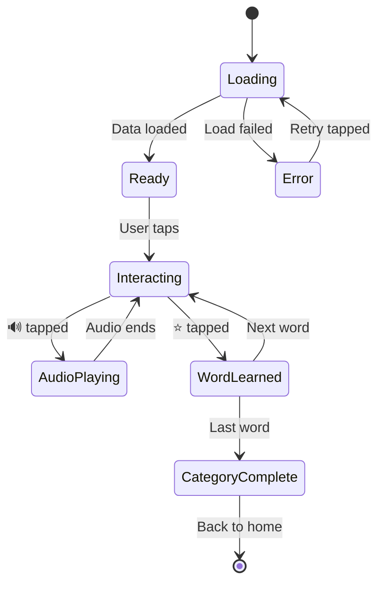
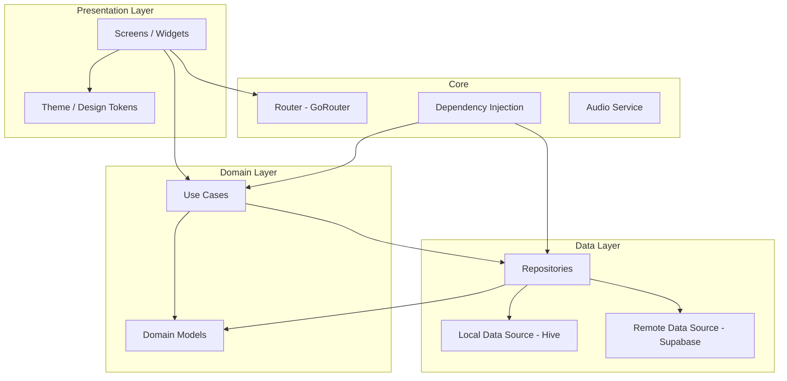
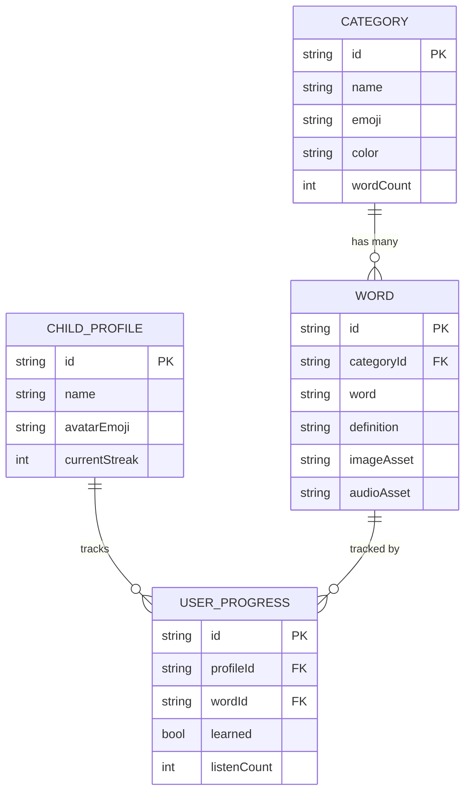
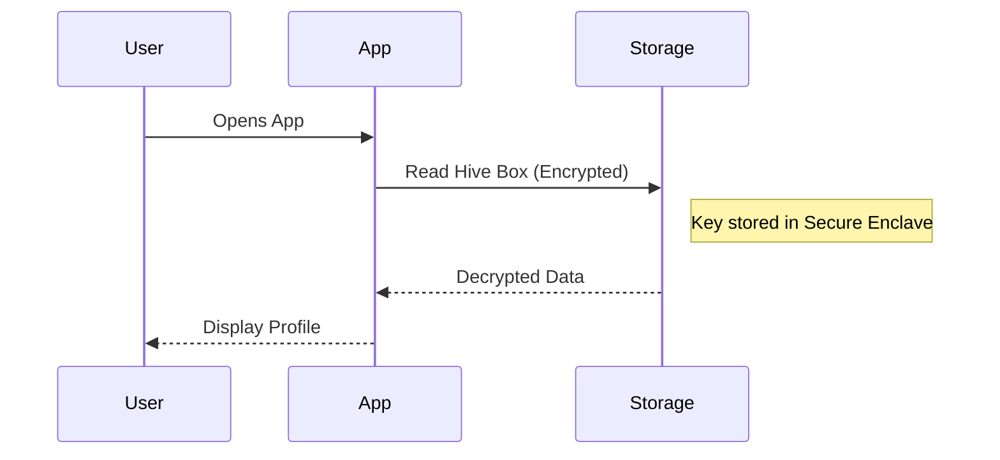
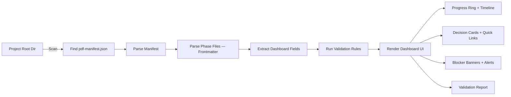

<!-- START_OF_FILE: 06-phase-discovery.md -->

# FILE: 06-phase-discovery.md

# Phase 1: Discovery — Requirements & User Understanding

> **Version:** PDF v1.0.0 | **Kit:** Planning Kit
> **Stage:** 2 (Interactive Planning) | **Phase:** 1 of 6
> **Tier:** All | **Duration:** 45 min – 2 hours
> **Prerequisite:** Stage 1 (Stakeholder Discovery) complete

---

## Purpose

Discovery is the **divergent** phase — cast a wide net on what the product could do, who it serves, and what success looks like. Later phases will converge and narrow.

This phase is broken into **5 focused sessions (bites)** so the AI gives deep, comprehensive responses instead of shallow overviews. Each bite is a complete conversation turn with one focused goal.

**At the end of this phase, you will have:**
- Real user pain points gathered from platform research
- User personas grounded in actual user behavior
- Functional and non-functional requirements categorized by priority
- User stories with acceptance criteria
- Edge cases and error scenarios
- A clear scope boundary (in/out for v1.0)

---

## Phase Structure: 5 Bites

```
BITE 1: Platform Research          (15-30 min)
  AI researches real user pain points across multiple platforms
  Output: Research findings document

BITE 2: Personas & User Profiles   (10-15 min)
  Informed by research, craft data-driven personas
  Output: 2-4 personas with scenarios

BITE 3: Requirements Deep Dive     (15-20 min)
  MoSCoW requirements, broken into sub-categories
  Output: Functional + non-functional requirements

BITE 4: User Stories & Edge Cases  (10-15 min)
  Convert top requirements into stories with edge cases
  Output: Stories with acceptance criteria

BITE 5: Scope Lock                 (5-10 min)
  Define v1.0 boundary, explicitly exclude items
  Output: Scope boundary document
```

Each bite follows the 4-sub-step loop: **AI Proposes → Human Reviews → AI Refines → Human Confirms → SAVE**.

---

## Bite 1: Platform Research

> **Goal:** Ground the discovery in REAL user pain points, not assumptions.
> **Duration:** 15-30 min | **This is the most important bite.**

The AI conducts structured research across multiple platforms before forming any opinions about requirements. This ensures the product addresses real problems.

### Research Sources (search in this order)

```
1. APP STORE / PLAY STORE REVIEWS (Highest value)
   Search for: top 5-10 competitors in this category
   Focus on: 1-3 star reviews (pain points)
   Extract: What users hate, what's missing, what broke

2. REDDIT / FORUMS
   Search for: subreddits related to the domain
   Focus on: "I wish there was..." and "Why doesn't [app] do..."
   Extract: Unmet needs, frustrations, feature requests

3. PRODUCT HUNT / ALTERNATIVES.TO
   Search for: recently launched products in this space
   Focus on: Comments, upvotes, criticism
   Extract: What resonated, what was missing, market appetite

4. TWITTER/X / SOCIAL MEDIA
   Search for: complaints about existing solutions
   Focus on: Viral frustration threads, influencer reviews
   Extract: Emotional pain points, dealbreakers

5. INDUSTRY BLOGS / REVIEWS
   Search for: "[category] app comparison 2025/2026"
   Focus on: Professional reviews highlighting gaps
   Extract: Expert-identified weaknesses in current market

6. Q&A PLATFORMS (Stack Overflow, Quora)
   Search for: "how to [problem this product solves]"
   Focus on: Frequency of question, quality of existing answers
   Extract: How people currently DIY the solution
```

### Research Prompts for Cloud AI

**Prompt 1: Competitor Review Mining**
```
Search for the top 5-10 apps/products in the [CATEGORY] space 
on [App Store / Product Hunt / relevant platform].

For each competitor:
1. Name and rating
2. Top 3 praised features (from 5-star reviews)
3. Top 5 complaints (from 1-3 star reviews)
4. Most requested missing feature
5. Pricing model

Then synthesize: What are the TOP 10 pain points across ALL 
competitors? Rank by frequency (how many apps have this complaint).
```

**Prompt 2: Community Pain Point Discovery**
```
Search Reddit, forums, and social media for discussions about 
[PROBLEM DOMAIN].

Find:
1. The 5 most common complaints people have about existing solutions
2. The 3 most requested features that don't exist yet
3. Any workarounds people are using (hacks, spreadsheets, manual processes)
4. Any emerging trends or shifts in what users want
5. Specific quotes that capture the emotional frustration

Format each finding as:
  PAIN POINT: [Description]
  FREQUENCY: [How often this appears]
  EVIDENCE: [Source + quote or data point]
  OPPORTUNITY: [How our product could address this]
```

**Prompt 3: Underserved Audience Discovery**
```
Based on the reviews and discussions found:

1. Are there user segments that existing products IGNORE?
   (e.g., non-English speakers, accessibility needs, specific age groups)
2. Are there use cases that are poorly served?
   (e.g., offline use, family sharing, enterprise features)
3. Are there price points that are underserved?
   (e.g., everything is $10/mo, nothing is free or one-time purchase)

For each underserved segment, describe:
  WHO: [The ignored audience]
  WHY IGNORED: [Why competitors don't serve them]
  OPPORTUNITY SIZE: [Rough estimate — niche or mainstream?]
  OUR FIT: [Could we serve them? What would it take?]
```

### Research Output Template

```markdown
## Platform Research Findings — [PROJECT_NAME]

### Competitors Analyzed
| # | Name | Platform | Rating | Key Strength | Key Weakness |
|---|---|---|---|---|---|
| 1 | [App A] | [iOS/Web] | [4.2] | [Best at X] | [Fails at Y] |
| 2 | [App B] | [Android] | [3.8] | [Best at X] | [Fails at Y] |

### Top 10 User Pain Points (ranked by frequency)
| Rank | Pain Point | Frequency | Sources | Severity |
|---|---|---|---|---|
| 1 | [e.g., No offline mode] | 5/5 competitors | Reviews, Reddit | HIGH |
| 2 | [e.g., Too many ads] | 4/5 competitors | Reviews, Twitter | HIGH |
| 3 | [e.g., No progress tracking] | 3/5 competitors | Reviews | MEDIUM |

### Unmet Needs (features users want but nobody provides)
1. [Need] — Evidence: [source]
2. [Need] — Evidence: [source]
3. [Need] — Evidence: [source]

### Underserved Audiences
1. [Audience] — Why ignored: [reason] — Opportunity: [assessment]

### Workarounds Users Currently Use
1. [Workaround] — What it tells us: [insight]

### Key Quotes (real user voices)
> "[Quote from review/forum]" — [Source, Date]
> "[Quote from review/forum]" — [Source, Date]

### Synthesis: Our Opportunity
[2-3 paragraph summary: what the research tells us about WHERE
our product should focus to win. Which pain points to solve,
which audiences to target, what differentiates us.]
```

**Save as:** `p_10_requirements.md` as the opening section, or save separately as `docs/p_11_platform_research.md` for reference.

### 🧑 Suggested Human Activities (Optional but High-Value)

After the AI completes its platform research, the facilitator should suggest manual activities the user can do to **validate and enrich** the findings. These are things AI cannot do.

**The AI says:**
```
"The research above is based on publicly available data. To make 
our discovery even stronger, here are optional activities you can 
do yourself. Each one significantly improves the quality of our 
requirements. Pick any that fit your timeline."
```

**Activity Menu (AI presents all, user picks):**

```
⚡ QUICK (30 min or less — do before next bite)
─────────────────────────────────────────────
□ Download top 3 competitor apps
  Use each for 10 minutes. Note what's good, what's frustrating.
  YOUR experience as a user is data the AI can't generate.

□ Read 20 recent 1-star reviews
  Open App Store/Play Store for top 2 competitors.
  Screenshot the most insightful negative reviews.
  Share the screenshots — AI will incorporate them.

□ Search Reddit/Twitter for 15 minutes
  Search "[domain] + frustrated" or "[competitor] + hate"
  Copy-paste 3-5 interesting threads/posts back to the AI.

⏱️ MEDIUM (1-3 hours — do before finalizing requirements)
─────────────────────────────────────────────
□ Talk to 3-5 potential users
  Ask: "How do you currently [solve this problem]?"
  Ask: "What do you wish existed?"
  Ask: "Would you pay for [proposed solution]?"
  Report back key quotes — AI will weave into personas.

□ Run a quick survey (Google Forms / Typeform)
  5 questions max. Share in relevant communities.
  Even 10-20 responses are valuable data.
  AI can help draft the survey questions.

□ Join 2-3 relevant communities
  Facebook groups, Discord servers, subreddits.
  Lurk and read the top 10 posts. What problems keep appearing?
  Don't pitch — just listen and learn.

□ Test accessibility
  Turn on screen reader / large text on your phone.
  Try 2 competitor apps with accessibility on.
  Note what breaks — these are your differentiation opportunities.

🔬 DEEP (1-3 days — do before scope lock)
─────────────────────────────────────────────
□ Build a landing page (Carrd / Framer / simple HTML)
  Describe the product. Add a "Join waitlist" button.
  Share in relevant communities. Track signups.
  Real interest data beats all assumptions.

□ Create a clickable prototype (Figma / paper sketches)
  Show 3-5 people. Watch them try to use it.
  Where do they get confused? That's your UX priority list.

□ Interview a domain expert
  Find someone who works in this domain professionally.
  30-minute call. Ask what the real problems are.
  Often reveals pain points users can't articulate themselves.
```

**After any human activity, report findings back to the AI:**
```
"I tried [competitor X] for 10 minutes. Here's what I found:
- [Observation 1]
- [Observation 2]
- [Key frustration]

Please factor this into our personas and requirements."
```

The AI incorporates human findings into the existing research, updating pain point rankings and adding new insights. Human observations are tagged as `[HUMAN VALIDATED]` in the research document for higher confidence.

**Facilitator reminder at the end of Bite 1:**
```
"Before we move to personas, do you want to do any quick manual 
research? Even 15 minutes downloading a competitor app gives us 
data I can't generate. 

If you'd rather continue now, we can — you can always come back 
with findings later and I'll update the requirements."
```

---

## Bite 2: Personas & User Profiles

> **Goal:** Build data-driven personas informed by the research, not invented from thin air.
> **Duration:** 10-15 min

Now that research has revealed real pain points and real user behaviors, create personas that reflect actual users — not generic archetypes.

### Persona Template

```markdown
### Persona: [NAME]

**Type:** [Primary User / Secondary User / Admin / Buyer]
**Based on:** [Which research findings informed this persona]
**Age/Demographics:** [If relevant]
**Tech Comfort:** [Low / Medium / High]
**Context:** [When, where, what device, how often]

**Goals:**
- [What they want to achieve — informed by research]
- [What success looks like for them]

**Frustrations (from research):**
- [Pain point they ACTUALLY experience — with evidence]
- [What they hate about current solutions]
- [Quote from reviews/forums that captures this]

**Current Behavior:**
- [How they solve this problem today]
- [Workarounds they use]
- [What they've tried and abandoned]

**What Would Make Them Switch:**
- [Specific feature/quality that would pull them from competitors]
- [Dealbreaker if missing]

**Key Scenarios:**
1. [First-time use: what triggers them to try our product?]
2. [Core loop: what does a typical session look like?]
3. [Retention: what brings them back?]
4. [Edge case: what unusual thing might they try?]
```

**Facilitator prompt:**
```
"Based on the research we just did, I see [N] distinct user types 
emerging from the data. Let me draft a persona for each — grounded 
in the actual pain points and behaviors we found."

"Notice that Persona A maps to pain points #1 and #3 from our 
research, while Persona B maps to pain points #2 and #5."
```

---

## Bite 3: Requirements Deep Dive

> **Goal:** Comprehensive requirements, broken into digestible sub-categories.
> **Duration:** 15-20 min

Instead of one massive requirements dump, the AI proposes requirements in **sub-categories**, one at a time. This produces deeper, more thoughtful coverage.

### Sub-Category Sequence

```
The AI presents requirements ONE category at a time:

Category A: Core Functionality
  "Here are the core features that directly solve the pain points 
   we identified. Let's review each one."
  → Human reviews → AI refines → confirm

Category B: User Experience & Interactions
  "Now let's cover how users interact — navigation, feedback, 
   animations, accessibility."
  → Human reviews → AI refines → confirm

Category C: Data & Content
  "What content does the app need? How is it structured, stored, 
   and updated?"
  → Human reviews → AI refines → confirm

Category D: Platform & Technical
  "Performance targets, device support, offline capability, 
   storage limits."
  → Human reviews → AI refines → confirm

Category E: Privacy, Security & Compliance
  "Data handling, user accounts, age gates, regulatory requirements."
  → Human reviews → AI refines → confirm

Category F: Business & Monetization
  "Pricing model, analytics, A/B testing, growth features."
  → Human reviews → AI refines → confirm
```

### Requirements Table (per category)

```markdown
## Category [A]: Core Functionality

| ID | Requirement | Priority | Persona | Pain Point # | Acceptance Criteria |
|---|---|---|---|---|---|
| FR-01 | [Feature] | MUST | [Persona] | #[N] | [Criteria] |
| FR-02 | [Feature] | MUST | [Persona] | #[N] | [Criteria] |
| FR-03 | [Feature] | SHOULD | [Persona] | #[N] | [Criteria] |
```

**Key: Link every requirement to a research pain point.** If a requirement can't be traced to a real pain point, question whether it's needed.

### Non-Functional Requirements Template

```markdown
## Non-Functional Requirements

| ID | Category | Requirement | Target | Measurement |
|---|---|---|---|---|
| NFR-01 | Performance | App launch time | < 3s cold start | Instrumented timing |
| NFR-02 | Performance | Screen transition | < 300ms | Frame profiling |
| NFR-03 | Storage | Initial app size | < 50MB | Build output |
| NFR-04 | Accessibility | Screen reader | WCAG 2.1 AA | Audit tool |
| NFR-05 | Privacy | Child data | Zero PII collected | Code review |
| NFR-06 | Reliability | Crash rate | < 0.1% sessions | Crash analytics |
| NFR-07 | Compatibility | iOS minimum | iOS 15+ | Device matrix |
| NFR-08 | Offline | Core features | 100% offline | Airplane mode test |
```

---

## Bite 4: User Stories & Edge Cases

> **Goal:** Convert top requirements into implementable stories with edge cases.
> **Duration:** 10-15 min

Focus on MUST and top SHOULD requirements only. Don't write stories for COULD/WON'T.

### User Story Format

```
As a [PERSONA],
I want to [ACTION],
so that [BENEFIT].

Research basis: Pain point #[N]: "[brief quote]"

Acceptance Criteria:
- [ ] [Specific, testable criterion 1]
- [ ] [Specific, testable criterion 2]
- [ ] [Specific, testable criterion 3]

Edge Cases:
- [What if X happens?] → [Expected behavior]
- [What if user does Y?] → [Expected behavior]
```

### Edge Case Master Checklist

After writing stories, run through this checklist to catch missing edge cases:

```
NETWORK
□ No internet — what happens?
□ Slow connection — timeout handling?
□ Mid-operation disconnect — data loss?

DATA
□ Empty state — first launch, no content yet?
□ Full storage — device at capacity?
□ Corrupted data — graceful recovery?

USER BEHAVIOR
□ Rapid taps / double submit?
□ Back button / swipe back mid-flow?
□ App killed and reopened — state preserved?
□ Accessibility tools active?
□ Extremely long input text?

DEVICE
□ Minimum supported OS version?
□ Small screen (iPhone SE) vs large (iPad Pro)?
□ Permissions denied?
□ Low battery / power saver mode?

CONTENT
□ Missing asset (image/audio not found)?
□ Content in unexpected language?
□ Content longer than expected?
```

---

## Bite 5: Scope Lock

> **Goal:** Draw a clear line around v1.0. Prevents "just one more feature" during building.
> **Duration:** 5-10 min

```markdown
## Scope Boundary — v1.0

### IN SCOPE (committed)
Everything in MUST and SHOULD requirements.
Specifically:
- [Feature 1] — addresses pain points #X, #Y
- [Feature 2] — addresses pain point #Z
- [Feature 3] — key differentiator vs competitors

### OUT OF SCOPE (explicitly deferred)
- [Feature A] — reason: [too complex for v1.0]
- [Feature B] — reason: [needs more user validation]
- [Feature C] — reason: [regulatory blocker]

### STRETCH GOALS (only if MUST+SHOULD finish early)
- [Feature X] — from COULD requirements
- [Feature Y] — from COULD requirements

### SCOPE LOCK RULE
After this document is confirmed, new features require 
Gate 2 (Milestone Start) approval. The user must say:
"I want to add [feature] to scope" and accept the 
timeline/effort impact. No silent scope creep.
```

---

## Complete Deliverable

**File:** `p_10_requirements.md`

```markdown
---
pdf_version: "1.0.0"
project_id: "[project-slug]"
project_name: "[Project Name]"
kit: "planning"
phase: 1
phase_name: "Discovery"
status: "confirmed"
tier: "standard"
created_at: "YYYY-MM-DD"
confirmed_at: "YYYY-MM-DD"
confirmed_by: "human"
---

# Requirements — [PROJECT_NAME]

## Platform Research Findings
[From Bite 1 — or link to docs/p_11_platform_research.md]

## Personas
[From Bite 2 — 2-4 data-driven personas]

## Requirements by Category
[From Bite 3 — sub-categorized, each linked to pain points]
  - Category A: Core Functionality
  - Category B: User Experience
  - Category C: Data & Content
  - Category D: Platform & Technical
  - Category E: Privacy & Compliance
  - Category F: Business & Monetization

## Non-Functional Requirements
[From Bite 3 — performance, accessibility, reliability targets]

## User Stories
[From Bite 4 — MUST + SHOULD stories with acceptance criteria]

## Edge Cases
[From Bite 4 — master checklist]

## Scope Boundary
[From Bite 5 — in/out/stretch/lock rule]
```

**Save-As-You-Go checkpoints:**
```
After Bite 1 → Save Project Background to `p_10_requirements.md`
After Bite 2 → Save Core Constraints to `p_10_requirements.md`
After Bite 3 → Save Scope Definition to `p_10_requirements.md`
After Bite 4 → Save User Personas to `p_10_requirements.md`
After Bite 5 → Save Success Metrics to `p_10_requirements.md`
After all    → Final confirmation of `p_10_requirements.md`
```

---

## Tier Adjustments

| Aspect | Lite | Standard | Enterprise |
|---|---|---|---|
| Platform Research | Top 3 competitors, 1 search | Top 5-10, all 6 sources | Full + paid research tools |
| Personas | 1-2, brief | 2-4, with research links | 3-5, with journey maps |
| Req Categories | A + D only | All 6 categories | All + traceability matrix |
| User Stories | 3-5 core | 8-15 stories | 15-30 + acceptance matrices |
| Edge Cases | Top 5 critical | Full checklist | Full + risk ratings per case |
| Scope Lock | Simple in/out | Detailed with rationale | Formal change request process |

---

## Facilitator Behavior for This Phase

```
CRITICAL RULES:

1. RESEARCH FIRST, OPINIONS SECOND
   Never propose requirements without conducting platform research 
   first. Every recommendation should cite a finding.

2. ONE BITE AT A TIME
   Present one category/section, wait for review, refine, confirm.
   Don't dump 50 requirements at once.

3. LINK TO EVIDENCE
   Every MUST requirement should trace to a research finding.
   "Based on pain point #3 (no offline support, cited in 5/5 
   competitor reviews), I recommend FR-03: Full offline mode."

4. CHALLENGE ASSUMPTIONS
   If the user adds a requirement without evidence, ask:
   "Did we see this need in the research? Is it a real pain point 
   or an assumption?" It's OK to proceed, but flag the risk.

5. QUANTITY CHECK
   After all categories, count requirements:
   Lite:       5-15 total (don't over-engineer)
   Standard:   15-30 total
   Enterprise: 30-50 total
   If significantly over: "We have [N] requirements. That's heavy 
   for [tier] tier. Want to re-prioritize?"
```


<!-- END_OF_FILE: 06-phase-discovery.md -->

---


<!-- START_OF_FILE: 07-phase-strategy.md -->

# FILE: 07-phase-strategy.md

# Phase 2: Strategy — Technical Decisions & Project Roadmap

> **Version:** PDF v1.0.0 | **Kit:** Planning Kit
> **Stage:** 2 (Interactive Planning) | **Phase:** 2 of 6
> **Tier:** All | **Duration:** 30 min – 1.5 hours
> **Prerequisite:** Phase 1 (Discovery) confirmed

---

## Purpose

Strategy is the **convergent** phase — take everything from Discovery and make hard decisions. What technology to use, how to monetize, and what the milestone plan looks like.

This phase is broken into **4 focused bites.** Each decision is explored and reasoned — never rushed.

**At the end of this phase, you will have:**
- Technology stack decisions with rationale and rejected alternatives
- Monetization and business model selected from compared options
- A milestone plan designed as quick wins
- Risk register with mitigations

---

## Phase Structure: 4 Bites

```
BITE 1: Technology Stack Decisions     (15-30 min)
  AI proposes 2-3 alternatives per decision with comparison
  Each decision explored ONE AT A TIME
  Output: Confirmed tech stack with rationale

BITE 2: Business Model & Monetization  (10-15 min)
  AI proposes 2-3 relevant models with comparison table
  Output: Selected model with pricing and growth plan

BITE 3: Milestone Plan                 (10-20 min)
  Quick wins — more milestones, smaller goals
  Each milestone = 1 demo-able outcome in ≤1 day
  Output: Milestone plan with dependencies

BITE 4: Risk Register                  (5-10 min)
  Identify top risks, map to milestone mitigations
  Output: Risk register with severity + mitigations
```

Each bite follows: **AI Proposes → Human Reviews → AI Refines → Human Confirms → SAVE**.

---

## Bite 1: Technology Stack Decisions

> **Goal:** Choose the right tools for the job with clear reasons why.
> **Duration:** 15-30 min

### Core Rule: One Decision at a Time, Always 2-3 Options

The AI walks through each technology decision **individually**. For EACH one, it presents **2-3 realistic alternatives** with a comparison table. Never dump all decisions at once.

### Decision Flow (repeat for each decision)

```
Step 1: FRAME THE DECISION
  "The next decision is [Frontend Framework]. Based on your 
  requirements (FR-03: offline mode, NFR-08: 100% offline, 
  budget: $0), here are 3 options."

Step 2: PRESENT COMPARISON TABLE
  ┌────────────────────────────────────────────────────────────┐
  │  DECISION: Frontend Framework                              │
  │                                                            │
  │  YOUR KEY REQUIREMENTS:                                    │
  │  • FR-03: Full offline mode                                │
  │  • NFR-07: iOS 15+ and Android 10+                         │
  │  • Budget: $0 development cost                             │
  │  • Team: Solo developer + AI agent                         │
  ├────────────────────────────────────────────────────────────┤
  │                                                            │
  │  Option A: Flutter (Dart)                                  │
  │  ✅ Native cross-platform from single codebase              │
  │  ✅ Excellent offline support (Hive, SQLite)                │
  │  ✅ Hot reload = fast development                           │
  │  ⚠️ Large app size (~15MB base)                            │
  │  ⚠️ Smaller package ecosystem than React Native             │
  │                                                            │
  │  Option B: React Native (TypeScript)                       │
  │  ✅ Huge ecosystem, familiar web skills                     │
  │  ✅ Large community, many tutorials                         │
  │  ⚠️ Bridge overhead affects performance                    │
  │  ❌ Weaker offline story (more manual work)                 │
  │                                                            │
  │  Option C: Native (Swift + Kotlin)                         │
  │  ✅ Best performance and platform integration               │
  │  ✅ Best offline support                                    │
  │  ❌ Two codebases = double the work                         │
  │  ❌ Solo developer = unsustainable                          │
  │                                                            │
  ├────────────────────────────────────────────────────────────┤
  │                                                            │
  │  COMPARISON MATRIX:                                        │
  │                        Flutter   React Native   Native     │
  │  Offline support:      ★★★★★     ★★★☆☆          ★★★★★      │
  │  Dev speed (solo):     ★★★★★     ★★★★☆          ★★☆☆☆      │
  │  Cross-platform:       ★★★★★     ★★★★☆          ★☆☆☆☆      │
  │  Performance:          ★★★★☆     ★★★☆☆          ★★★★★      │
  │  Ecosystem:            ★★★★☆     ★★★★★          ★★★★★      │
  │  Learning curve:       ★★★☆☆     ★★★★☆          ★★☆☆☆      │
  │  App size:             ★★★☆☆     ★★★★☆          ★★★★★      │
  │                                                            │
  └────────────────────────────────────────────────────────────┘

Step 3: AI RECOMMENDS WITH REASONING
  "I recommend Option A (Flutter) because:
  1. Your #1 requirement (FR-03: offline) is natively strong
  2. Single codebase is critical for a solo developer
  3. Hot reload speeds up AI-assisted development
  4. The app size tradeoff (15MB) is acceptable for your use case
  
  The main risk is Dart's smaller ecosystem, but for a kids' 
  vocabulary app, the packages we need (audio, animation, 
  local DB) are mature."

Step 4: HUMAN CHOOSES
  User picks an option (or asks for more detail on one).
  AI records: Decision + Rationale + What was rejected and why.

Step 5: MOVE TO NEXT DECISION
  "Great, Flutter it is. Next decision: Database..."
```

### Decision Areas (explored one by one)

```
1. Frontend Framework & Language
   └── Options shaped by: platform targets, offline needs, team skills

2. State Management
   └── Options shaped by: app complexity, testability requirements

3. Backend / BaaS
   └── Options shaped by: budget, auth needs, data sync model

4. Database (Local + Remote)
   └── Options shaped by: offline support, query complexity, data size

5. Hosting & Infrastructure
   └── Options shaped by: budget, scale, compliance jurisdiction

6. CI/CD Pipeline (Standard+)
   └── Options shaped by: team size, deployment frequency

7. Third-Party Services
   └── Options shaped by: auth, payments, analytics, notifications
```

### Stack Summary Output

After all decisions are made:

```markdown
## Technology Stack — [PROJECT_NAME]

### Decision Log

| # | Decision | Chosen | Why | Rejected | Why Not |
|---|---|---|---|---|---|
| 1 | Frontend | Flutter | Offline-first, cross-platform, solo dev | React Native | Weaker offline; Native: double work |
| 2 | State | Riverpod | Type-safe, testable, no boilerplate | BLoC | Too verbose for this scope |
| 3 | Backend | Supabase | Free tier, built-in auth, Postgres | Firebase | Vendor lock-in, COPPA complexity |
| 4 | Local DB | Hive | Ultra-fast, offline-first, no SQL needed | SQLite | Overkill for key-value data |
| 5 | Hosting | Vercel Edge | Auto-deploy, free tier sufficient | AWS | Over-engineered for this scale |
| 6 | CI/CD | GitHub Actions | Free for public repos, integrated | GitLab CI | Team already uses GitHub |
| 7 | Analytics | PostHog | Privacy-first, self-host option | GA4 | Children's data concerns |

### Full Stack Diagram
[AI draws a simple architecture showing how components connect]
```

### 🧑 Suggested Human Activities

```
⚡ QUICK (before confirming stack)
□ Search "[framework] + [key requirement]" for each choice
  Confirm mature packages exist. Share any concerns with AI.

□ Check free tier limits
  Open pricing pages for Supabase/Firebase/hosting.
  Confirm free tier covers your expected usage. Report surprises.

⏱️ MEDIUM (before starting milestones)
□ Build a 1-hour spike
  Create a tiny project: install framework → call DB → confirm offline.
  Test the SINGLE riskiest technical assumption.
  Report: "It worked" or "I hit a wall with [X]."

□ Assess your own skills honestly
  If you've never used [framework], try the official tutorial.
  Tell AI: "I'm comfortable" or "I need extra time to learn."
  AI adjusts milestone estimates accordingly.
```

---

## Bite 2: Business Model & Monetization

> **Goal:** Select the right business model from compared options.
> **Duration:** 10-15 min

### Core Rule: Present 2-3 Relevant Models, Not All Possible Models

The AI selects 2-3 models that **actually fit this project** based on audience, domain, and constraints. It does NOT list every possible model — only realistic ones.

### Model Comparison Flow

```
Step 1: AI SELECTS RELEVANT MODELS
  "Based on your project (kids vocabulary app, COPPA-compliant,
  offline-first, parents are the buyers), I see 3 viable models."

Step 2: AI PRESENTS COMPARISON TABLE
  ┌────────────────────────────────────────────────────────────┐
  │  BUSINESS MODEL OPTIONS                                    │
  │                                                            │
  │  Option A: Freemium (Core free, Premium unlock)            │
  │  ✅ Low barrier to entry → high download count              │
  │  ✅ Parents can try before buying                           │
  │  ✅ App Store friendly (no mandatory paywall)               │
  │  ⚠️ Conversion rate typically 3-5%                         │
  │  Revenue: $5 one-time × 4% of 1,000 users = $200/month    │
  │                                                            │
  │  Option B: One-Time Purchase ($4.99)                       │
  │  ✅ Simple — pay once, get everything                       │
  │  ✅ No ongoing feature gating                               │
  │  ✅ Parents prefer this for kids' apps                      │
  │  ⚠️ Lower download count (price scares away browsers)      │
  │  Revenue: $5 × 200 buyers = $1,000 total                  │
  │                                                            │
  │  Option C: Subscription ($2.99/month)                      │
  │  ✅ Recurring revenue                                       │
  │  ✅ Funds ongoing content development                       │
  │  ⚠️ Parents resist subscriptions for kids' apps            │
  │  ⚠️ Higher churn rate                                      │
  │  Revenue: $3/mo × 50 subscribers = $150/month              │
  │                                                            │
  ├────────────────────────────────────────────────────────────┤
  │                                                            │
  │  COMPARISON:                                               │
  │                      Freemium   Purchase   Subscription    │
  │  Barrier to entry:   ★★★★★      ★★★☆☆      ★★★★☆          │
  │  Revenue/user:       ★★★☆☆      ★★★★☆      ★★★★★          │
  │  Parent preference:  ★★★★☆      ★★★★★      ★★☆☆☆          │
  │  Implementation:     ★★★☆☆      ★★★★★      ★★☆☆☆          │
  │  Content funding:    ★★☆☆☆      ★★☆☆☆      ★★★★★          │
  │                                                            │
  └────────────────────────────────────────────────────────────┘

Step 3: AI RECOMMENDS
  "I recommend Option A (Freemium) because:
  1. COPPA means NO ads, so freemium is the natural alternative
  2. Parents need to see the app is quality before paying
  3. High SAM to TAM ratio with free downloads
  4. One-time $4.99 premium unlock keeps it simple
  
  Risk: Low conversion. Mitigation: Make free tier genuinely 
  useful (50 words) so parents see value before premium (200+ words)."

Step 4: HUMAN CHOOSES
  User picks. AI records decision.
```

### Business Model Output

```markdown
## Business Model — [PROJECT_NAME]

**Selected Model:** [e.g., Freemium with one-time premium unlock]
**Why This Model:** [2-3 sentence reasoning]

### Models Compared
| Aspect | Freemium ✅ | One-Time Purchase | Subscription |
|---|---|---|---|
| Barrier to entry | Free download | $4.99 upfront | Free trial needed |
| Revenue per user | $5 (if converts) | $5 guaranteed | $36/year |
| Parent preference | High | Highest | Low |
| Why rejected | — | Lower reach | Parents resist for kids |

### Free Tier
- [What's included — enough to be useful]
- [Clear limitation that creates upgrade desire]

### Premium Tier
- **Price:** [e.g., $4.99 one-time]
- **Unlock:** [What premium adds]
- **Payment:** [App Store IAP]

### Revenue Projections
| Month | Free Users | Conversion | Paid Users | Revenue |
|---|---|---|---|---|
| 1 | 500 | 4% | 20 | $100 |
| 3 | 2,000 | 5% | 100 | $500 |
| 6 | 5,000 | 5% | 250 | $1,250 |

### Growth Strategy
- **Acquisition:** [e.g., ASO, parent forums, social media]
- **Retention:** [e.g., daily streak, new content drops]
- **Referral:** [e.g., "Share with a friend" for bonus content]
```

---

## Bite 3: Milestone Plan

> **Goal:** Break the build into quick wins. More milestones, smaller goals.
> **Duration:** 10-20 min

### Core Rule: Quick Wins > Big Milestones

Every milestone should feel like a **small victory**. The developer sees progress, stays motivated, and can demo something real after each one.

```
QUICK WIN DESIGN RULES:

1. Each milestone = 1 DEMO-ABLE outcome
   "After M3, you can show someone: 'Look, the app plays audio 
   when you tap a word!'"

2. Max effort: 1 day per milestone (prefer half-day)
   If it's bigger → split it into 2 quick wins

3. Stack wins earliest
   Put the satisfying, visible wins first (UI, interactions, sound)
   Save invisible work (refactoring, optimization) for later

4. First milestone is ALWAYS the Walking Skeleton
   App launches → shows one screen → one user action works
   Proves: "The tech stack works. We can build from here."

5. Every 3 milestones = celebration checkpoint
   AI says: "🎉 You've completed 3 milestones! Here's what 
   you've built so far: [summary]. Keep going!"

6. Total milestones by tier:
   Lite:       3-5 quick wins
   Standard:   6-12 quick wins
   Enterprise: 10-20 quick wins
```

### Milestone Structure: Small Bites

Instead of big milestones like "Build content system" (too vague, too big), break into quick wins:

```
❌ BAD (too big):
  M2: Build content system (3 days)

✅ GOOD (quick wins):
  M2: Display word list with categories (4 hours)
  M3: Tap word → show detail screen (3 hours)
  M4: Add pronunciation audio playback (4 hours)
  M5: Add progress tracking per word (4 hours)

Each one is demo-able. Each one feels like progress.
```

### Milestone Plan Template

```markdown
## Milestone Plan — [PROJECT_NAME]

### Quick Win Summary
| # | Quick Win | What You Can Demo After | Effort | Stream Deps |
|---|---|---|---|---|
| M1 | Walking Skeleton | "App launches and shows a screen" | 4h | None |
| M2 | Category browsing | "User picks a category and sees words" | 4h | None |
| M3 | Word detail screen | "Tap a word → see image + info" | 4h | None |
| M4 | Audio playback | "Tap 🔊 → hear the word spoken" | 4h | A2 (audio files) |
| M5 | Progress tracking | "Stars show which words are learned" | 4h | None |
| M6 | Interactive quiz | "Kid answers questions about words" | 6h | C1 (word list) |
| M7 | Parent dashboard | "Parent sees child's progress" | 4h | None |
| M8 | Streak system | "3-day streak → celebration animation" | 4h | None |
| M9 | Settings & profiles | "Switch between child profiles" | 4h | None |
| M10 | Polish & animations | "Everything feels smooth and premium" | 6h | A1 (illustrations) |
| M11 | Testing & QA | "All tests pass, no crashes" | 4h | L1 (COPPA audit) |
| M12 | Launch prep | "Screenshots, store listing, submit" | 4h | K1, L2 |

### Celebration Checkpoints
🎉 After M3:  "You have a browsable word library!"
🎉 After M6:  "You have a working educational game!"
🎉 After M9:  "You have a complete app feature set!"
🎉 After M12: "You're ready to launch!"

### Detailed Quick Wins

#### M1: Walking Skeleton
**Demo:** App launches → shows home screen → navigate to one category → see placeholder words
**Tasks:**
- [ ] Create project with selected stack
- [ ] Set up folder structure (feature-first)
- [ ] Add navigation shell (3-4 screens, placeholder content)
- [ ] One widget test passing
- [ ] Push to Git
**Proves:** Stack works, navigation works, project structure is solid.
**Gate:** Gate 1 (Architecture Approval) after this milestone.

#### M2: Category Browsing
**Demo:** Home screen shows real categories → tap one → word list appears
**Tasks:**
- [ ] Define data model for Category + Word
- [ ] Add local data source (hardcoded for now)
- [ ] Build category grid UI
- [ ] Build word list UI
- [ ] Navigation: home → category → word list
**Depends On:** M1 complete
**No external deps — uses stub data**

#### M3: Word Detail Screen
**Demo:** Tap a word → detail screen with image placeholder + definition
**Tasks:**
- [ ] Build word detail screen
- [ ] Display word, definition, example sentence
- [ ] Image placeholder (replaced with real art in M10)
- [ ] Back navigation
**Depends On:** M2 complete

[Continue for each milestone...]
```

### 🧑 Suggested Human Activities

```
⚡ QUICK
□ Sanity-check with the "evening test"
  For each milestone, ask: "Could I finish this in one evening
  of focused work?" If not, tell AI to split it further.

□ Map to your calendar
  "I work evenings only" → M1 = Monday, M2 = Tuesday, etc.
  Share timeline. AI flags if dependencies don't line up.

□ Pick your first celebration checkpoint
  Which demo would excite you most? AI can reorder milestones
  to get to that satisfying demo sooner.

⏱️ MEDIUM
□ Pre-validate the Walking Skeleton
  Create the project now. Run `flutter create` or `npx create-next-app`.
  Confirm it builds. Report any issues before planning continues.
```

---

## Bite 4: Risk Register

> **Goal:** Identify what could go wrong and plan mitigations now.
> **Duration:** 5-10 min

The AI proposes **2-3 options per risk mitigation** where relevant, presented one at a time.

### Risk Identification

```
The AI presents risks ONE AT A TIME:

"Risk #1: Offline sync conflicts.
 Likelihood: Medium | Impact: High | Severity: 🔴 HIGH

 This matters because your #1 requirement is offline mode.
 If sync fails when the device reconnects, users lose progress.

 Mitigation options:
 A) Last-write-wins (simple, may lose data in rare cases)
 B) Conflict-free merge (complex but no data loss)
 C) Offline-only MVP, add sync in v2 (avoids problem entirely)

 I recommend C for v1.0 — keeps scope manageable. Thoughts?"

[Human responds]

"Risk #2: Content delivery delayed..."
```

### Risk Register Template

```markdown
## Risk Register — [PROJECT_NAME]

| # | Risk | Likelihood | Impact | Severity | Mitigation | Milestone |
|---|---|---|---|---|---|---|
| R1 | [e.g., Offline sync] | Medium | High | 🔴 | Go offline-only v1 | M1 |
| R2 | [e.g., Content delayed] | Medium | High | 🔴 | Start content NOW, parallelize | M4 dep |
| R3 | [e.g., New to Flutter] | High | Medium | 🟡 | Extra time M1, use skill library | M1 |
| R4 | [e.g., COPPA audit fails] | Low | High | 🟡 | Review arch + legal checklist in M1 | M11 |
| R5 | [e.g., Scope creep] | High | Medium | 🟡 | Scope Lock Rule at every gate | All |
| R6 | [e.g., App Store rejection] | Low | High | 🟡 | Follow maintenance-kit checklist | M12 |

### Severity Matrix
              Low Impact    Medium Impact    High Impact
High Likely     🟡 MED         🟡 MED          🔴 HIGH
Med Likely      🟢 LOW         🟡 MED          🔴 HIGH
Low Likely      🟢 LOW         🟢 LOW          🟡 MED

### Rule: HIGH risks get early milestones
Every 🔴 HIGH risk must be mitigated in the FIRST 3 milestones.
Don't wait until M10 to discover your architecture doesn't work offline.
```

---

## Complete Deliverable

**File:** `p_11_strategy.md`

```markdown
---
pdf_version: "1.0.0"
project_id: "[project-slug]"
project_name: "[Project Name]"
kit: "planning"
phase: 2
phase_name: "Strategy"
status: "confirmed"
tier: "standard"
created_at: "YYYY-MM-DD"
confirmed_at: "YYYY-MM-DD"
confirmed_by: "human"
---

# Strategy — [PROJECT_NAME]

## Technology Stack
[From Bite 1 — decision log with alternatives + comparison]

## Business Model
[From Bite 2 — selected model + comparison table + projections]

## Milestone Plan
[From Bite 3 — or link to docs/milestone-plan.md]
[From Bite 3 — or link to docs/p_12_milestone-plan.md]

## Risk Register
[From Bite 4 — ranked risks with mitigations + milestone mapping]
```

**Additional files:**
- `p_12_milestone-plan.md` — standalone milestone document

**Save-As-You-Go checkpoints:**
```
After Bite 1 → Save Stack Selection to `p_11_strategy.md`
After Bite 2 → Save Milestone Roadmap to `p_11_strategy.md`
After Bite 3 → Save Risk Register to `p_11_strategy.md`
After Bite 4 → Save `p_12_milestone-plan.md`
After all    → Final confirmation of `p_11_strategy.md`
```

---

## Tier Adjustments

| Aspect | Lite | Standard | Enterprise |
|---|---|---|---|
| Stack Decisions | 3-4 decisions, 2 options each | All 7, 2-3 options each | Full + vendor evaluation matrix |
| Business Model | Quick decision, 2 options | Full comparison, 3 options | Full + financial model spreadsheet |
| Milestones | 3-5 quick wins, half day each | 6-12 quick wins | 10-20 quick wins + dependency graph |
| Risk Register | Top 3 risks, brief | Top 5-8, mitigations mapped | Full register + quarterly review plan |
| Human Activities | Optional | Recommended | Required (spike + calendar) |
| Celebration Points | After each milestone | Every 3 milestones | Every 3 + formal demo reviews |


<!-- END_OF_FILE: 07-phase-strategy.md -->

---


<!-- START_OF_FILE: 08-phase-ux.md -->

# FILE: 08-phase-ux.md

# Phase 3: UX — User Experience & Flow Design

> **Version:** PDF v1.0.0 | **Kit:** Planning Kit
> **Stage:** 2 (Interactive Planning) | **Phase:** 3 of 6
> **Tier:** Standard + Enterprise (Lite skips) | **Duration:** 30 min – 1 hour
> **Prerequisite:** Phase 2 (Strategy) confirmed

---

## Purpose

UX translates requirements into **how the product actually feels to use.** Where Phase 1 defined WHAT the product does, Phase 3 defines HOW users interact with it — screen by screen, tap by tap.

This phase is broken into **6 focused bites.**

**At the end of this phase, you will have:**
- A complete screen map with navigation flow
- User journey flows for each persona
- Wireframe descriptions for key screens
- Interaction patterns and micro-UX decisions
- Empty state and error flow designs
- Visual flowcharts as downloadable HTML files
- An interactive low-fidelity clickable prototype
- Screen size adaptation notes

---

## Phase Structure: 4 Bites

```
BITE 1: Screen Map & Navigation       (10-15 min)
  Map every screen, define navigation relationships
  Output: Screen map + navigation model

BITE 2: User Journey Flows             (10-15 min)
  Walk each persona through their key scenarios
  Output: Step-by-step journey for each persona

BITE 3: Screen Wireframes              (10-15 min)
  Text-based wireframe descriptions for every screen
  2-3 layout options for key screens
  Output: Screen specs ready for UI design

BITE 4: States & Error Flows           (5-10 min)
  Empty states, loading, errors, edge cases
  Output: Complete state coverage

BITE 5: Visual Flowcharts              (5-10 min)
  AI generates Mermaid diagrams rendered as HTML files
  User downloads/previews in browser for visual validation
  Output: Flowchart HTML files for navigation + journeys

BITE 6: Interactive Lo-Fi Prototype    (10-15 min)
  AI generates a clickable HTML mock-up with screen size notes
  User clicks through flows to validate UX decisions
  Output: prototype.html + screen size adaptation notes
```

Each bite follows: **AI Proposes → Human Reviews → AI Refines → Human Confirms → SAVE**.

---

## Bite 1: Screen Map & Navigation

> **Goal:** Map every screen in the app and how they connect.
> **Duration:** 10-15 min

### Screen Discovery Process

```
Step 1: AI EXTRACTS SCREENS FROM REQUIREMENTS
  Go through every FR (functional requirement) and identify 
  which screens are implied.
  
  "FR-01 (browse by category) implies: Home Screen, Category Screen
   FR-02 (view progress) implies: Parent Dashboard Screen
   FR-10 (audio playback) implies: Word Detail Screen has audio controls
   
   I count [N] distinct screens. Let me map them."

Step 2: AI PRESENTS SCREEN MAP
```

### Screen Map Format

The AI presents 2-3 **navigation model options** with comparison:

```
┌────────────────────────────────────────────────────────────┐
│  NAVIGATION MODEL OPTIONS                                  │
│                                                            │
│  Option A: Tab-Based (Bottom Navigation)                   │
│  ✅ Familiar to mobile users                                │
│  ✅ Quick access to key sections                            │
│  ⚠️ Limited to 3-5 top-level sections                      │
│                                                            │
│  [Home] [Learn] [Quiz] [Progress] [Settings]               │
│    │       │       │       │          │                     │
│    └→ Featured words                                       │
│            └→ Category → Word List → Word Detail            │
│                    └→ Quiz Screen → Results                 │
│                            └→ Dashboard → Reports           │
│                                    └→ Profile, Prefs        │
│                                                            │
│  Option B: Hub-and-Spoke (Single Home Screen)              │
│  ✅ Simple, fewer decisions for young users                  │
│  ✅ Parent section clearly separated                         │
│  ⚠️ More taps to reach deep content                        │
│                                                            │
│  [Home Hub] ──→ Learn ──→ Category ──→ Word Detail          │
│      │──→ Quiz ──→ Quiz Screen ──→ Results                  │
│      │──→ My Stars ──→ Progress View                        │
│      └──→ 🔒 Parent Zone (PIN-gated)                        │
│               ├──→ Dashboard                                │
│               ├──→ Settings                                 │
│               └──→ Manage Profiles                          │
│                                                            │
│  Option C: Progressive (Start simple, unlock sections)     │
│  ✅ Reduces overwhelm for first-time users                   │
│  ✅ Natural onboarding                                       │
│  ⚠️ More complex to implement                               │
│                                                            │
│  COMPARISON:                                               │
│                        Tab-Based  Hub-Spoke  Progressive    │
│  Simplicity for kids:  ★★★☆☆      ★★★★★      ★★★★☆         │
│  Quick access:         ★★★★★      ★★★☆☆      ★★★☆☆         │
│  Parent separation:    ★★★☆☆      ★★★★★      ★★★★☆         │
│  Implementation ease:  ★★★★★      ★★★★☆      ★★☆☆☆         │
│                                                            │
│  Recommendation: Option B (Hub-and-Spoke) because:          │
│  - Target users are age 3-5: fewer decisions = better       │
│  - Parent zone is clearly separated with PIN gate           │
│  - Simpler than Progressive, more focused than Tabs         │
│                                                            │
└────────────────────────────────────────────────────────────┘
```

### Screen Map Output

```markdown
## Screen Map — [PROJECT_NAME]

### Navigation Model: [e.g., Hub-and-Spoke]
**Why:** [Rationale from comparison]

### All Screens

| # | Screen | Parent Screen | Access | Persona | Core Requirement |
|---|---|---|---|---|---|
| 1 | Home Hub | — | App launch | Child | — |
| 2 | Category List | Home Hub | Tap "Learn" | Child | FR-01 |
| 3 | Word List | Category List | Tap category | Child | FR-01 |
| 4 | Word Detail | Word List | Tap word | Child | FR-01, FR-10 |
| 5 | Quiz Screen | Home Hub | Tap "Quiz" | Child | FR-06 |
| 6 | Quiz Results | Quiz Screen | Complete quiz | Child | FR-06 |
| 7 | My Stars | Home Hub | Tap "Stars" | Child | FR-02 |
| 8 | Parent Zone Gate | Home Hub | Tap 🔒 | Parent | Security |
| 9 | Parent Dashboard | Parent Zone | After PIN | Parent | FR-02 |
| 10 | Settings | Parent Zone | Tap settings | Parent | FR-20 |
| 11 | Onboarding | — | First launch | Both | Engagement |

### Navigation Rules
- Back button: always returns to parent screen
- Deep links: none for v1.0
- Parent zone: PIN-gated, never accessible to children
- Timeout: return to Home Hub after 5 min inactive
```

---

## Bite 2: User Journey Flows

> **Goal:** Walk each persona through their key scenarios, tap by tap.
> **Duration:** 10-15 min

### Journey Flow Format

For each persona, the AI maps 2-3 key journeys:

```markdown
### Journey: Child Learns a New Word

Persona: Child (age 3-5)
Trigger: Parent opens app, hands device to child
Goal: Learn 5 new words

FLOW:
┌──────────┐    ┌──────────────┐    ┌───────────┐
│ Home Hub │───→│ Category List │───→│ Word List │
│          │    │ "Animals" 🐶  │    │ Dog, Cat, │
│ [Learn]  │    │ "Food" 🍎     │    │ Bird, ... │
│ [Quiz]   │    │ "Colors" 🎨   │    │           │
│ [Stars]  │    │              │    │           │
└──────────┘    └──────────────┘    └─────┬─────┘
                                          │ tap "Dog"
                                    ┌─────▼─────┐
                                    │ Word Detail│
                                    │ 🐶 [image] │
                                    │ "Dog"      │
                                    │ 🔊 [play]  │
                                    │ ⭐ [learn]  │
                                    └───────────┘

MICRO-INTERACTIONS:
- Tap 🔊 → hear "dog" pronounced → button bounces
- Tap ⭐ → star fills in → confetti animation → word marked learned
- Swipe right → next word in category
- All taps have haptic feedback (if device supports)

HAPPY PATH TIME: ~2 minutes per word
SESSION LENGTH: ~10-15 minutes (5-8 words)

DECISION POINTS:
⓵ What happens when all words in a category are learned?
   → Show "🎉 Complete!" screen with celebration
   → Suggest: "Try the quiz!" or "Explore [next category]"

⓶ What if child taps 🔊 repeatedly?
   → Play audio each time (kids love repetition)
   → No cooldown, no "please wait"
```

### Multiple Journeys per Persona

```
Child persona:
  Journey 1: First-time use (onboarding → first word → first star)
  Journey 2: Daily learning (home → category → 5 words → quiz)
  Journey 3: Achievement moment (streak → celebration → share-worthy)

Parent persona:
  Journey 1: Setup (install → onboarding → create profile → hand to child)
  Journey 2: Check progress (PIN → dashboard → see stats → feel good)
  Journey 3: Manage settings (PIN → settings → adjust difficulty)
```

### 🧑 Suggested Human Activities

```
⚡ QUICK
□ Act out the journey yourself
  Pretend you're the user. Mime tapping through the flow on paper.
  Does it feel natural? Where do you hesitate?
  Report any awkward moments to AI.

□ Count the taps
  For the CORE user journey, count: how many taps from app launch 
  to the main action? If it's more than 3, ask AI to simplify.

⏱️ MEDIUM
□ Watch a real user (or child) use a competitor app
  Note: Where do they get stuck? What do they try first?
  This reveals UX assumptions you didn't know you had.

□ Paper prototype
  Draw 4-5 screens on paper/sticky notes.
  Arrange them on a table. "Tap" through the flow.
  Take a photo and share with AI for feedback.
```

---

## Bite 3: Screen Wireframe Descriptions

> **Goal:** Define what every screen contains and how it's laid out.
> **Duration:** 10-15 min

For each screen, the AI presents **2-3 layout options** for key screens (like Home, Detail, Dashboard) and a single proposal for simpler screens.

### Key Screen Comparison (2-3 options)

```
┌────────────────────────────────────────────────────────────┐
│  HOME SCREEN LAYOUT OPTIONS                                │
│                                                            │
│  Option A: Grid of Categories                              │
│  ┌────────────────────────────┐                            │
│  │ 🌟 "Hello [Name]!"        │                            │
│  │ ────────────────────       │                            │
│  │ [🐶 Animals] [🍎 Food]    │  ← 2×3 grid               │
│  │ [🎨 Colors] [🔢 Numbers]  │                            │
│  │ [👕 Clothes] [🏠 Home]    │                            │
│  │ ────────────────────       │                            │
│  │ [🧩 Quiz] [⭐ My Stars]   │  ← Bottom actions          │
│  │ [🔒 Parent]               │                            │
│  └────────────────────────────┘                            │
│  ✅ Clean, scannable, familiar                              │
│  ⚠️ All categories equal visual weight                     │
│                                                            │
│  Option B: Scrollable Cards with Progress                  │
│  ┌────────────────────────────┐                            │
│  │ 🌟 "Hello [Name]!"        │                            │
│  │ 🔥 3-day streak!          │  ← Motivation              │
│  │ ────────────────────       │                            │
│  │ ┌──────────────────┐      │                            │
│  │ │ 🐶 Animals  8/20 │      │  ← Horizontal scroll       │
│  │ │ ████████░░░░░░░░ │      │    with progress bars       │
│  │ └──────────────────┘      │                            │
│  │ ┌──────────────────┐      │                            │
│  │ │ 🍎 Food     3/15 │      │                            │
│  │ │ ████░░░░░░░░░░░░ │      │                            │
│  │ └──────────────────┘      │                            │
│  │ ────────────────────       │                            │
│  │ [🧩 Quiz] [⭐ Stars] [🔒] │                            │
│  └────────────────────────────┘                            │
│  ✅ Shows progress, motivating                              │
│  ✅ Highlights streaks                                      │
│  ⚠️ More complex to build                                  │
│                                                            │
│  COMPARISON:                                               │
│                      Grid      Cards+Progress               │
│  Simplicity:         ★★★★★     ★★★☆☆                       │
│  Motivation:         ★★☆☆☆     ★★★★★                       │
│  Kid-friendly:       ★★★★☆     ★★★★★                       │
│  Build effort:       ★★★★★     ★★★☆☆                       │
│                                                            │
│  Recommendation: Option B because progress visibility       │
│  drives retention (research pain point #3: no tracking).    │
│                                                            │
└────────────────────────────────────────────────────────────┘
```

### Simple Screen Specification (single proposal)

```markdown
### Screen: Word Detail

**Purpose:** Display a single word with image, audio, and learning action
**Requirement:** FR-01, FR-10

**Layout:**
┌────────────────────────────┐
│ ← [Back to {category}]    │  ← Navigation
│                            │
│     ┌────────────────┐     │
│     │                │     │
│     │   [WORD IMAGE]  │     │  ← Large, centered
│     │                │     │
│     └────────────────┘     │
│                            │
│     🐶 "Dog"               │  ← Word, large text
│     "A friendly animal     │
│      that barks"           │  ← Definition
│                            │
│  [🔊 Listen]  [⭐ Learned!] │  ← Action buttons
│                            │
│  ◀ prev          next ▶    │  ← Swipe navigation
│                            │
└────────────────────────────┘

**Interactions:**
- 🔊 Listen: plays pronunciation, button pulses on press
- ⭐ Learned: marks word, fills star, confetti burst
- Swipe left/right: prev/next word in category
- Image: tap to zoom (pinch on tablets)
- Auto-advance: none (child controls pace)

**States:**
- Default: star empty, word not yet learned
- Learned: star filled, subtle glow
- Audio playing: speaker icon animates
- Last word in category: "next" shows "🎉 Complete!"
```

### Screen Wireframe Output

```markdown
## Screen Wireframes — [PROJECT_NAME]

### Screen Index
| # | Screen | Layout Style | Option Chosen | Complexity |
|---|---|---|---|---|
| 1 | Home Hub | Cards + Progress (Option B) | Selected | Medium |
| 2 | Category List | Simple grid | Single proposal | Low |
| 3 | Word List | Scrollable list with thumbnails | Single proposal | Low |
| 4 | Word Detail | Centered image + actions (above) | Single proposal | Low |
| 5 | Quiz Screen | Full-screen question cards | Option A | Medium |
| 6 | Parent Dashboard | Stats with charts | Option B | Medium |

[Detailed spec for each screen follows]
```

---

## Bite 4: States & Error Flows

> **Goal:** Define what EVERY screen looks like in non-happy-path states.
> **Duration:** 5-10 min

### State Checklist (per screen)

The AI walks through each screen and defines these states:

```
For EVERY screen, define:

1. EMPTY STATE (no data yet)
   First launch. No words learned. No progress.
   What does the user see? How do they know what to do?
   
   Example: Home Hub empty state →
   "Welcome! Tap a category to start learning your first words! 🎉"

2. LOADING STATE
   Data is loading. What does the user see?
   Skeleton screens? Spinner? Placeholder animation?
   
   Rule: Never show a blank white screen. Always show SOMETHING.

3. ERROR STATE
   Something went wrong. Audio file missing. Data corrupted.
   What does the user see? How do they recover?
   
   Rule: Never show a technical error message to a child.
   "Oops! Something went wrong. Let's try again! 🔄"

4. FULL STATE
   All words learned. All categories complete. Max progress.
   What happens? New content? Celebration? Reset option?

5. OFFLINE STATE
   No internet. Can the user still do everything?
   What's degraded? What's unavailable?
   
   For offline-first apps: show nothing different.
   For hybrid apps: subtle "offline" indicator, queue syncs.

6. PERMISSION STATE
   Audio permission denied. Storage full. Camera blocked.
   Graceful degradation, not a wall.
```

### State Coverage Output

```markdown
## State Coverage — [PROJECT_NAME]

### Per-Screen States

| Screen | Empty | Loading | Error | Full | Offline |
|---|---|---|---|---|---|
| Home Hub | Welcome message + first category highlighted | Skeleton cards | Retry prompt | "All done!" + suggestion | No change (offline-first) |
| Word List | "No words in this category yet" | Skeleton list | Retry | All words shown | No change |
| Word Detail | n/a (always has data) | Image placeholder until loaded | Fallback: show text only | n/a | Audio cached, works offline |
| Quiz | "Learn 5 words first!" | Loading questions | "Let's try again 🔄" | Harder questions unlocked | No change |
| Parent Dashboard | "No activity yet" | Skeleton charts | "Could not load. Pull to refresh" | Full stats | Last cached data + "offline" badge |

### Global Error Patterns
- **Child-facing:** Friendly, encouraging, never technical
  "Oops! 🙈 Let's try that again!"
- **Parent-facing:** Clear but non-alarming
  "Unable to sync progress. Will retry when connected."
- **Recovery:** Always offer a clear next action (retry, go back, try different)
- **Never:** Show stack traces, error codes, or technical jargon
```

---

## Complete Deliverable

**File:** `p_13_ux-flows.md`

```markdown
---
pdf_version: "1.0.0"
project_id: "[project-slug]"
project_name: "[Project Name]"
kit: "planning"
phase: 3
phase_name: "UX"
status: "confirmed"
tier: "standard"
created_at: "YYYY-MM-DD"
confirmed_at: "YYYY-MM-DD"
confirmed_by: "human"
---

# UX Flows — [PROJECT_NAME]

## Screen Map
[From Bite 1 — all screens, navigation model, navigation rules]

## User Journeys
[From Bite 2 — 2-3 journeys per persona with micro-interactions]

## Screen Wireframes
[From Bite 3 — layout specs for every screen, options for key screens]

## State Coverage
[From Bite 4 — empty, loading, error, full, offline for every screen]
```

---

## Bite 5: Visual Flowcharts (Mermaid → HTML)

> **Goal:** Generate visual navigation and journey flowcharts the user can download and preview.
> **Duration:** 5-10 min

Text-based flow descriptions are hard to scan. The AI generates **Mermaid diagrams** rendered inside standalone HTML files that the user can:
- Download and open in any browser
- Preview in canvas/artifacts
- Share with stakeholders for validation
- Print for wall-mounted reference

### What to Generate

The AI creates **3 flowchart files:**

**1. Navigation Map** — all screens and how they connect:


**2. User Journey Flow** — one per key persona:


**3. State Flow** — how the app handles errors and edge cases:


### HTML Rendering Template

The AI wraps each Mermaid diagram in a self-contained HTML file:

```html
<!DOCTYPE html>
<html lang="en">
<head>
  <meta charset="UTF-8">
  <meta name="viewport" content="width=device-width, initial-scale=1.0">
  <title>[PROJECT_NAME] — Navigation Flow</title>
  <style>
    body {
      font-family: -apple-system, BlinkMacSystemFont, 'Segoe UI', sans-serif;
      display: flex;
      flex-direction: column;
      align-items: center;
      padding: 2rem;
      background: #1a1a2e;
      color: #e0e0e0;
    }
    h1 { color: #7c3aed; margin-bottom: 0.5rem; }
    h2 { color: #a78bfa; font-weight: 400; margin-bottom: 2rem; }
    .diagram-container {
      background: #16213e;
      border-radius: 12px;
      padding: 2rem;
      max-width: 900px;
      width: 100%;
      box-shadow: 0 4px 20px rgba(0,0,0,0.3);
    }
    .meta { color: #888; font-size: 0.85rem; margin-top: 2rem; }
  </style>
</head>
<body>
  <h1>[PROJECT_NAME]</h1>
  <h2>Navigation Flow — Phase 3: UX</h2>
  <div class="diagram-container">
    <pre class="mermaid">
      [MERMAID DIAGRAM CODE HERE]
    </pre>
  </div>
  <p class="meta">Generated by Pro Dev Framework v1.0.0 — Phase 3: UX</p>
  <script type="module">
    import mermaid from 'https://cdn.jsdelivr.net/npm/mermaid@11/dist/mermaid.esm.min.mjs';
    mermaid.initialize({ startOnLoad: true, theme: 'dark' });
  </script>
</body>
</html>
```

### Facilitator Instructions

```
After confirming the screen map and user journeys, the AI says:

"I'll now generate visual flowcharts from our confirmed UX decisions.
You'll get 3 HTML files you can preview in your browser:

  1. navigation-flow.html  — All screens and connections
  2. user-journey.html     — Key user flow step by step
  3. state-diagram.html    — How the app handles errors/edge cases

Save these to your docs/ folder. They're standalone — no internet needed."

For IDE agents: Generate the HTML files directly into the project's docs/ folder.
For Cloud AI: Output the HTML code in a code block for the user to save.
```

**Save as:** `p_14_navigation-flow.html`, `p_15_user-journey.html`, `p_16_state-diagram.html`

---

## Bite 6: Interactive Low-Fidelity Prototype

> **Goal:** Generate a clickable HTML mock-up the user can interact with.
> **Duration:** 10-15 min

A text description of UX is useful. A **clickable prototype they can tap through** is 10x better. The AI generates a self-contained HTML file that simulates the app's navigation.

### What the Prototype Includes

```
FEATURES:
✅ Every screen as a styled HTML "page" (shown/hidden via JavaScript)
✅ Clickable navigation between screens (tap buttons to navigate)
✅ Visual screen-size selector (phone / tablet / desktop toggle)
✅ Screen title + breadcrumb showing current location
✅ Placeholder content matching the wireframe specs
✅ Simple transitions between screens (fade or slide)
✅ "Screen Size Notes" panel showing adaptation rules

NOT INCLUDED (this is lo-fi, not a real app):
❌ Real data or functionality
❌ Animations or micro-interactions
❌ Actual audio playback
❌ Backend connectivity
```

### Prototype HTML Structure

```html
<!DOCTYPE html>
<html lang="en">
<head>
  <meta charset="UTF-8">
  <meta name="viewport" content="width=device-width, initial-scale=1.0">
  <title>[PROJECT_NAME] — Lo-Fi Prototype</title>
  <style>
    * { margin: 0; padding: 0; box-sizing: border-box; }
    body {
      font-family: -apple-system, BlinkMacSystemFont, sans-serif;
      background: #0f0f1a;
      color: #fff;
      display: flex;
      justify-content: center;
      padding: 2rem;
    }

    /* Device frame */
    .device-frame {
      border: 3px solid #333;
      border-radius: 24px;
      overflow: hidden;
      transition: all 0.3s ease;
      background: #1a1a2e;
      position: relative;
    }
    .device-frame.phone  { width: 375px; height: 812px; }
    .device-frame.tablet { width: 768px; height: 1024px; }
    .device-frame.desktop { width: 1280px; height: 800px; border-radius: 12px; }

    /* Screen size selector */
    .size-toggle {
      position: fixed; top: 1rem; right: 1rem;
      display: flex; gap: 0.5rem; z-index: 100;
    }
    .size-toggle button {
      padding: 0.5rem 1rem; border: 1px solid #555;
      background: #222; color: #fff; border-radius: 8px;
      cursor: pointer; font-size: 0.85rem;
    }
    .size-toggle button.active { background: #7c3aed; border-color: #7c3aed; }

    /* Screens */
    .screen { display: none; height: 100%; padding: 1.5rem; overflow-y: auto; }
    .screen.active { display: flex; flex-direction: column; }

    /* Screen size notes panel */
    .size-notes {
      position: fixed; bottom: 0; left: 0; right: 0;
      background: #16213e; border-top: 1px solid #333;
      padding: 1rem 2rem; font-size: 0.8rem; color: #aaa;
    }

    /* Navigation elements */
    .nav-btn {
      padding: 1rem; margin: 0.5rem 0;
      background: #16213e; border: 2px solid #333;
      border-radius: 16px; color: #fff; font-size: 1.1rem;
      cursor: pointer; text-align: center;
      transition: all 0.2s;
    }
    .nav-btn:hover { border-color: #7c3aed; background: #1e2a4a; }
    .back-btn {
      color: #7c3aed; background: none; border: none;
      cursor: pointer; font-size: 1rem; padding: 0.5rem 0;
    }
    .breadcrumb { color: #666; font-size: 0.8rem; margin-bottom: 1rem; }
  </style>
</head>
<body>

  <!-- Size Toggle -->
  <div class="size-toggle">
    <button onclick="setSize('phone')" class="active">📱 Phone</button>
    <button onclick="setSize('tablet')">📋 Tablet</button>
    <button onclick="setSize('desktop')">🖥️ Desktop</button>
  </div>

  <div class="device-frame phone" id="device">

    <!-- Screen: Home Hub -->
    <div class="screen active" id="screen-home">
      <h1>🌟 Hello!</h1>
      <p style="color:#888;margin:1rem 0">What do you want to learn today?</p>
      <div class="nav-btn" onclick="goTo('categories')">📚 Learn Words</div>
      <div class="nav-btn" onclick="goTo('quiz')">🧩 Quiz Time</div>
      <div class="nav-btn" onclick="goTo('stars')">⭐ My Stars</div>
      <div class="nav-btn" onclick="goTo('parent-gate')" style="margin-top:auto;
        border-color:#555;font-size:0.9rem">🔒 Parent Zone</div>
    </div>

    <!-- Screen: Categories -->
    <div class="screen" id="screen-categories">
      <button class="back-btn" onclick="goTo('home')">← Back</button>
      <p class="breadcrumb">Home → Learn</p>
      <h2>Categories</h2>
      <div class="nav-btn" onclick="goTo('wordlist')">🐶 Animals (0/20)</div>
      <div class="nav-btn" onclick="goTo('wordlist')">🍎 Food (0/15)</div>
      <div class="nav-btn" onclick="goTo('wordlist')">🎨 Colors (0/12)</div>
      <div class="nav-btn" onclick="goTo('wordlist')">🔢 Numbers (0/10)</div>
    </div>

    <!-- Screen: Word List -->
    <div class="screen" id="screen-wordlist">
      <button class="back-btn" onclick="goTo('categories')">← Back</button>
      <p class="breadcrumb">Home → Learn → Animals</p>
      <h2>🐶 Animals</h2>
      <div class="nav-btn" onclick="goTo('word-detail')">🐕 Dog</div>
      <div class="nav-btn" onclick="goTo('word-detail')">🐈 Cat</div>
      <div class="nav-btn" onclick="goTo('word-detail')">🐦 Bird</div>
      <div class="nav-btn" onclick="goTo('word-detail')">🐟 Fish</div>
    </div>

    <!-- Screen: Word Detail -->
    <div class="screen" id="screen-word-detail">
      <button class="back-btn" onclick="goTo('wordlist')">← Back</button>
      <p class="breadcrumb">Home → Learn → Animals → Dog</p>
      <div style="text-align:center;margin:2rem 0">
        <div style="width:150px;height:150px;background:#16213e;border-radius:20px;
          margin:0 auto;display:flex;align-items:center;justify-content:center;
          font-size:4rem">🐕</div>
        <h1 style="margin-top:1rem">Dog</h1>
        <p style="color:#888">A friendly animal that barks</p>
      </div>
      <div style="display:flex;gap:1rem;justify-content:center">
        <div class="nav-btn" style="flex:1;text-align:center">🔊 Listen</div>
        <div class="nav-btn" style="flex:1;text-align:center">⭐ Learned!</div>
      </div>
      <div style="display:flex;justify-content:space-between;margin-top:auto;
        padding:1rem 0;color:#7c3aed">
        <span>◀ prev</span><span>next ▶</span>
      </div>
    </div>

    <!-- Add more screens: quiz, stars, parent-gate, dashboard, settings -->
    <!-- [AI generates one <div class="screen"> per screen in the map] -->

  </div>

  <!-- Screen Size Notes -->
  <div class="size-notes" id="sizeNotes">
    📱 <strong>Phone (375×812):</strong> Single column, large tap targets (48px min),
    bottom-anchored actions, swipe navigation between words.
  </div>

  <script>
    function goTo(screenId) {
      document.querySelectorAll('.screen').forEach(s => s.classList.remove('active'));
      document.getElementById('screen-' + screenId)?.classList.add('active');
    }
    function setSize(size) {
      const device = document.getElementById('device');
      device.className = 'device-frame ' + size;
      document.querySelectorAll('.size-toggle button').forEach(b => b.classList.remove('active'));
      event.target.classList.add('active');
      const notes = {
        phone: '📱 <strong>Phone (375×812):</strong> Single column, large tap targets (48px min), bottom-anchored actions, swipe navigation between words.',
        tablet: '📋 <strong>Tablet (768×1024):</strong> Two-column layout possible, sidebar category list + word detail. Larger images. Consider landscape orientation.',
        desktop: '🖥️ <strong>Desktop (1280×800):</strong> Three-column layout (categories → word list → detail). Keyboard shortcuts. Hover states. No swipe — click instead.'
      };
      document.getElementById('sizeNotes').innerHTML = notes[size];
    }
  </script>

</body>
</html>
```

### Screen Size Adaptation Notes

The AI includes screen-size-specific design decisions for **every key screen:**

```markdown
## Screen Size Adaptation — [PROJECT_NAME]

### Global Rules
| Rule | Phone (< 480px) | Tablet (480-1024px) | Desktop (> 1024px) |
|---|---|---|---|
| Layout | Single column | Two column possible | Three column |
| Tap targets | 48px minimum | 44px minimum | 36px + hover states |
| Navigation | Bottom nav / back button | Sidebar + back | Sidebar persistent |
| Font base | 16px | 18px | 16px |
| Images | Full width, 1:1 ratio | Medium, 2-column grid | Thumbnail + detail panel |
| Swipe | Primary navigation | Optional | Disabled (click instead) |
| Keyboard | On-screen only | External possible | Full keyboard shortcuts |

### Per-Screen Adaptations

#### Home Hub
| Phone | Tablet | Desktop |
|---|---|---|
| Vertical card stack | 2×3 grid of cards | 3×2 grid with sidebar stats |
| Streak banner top | Streak in sidebar | Streak in top bar |
| Parent 🔒 at bottom | Parent 🔒 in corner | Parent 🔒 in settings menu |

#### Word Detail
| Phone | Tablet | Desktop |
|---|---|---|
| Image above, text below | Image left, text right (split view) | Image left, text center, related right |
| Swipe for next word | Swipe or arrow buttons | Click arrows or keyboard ←→ |
| Full-screen focus | Partial screen (list visible) | List + detail side by side |

#### Parent Dashboard
| Phone | Tablet | Desktop |
|---|---|---|
| Scrollable stat cards | 2-column stat grid | Full dashboard with charts |
| Simple progress bars | Charts + progress bars | Charts + tables + export |
| Minimal data density | Medium density | High density, more metrics |

### Breakpoints
- **Phone:** max-width: 479px
- **Tablet:** 480px – 1023px
- **Desktop:** 1024px+
- **Large Desktop:** 1440px+ (optional: wider content area)
```

### Facilitator Instructions

```
After confirming all wireframes and states, the AI says:

"I'll now generate two things you can interact with:

  1. FLOWCHARTS (Bite 5)
     3 HTML files with Mermaid diagrams you can view in browser.
     Download and open them — no installation needed.

  2. CLICKABLE PROTOTYPE (Bite 6)
     A single HTML file that simulates your app.
     Click through screens, toggle phone/tablet/desktop views,
     and see screen-size adaptation notes for each view.

These help you validate UX decisions before any code is written.
You can also share these with stakeholders for feedback."

For IDE agents: Save files directly to docs/diagrams/ and docs/prototype/
For Cloud AI: Output complete HTML in code blocks for user to save
```

### 🧑 Suggested Human Activities

```
⚡ QUICK
□ Click through the prototype yourself
  Start at Home. Navigate to every screen.
  Count taps to core action. Note any dead ends.

□ Toggle screen sizes
  Switch between phone, tablet, desktop views.
  Does the layout make sense at each size?
  Any screen that feels cramped or empty?

□ Share with 1-2 people
  Send the prototype HTML file. Ask: "Can you figure out 
  how to [core action]?" Watch (or ask) where they get stuck.

⏱️ MEDIUM
□ Test on actual devices
  Open the HTML file on your phone AND tablet.
  Are tap targets big enough? Is text readable?
  Report findings back to AI.

□ Show to a real user in your target audience
  Watch them tap through without guidance.
  Where do they pause? What do they try first?
  This is the cheapest usability test possible.
```

**Save as:** `p_17_prototype.html`, `p_14_navigation-flow.html`, `p_15_user-journey.html`, `p_16_state-diagram.html`

**Save-As-You-Go checkpoints:**
```
After Bite 1 → Save screen map section
After Bite 2 → Save user journeys section
After Bite 3 → Save screen wireframes
After Bite 4 → Save state coverage
After Bite 5 → Save `p_14_navigation-flow.html`, `p_15_user-journey.html`, `p_16_state-diagram.html`
After Bite 6 → Save `p_17_prototype.html`
After all    → Save complete `p_13_ux-flows.md`
```

---

## Tier Adjustments

| Aspect | Lite | Standard | Enterprise |
|---|---|---|---|
| This Phase | SKIP ENTIRELY | Full (all 6 bites) | Full + accessibility audit |
| Navigation Options | — | 2 options for key model | 3 options + user testing |
| Journeys | — | 2 per persona | 3 per persona + edge journeys |
| Wireframes | — | Key screens get 2 options | All screens get 2-3 options |
| State Coverage | — | Per-screen table | Per-screen + global patterns |
| Flowcharts | — | Navigation + 1 journey | All flows + state diagrams |
| Prototype | — | Core flow only (4-5 screens) | All screens + 3 sizes |
| Screen Sizes | — | Phone + tablet notes | Phone + tablet + desktop + large |
| Human Activities | — | Paper prototype recommended | Device testing required |


<!-- END_OF_FILE: 08-phase-ux.md -->

---


<!-- START_OF_FILE: 09-phase-ui.md -->

# FILE: 09-phase-ui.md

# Phase 4: UI Design — Visual Style & Component Specification

> **Version:** PDF v1.0.0 | **Kit:** Planning Kit
> **Stage:** 2 (Interactive Planning) | **Phase:** 4 of 6
> **Tier:** Standard (optional), Enterprise (required), Lite (skip)
> **Duration:** 30 min – 1 hour
> **Prerequisite:** Phase 3 (UX) confirmed

---

## Purpose

UI Design translates wireframes into **visual specifications.** Where Phase 3 defined the layout and flow, Phase 4 defines the look and feel — colors, typography, spacing, component styles, and asset requirements.

This phase is broken into **5 focused bites.**

**At the end of this phase, you will have:**
- A complete design system (colors, fonts, spacing, shapes)
- Component specifications for every UI element
- Design token definitions ready for implementation
- Asset briefs for illustrations, icons, and media
- A styled high-fidelity HTML prototype

---

## Phase Structure: 5 Bites

```
BITE 1: Design Direction & Moodboard   (10-15 min)
  AI proposes 2-3 visual directions with reasoning
  Output: Chosen design direction with rationale

BITE 2: Design System Tokens            (10-15 min)
  Colors, typography, spacing, shapes, elevation
  Output: Complete token definitions

BITE 3: Component Specifications        (10-15 min)
  Every UI element styled and documented
  Output: Component spec sheet

BITE 4: Asset Briefs                    (5-10 min)
  What illustrations, icons, and media are needed
  Output: Asset requirements document

BITE 5: Styled Prototype                (10-15 min)
  Upgrade the lo-fi prototype with real styling
  Output: `p_19_prototype-styled.html` with design system applied
```

Each bite follows: **AI Proposes → Human Reviews → AI Refines → Human Confirms → SAVE**.

---

## Bite 1: Design Direction & Moodboard

> **Goal:** Choose the visual personality of the product from 2-3 compared options.
> **Duration:** 10-15 min

### Direction Discovery

```
Step 1: AI CONSIDERS THE CONTEXT
  "Based on your project:
   - Audience: Children age 3-5 (+ parents)
   - Domain: Educational / vocabulary learning
   - Competitors: [findings from Phase 1 research]
   - Differentiator: [from Strategy]
   
   I'll propose 3 visual directions."

Step 2: AI PRESENTS 2-3 DESIGN DIRECTIONS WITH COMPARISON
```

### Design Direction Comparison

```
┌────────────────────────────────────────────────────────────┐
│  DESIGN DIRECTION OPTIONS                                  │
│                                                            │
│  Option A: Bright & Playful                                │
│  ✅ Vibrant primary colors (yellow, orange, green)          │
│  ✅ Rounded, bubbly shapes (border-radius: 20px+)          │
│  ✅ Bouncy animations, confetti rewards                     │
│  ✅ Hand-drawn illustration style                           │
│  ⚠️ May feel generic compared to competitors               │
│  Typography: Rounded sans-serif (Nunito, Baloo 2)          │
│  Mood: Fun, energetic, Saturday morning cartoons           │
│                                                            │
│  Option B: Soft & Modern                                   │
│  ✅ Pastel palette (soft purple, mint, coral)               │
│  ✅ Clean lines with gentle rounded corners (12-16px)       │
│  ✅ Smooth animations, satisfying micro-interactions        │
│  ✅ Flat illustration style with subtle texture              │
│  ⚠️ May feel too calm for very young children              │
│  Typography: Modern rounded (Poppins, Quicksand)           │
│  Mood: Calm, premium, trusted by parents                   │
│                                                            │
│  Option C: Storybook / Nature                              │
│  ✅ Earth tones + accent colors (forest green, sky blue)    │
│  ✅ Organic shapes, leaf/cloud motifs in UI elements        │
│  ✅ Page-turn transitions, book metaphor                    │
│  ✅ Watercolor illustration style                            │
│  ⚠️ Harder to implement consistently across screens        │
│  Typography: Serif + sans-serif mix (Merriweather + Inter) │
│  Mood: Warm, educational, like a picture book              │
│                                                            │
│  COMPARISON:                                               │
│                      Bright   Soft/Modern  Storybook        │
│  Kid appeal:         ★★★★★    ★★★★☆        ★★★★☆            │
│  Parent trust:       ★★★☆☆    ★★★★★        ★★★★☆            │
│  Uniqueness:         ★★☆☆☆    ★★★★☆        ★★★★★            │
│  Implementation:     ★★★★★    ★★★★☆        ★★★☆☆            │
│  Accessibility:      ★★★★☆    ★★★★★        ★★★☆☆            │
│  Scalability:        ★★★★☆    ★★★★★        ★★★☆☆            │
│                                                            │
│  Recommendation: Option B (Soft & Modern) because:          │
│  - Parents are the buyers — premium feel builds trust       │
│  - Pastel colors pass WCAG contrast on dark backgrounds     │
│  - Clean components scale well as content grows             │
│  - Competitors use Option A — this differentiates           │
│                                                            │
└────────────────────────────────────────────────────────────┘
```

### Design Direction Output

```markdown
## Design Direction — [PROJECT_NAME]

**Chosen:** Soft & Modern
**Mood:** Calm, premium, trusted by parents
**Why:** [Rationale from comparison]

### Visual Identity Summary
- **Palette feel:** Pastels with vivid accent for interactions
- **Shape language:** Rounded (12-16px radius), organic curves
- **Typography feel:** Modern, rounded, highly readable
- **Illustration style:** Flat with subtle texture/gradients
- **Animation feel:** Smooth, satisfying, never jarring
- **Overall tone:** "Premium educational, not cheap-looking"

### Rejected Alternatives
| Direction | Why Rejected |
|---|---|
| Bright & Playful | Too generic, doesn't differentiate from competitors |
| Storybook | Beautiful but hard to maintain consistency at scale |
```

### 🧑 Suggested Human Activities

```
⚡ QUICK
□ Browse Dribbble / Behance for "[domain] app design"
  Screenshot 3-5 designs you like. Share with AI.
  "I like the colors from this one and the layout from that one."

□ Look at competitor app screenshots
  What visual patterns do ALL competitors share?
  That's what we should NOT copy — find our differentiation.

⏱️ MEDIUM
□ Create a simple moodboard
  Collect 5-10 images (from Pinterest, Dribbble, real photos)
  that capture the FEELING you want. Share with AI.
  AI will extract color palettes and style cues from your picks.
```

---

## Bite 2: Design System Tokens

> **Goal:** Define every design token so the build phase has exact values.
> **Duration:** 10-15 min

The AI proposes the full design system as a set of **tokens** — specific values that the developer will use directly in code. For each token category, the AI presents 2-3 options for key decisions.

### Color Palette

```
┌────────────────────────────────────────────────────────────┐
│  COLOR PALETTE OPTIONS (based on Soft & Modern direction)  │
│                                                            │
│  Option A: Purple Core + Rainbow Accents                   │
│  Primary:    #7C3AED (vibrant purple)                      │
│  Secondary:  #06B6D4 (cyan)                                │
│  Success:    #10B981 (emerald)                             │
│  Warning:    #F59E0B (amber)                               │
│  Error:      #EF4444 (red)                                 │
│  Background: #0F0F1A (deep dark) / #FAFAFA (light)        │
│  Surface:    #1A1A2E (card dark) / #FFFFFF (card light)   │
│                                                            │
│  Option B: Teal Core + Warm Accents                        │
│  Primary:    #0D9488 (teal)                                │
│  Secondary:  #8B5CF6 (violet)                              │
│  Success:    #22C55E (green)                               │
│  Warning:    #FB923C (orange)                              │
│  Error:      #F43F5E (rose)                                │
│  Background: #0C1222 (navy dark) / #F8FAFC (slate light)  │
│  Surface:    #162032 (card dark) / #FFFFFF (card light)   │
│                                                            │
│  Both include: WCAG AA contrast on chosen backgrounds      │
│                                                            │
└────────────────────────────────────────────────────────────┘
```

### Complete Token Definition

```markdown
## Design Tokens — [PROJECT_NAME]

### Colors
| Token | Light Mode | Dark Mode | Usage |
|---|---|---|---|
| `--color-primary` | #7C3AED | #A78BFA | Buttons, links, active states |
| `--color-primary-light` | #EDE9FE | #2E1065 | Backgrounds, hover states |
| `--color-secondary` | #06B6D4 | #22D3EE | Accents, secondary actions |
| `--color-success` | #10B981 | #34D399 | Learned state, correct answer |
| `--color-warning` | #F59E0B | #FBBF24 | Streaks, attention needed |
| `--color-error` | #EF4444 | #F87171 | Wrong answer, errors |
| `--color-bg` | #FAFAFA | #0F0F1A | Page background |
| `--color-surface` | #FFFFFF | #1A1A2E | Cards, modals |
| `--color-text` | #1F2937 | #E5E7EB | Primary text |
| `--color-text-secondary` | #6B7280 | #9CA3AF | Labels, hints |
| `--color-border` | #E5E7EB | #374151 | Dividers, card borders |

### Category Colors (unique per content category)
| Category | Color | Light Bg | Usage |
|---|---|---|---|
| Animals | #F97316 (orange) | #FFF7ED | Category card, progress |
| Food | #EF4444 (red) | #FEF2F2 | Category card, progress |
| Colors | #8B5CF6 (violet) | #F5F3FF | Category card, progress |
| Numbers | #06B6D4 (cyan) | #ECFEFF | Category card, progress |

### Typography
| Token | Value | Usage |
|---|---|---|
| `--font-family` | 'Poppins', sans-serif | All text |
| `--font-display` | 'Baloo 2', cursive | Headings, word display |
| `--size-xs` | 0.75rem (12px) | Captions, meta |
| `--size-sm` | 0.875rem (14px) | Labels, secondary text |
| `--size-base` | 1rem (16px) | Body text |
| `--size-lg` | 1.25rem (20px) | Subheadings |
| `--size-xl` | 1.5rem (24px) | Section headings |
| `--size-2xl` | 2rem (32px) | Page headings |
| `--size-3xl` | 3rem (48px) | Word display (hero) |
| `--weight-normal` | 400 | Body text |
| `--weight-medium` | 500 | Labels |
| `--weight-semibold` | 600 | Subheadings |
| `--weight-bold` | 700 | Headings, buttons |
| `--line-height-tight` | 1.2 | Headings |
| `--line-height-normal` | 1.5 | Body |
| `--line-height-relaxed` | 1.75 | Long form text |

### Spacing
| Token | Value | Usage |
|---|---|---|
| `--space-1` | 0.25rem (4px) | Inline gaps |
| `--space-2` | 0.5rem (8px) | Tight padding |
| `--space-3` | 0.75rem (12px) | Component inner padding |
| `--space-4` | 1rem (16px) | Standard padding |
| `--space-5` | 1.5rem (24px) | Card padding |
| `--space-6` | 2rem (32px) | Section spacing |
| `--space-8` | 3rem (48px) | Page margins |

### Shape
| Token | Value | Usage |
|---|---|---|
| `--radius-sm` | 8px | Small chips, tags |
| `--radius-md` | 12px | Input fields, small cards |
| `--radius-lg` | 16px | Buttons, cards |
| `--radius-xl` | 24px | Large cards, modals |
| `--radius-full` | 9999px | Avatars, circles |

### Elevation / Shadows
| Token | Value | Usage |
|---|---|---|
| `--shadow-sm` | 0 1px 2px rgba(0,0,0,0.05) | Subtle lift |
| `--shadow-md` | 0 4px 8px rgba(0,0,0,0.1) | Cards |
| `--shadow-lg` | 0 8px 24px rgba(0,0,0,0.15) | Modals, popovers |
| `--shadow-glow` | 0 0 20px var(--color-primary-light) | Active/focused elements |

### Motion
| Token | Value | Usage |
|---|---|---|
| `--duration-fast` | 150ms | Hover, micro-interactions |
| `--duration-normal` | 300ms | Screen transitions |
| `--duration-slow` | 500ms | Celebrations, confetti |
| `--easing-default` | cubic-bezier(0.4, 0, 0.2, 1) | Standard transitions |
| `--easing-bounce` | cubic-bezier(0.34, 1.56, 0.64, 1) | Fun interactions (stars, badges) |
| `--easing-smooth` | cubic-bezier(0.4, 0, 0, 1) | Page transitions |
```

---

## Bite 3: Component Specifications

> **Goal:** Define every reusable UI component with exact styles.
> **Duration:** 10-15 min

The AI defines each component one at a time, with 2-3 variant options for primary components.

### Component Catalog

```
Components to define (AI presents ONE AT A TIME):

1. Buttons (primary, secondary, ghost, icon-only)
2. Cards (category card, word card, stat card)
3. Navigation (back button, breadcrumb, bottom bar)
4. Progress indicators (progress bar, star rating, streak counter)
5. Input elements (PIN input, search, toggle)
6. Feedback (toast, celebration overlay, empty state)
7. Layout containers (screen wrapper, section, grid)
8. Media (image frame, audio player button)
```

### Component Spec Format

```markdown
### Component: Category Card

**Usage:** Displayed in category grid on Home Hub and Category List
**Requirement:** FR-01

**Anatomy:**
┌──────────────────────────────┐
│  ┌────┐                     │
│  │ 🐶 │  Animals             │  ← emoji + category name
│  └────┘  8 of 20 words       │  ← progress text
│  ████████░░░░░░░░░░░░░░░░░░ │  ← progress bar
└──────────────────────────────┘

**Tokens Used:**
- Background: var(--color-surface)
- Border: 2px solid [category-color at 30% opacity]
- Radius: var(--radius-lg) → 16px
- Padding: var(--space-5) → 24px
- Shadow: var(--shadow-md)
- Font (name): var(--font-family) at var(--size-lg), var(--weight-semibold)
- Font (progress): var(--font-family) at var(--size-sm), var(--weight-normal)
- Progress bar: [category-color] on var(--color-border) track

**States:**
| State | Changes |
|---|---|
| Default | As above |
| Hover/Press | border: 2px solid [category-color], shadow: var(--shadow-lg) |
| Completed | Full progress bar, "✅ Complete!" text, subtle glow |
| Disabled | Opacity 0.5, no press effect (locked content) |

**Interaction:**
- Tap → navigate to word list for this category
- Press feedback: scale(0.97) for 150ms, then navigate
- Haptic: light tap (iOS) / click (Android)

**Responsive:**
| Phone | Tablet | Desktop |
|---|---|---|
| Full width, stacked | 2-column grid | 3-column grid |
| 16px margin | 24px grid gap | 24px grid gap |
```

### Key Component Comparison (buttons example)

```
┌────────────────────────────────────────────────────────────┐
│  BUTTON STYLE OPTIONS                                      │
│                                                            │
│  Option A: Filled with Rounded Corners                     │
│  ┌─────────────────────┐                                   │
│  │    🔊 Listen         │  bg: var(--color-primary)         │
│  └─────────────────────┘  color: white                     │
│  radius: var(--radius-lg)  padding: 16px 24px              │
│  ✅ High contrast, clear CTA                                │
│  ⚠️ Can feel heavy if overused                             │
│                                                            │
│  Option B: Outlined with Fill on Press                     │
│  ┌─────────────────────┐                                   │
│  │    🔊 Listen         │  bg: transparent                  │
│  └─────────────────────┘  border: 2px solid primary        │
│  Fills with color on press                                 │
│  ✅ Lighter visual weight, modern feel                      │
│  ✅ Satisfying press interaction                             │
│  ⚠️ Lower visual prominence for primary actions            │
│                                                            │
│  Recommendation: Option A for primary actions (Listen,      │
│  Learned), Option B for secondary (Next, Back)              │
│                                                            │
└────────────────────────────────────────────────────────────┘
```

---

## Bite 4: Asset Briefs

> **Goal:** Define every non-code asset needed and create actionable briefs.
> **Duration:** 5-10 min

### Asset Categories

The AI generates a brief for each asset type:

```markdown
## Asset Requirements — [PROJECT_NAME]

### Illustrations

| # | Asset | Description | Format | Size | Variants | Priority |
|---|---|---|---|---|---|---|
| I-1 | Animal: Dog | Friendly cartoon dog, sitting | PNG @2x | 300×300 | None | M4 |
| I-2 | Animal: Cat | Playful cartoon cat | PNG @2x | 300×300 | None | M4 |
| I-3 | Category icon: Animals | Paw print or animal silhouette | SVG | 48×48 | Selected/Unselected | M2 |
| I-4 | Empty state | Cheerful character waving | PNG @2x | 400×300 | None | M3 |
| I-5 | Celebration | Confetti explosion | Lottie JSON | 400×400 | None | M8 |

**Art Style Brief:**
- Style: Flat illustration with subtle gradients
- Palette: Use category colors from design tokens
- Stroke: 2px consistent stroke weight
- Mood: Friendly, approachable, non-gendered
- Consistency: All animals should share the same visual language

### Icons

| # | Icon | Usage | Format | Size |
|---|---|---|---|---|
| IC-1 | 🔊 Speaker | Audio playback | SVG | 24×24 |
| IC-2 | ⭐ Star | Learning progress | SVG | 24×24 (filled + outline) |
| IC-3 | 🔒 Lock | Parent zone gate | SVG | 24×24 |
| IC-4 | ← Back arrow | Navigation | SVG | 24×24 |
| IC-5 | 🔥 Flame | Streak indicator | SVG | 24×24 |

**Icon Style**: Rounded line icons, 2px stroke, using `--color-text` for default,
`--color-primary` for active state. Match icon set (e.g., Lucide, Phosphor).

### Audio

| # | Asset | Description | Format | Duration |
|---|---|---|---|---|
| A-1 | Word pronunciation (per word) | Clear, friendly voice | MP3 / OGG | 1-3s |
| A-2 | Correct answer chime | Positive feedback | MP3 | <1s |
| A-3 | Wrong answer sound | Gentle, not punishing | MP3 | <1s |
| A-4 | Achievement unlocked | Celebratory fanfare | MP3 | 2-3s |
| A-5 | Button tap | Subtle click/pop | MP3 | <0.5s |

### App Store Assets

| # | Asset | Required By | Format | Size |
|---|---|---|---|---|
| AS-1 | App icon | M12 | PNG | 1024×1024 |
| AS-2 | Screenshots (iPhone) | M12 | PNG | 1290×2796 (×5) |
| AS-3 | Screenshots (iPad) | M12 | PNG | 2048×2732 (×5) |
| AS-4 | Feature graphic (Android) | M12 | PNG | 1024×500 |
| AS-5 | Preview video | M12 (optional) | MP4 | 30s max |
```

### Asset Production Options

The AI presents options for how to source each asset type:

```
┌────────────────────────────────────────────────────────────┐
│  ILLUSTRATION SOURCING OPTIONS                             │
│                                                            │
│  Option A: AI Generated (Fastest, cheapest)                │
│  ✅ Immediate availability                                  │
│  ✅ Unlimited iterations                                     │
│  ✅ $0 cost                                                  │
│  ⚠️ Consistency harder to maintain across 50+ images       │
│  ⚠️ Legal ambiguity on AI-generated art in some markets    │
│                                                            │
│  Option B: Stock Illustration Pack (Fast, moderate cost)   │
│  ✅ Pre-made, consistent style                               │
│  ✅ Licensed and legally clear                               │
│  ⚠️ Limited customization                                   │
│  ⚠️ Other apps may use same assets                         │
│  Cost: $20-100 for a pack                                  │
│                                                            │
│  Option C: Custom Illustrator (Slowest, highest quality)   │
│  ✅ Unique, ownable art style                                │
│  ✅ Perfect consistency                                      │
│  ✅ Competitive differentiator                               │
│  ⚠️ Cost: $500-2000+ for 50 illustrations                  │
│  ⚠️ Lead time: 2-4 weeks                                   │
│                                                            │
│  Recommendation for v1.0: Option A for prototyping,         │
│  upgrade to Option C before public launch if budget allows. │
│                                                            │
└────────────────────────────────────────────────────────────┘
```

### 🧑 Suggested Human Activities

```
⚡ QUICK
□ Browse illustration marketplaces
  Search Blush.design, Humaaans, Storyset, undraw.co
  Find a style that matches chosen design direction.
  Share link with AI — it will reference the style in briefs.

□ Test font readability
  Open Google Fonts, type your app's key words in chosen font.
  Increase/decrease size. Is it readable at --size-sm (14px)?

⏱️ MEDIUM
□ Create a quick color mockup
  Apply chosen palette to 1-2 wireframe screens in Figma/Canva.
  Does it FEEL right? Colors on screen often differ from hex values.

□ Collect reference art
  Find 3-5 illustrations that match your target style.
  Share with AI or potential illustrator as "the style I want."

🔬 DEEP
□ Commission a test illustration
  Have an illustrator draw ONE asset (e.g., the Dog character).
  This is your style reference for all future illustrations.
  Cheaper to adjust direction now than after 50 illustrations.
```

---

## Bite 5: Styled High-Fidelity Prototype

> **Goal:** Apply the design system to the lo-fi prototype from Phase 3.
> **Duration:** 10-15 min

The AI upgrades the lo-fi prototype HTML with the confirmed design tokens:

```
UPGRADES FROM LO-FI:
✅ Real color palette applied
✅ Chosen typography (Google Fonts loaded)
✅ Proper spacing and border-radius
✅ Button styles match component specs
✅ Card styles with shadows and hover states
✅ Dark mode / light mode toggle
✅ Category-specific color coding
✅ Empty emoji placeholders replaced with styled elements
✅ Responsive layouts per screen size notes
✅ Micro-animation hints (hover effects, transitions)
```

### Prototype Template (key additions)

```html
<!-- Add to <head> of lo-fi prototype -->
<link href="https://fonts.googleapis.com/css2?family=Poppins:wght@400;500;600;700
  &family=Baloo+2:wght@700&display=swap" rel="stylesheet">

<style>
  :root {
    /* Design System Tokens - Light */
    --color-primary: #7C3AED;
    --color-primary-light: #EDE9FE;
    --color-secondary: #06B6D4;
    --color-success: #10B981;
    --color-warning: #F59E0B;
    --color-error: #EF4444;
    --color-bg: #FAFAFA;
    --color-surface: #FFFFFF;
    --color-text: #1F2937;
    --color-text-secondary: #6B7280;
    --color-border: #E5E7EB;

    --font-family: 'Poppins', sans-serif;
    --font-display: 'Baloo 2', cursive;

    --radius-sm: 8px;
    --radius-md: 12px;
    --radius-lg: 16px;
    --radius-xl: 24px;

    --shadow-md: 0 4px 8px rgba(0,0,0,0.1);
    --shadow-lg: 0 8px 24px rgba(0,0,0,0.15);

    --duration-fast: 150ms;
    --duration-normal: 300ms;
    --easing-default: cubic-bezier(0.4, 0, 0.2, 1);
    --easing-bounce: cubic-bezier(0.34, 1.56, 0.64, 1);
  }

  /* Dark mode */
  [data-theme="dark"] {
    --color-primary: #A78BFA;
    --color-primary-light: #2E1065;
    --color-bg: #0F0F1A;
    --color-surface: #1A1A2E;
    --color-text: #E5E7EB;
    --color-text-secondary: #9CA3AF;
    --color-border: #374151;
  }

  body {
    font-family: var(--font-family);
    background: var(--color-bg);
    color: var(--color-text);
    transition: background var(--duration-normal) var(--easing-default);
  }

  /* Add theme toggle button */
  .theme-toggle {
    position: fixed; top: 1rem; left: 1rem;
    padding: 0.5rem 1rem;
    background: var(--color-surface);
    border: 1px solid var(--color-border);
    border-radius: var(--radius-md);
    color: var(--color-text);
    cursor: pointer;
  }
</style>
```

### Facilitator Instructions

```
After confirming the design tokens and components, the AI says:

"I'll now apply the design system to your clickable prototype.
When you open the updated HTML file, you'll see:

  ✅ Your chosen color palette
  ✅ Real typography (Poppins + Baloo 2)
  ✅ Styled buttons, cards, and navigation
  ✅ Dark/light mode toggle
  ✅ Phone / tablet / desktop views

This is the closest you'll get to the final app without writing code.
Share this with stakeholders for final visual approval."
```

**Save as:** `p_19_prototype-styled.html`

---

## Complete Deliverable

**File:** `p_18_ui-design-brief.md`

```markdown
---
pdf_version: "1.0.0"
project_id: "[project-slug]"
project_name: "[Project Name]"
kit: "planning"
phase: 4
phase_name: "UI Design"
status: "confirmed"
tier: "standard"
created_at: "YYYY-MM-DD"
confirmed_at: "YYYY-MM-DD"
confirmed_by: "human"
---

# UI Design Brief — [PROJECT_NAME]

## Design Direction
[From Bite 1 — chosen direction, mood, rejected alternatives]

## Design Tokens
[From Bite 2 — complete token tables: colors, fonts, spacing, motion]

## Component Specifications
[From Bite 3 — every component with anatomy, tokens, states, responsive]

## Asset Requirements
[From Bite 4 — illustration, icon, audio, app store asset briefs]
```

**Additional files:**
- `p_19_prototype-styled.html` — hi-fi clickable prototype
- `docs/assets/` — directory for collected reference images

**Save-As-You-Go checkpoints:**
```
After Bite 1 → Save design direction section
After Bite 2 → Save design tokens section
After Bite 3 → Save component specs section
After Bite 4 → Save asset briefs section
After Bite 5 → Save `p_19_prototype-styled.html`
After all    → Save complete `p_18_ui-design-brief.md`
```

---

## Tier Adjustments

| Aspect | Lite | Standard | Enterprise |
|---|---|---|---|
| This Phase | SKIP ENTIRELY | Optional (recommended) | Required |
| Design Directions | — | 2 options | 3 options + stakeholder vote |
| Token Categories | — | Colors, fonts, spacing, shapes | Full + motion, elevation, breakpoints |
| Components | — | 5-8 core components | 10-15 components + variant matrix |
| Asset Briefs | — | Core illustrations + icons | Full + audio + video + store assets |
| Styled Prototype | — | Core screens only | All screens + dark mode + 3 sizes |
| Human Activities | — | Moodboard recommended | Style reference + test illustration required |


<!-- END_OF_FILE: 09-phase-ui.md -->

---


<!-- START_OF_FILE: 10-phase-architecture.md -->

# FILE: 10-phase-architecture.md

# Phase 5: Architecture — System Design & Walking Skeleton Spec

> **Version:** PDF v1.0.0 | **Kit:** Planning Kit
> **Stage:** 2 (Interactive Planning) | **Phase:** 5 of 6
> **Tier:** All (depth varies) | **Duration:** 30 min – 1 hour
> **Prerequisite:** Phase 2 (Strategy) confirmed, Phase 3 (UX) helpful

---

## Purpose

Architecture translates the technology stack and requirements into a **buildable system design.** This is where the planning phase produces the blueprint that the IDE agent will follow.

This phase is broken into **4 focused bites.**

**At the end of this phase, you will have:**
- A system architecture diagram with component relationships
- A data model with entity definitions and relationships
- A walking skeleton specification (what M1 builds exactly)
- Folder structure and code organization decisions

---

## Phase Structure: 4 Bites

```
BITE 1: System Architecture            (10-15 min)
  High-level components and how they connect
  2-3 architecture pattern options compared
  Output: Architecture diagram + decision log

BITE 2: Data Model                     (10-15 min)
  Entities, attributes, relationships
  2-3 storage approach options compared
  Output: Data model document + schema

BITE 3: Walking Skeleton Spec          (5-10 min)
  Exact M1 specification for the IDE agent
  What the skeleton proves, what it skips
  Output: Walking skeleton spec ready for handoff

BITE 4: Folder Structure & Conventions (5-10 min)
  Project organization, naming, file patterns
  Output: Folder structure + coding convention document
```

Each bite follows: **AI Proposes → Human Reviews → AI Refines → Human Confirms → SAVE**.

---

## Bite 1: System Architecture

> **Goal:** Choose the architecture pattern and define system components.
> **Duration:** 10-15 min

### Architecture Pattern Comparison

The AI proposes 2-3 architecture patterns based on the chosen tech stack:

```
┌────────────────────────────────────────────────────────────┐
│  ARCHITECTURE PATTERN OPTIONS                              │
│                                                            │
│  Option A: Feature-First Clean Architecture                │
│                                                            │
│  lib/                                                      │
│  ├── features/                                             │
│  │   ├── word_learning/                                    │
│  │   │   ├── data/       (repos, data sources)             │
│  │   │   ├── domain/     (models, use cases)               │
│  │   │   └── ui/         (screens, widgets)                │
│  │   ├── quiz/                                             │
│  │   │   ├── data/                                         │
│  │   │   ├── domain/                                       │
│  │   │   └── ui/                                           │
│  │   └── parent_dashboard/                                 │
│  │       ├── data/                                         │
│  │       ├── domain/                                       │
│  │       └── ui/                                           │
│  ├── core/                (shared utilities, theme, routes) │
│  └── main.dart                                             │
│                                                            │
│  ✅ Each feature is self-contained and testable             │
│  ✅ Easy to add new features without touching others        │
│  ✅ Clear dependency direction: UI → Domain → Data          │
│  ⚠️ More folders/files for small projects                  │
│                                                            │
│  Option B: Layer-First (Traditional MVC-like)              │
│                                                            │
│  lib/                                                      │
│  ├── models/         (all data models)                     │
│  ├── screens/        (all UI screens)                      │
│  ├── widgets/        (reusable components)                 │
│  ├── services/       (API, database, audio)                │
│  ├── utils/          (helpers, constants)                  │
│  └── main.dart                                             │
│                                                            │
│  ✅ Simple, familiar structure                              │
│  ✅ Fast to set up                                          │
│  ⚠️ Features are scattered across layers                   │
│  ⚠️ Gets messy as project grows past 20+ screens           │
│                                                            │
│  Option C: Modular Monolith                                │
│                                                            │
│  lib/                                                      │
│  ├── modules/                                              │
│  │   ├── learning/    (complete learning module)            │
│  │   ├── assessment/  (quiz + scoring)                     │
│  │   ├── progress/    (tracking + stats)                   │
│  │   └── settings/    (config + profiles)                  │
│  ├── shared/           (cross-module utilities)            │
│  ├── app/              (routing, theme, DI)                │
│  └── main.dart                                             │
│                                                            │
│  ✅ Module boundaries = team boundaries (scalable)          │
│  ✅ Each module can have its own architecture               │
│  ⚠️ Over-engineered for solo developer                     │
│                                                            │
│  COMPARISON:                                               │
│                      Feature-First  Layer-First  Modular    │
│  Solo dev speed:     ★★★★☆          ★★★★★        ★★★☆☆     │
│  Scalability:        ★★★★★          ★★☆☆☆        ★★★★★     │
│  Testability:        ★★★★★          ★★★☆☆        ★★★★☆     │
│  Learning curve:     ★★★☆☆          ★★★★★        ★★★☆☆     │
│  Code navigation:    ★★★★★          ★★★☆☆        ★★★★☆     │
│                                                            │
│  Recommendation: Option A (Feature-First) because:          │
│  - Each feature maps to a milestone = clean work units     │
│  - Tests are co-located with the code they test            │
│  - Adding features (future update-kit) is modular          │
│  - Clean Architecture is well-documented in Flutter        │
│                                                            │
└────────────────────────────────────────────────────────────┘
```

### State Management & Data Flow Strategy

Before drawing the diagram, the AI proposes 2-3 state management or data flow paradigms (specifically tailored to the chosen tech stack).

```text
┌────────────────────────────────────────────────────────────┐
│  STATE MANAGEMENT OPTIONS (Flutter Example)                │
│                                                            │
│  Option A: Global Reactive State (e.g., Riverpod/Redux)    │
│  ✅ Single source of truth, easy to access anywhere         │
│  ✅ Excellent for reactive UI and caching                   │
│  ⚠️ High boilerplate for very simple screens               │
│                                                            │
│  Option B: Local/Context State (e.g., Provider)            │
│  ✅ Low boilerplate, fast to write                          │
│  ✅ Good for isolated, simple features                      │
│  ⚠️ Messy when sharing data across many distant features   │
│                                                            │
│  Option C: Event-Driven (e.g., BLoC)                       │
│  ✅ Strict separation of events and business logic          │
│  ✅ Extremely testable and scalable                         │
│  ⚠️ Steep learning curve, verbose                          │
│                                                            │
│  Recommendation: Option A (Riverpod). It balances          │
│  scalability with safety, fitting the Clean Architecture.  │
└────────────────────────────────────────────────────────────┘
```

### System Architecture Diagram

After choosing the pattern, the AI generates a Mermaid architecture diagram:



The AI renders this as an HTML file (same pattern as Phase 3, Bite 5).

**Save as:** `p_21_architecture.html`

---

## Bite 2: Data Model

> **Goal:** Define every entity, its attributes, and relationships.
> **Duration:** 10-15 min

### E-R Brainstorming & Data Paradigms

Before generating the final ER diagram, the AI proposes 2-3 conceptual models for how the core data should be structured and related.

```text
┌────────────────────────────────────────────────────────────┐
│  DATA PARADIGM OPTIONS                                     │
│                                                            │
│  Option A: Flat Relational (SQL-style ER Model)            │
│  Categories, Words, and Profiles are separate tables.      │
│  ✅ Highly queryable, easy to join                          │
│  ✅ Strict schema guarantees data integrity                 │
│  ⚠️ Slower reads if joins get complex                       │
│                                                            │
│  Option B: Document/Nested (NoSQL-style)                   │
│  A Category document contains an array of its Words inside.│
│  ✅ Extremely fast reads (get category = get all words)    │
│  ✅ Great for offline-first JSON stores and direct UI feed │
│  ⚠️ Harder to query single words across categories         │
│                                                            │
│  Option C: Graph/Nodes                                     │
│  Words and Categories are nodes, 'learned' are edges.      │
│  ✅ Perfect for recommendation systems and spaced learning  │
│  ⚠️ Overkill for a simple local-first application          │
│                                                            │
│  Recommendation: Option A provides the most robust ER      │
│  mapping, but Option B might be best for local-first apps. │
└────────────────────────────────────────────────────────────┘
```

### Data Model Design

Based on the chosen paradigm, the AI proposes the detailed model entity by entity:

```markdown
## Data Model — [PROJECT_NAME]

### Entity: Category
| Attribute | Type | Required | Description |
|---|---|---|---|
| id | String (UUID) | ✅ | Unique identifier |
| name | String | ✅ | Display name ("Animals") |
| emoji | String | ✅ | Category icon ("🐶") |
| color | String (hex) | ✅ | Category theme color |
| wordCount | int | ✅ | Total words in category |
| sortOrder | int | ✅ | Display order |

### Entity: Word
| Attribute | Type | Required | Description |
|---|---|---|---|
| id | String (UUID) | ✅ | Unique identifier |
| categoryId | String (FK) | ✅ | Parent category |
| word | String | ✅ | The vocabulary word |
| definition | String | ✅ | Kid-friendly description |
| imageAsset | String | ✅ | Path to illustration |
| audioAsset | String | ✅ | Path to pronunciation |
| sortOrder | int | ✅ | Display order in category |

### Entity: UserProgress
| Attribute | Type | Required | Description |
|---|---|---|---|
| id | String (UUID) | ✅ | Unique identifier |
| profileId | String (FK) | ✅ | Child profile |
| wordId | String (FK) | ✅ | Which word |
| learned | bool | ✅ | Has the child marked this learned? |
| learnedAt | DateTime | ❌ | When was it learned? |
| listenCount | int | ✅ | Times audio was played |
| quizAttempts | int | ✅ | Times appeared in quiz |
| quizCorrect | int | ✅ | Times answered correctly |

### Entity: ChildProfile
| Attribute | Type | Required | Description |
|---|---|---|---|
| id | String (UUID) | ✅ | Unique identifier |
| name | String | ✅ | Display name |
| avatarEmoji | String | ✅ | Profile avatar |
| createdAt | DateTime | ✅ | When profile was created |
| currentStreak | int | ✅ | Consecutive days of activity |
| longestStreak | int | ✅ | Best streak ever |
| lastActiveDate | Date | ✅ | Last day of activity |
```

### Relationship Diagram (Mermaid)



### Storage Approach Options

```
┌────────────────────────────────────────────────────────────┐
│  STORAGE APPROACH OPTIONS                                  │
│                                                            │
│  Option A: All Local (Hive / SharedPreferences)            │
│  ✅ Zero network dependency — truly offline                 │
│  ✅ Fastest reads/writes                                    │
│  ✅ Simplest to implement                                   │
│  ⚠️ No cross-device sync                                   │
│  ⚠️ Data lost if app uninstalled                           │
│                                                            │
│  Option B: Local + Cloud Sync (Hive + Supabase)            │
│  ✅ Offline-first with cloud backup                         │
│  ✅ Cross-device sync possible                              │
│  ⚠️ Sync conflict resolution needed                        │
│  ⚠️ More complex, more code                                │
│                                                            │
│  Option C: Local Content + Cloud Progress                  │
│  ✅ Content is bundled (fast, offline)                       │
│  ✅ Progress syncs to cloud (backup only)                   │
│  ✅ Simpler sync (no merge conflicts on progress)           │
│  ⚠️ Requires account creation (parent)                     │
│                                                            │
│  Recommendation for v1.0: Option A (All Local).             │
│  Reason: Risk R1 (sync complexity) is HIGH.                 │
│  Add cloud backup in v1.1 after core is solid.              │
│                                                            │
└────────────────────────────────────────────────────────────┘
```

---

## Bite 3: Walking Skeleton Spec

> **Goal:** Define exactly what the IDE agent builds in Milestone 1.
> **Duration:** 5-10 min

The Walking Skeleton (from ThoughtWorks) is a tiny implementation that spans the full tech stack end-to-end with minimal flesh.

```markdown
## Walking Skeleton — [PROJECT_NAME]

### What It Proves
"After completing this milestone, we know:
  ✅ The framework (Flutter) builds and runs on both platforms
  ✅ Navigation works (GoRouter routes between screens)
  ✅ State management works (Riverpod provides data to UI)
  ✅ Local database works (Hive reads/writes)
  ✅ Asset loading works (images and audio load from assets/)
  ✅ At least 1 test passes
  ✅ The folder structure supports feature-first architecture"

### What It Skips (deliberately)
"The skeleton does NOT include:
  ❌ Real content (uses 3-5 hardcoded words)
  ❌ Polish (no animations, no design tokens)
  ❌ Error handling (happy path only)
  ❌ Progress tracking (no database writes)
  ❌ Quiz feature
  ❌ Parent dashboard
  ❌ Multiple profiles"

### Exact Scope

| Screen | What It Shows | Real or Stub? |
|---|---|---|
| Home Hub | 2 category buttons | Stub (hardcoded) |
| Category List | 3-5 words in selected category | Stub (hardcoded) |
| Word Detail | Image + word + audio play button | Real (loads asset) |

### Files Created

```
lib/
├── main.dart                           ← App entry point
├── core/
│   ├── router.dart                     ← GoRouter routes
│   └── theme.dart                      ← Basic theme (will be replaced)
├── features/
│   └── word_learning/
│       ├── data/
│       │   ├── models/word.dart        ← Word data class
│       │   └── sources/local_data.dart ← Hardcoded stub data
│       ├── domain/
│       │   └── word_provider.dart      ← Riverpod provider
│       └── ui/
│           ├── home_screen.dart        ← Home hub
│           ├── word_list_screen.dart   ← Word list
│           └── word_detail_screen.dart ← Word detail + audio
├── assets/
│   ├── images/dog.png                  ← 1 test image
│   └── audio/dog.mp3                   ← 1 test audio
└── test/
    └── word_learning/
        └── word_model_test.dart        ← 1 model test
```

### Acceptance Criteria for M1

```
M1 is DONE when:
  □ App launches on both iOS simulator and Android emulator
  □ Home screen shows 2 category buttons
  □ Tapping "Animals" navigates to word list
  □ Word list shows 3-5 words with names
  □ Tapping a word navigates to detail screen
  □ Detail screen shows image placeholder
  □ Tapping 🔊 plays the audio file
  □ Back button returns to previous screen
  □ At least 1 unit test passes
  □ Code is committed to Git with meaningful message
```

### 🧑 Suggested Human Activities

```
⚡ QUICK (before handing off to IDE agent)
□ Verify your dev environment
  Can you run `flutter doctor` (or equivalent)?
  All green? If not, fix before starting M1.

□ Prepare 1 test asset
  Find or record 1 word pronunciation ("dog").
  Find or create 1 simple illustration.
  These go into assets/ for the skeleton.
```

---

## Bite 4: Folder Structure & Conventions

> **Goal:** Define project organization and coding conventions.
> **Duration:** 5-10 min

### Folder Structure

```markdown
## Project Structure — [PROJECT_NAME]

[APP_NAME]/
├── lib/
│   ├── main.dart                        ← App entry, DI setup
│   ├── app/
│   │   └── app.dart                     ← MaterialApp / Theme
│   ├── core/
│   │   ├── router.dart                  ← All route definitions
│   │   ├── theme.dart                   ← Design tokens from Phase 4
│   │   ├── constants.dart               ← App-wide constants
│   │   └── extensions/                  ← Dart extension methods
│   ├── features/
│   │   ├── word_learning/               ← Feature: Learn words
│   │   │   ├── data/
│   │   │   │   ├── models/              ← Data classes
│   │   │   │   ├── sources/             ← Local/remote data
│   │   │   │   └── repositories/        ← Repo implementations
│   │   │   ├── domain/
│   │   │   │   ├── providers/           ← Riverpod providers
│   │   │   │   └── use_cases/           ← Business logic
│   │   │   └── ui/
│   │   │       ├── screens/             ← Full-page screens
│   │   │       └── widgets/             ← Feature-specific widgets
│   │   ├── quiz/                        ← Feature: Quiz
│   │   ├── progress/                    ← Feature: Progress tracking
│   │   └── settings/                    ← Feature: Parent zone
│   └── shared/
│       ├── widgets/                     ← Cross-feature widgets
│       ├── services/                    ← Audio, analytics, etc.
│       └── utils/                       ← Helpers, formatters
├── assets/
│   ├── images/                          ← Illustrations (by category)
│   ├── audio/                           ← Word pronunciations
│   ├── fonts/                           ← Custom fonts (Poppins, Baloo 2)
│   └── data/                            ← JSON content files (if applicable)
├── test/
│   ├── features/                        ← Mirror lib/features/
│   └── shared/                          ← Mirror lib/shared/
├── docs/                                ← Planning package lives here
│   ├── requirements.md
│   ├── strategy.md
│   ├── ux-flows.md
│   ├── ui-design-brief.md
│   ├── architecture.md
│   ├── stakeholders/
│   ├── diagrams/
│   └── prototype/
├── AGENT.md                             ← Project brain
├── CLAUDE.md                            ← → AGENT.md
├── AGENTS.md                            ← → AGENT.md
└── pubspec.yaml
```

### Naming Conventions

```markdown
## Naming Conventions

| Element | Convention | Example |
|---|---|---|
| Files | snake_case | `word_detail_screen.dart` |
| Classes | PascalCase | `WordDetailScreen` |
| Variables | camelCase | `currentStreak` |
| Constants | camelCase | `maxWordsPerCategory` |
| Enums | PascalCase + camelCase values | `QuizDifficulty.easy` |
| Directories | snake_case | `word_learning/` |
| Assets | snake_case | `dog_illustration.png` |
| Test files | [file]_test.dart | `word_model_test.dart` |
| Routes | /kebab-case | `/word-detail/:id` |

### File Size Rule
- Max 200 lines per file
- If a file exceeds 200 lines, split into smaller units
- Exception: generated files, data files
```

---

## Complete Deliverable

**File:** `p_20_architecture.md`

```markdown
---
pdf_version: "1.0.0"
project_id: "[project-slug]"
project_name: "[Project Name]"
kit: "planning"
phase: 5
phase_name: "Architecture"
status: "confirmed"
tier: "standard"
created_at: "YYYY-MM-DD"
confirmed_at: "YYYY-MM-DD"
confirmed_by: "human"
---

# Architecture — [PROJECT_NAME]

## System Architecture
[From Bite 1 — pattern choice, component diagram, decision log]

## Data Model
[From Bite 2 — entities, attributes, relationships, ER diagram]

## Walking Skeleton
[From Bite 3 — or link to docs/walking-skeleton-spec.md]

## Project Structure
[From Bite 4 — folder structure, naming, file size rules]
```

**Additional files:**
- `p_23_walking-skeleton-spec.md` — standalone spec for M1
- `p_21_architecture.html` — Mermaid rendered architecture diagram
- `p_22_data-model.html` — Mermaid rendered ER diagram

**Save-As-You-Go checkpoints:**
```
After Bite 1 → Save architecture section + `p_21_architecture.html`
After Bite 2 → Save data model section + `p_22_data-model.html`
After Bite 3 → Save `p_23_walking-skeleton-spec.md`
After Bite 4 → Save project structure section
After all    → Save complete `p_20_architecture.md`
```

---

## Tier Adjustments

| Aspect | Lite | Standard | Enterprise |
|---|---|---|---|
| Architecture Pattern | Simple (layer-first) | 2-3 options compared | 3 options + ADR log started |
| Data Model | 3-5 entities, brief | Full with types and relationships | Full + migration strategy |
| Walking Skeleton | Essential screens only | Full end-to-end proof | Full + CI/CD pipeline |
| Folder Structure | Flat, minimal | Feature-first, documented | Feature-first + module boundaries |
| Conventions | Naming only | Naming + file size + patterns | Full style guide + linting rules |
| Diagrams | None | Architecture + ER diagram | Full + sequence diagrams |
| Human Activities | Verify dev env only | Dev env + 1 test asset | Full spike + team review |


<!-- END_OF_FILE: 10-phase-architecture.md -->

---


<!-- START_OF_FILE: 11-phase-compliance.md -->

# FILE: 11-phase-compliance.md

# Phase 6: Security, Compliance & Accessibility — Protecting Users

> **Version:** PDF v1.0.0 | **Kit:** Planning Kit
> **Stage:** 2 (Interactive Planning) | **Phase:** 6 of 6
> **Tier:** All (depth varies) | **Duration:** 30 min – 1 hour
> **Prerequisite:** Phase 5 (Architecture) confirmed

---

## Purpose

The final step of the Interactive Planning stage ensures the project meets all legal, security, and accessibility standards before a single line of production code is written. Fixing compliance issues midway through development is costly; addressing them now is cheap.

This phase is broken into **4 focused bites.**

**At the end of this phase, you will have:**
- A comprehensive data privacy strategy.
- Security controls and threat mitigations mapped out.
- Accessibility standards (WCAG) and responsive design breakpoints defined.
- A legally binding-ready compliance checklist.

---

## Phase Structure: 4 Bites

```
BITE 1: Data Privacy & Handling        (10-15 min)
  PII handling, GDPR/COPPA/CCPA requirements
  2-3 privacy strategy options compared
  Output: Data Privacy Strategy document

BITE 2: Security & Authentication      (10-15 min)
  Auth flows, API security, at-rest encryption
  2-3 authentication options compared
  Output: Security Model document

BITE 3: Accessibility & Constraints    (5-10 min)
  WCAG targets, screen size notes, and offline capabilities
  Output: UX Constraints & Accessibility checklist

BITE 4: Final Compliance Sign-off      (5-10 min)
  Bringing it all together for human review
  Output: Complete `p_27_compliance.md`
```

Each bite follows: **AI Proposes → Human Reviews → AI Refines → Human Confirms → SAVE**.

---

## Facilitator Behavior (AI Rules)

- **DO** actively research relevant laws based on the target audience (e.g., COPPA for kids, HIPAA for health, GDPR for EU).
- **DON'T** provide legal advice. Always caveat that the output is a technical foundation for legal review.
- **DO** assume least privilege architecture by default.
- **DON'T** let the user skip this phase if they are storing PII (Personally Identifiable Information).

---

## Bite 1: Data Privacy & Handling

> **Goal:** Determine how user data (especially PII) is collected, stored, and deleted.
> **Duration:** 10-15 min

### Data Privacy Approach

Based on the Data Model (Phase 5), the AI identifies any PII and proposes 2-3 privacy approaches:

```
┌────────────────────────────────────────────────────────────┐
│  PRIVACY STRATEGY OPTIONS                                  │
│                                                            │
│  Option A: Zero PII / Local Only Strategy                  │
│  ✅ No user accounts, everything stored on device           │
│  ✅ Exempt from most GDPR/COPPA heavy reporting             │
│  ✅ Lowest legal risk                                       │
│  ⚠️ Cannot sync progress across devices                    │
│                                                            │
│  Option B: Minimal PII + Managed Cloud Auth                │
│  ✅ Uses OAuth (Apple/Google) or Supabase Auth              │
│  ✅ We don't store passwords, just a user ID and email      │
│  ✅ Allows cloud sync                                       │
│  ⚠️ Requires Privacy Policy, basic GDPR compliance         │
│                                                            │
│  Option C: Full Custom Auth + Analytics                    │
│  ✅ Full control over the user experience                   │
│  ✅ Granular analytics directly tied to users               │
│  ⚠️ High legal footprint, requires age-gating              │
│  ⚠️ Needs fully audited "Right to be Forgotten" flow       │
│                                                            │
│  COMPARISON:                                               │
│                      Local Only   Min PII     Full Custom  │
│  Legal Risk:         Low          Medium      High         │
│  Dev Effort:         Low          Medium      High         │
│  User Sync:          No           Yes         Yes          │
│                                                            │
│  Recommendation: Option A (Local Only).                    │
│  Reason: Educational app for toddlers. COPPA compliance    │
│  is brutal. Avoid cloud sync for v1.0 to ensure 100%       │
│  child safety with minimal dev overhead.                   │
│                                                            │
└────────────────────────────────────────────────────────────┘
```

**Save as:** `p_24_privacy-strategy.md`

---

## Bite 2: Security & Authentication

> **Goal:** Secure the application against unauthorized access and data breaches.
> **Duration:** 10-15 min

### Security Flow

The AI proposes a Mermaid flow illustrating how security is handled (e.g., API requests or local encryption). 



### Threat Mitigation

The AI lists the top 3-5 threats to the architecture and how to mitigate them:

| Threat | Risk Level | Mitigation Strategy |
|---|---|---|
| Local file tampering | Medium | Encrypt local database (e.g., Hive AES encryption). |
| Bot traffic on APIs | High | Implement rate limiting + reCAPTCHA on public endpoints. |
| Malicious ad SDKs | High | Do not include third-party ad networks (ad-free model). |

**Save as:** `p_25_security-model.md`

---

## Bite 3: Accessibility & Design Constraints

> **Goal:** Ensure the app is usable by everyone, across target devices.
> **Duration:** 5-10 min

### Accessibility (WCAG) Targets

| Component | standard | Implementation |
|---|---|---|
| Screen Readers | WCAG 2.1 AA | `Semantics` widgets in Flutter for all actionable items. |
| Contrast Ratio | WCAG 2.1 AA | Minimum 4.5:1 contrast for text; 3:1 for large text. |
| Touch Targets | Human Interface | All buttons must be minimum 44x44pt. |

### Screen Size Notes (Responsive Breakpoints)

The AI documents adaptation rules for every screen type:

| Breakpoint | Category | Adaptation Rule |
|---|---|---|
| 0 - 599px | Phone (Mobile) | Single column layout. Bottom navigation bar. |
| 600 - 899px | Tablet (Portrait) | Single column, wider margins. Larger tap targets. |
| 900+ px | Tablet (Landscape)/Desktop| Grid layouts (2+ columns). Sidebar navigation instead of bottom bar. |

**Save as:** `p_26_accessibility-constraints.md`

---

## Bite 4: Final Compliance Checklist

> **Goal:** Generate the final legally-binding-ready summary of what M1 needs to implement.
> **Duration:** 5-10 min

The AI groups the decisions into an actionable checklist for the IDE agent.

### Complete Deliverable

**File:** `p_27_compliance.md`

```markdown
---
pdf_version: "1.0.0"
project_id: "[project-slug]"
project_name: "[Project Name]"
kit: "planning"
phase: 6
phase_name: "Compliance"
status: "confirmed"
tier: "standard"
created_at: "YYYY-MM-DD"
confirmed_at: "YYYY-MM-DD"
confirmed_by: "human"
---

# Security & Compliance — [PROJECT_NAME]

## Data Privacy
[From Bite 1 — Strategy choice, PII definitions, COPPA/GDPR standing]

## Security Architecture
[From Bite 2 — Threat mitigations, auth options, sequence diagrams]

## Accessibility Constraints
[From Bite 3 — WCAG rules, touch targets, screen size notes]

## Checklists for Implementation Stage
- [ ] Database encryption implemented
- [ ] Screen reader semantics attached to all buttons
- [ ] Responsive breakpoints implemented in Theme
- [ ] Privacy Policy drafted (External Task)
```

**Additional formats generated:**
- `p_28_security-flow.html` — Interactive sequence diagram.

**Save-As-You-Go checkpoints:**
```
After Bite 1 → Save `p_24_privacy-strategy.md`
After Bite 2 → Save `p_25_security-model.md` + `p_28_security-flow.html`
After Bite 3 → Save `p_26_accessibility-constraints.md`
After Bite 4 → Save complete `p_27_compliance.md`
```

---

## 🧑 Suggested Human Activities

```
⚡ QUICK
□ Read the threat model. Are there any business risks missing?

⏱️ MEDIUM
□ Run a color contrast checker on your brand colors to ensure WCAG 2.1 AA compliance natively.

🔬 DEEP
□ Consult a legal professional with the output data-privacy strategy to draft your actual Privacy Policy.
```

---

## Tier Adjustments

| Aspect | Lite | Standard | Enterprise |
|---|---|---|---|
| Privacy Strategy | Basic local/cloud note | Full option comparison | Dedicated DPO review required |
| Threat Model | Top 3 general threats | Custom threat model | Full STRIDE threat modeling |
| Security Diags | None | 1 Sequence Diagram | Complex system auth flows mapped |
| Accessibility | Basic contrast check | Full WCAG 2.1 AA spec | WCAG 2.2 AAA + audit planning |
| Screen Rules | Phone only | Phone & Tablet | All breakpoints + auto-scaling |
| Human Activity | Quick review | Color contrast check | Legal consultation mandatory |


<!-- END_OF_FILE: 11-phase-compliance.md -->

---


<!-- START_OF_FILE: 12-phase-prd.md -->

# FILE: 12-phase-prd.md

# Phase 7: PRD Synthesis — Consolidated Requirements Document

> **Version:** PDF v1.0.0 | **Kit:** Planning Kit
> **Stage:** 2 (Interactive Planning) | **Phase:** 7
> **Tier:** All | **Duration:** 10–20 min
> **Prerequisite:** Phases 1–6 confirmed (all `docs/` deliverables exist)

---

## Purpose

Phases 1–6 produce **six separate documents**, each optimized for AI-driven, bite-sized collaboration. But human stakeholders — clients, managers, investors, team leads — need a **single master document** they can read end-to-end, review with their team, and formally approve.

**Phase 7: PRD Synthesis** consolidates the confirmed planning outputs into one **Product Requirements Document (PRD)**: `p_29_prd.md`.

This document is:
- **Human-first:** Written for stakeholders, not AI agents.
- **Non-redundant:** Summarizes and cross-references the detailed phase files; does NOT duplicate them.
- **Sign-off ready:** Includes an explicit approval section.

---

## What the PRD Is (and Is Not)

```
✅ IS:
  • A high-level summary of the entire planning phase
  • A stakeholder-readable "executive brief"
  • A sign-off document with explicit approval tracking
  • A navigation hub that links to detailed phase files

❌ IS NOT:
  • A replacement for the 6 phase documents
  • A copy-paste of all phase content into one file
  • A technical spec (that's `p_20_architecture.md`)
  • An agent-facing document (that's `p_32_AGENT.md`)
```

---

## Facilitator Workflow

### Step 1: Announce the PRD Phase

```text
"All 6 planning phases are confirmed. Before we hand off to the IDE,
let's create a single PRD — a master summary document that a human
stakeholder can read and approve. This takes about 10 minutes."
```

### Step 2: Synthesize (AI Proposes)

The AI reads all 6 confirmed phase files and generates the PRD draft. The structure follows the **exact template** defined in `13-output-formats.md`.

**Synthesis Rules:**
- **Summarize, don't copy.** Each phase section should be 3–8 bullet points, not a wall of text.
- **Link, don't repeat.** Every section ends with `→ Full details: docs/[filename].md`.
- **Use plain language.** A non-technical stakeholder should understand 80% of it.
- **Include decision rationale.** For each major choice (stack, architecture, monetization), explain WHY in one sentence.

### Step 3: Human Reviews

The user reads the PRD, asks questions, pushes back on any summaries that misrepresent decisions, or requests additions.

### Step 4: AI Refines

Incorporate feedback. Adjust tone, depth, or structure based on who will read this document.

### Step 5: Human Confirms

User explicitly approves. The AI outputs the final PRD with `status: confirmed` in the frontmatter.

```text
"✅ PRD is ready. Please save it now:

📁 File: `p_29_prd.md`
📋 Copy the content below and save it in your project's docs/ folder.

[CONTENT BLOCK]

Once saved, say 'saved' and we'll proceed to the Build Handoff."
```

---

## PRD Structure

The PRD follows this exact structure (template in `13-output-formats.md`):

```
1. Executive Summary     — One paragraph: what, who, why
2. Problem & Opportunity — From requirements.md
3. Target Users          — Personas from requirements.md
4. Scope & Features      — MoSCoW table from requirements.md
5. Technical Strategy    — Stack + architecture from strategy.md & architecture.md
6. User Experience       — Key flows from ux-flows.md
7. Visual Design         — Design tokens summary from ui-design-brief.md
8. Security & Compliance — Regulations from compliance.md
9. Milestone Roadmap     — From strategy.md
10. Success Metrics      — From requirements.md
11. Risks & Mitigations  — From strategy.md
12. Approval             — Sign-off section
```

---

## Tier Adjustments

| Aspect | Lite | Standard | Enterprise |
|---|---|---|---|
| PRD Length | 1 page (~500 words) | 2–3 pages (~1500 words) | 3–5 pages (~2500 words) |
| Sections | 1, 4, 5, 9, 12 only | All 12 sections | All 12 + appendices |
| Approval | Single `confirmed_by` | Single `confirmed_by` | Named approvers list |
| Cross-references | Minimal | Full links | Full links + version tracking |

---

## Facilitator Rules

- **DO** generate the PRD in a single code block so the user can copy-paste.
- **DO** keep summaries concise — this is a summary document, not a thesis.
- **DO** include the deep-link to each source document at the end of every section.
- **DON'T** introduce new requirements or decisions not present in the phase files.
- **DON'T** skip the approval section — it's the whole point of this phase.
- **DON'T** proceed to the Build Handoff until the PRD is saved.

---

## Connection to Build Handoff

After the PRD is confirmed and saved:
1. The **Build Handoff** (`14-build-handoff-template.md`) validates `docs/prd.md` exists alongside the 6 phase files.
2. The `docs/index.md` generated during handoff includes the PRD as the primary "start here for context" link.
3. The `AGENT.md` generated during handoff references the PRD for project-level context.

The PRD does NOT replace `AGENT.md`. The PRD is for **humans**. `AGENT.md` is for **agents**.


<!-- END_OF_FILE: 12-phase-prd.md -->

---


<!-- START_OF_FILE: 13-output-formats.md -->

# FILE: 13-output-formats.md

# Planning Kit Output Formats — Deliverable Templates

> **Version:** PDF v1.0.0 | **Kit:** Planning Kit
> **Stage:** Reference | **Category:** Formats
> **Tier:** All
> **Prerequisite:** N/A

---

## Purpose

The Planning Kit requires specific output formats to ensure seamless handoff to the Building Kit (IDE Agents). These files are also the data source for the **PDF Project Dashboard** — a future webapp that tracks every project built with this framework.

This document defines:
1. The **YAML frontmatter** standard (machine-parseable metadata on every file)
2. The **canonical file names** (no variation allowed)
3. The **`pdf-manifest.json`** spec (project-level index for the dashboard webapp)
4. The **exact Markdown templates** for core Phase 1–7 deliverables
5. The **validation rules** a script or webapp can enforce

---

## 1. YAML Frontmatter Standard

Every deliverable file produced by the Planning Kit **MUST** begin with a YAML frontmatter block. This replaces all HTML comments for metadata.

### Required Fields (Identity & Status)

These fields are **mandatory** on every deliverable file. A missing field causes a validation error.

```yaml
---
# ── Identity ───────────────────────────────────────────────
pdf_version: "1.0.0"                    # Framework version that produced this file
project_id: "first-words-app"           # URL-safe slug, unique per project
project_name: "First Words"             # Human-readable project name
kit: "planning"                         # planning | building | content | maintenance
phase: 1                                # Phase number (1-7), or 0 for pre-phase files
phase_name: "Discovery"                 # Human-readable phase name
status: "confirmed"                     # draft | in-progress | confirmed
tier: "standard"                        # lite | standard | enterprise
created_at: "2026-04-12"               # ISO 8601 date
confirmed_at: "2026-04-12"             # ISO 8601 date, null if not yet confirmed
confirmed_by: "human"                   # human | auto
description: "Short project description"  # One-line summary (used by dashboard)
tech_stack: "Flutter, Hive, Riverpod"     # Comma-separated list of technologies
target_platforms: "iOS, Android"          # Comma-separated list of target platforms
---
```

### Dashboard Fields (Progress & Tracking)

These fields enable **granular progress tracking** in the PDF Project Dashboard. They are **recommended** on all phase deliverables (phases 1–7). A missing dashboard field causes a validation warning (not an error).

```yaml
---
# ... identity fields above ...

# ── Bite-Level Progress ────────────────────────────────────
bites_total: 5                          # Total bites in this phase (from phase guide)
bites_completed: 3                      # Bites with human-confirmed output
current_bite: 4                         # Currently active bite (null if phase confirmed)

# ── Time Tracking ──────────────────────────────────────────
estimated_duration_min: 45              # Expected duration from phase guide
actual_duration_min: 62                 # Real elapsed time, logged at confirmation
revision_count: 2                       # Times human requested refinement before confirm

# ── Outputs Produced ───────────────────────────────────────
linked_assets:                          # Files THIS phase created (relative to docs/)
  - "p_17_prototype.html"
  - "p_14_navigation-flow.html"

# ── Key Decisions (Dashboard Cards) ────────────────────────
key_decisions:                          # Major choices made during this phase
  - label: "Navigation Model"           # Short decision name
    value: "Bottom Tab Bar"             # Chosen option
    bite: 2                             # Which bite produced this decision
  - label: "Prototype Format"
    value: "Interactive HTML"
    bite: 5

# ── Blocker & Human Action Flags ───────────────────────────
needs_human_action: false               # True if phase is blocked on manual work
blocker: null                           # Free text reason, e.g., "Waiting on brand colors"
---
```

### Field Reference Table

| Field | Type | Required | Default | Dashboard Widget |
|---|---|---|---|---|
| `bites_total` | int | Recommended | Phase guide value | Progress bar denominator |
| `bites_completed` | int | Recommended | 0 | Progress bar numerator |
| `current_bite` | int \| null | Recommended | null | "Currently on" label |
| `estimated_duration_min` | int | Recommended | Phase guide value | Time comparison chart |
| `actual_duration_min` | int \| null | Recommended | null (set at confirm) | Time comparison chart |
| `revision_count` | int | Recommended | 0 | Quality signal badge |
| `linked_assets` | list[string] | Recommended | [] | Quick-link buttons |
| `key_decisions` | list[object] | Recommended | [] | Decision cards |
| `key_decisions[].label` | string | Required (if parent exists) | — | Card title |
| `key_decisions[].value` | string | Required (if parent exists) | — | Card value |
| `key_decisions[].bite` | int | Optional | null | Card subtitle |
| `needs_human_action` | bool | Recommended | false | Alert badge (🔴) |
| `blocker` | string \| null | Recommended | null | Blocker banner |

### Rules

- **Identity fields are required.** A missing identity field will cause a validation error.
- **Dashboard fields are recommended.** A missing dashboard field will cause a validation warning.
- `project_id` must be lowercase, kebab-case, and unique across all projects. This is the primary key the dashboard uses.
- `status` transitions: `draft` → `in-progress` → `confirmed`. Once `confirmed`, the file is locked.
- `confirmed_at` is `null` until the human explicitly confirms the phase.
- `bites_completed` must be ≤ `bites_total`. If `status` is `confirmed`, `bites_completed` must equal `bites_total`.
- `current_bite` must be `null` when `status` is `confirmed` (no active bite in a finished phase).
- `actual_duration_min` should be `null` until `status` is `confirmed`.
- `needs_human_action` should be `false` when `status` is `confirmed`.
- `linked_assets` paths are relative to the `docs/` folder and must resolve to existing files.

---

## 2. Canonical File Names

The `docs/` folder inside every project MUST follow this exact structure. All files use the `p_NN_` prefix (file sequence number) for easy sorting and resolution. No renaming, no aliases.

```text
docs/
├── p_30_pdf-manifest.json       ← File 30: Project index (dashboard reads this)
├── p_29_prd.md                  ← File 29: Phase 7: PRD Synthesis (master summary)
├── p_10_requirements.md         ← File 10: Phase 1: Discovery
├── p_11_strategy.md             ← File 11: Phase 2: Strategy
├── p_13_ux-flows.md             ← File 13: Phase 3: UX
├── p_18_ui-design-brief.md      ← File 18: Phase 4: UI Design
├── p_20_architecture.md         ← File 20: Phase 5: Architecture
├── p_23_walking-skeleton-spec.md ← File 23: Phase 5: Sub-deliverable
├── p_27_compliance.md           ← File 27: Phase 6: Security & Compliance
├── diagrams/                    ← Rendered Mermaid visuals
│   ├── p_21_architecture.html
│   ├── p_22_data-model.html
│   ├── p_28_security-flow.html
│   ├── p_14_navigation-flow.html
│   ├── p_15_user-journey.html
│   └── p_16_state-diagram.html
├── prototype/                   ← Interactive HTML prototypes
│   ├── p_17_prototype.html
│   └── p_19_prototype-styled.html
├── compliance/                  ← Phase 6 sub-documents
│   ├── p_24_privacy-strategy.md
│   ├── p_25_security-model.md
│   └── p_26_accessibility-constraints.md
└── stakeholders/                ← Stage 1 outputs
    ├── p_05_stakeholder-map.md
    ├── p_06_<role>.md           ← one per identified stakeholder
    └── p_07_work-streams.md
```

### File Name Rules

| Rule | Example | Why |
|---|---|---|
| Prefix with `p_NN_` | `p_10_requirements.md`, `p_21_architecture.html` | Sorts chronologically, easy file discovery |
| All lowercase | `p_13_ux-flows.md` not `p_13_UX-Flows.md` | OS-safe, consistent sorting |
| Kebab-case for descriptors | `p_05_stakeholder-map.md` | URL-friendly, matches `project_id` style |
| `.md` for text, `.html` for visuals | `p_20_architecture.md`, `p_21_architecture.html` | Clear tool chain separation |
| No spaces, no underscores in filenames | `p_18_ui-design-brief.md` | Prevents shell escaping issues |
| Files 1–32 → p_01 to p_32 | `p_01_feasibility-assessment.md` through `p_32_AGENT.md` | Strict sequence, no gaps |

---

## 3. Project Manifest: `pdf-manifest.json`

This is the **single source of truth** the dashboard webapp reads per project. The AI Facilitator generates this file at the end of the Build Handoff (Phase 13).

### Schema

```json
{
  "$schema": "https://prodevframework.dev/schemas/manifest-v1.json",
  "pdf_version": "1.0.0",
  "project_id": "first-words-app",
  "project_name": "First Words",
  "description": "Ad-free vocabulary learning game for toddlers age 3-5.",
  "tier": "standard",
  "tech_stack": ["Flutter", "Hive", "Riverpod", "GoRouter"],
  "target_platforms": ["iOS", "Android"],
  "created_at": "2026-04-12",
  "updated_at": "2026-04-15",

  "phases": {
    "discovery": {
      "phase_number": 1,
      "file": "requirements.md",
      "status": "confirmed",
      "created_at": "2026-04-12",
      "confirmed_at": "2026-04-12"
    },
    "strategy": {
      "phase_number": 2,
      "file": "strategy.md",
      "status": "confirmed",
      "created_at": "2026-04-12",
      "confirmed_at": "2026-04-12"
    },
    "ux": {
      "phase_number": 3,
      "file": "ux-flows.md",
      "status": "confirmed",
      "created_at": "2026-04-13",
      "confirmed_at": "2026-04-13"
    },
    "ui": {
      "phase_number": 4,
      "file": "ui-design-brief.md",
      "status": "in-progress",
      "created_at": "2026-04-14",
      "confirmed_at": null
    },
    "architecture": {
      "phase_number": 5,
      "file": "architecture.md",
      "status": "not-started",
      "created_at": null,
      "confirmed_at": null
    },
    "compliance": {
      "phase_number": 6,
      "file": "compliance.md",
      "status": "not-started",
      "created_at": null,
      "confirmed_at": null
    },
    "prd": {
      "phase_number": 7,
      "file": "prd.md",
      "status": "not-started",
      "created_at": null,
      "confirmed_at": null
    }
  },

  "milestones": {
    "current": "M1",
    "walking_skeleton": "walking-skeleton-spec.md"
  },

  "assets": {
    "diagrams": [
      "p_21_architecture.html",
      "p_22_data-model.html"
    ],
    "prototypes": [
      "p_17_prototype.html",
      "p_19_prototype-styled.html"
    ],
    "stakeholders": [
      "p_05_stakeholder-map.md",
      "p_07_work-streams.md"
    ]
  }
}
```

### Manifest Rules

- The manifest is generated **automatically** by the AI Facilitator at each save checkpoint.
- The `phases` object uses the canonical phase slug as the key (not the number).
- Status values: `not-started` | `draft` | `in-progress` | `confirmed`.
- The `updated_at` field is refreshed every time any phase status changes.
- The dashboard webapp scans a configurable root directory for `**/docs/pdf-manifest.json` files to build its project list.

---

## 4. Phase Deliverable Templates

Below are the exact Markdown structures for the 7 core phase deliverables.

---

### Phase 1: Discovery — `p_10_requirements.md`

```markdown
---
pdf_version: "1.0.0"
project_id: "[project-slug]"
project_name: "[Project Name]"
kit: "planning"
phase: 1
phase_name: "Discovery"
file_sequence: 10
status: "confirmed"
tier: "standard"
created_at: "YYYY-MM-DD"
confirmed_at: "YYYY-MM-DD"
confirmed_by: "human"
---

# Requirements & Scope — [PROJECT_NAME]

## 1. Project Background
[Brief summary of the business need or problem being solved]

## 2. Core Constraints
- Platform(s): [e.g., iOS, Android, Web]
- Tech Stack: [e.g., Flutter, Supabase]
- Hard limitation: [e.g., No cloud sync for v1.0]

## 3. Scope Definition
| Feature | Included in M1 | Description |
|---|---|---|
| [Feature Name] | ✅ / ❌ | [Summary] |

## 4. User Personas
### Persona 1: [Name]
- Goal: [Primary objective]
- Pain Point: [Main frustration]

## 5. Success Metrics
- Technical: [e.g., Crash rate < 1%]
- Product: [e.g., Session duration > 3 min]
```

---

### Phase 2: Strategy — `p_11_strategy.md`

```markdown
---
pdf_version: "1.0.0"
project_id: "[project-slug]"
project_name: "[Project Name]"
kit: "planning"
phase: 2
phase_name: "Strategy"
file_sequence: 11
status: "confirmed"
tier: "standard"
created_at: "YYYY-MM-DD"
confirmed_at: "YYYY-MM-DD"
confirmed_by: "human"
---

# Technical Strategy — [PROJECT_NAME]

## 1. Stack Selection
**Frontend:** [Framework + version]
**Backend:** [BaaS/DB]
**State Management:** [Pattern]

*Reasoning: [Explanation based on Phase 2 comparison]*

## 2. Milestone Roadmap
1. **M1 (Walking Skeleton):** [End-to-end basic proof, 1 week]
2. **M2 (Core Data):** [Offline storage mechanism, 2 weeks]
3. **M3 (Core Feature):** [Feature X implementation, 2 weeks]
4. **M4 (Polish & Security):** [Themes and hardening, 1 week]

## 3. Risk Register
| Risk | Impact | Likelihood | Mitigation |
|---|---|---|---|
| [Risk description] | High/Med/Low | High/Med/Low | [Strategy] |
```

---

### Phase 3: UX — `p_13_ux-flows.md`

```markdown
---
pdf_version: "1.0.0"
project_id: "[project-slug]"
project_name: "[Project Name]"
kit: "planning"
phase: 3
phase_name: "UX"
file_sequence: 13
status: "confirmed"
tier: "standard"
created_at: "YYYY-MM-DD"
confirmed_at: "YYYY-MM-DD"
confirmed_by: "human"
---

# User Experience Flows — [PROJECT_NAME]

## 1. Information Architecture
[Link to docs/diagrams/sitemap.html or markdown list of hierarchy]
- Root
  - Branch 1
  - Branch 2

## 2. Core User Journey
1. **Trigger:** [How user enters]
2. **Action:** [What user does]
3. **Reward:** [Feedback loop]

## 3. Key Screen Requirements
### Screen: [Name]
- **Purpose:** [Goal]
- **Inputs:** [Forms, buttons]
- **Outputs:** [Data displayed]
- **Linked Screens:** [Where user can go next]
```

---

### Phase 4: UI Design — `p_18_ui-design-brief.md`

```markdown
---
pdf_version: "1.0.0"
project_id: "[project-slug]"
project_name: "[Project Name]"
kit: "planning"
phase: 4
phase_name: "UI Design"
file_sequence: 18
status: "confirmed"
tier: "standard"
created_at: "YYYY-MM-DD"
confirmed_at: "YYYY-MM-DD"
confirmed_by: "human"
---

# UI Design Brief & Tokens — [PROJECT_NAME]

## 1. Visual Direction
**Style:** [e.g., Neo-Brutalist, Material 3, Clean/Minimal]
**Vibe:** [3-5 adjectives]

## 2. Design Tokens
### Colors (Hex)
- Primary: `#XXXXXX`
- Secondary: `#XXXXXX`
- Background: `#XXXXXX`
- Text: `#XXXXXX`

### Typography
- Headings: [Font Family]
- Body: [Font Family]
- Scale: Base 16px, h1 32px.

### Spacing & Borders
- Root spacing scale: [e.g., 4px baseline]
- Border Radius: [e.g., 12px]
- Elevation: [Shadow values]

## 3. UI Component Roster
- Primary Button: [Visual rules]
- Card Array: [Visual rules]
```

---

### Phase 5: Architecture — `p_20_architecture.md`

```markdown
---
pdf_version: "1.0.0"
project_id: "[project-slug]"
project_name: "[Project Name]"
kit: "planning"
phase: 5
phase_name: "Architecture"
file_sequence: 20
status: "confirmed"
tier: "standard"
created_at: "YYYY-MM-DD"
confirmed_at: "YYYY-MM-DD"
confirmed_by: "human"
---

# Architecture — [PROJECT_NAME]

## 1. System Architecture
**Pattern:** [e.g., Feature-First Clean Architecture]
[Link to `p_21_architecture.html`]

## 2. Data Model
| Entity | Attributes | Relationships |
|---|---|---|
| [Name] | [Fields] | [Links] |

[Link to `p_22_data-model.html`]

## 3. Project Structure
**Root Structure:**
```
[Folder map]
```

**Naming Conventions:**
- Files: snake_case
- Classes: PascalCase

## 4. Walking Skeleton
See: `docs/p_23_walking-skeleton-spec.md`
```

---

### Phase 6: Compliance — `p_27_compliance.md`

```markdown
---
pdf_version: "1.0.0"
project_id: "[project-slug]"
project_name: "[Project Name]"
kit: "planning"
phase: 6
phase_name: "Compliance"
file_sequence: 27
status: "confirmed"
tier: "standard"
created_at: "YYYY-MM-DD"
confirmed_at: "YYYY-MM-DD"
confirmed_by: "human"
---

# Security & Compliance — [PROJECT_NAME]

## 1. Data Privacy
**Strategy:** [e.g., Local Only]
**PII Handled:** [List of PII if any, or "None"]
**Regulatory Standing:** [e.g., COPPA compliant via local storage]

## 2. Security Architecture
**Threats Mitigated:**
1. [Threat] -> [Mitigation]

## 3. Accessibility
- **Color Contrast:** [Target ratio]
- **Touch Targets:** [Size rules]
- **Device Scaling:**
  - Phone: [Rule]
  - Tablet: [Rule]

## 4. Final Implementation Checklist
- [ ] Checklist item 1
- [ ] Checklist item 2
```

---

### Phase 7: PRD Synthesis — `p_29_prd.md`

```markdown
---
pdf_version: "1.0.0"
project_id: "[project-slug]"
project_name: "[Project Name]"
kit: "planning"
phase: 7
phase_name: "PRD Synthesis"
file_sequence: 29
status: "confirmed"
tier: "standard"
created_at: "YYYY-MM-DD"
confirmed_at: "YYYY-MM-DD"
confirmed_by: "human"
---

# Product Requirements Document — [PROJECT_NAME]

## 1. Executive Summary
[One paragraph: What is this product, who is it for, and why does it matter?]

## 2. Problem & Opportunity
- **Problem:** [Core pain point from p_10_requirements.md]
- **Opportunity:** [Market gap or user need]
- **Validation:** [Key evidence from idea validation]
→ Full details: `docs/p_10_requirements.md`

## 3. Target Users
| Persona | Goal | Pain Point |
|---|---|---|
| [Name] | [Primary objective] | [Main frustration] |

→ Full details: `docs/p_10_requirements.md` § User Personas

## 4. Scope & Features
| Feature | Priority | Description |
|---|---|---|
| [Feature Name] | Must / Should / Could | [Summary] |

→ Full details: `docs/p_10_requirements.md` § Scope Definition

## 5. Technical Strategy
- **Stack:** [Frontend + Backend + State Management]
- **Architecture:** [Pattern, e.g., Feature-First Clean Architecture]
- **Rationale:** [One sentence explaining WHY this stack]

→ Full details: `docs/p_11_strategy.md`, `docs/p_20_architecture.md`

## 6. User Experience
- **Core Journey:** [Trigger → Action → Reward summary]
- **Key Screens:** [List of 3-5 primary screens]
- **Navigation Model:** [Tab / Drawer / Stack]

→ Full details: `docs/p_13_ux-flows.md`

## 7. Visual Design
- **Style:** [e.g., Neo-Brutalist, Material 3]
- **Primary Color:** `#XXXXXX`
- **Typography:** [Heading + Body fonts]

→ Full details: `docs/p_18_ui-design-brief.md`

## 8. Security & Compliance
- **Data Strategy:** [Local Only / Cloud / Hybrid]
- **Regulations:** [COPPA, GDPR, etc.]
- **Key Constraint:** [Most important security rule]

→ Full details: `docs/p_27_compliance.md`

## 9. Milestone Roadmap
| Milestone | Scope | Duration |
|---|---|---|
| M1 (Walking Skeleton) | [Scope summary] | [Time] |
| M2 | [Scope summary] | [Time] |
| M3 | [Scope summary] | [Time] |

→ Full details: `docs/p_11_strategy.md` § Milestone Roadmap

## 10. Success Metrics
- **Technical:** [e.g., Crash rate < 1%]
- **Product:** [e.g., Session duration > 3 min]
- **Business:** [e.g., 1000 downloads in first month]

→ Full details: `docs/p_10_requirements.md` § Success Metrics

## 11. Risks & Mitigations
| Risk | Impact | Mitigation |
|---|---|---|
| [Risk] | High/Med/Low | [Strategy] |

→ Full details: `docs/p_11_strategy.md` § Risk Register

## 12. Approval
- **Prepared by:** [AI Facilitator / Human name]
- **Reviewed by:** [Stakeholder name(s)]
- **Status:** Approved / Pending
- **Date:** YYYY-MM-DD
```

---

## 5. Validation Rules

A validation script (or the future dashboard webapp) checks:

### File-Level Checks (Identity)
| Check | Rule | Severity |
|---|---|---|
| Frontmatter exists | File starts with `---` block | ❌ Error |
| `pdf_version` present | Must be a valid semver string | ❌ Error |
| `project_id` matches manifest | Frontmatter `project_id` == `pdf-manifest.json` `project_id` | ❌ Error |
| `status` valid | One of: `draft`, `in-progress`, `confirmed` | ❌ Error |
| `confirmed_at` set when confirmed | If status is `confirmed`, `confirmed_at` must be non-null | ⚠️ Warning |
| H1 heading exists | File must have exactly one `# ` heading | ⚠️ Warning |
| Required sections present | Each phase has expected `## ` headings (see templates above) | ⚠️ Warning |

### File-Level Checks (Dashboard Fields)
| Check | Rule | Severity |
|---|---|---|
| `bites_total` present | Must be a positive integer | ⚠️ Warning |
| `bites_completed` ≤ `bites_total` | Cannot complete more bites than exist | ❌ Error |
| `bites_completed` = `bites_total` when confirmed | If `status` is `confirmed`, all bites must be done | ❌ Error |
| `current_bite` null when confirmed | If `status` is `confirmed`, `current_bite` must be null | ⚠️ Warning |
| `current_bite` in range | Must be between 1 and `bites_total` (or null) | ⚠️ Warning |
| `estimated_duration_min` present | Must be a positive integer | ⚠️ Warning |
| `actual_duration_min` set when confirmed | If `status` is `confirmed`, should be non-null | ⚠️ Warning |
| `revision_count` non-negative | Must be ≥ 0 | ⚠️ Warning |
| `linked_assets` files exist | Every path in `linked_assets` must resolve in `docs/` | ⚠️ Warning |
| `key_decisions` structure valid | Each entry must have `label` (string) and `value` (string) | ⚠️ Warning |
| `needs_human_action` false when confirmed | Confirmed phases cannot be blocked | ⚠️ Warning |
| `blocker` null when confirmed | Confirmed phases cannot have active blockers | ⚠️ Warning |

### Manifest-Level Checks
| Check | Rule | Severity |
|---|---|---|
| Manifest exists | `docs/pdf-manifest.json` must be present | ❌ Error |
| Valid JSON | Must parse without error | ❌ Error |
| All phase files exist | Every `file` in `phases` must exist on disk | ❌ Error |
| No orphan files | No `.md` in `docs/` without a manifest reference | ⚠️ Warning |
| Status consistency | Manifest phase status must match frontmatter status | ❌ Error |
| Sequential confirmation | Phase N cannot be `confirmed` if Phase N-1 is not `confirmed` | ⚠️ Warning |

### Cross-File Checks
| Check | Rule | Severity |
|---|---|---|
| Tech stack consistency | `strategy.md` stack matches `architecture.md` references | ⚠️ Warning |
| All diagrams referenced | Diagrams listed in manifest exist in `diagrams/` | ⚠️ Warning |
| Walking skeleton references architecture | `walking-skeleton-spec.md` file pattern matches `architecture.md` | ⚠️ Warning |
| Linked assets cross-check | All `linked_assets` across phases are unique (no duplicates) | ⚠️ Warning |
| Decision consistency | `key_decisions` in `strategy.md` don't contradict `architecture.md` | ⚠️ Warning |

---

## 6. Dashboard Webapp Integration

The **PDF Project Dashboard** reads frontmatter to power the following widgets:

### Widget → Frontmatter Mapping

| Dashboard Widget | Data Source | Frontmatter Fields Used |
|---|---|---|
| **Phase Progress Ring** | Each phase file | `status`, `bites_completed`, `bites_total` |
| **Phase Timeline Stepper** | Each phase file | `status`, `phase`, `phase_name`, `current_bite` |
| **Key Decision Cards** | Each phase file | `key_decisions[].label`, `key_decisions[].value` |
| **Milestone Roadmap Bar** | `pdf-manifest.json` | `milestones.current` |
| **Risk Heat Strip** | `strategy.md` body | Parsed from `## Risk Register` section |
| **Validation Health Badge** | Validation engine | All identity + dashboard fields |
| **Quick Link Buttons** | Each phase file | `linked_assets[]` |
| **Time Tracking Chart** | Each phase file | `estimated_duration_min`, `actual_duration_min` |
| **Blocker Banner** | Each phase file | `needs_human_action`, `blocker` |
| **Quality Signal** | Each phase file | `revision_count` |

### Dashboard Capabilities

1. **Scan** a configurable root directory for `**/docs/pdf-manifest.json` files.
2. **Parse** each manifest and display a project card with:
   - Project name, tier badge, tech stack tags
   - Phase progress ring (7 phases, color-coded by status)
   - Bite-level progress bars within each phase
   - Key decision summary cards
   - Current milestone indicator
   - Blocker alerts and human-action flags
   - Last updated timestamp
3. **Deep link** into individual phase files and linked assets for review.
4. **Validate** all projects against the rules above and flag issues.
5. **Aggregate** cross-project metrics (total planning time, avg revisions, common blockers).

### Dashboard Data Flow



---

## Facilitator Review

Before moving to the Build Handoff Phase, the AI MUST verify:
1. All 7 phase files exist in the `docs/` folder with valid YAML frontmatter.
2. The `status: confirmed` tag is present in all frontmatter blocks.
3. The `pdf-manifest.json` file is generated and all phase references resolve.
4. No contradiction exists between files (e.g., Architecture specifies PostgreSQL, but Strategy specifies Local Storage).


<!-- END_OF_FILE: 13-output-formats.md -->

---


<!-- START_OF_FILE: 14-build-handoff-template.md -->

# FILE: 14-build-handoff-template.md

# Build Handoff — Packaging for IDE Agents

> **Version:** PDF v1.0.0 | **Kit:** Planning Kit
> **Stage:** 2 (Interactive Planning) | **Phase:** Handoff
> **Tier:** All | **Duration:** 5-10 min
> **Prerequisite:** Phases 1-7 Confirmed (All `docs/` templates exist)

---

## Purpose

The Build Handoff is the bridge between the **Planning Kit** (cloud chat AI) and the **Building Kit** (IDE-integrated AI). 

IDE Agents (like Cursor, Copilot, Antigravity) are excellent at writing code but terrible at holding multi-phase design constraints in a single context window. The handoff process condenses the planning docs into a format the IDE agent can consume flawlessly.

This final module generates the **Handoff Package** and the **Activation Prompt**.

---

## The Handoff Process: 3 Steps

```
STEP 1: Validate the Planning Package      (Automated by AI)
STEP 2: Generate the Context Digest        (Automated by AI)
STEP 3: Provide the Activation Prompt      (Given to Human)
```

---

## Step 1: Validate the Planning Package

Before generating the handoff, the AI acting as the Planning Facilitator must silently check that all required deliverables exist and are tagged `Status: Confirmed`.

**Checklist:**
- `p_29_prd.md`
- `p_10_requirements.md`
- `p_11_strategy.md`
- `p_13_ux-flows.md`
- `p_18_ui-design-brief.md`
- `p_20_architecture.md`
- `p_27_compliance.md`
- `p_23_walking-skeleton-spec.md`

If anything is missing or unconfirmed, the AI halts and says: 
*"Wait! We haven't finalized `[Document]`. Let's finish that before handing off to the IDE."*

---

## Step 2: Generate the Context Digest

The AI creates two specific artifacts that the IDE agent will use to ground itself.

### 1. `docs/index.md` (The Master Index)
Instead of forcing the IDE to read all files at once (which blows up context limits), we generate an index. The IDE agent reads the index, then uses an internal `read_file` tool to fetch details ONLY when needed.

**Format for `docs/index.md`**:
```markdown
# Project Documentation Index

**Start Here:** `p_23_walking-skeleton-spec.md` contains the exact scope for Milestone 1. Do not build anything else until M1 is approved.

| Concept | Look Here |
|---|---|
| Product Overview (human-readable) | `p_29_prd.md` |
| Tech Stack & Architecture | `p_20_architecture.md` |
| Feature Scope (M1 vs M2) | `p_10_requirements.md` |
| UI Tokens (Colors, Typography) | `p_18_ui-design-brief.md` |
| UX Data Flow | `p_13_ux-flows.md` |
| Security/Privacy Rules | `p_27_compliance.md` |
```

### 2. The `p_32_AGENT.md` Base
The AI generates the initial contents of the `AGENT.md` file (the "persistent brain" for the building kit). 

**Format for `p_32_AGENT.md` initialization**:
```xml
<context>
  <project_name>[PROJECT_NAME]</project_name>
  <current_milestone>M1: Walking Skeleton</current_milestone>
  <tech_stack>[Format: Flutter + Hive]</tech_stack>
  <architecture>[Format: Feature-First Clean]</architecture>
</context>

<rules>
  - Read `p_23_walking-skeleton-spec.md` before writing code.
  - No cloud sync allowed in v1.0.
  - Max file size: 200 lines.
</rules>
```

---

## Step 3: Provide the Activation Prompt

The AI gives the human the final instruction block. The human will paste this EXACT text into their IDE to wake up the coding agent.

**The Output block:**

```text
======================================================
🎉 PLANNING COMPLETE! READY FOR IDE HANDOFF.
======================================================

**Human, do the following to start coding:**

1. Copy the entire `docs/` folder into your code editor.
2. Save the `AGENT.md` file at the root of your project.
3. Open your IDE's AI Agent (e.g., Cursor Composer, Antigravity).
4. Paste the prompt below exactly as written:

--------- PASTE THIS INTO YOUR IDE AI ---------

Initialize Project Build.
1. Read `p_32_AGENT.md` at the root. Do not process anything else until you read it.
2. Read `p_31_index.md` to map your context.
3. Read `p_23_walking-skeleton-spec.md` to get your exact scope.
4. Explain to me what you are about to build for M1, wait for my confirmation, and then begin scaffolding.

-----------------------------------------------

Good luck with the build phase! Returning to standby mode.
======================================================
```

---

## Facilitator Behavior (AI Rules)

- **DO** generate the markdown text in code blocks so the user can easily copy/paste it into files.
- **DON'T** rewrite the contents of the 7 core docs into the handoff prompt. That creates duplicates and wastes context.
- **DO** emphasize that the IDE agent must wait for human confirmation before scaffolding.
- **DON'T** assume the IDE agent has a large context window. Always use the `docs/index.md` pointer method.

---

## Tier Adjustments

| Aspect | Lite | Standard | Enterprise |
|---|---|---|---|
| Document Check | Just Architecture + Scope | All 7 + Walking Skeleton | Full Audit |
| Digest Type | Flat `docs/README` | `docs/index.md` pointer setup | Scripted `.zip` packager |
| AGENT.md prep | Basic context only | Full context + rules | Integrated with CI gates |


<!-- END_OF_FILE: 14-build-handoff-template.md -->

---

