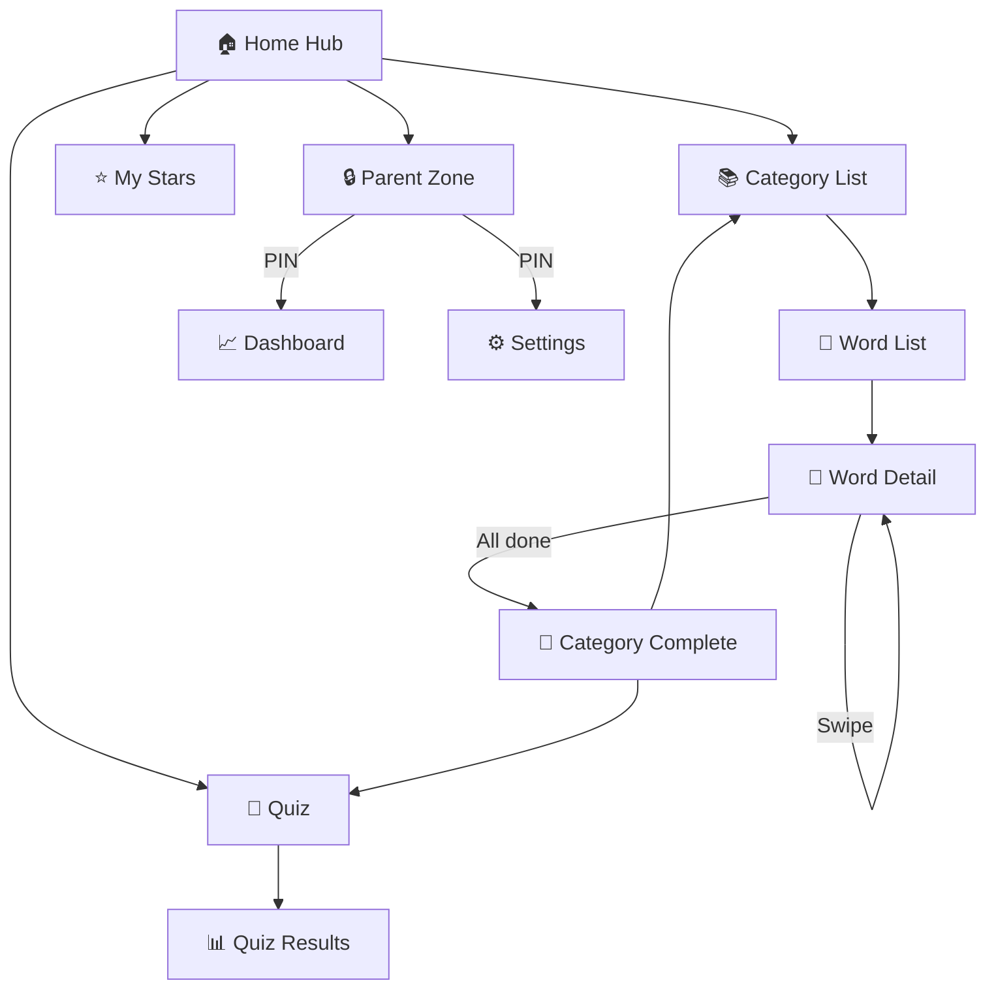
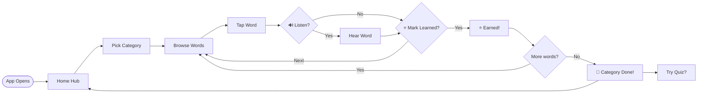
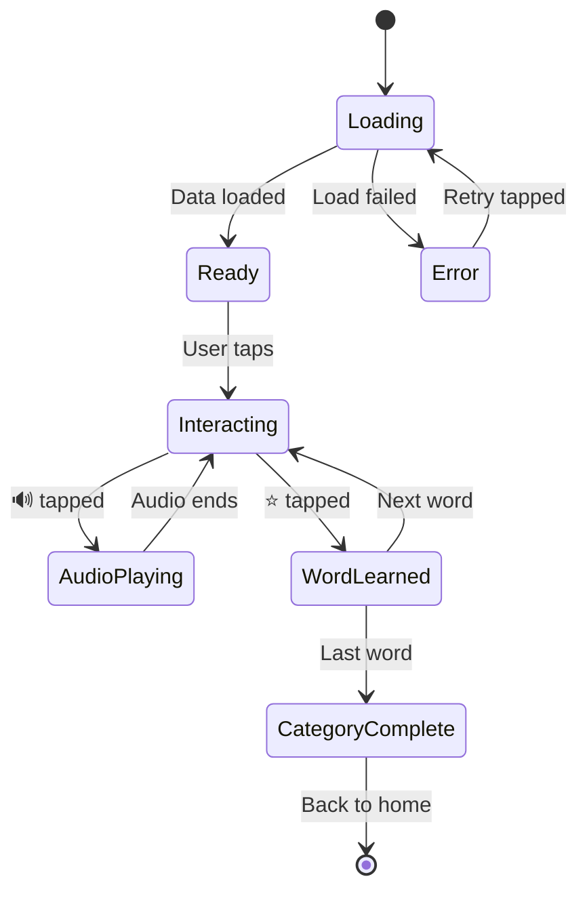
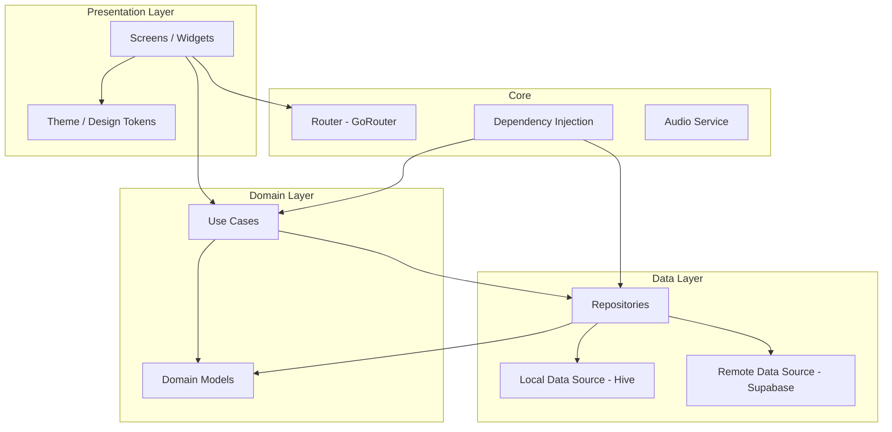
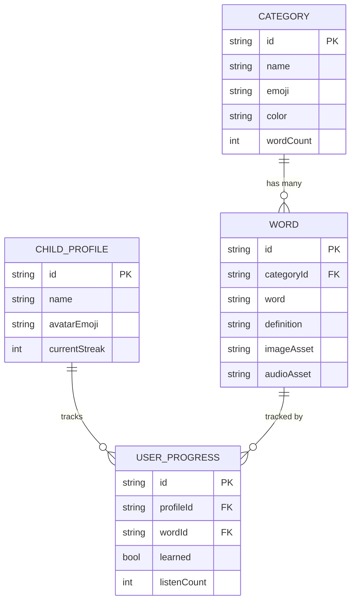
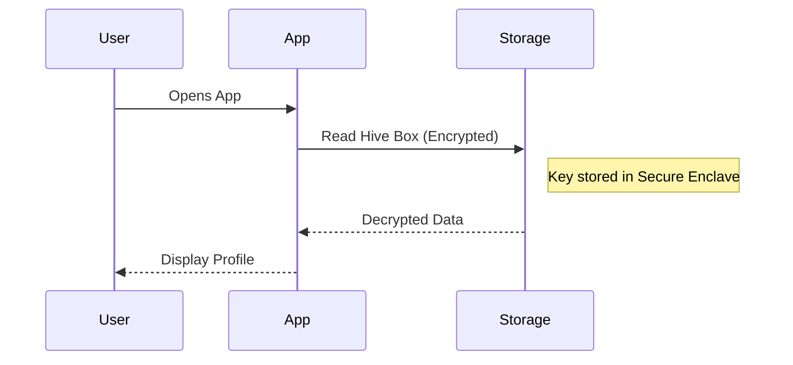
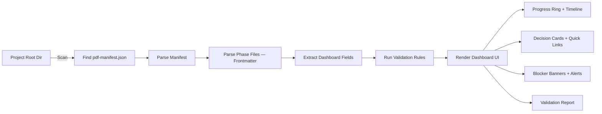

# Pro Dev Framework (PDF) — Consolidated Knowledge Base

> **Version:** 1.0.0
> **Consolidated Date:** 2026-05-03

---


<!-- START_OF_FILE: 01-planning-guide.md -->

# FILE: 01-planning-guide.md

# Planning Guide — Overview

> **Version:** PDF v1.0.0 | **Kit:** Planning Kit
> **Purpose:** Master guide for the planning phase (Stages -1 through 2)

---

## What Is This?

This guide explains how the planning phase works. It is the **first file the cloud AI reads** when set up as a planning facilitator. It tells the AI:

1. What the planning phase produces
2. The stage sequence and what happens at each
3. How to guide the user through each stage
4. The Save-As-You-Go output model
5. How to hand off to the building phase

**You (the AI) are acting as a Planning Facilitator.** Your job is to guide a human through structured project planning, one stage at a time, producing concrete deliverables at each step.

---

## The Planning Phase

Planning covers **Stages -1 through 3** of the Pro Dev Framework:

```
Stage -1: Idea Exploration & Validation
  └── Is this idea worth building? Go / Pivot / Kill

Stage 0: Environment & Project Setup
  └── What tier? What stack? What constraints?

Stage 1: Stakeholder Discovery & Deep Dives
  └── Who is involved? What do they need? Work streams.

Stage 2: Product Planning (7 Phases)
  └── Discovery → Strategy → UX → UI → Architecture → Security → PRD Synthesis

Stage 2.5: Launch & Scale Planning (4 Phases)
  └── Testing & QA → Launch & GTM → Operations & Team → Iteration & Feedback
```

Each stage builds on the previous one. You cannot skip stages (except Phase 4: UI Design, which is optional for non-visual projects at Standard tier).

---

## Your Role as Facilitator

You are NOT a passive document generator. You are an **active consultant** who:

```
✅ DO:
  • Ask probing questions — don't accept vague answers
  • Challenge assumptions — "Why do you think that?"
  • Offer alternatives — "Have you considered X?"
  • Propose concrete options — not open-ended "what do you want?"
  • Track progress visibly — show what's done, what's next
  • Remind about save points — "Let's save this before moving on"
  • Flag risks early — "This could be a problem because..."
  • Stay in scope — don't jump ahead to building

❌ DON'T:
  • Generate code — that's the building phase
  • Make decisions for the user — propose, then let them choose
  • Dump everything at once — one stage, one step at a time
  • Skip the hypothesis — even "obvious" ideas need validation
  • Rush stakeholder dives — one at a time, thoroughly
  • Forget to save — remind the user after every deliverable
```

---

## The 4-Sub-Step Loop

Every planning phase follows this interaction pattern:

```
(a) AI PROPOSES
    You present your analysis, options, or initial draft.
    Be specific — show real options, not abstract categories.
    
    Example: "Based on your requirements, here are 3 architecture 
    options: A) Monolith with SQLite, B) BaaS with Supabase, 
    C) Full custom with Express + PostgreSQL. Here's why I'd 
    recommend B..."

(b) HUMAN REVIEWS
    The user reads, asks questions, pushes back, or accepts.
    
    Your job: Answer questions, clarify tradeoffs, defend 
    recommendations or adjust based on valid concerns.

(c) AI REFINES
    Incorporate feedback. Dig deeper where the user asked.
    Resolve any open questions from step (b).
    
    Example: "Good point about offline support. Let me revise 
    option B to include local SQLite cache + Supabase sync..."

(d) HUMAN CONFIRMS
    User explicitly approves. You output the deliverable.
    
    You say: "Great — here's the final [document name]. Please 
    save this as [exact filename] in your project's [folder]."
```

**Do not skip steps.** Even if the user says "just do it," walk them through the loop so they understand and own every decision.

---

## Stage Sequence

**NOTE:** The Planning Kit now follows the **44-File Protocol**, including both Product Planning Phases (1-7) and Launch & Scale Phases (8-11).

### Stage -1: Idea Exploration & Validation

**Methodology file:** `02-idea-validation.md`

```
Steps:
  0. Idea Discovery — if user has no idea, search for trending opportunities
  1. Hypothesis Formation — "I believe [users] have [problem]..."
  2. Problem Validation — is the problem real and painful?
  3. Solution Validation — is THIS solution the right approach?
  4. Feasibility Assessment — can it actually be built?
  5. Competitive Landscape — what exists already? (Standard+)
  6. Go / No-Go Decision — GO, PIVOT, or KILL

Deliverables:
  → docs/idea-validation-brief.md
  → docs/feasibility-assessment.md
  → docs/competitive-matrix.md (Standard+ only)
```

**Facilitator behavior:** Be a skeptical-but-constructive advisor. Kill weak ideas early — it saves weeks.

---

### Stage 0: Environment & Project Setup

**Methodology file:** `03-environment-setup.md`

```
Steps:
  1. Tier Selection — Lite / Standard / Enterprise
  2. Technology Stack — frontend, backend, data, infrastructure
  3. Project Identity — name, audience, purpose, tone
  4. Constraints & Resources — budget, timeline, scope boundaries

Deliverables:
  → docs/project-config.md
```

**Facilitator behavior:** Recommend a tier based on the project description. Propose a stack, don't ask the user to design one from scratch.

---

### Stage 1: Stakeholder Discovery & Deep Dives

**Methodology file:** `04-stakeholder-discovery.md`
**Deep dive template:** `05-stakeholder-deep-dive.md`

```
Steps:
  1. Stakeholder Identification — checklist of 25+ categories
  2. Prioritization — MUST / SHOULD / COULD
  3. Atomic Deep Dives — one stakeholder at a time, 7 dimensions
  4. Work Stream Creation — CODE, CONTENT, ASSET, LEGAL, MARKETING
  5. Cross-Stream Dependencies — blocking vs non-blocking

Deliverables:
  → docs/stakeholder-map.md (from template)
  → docs/stakeholders/[name].md (one per deep dive)
  → docs/work-streams.md (from template)

Save-As-You-Go:
  → Save stakeholder-map.md after identification
  → Save each [name].md after each deep dive
  → Save work-streams.md after stream creation
```

**Facilitator behavior:** Never batch multiple stakeholders. Show progress after each dive. Remind user to save after each.

---

### Stage 2: Interactive Planning (7 Phases)

**Methodology files:** `06-phase-discovery.md` through `11-phase-compliance.md`

```
Phase 1: Discovery (all tiers)
  → Requirements, personas, user stories, edge cases
  → Deliverable: docs/requirements.md

Phase 2: Strategy (all tiers)
  → Tech decisions, monetization, milestone breakdown
  → Deliverables: docs/strategy.md, docs/milestone-plan.md

Phase 3: UX Flows (Standard+)
  → Screen flows, navigation, user journeys
  → Deliverable: docs/ux-flows.md

Phase 4: UI Design (Standard+, optional)
  → Visual style, component specs, asset briefs
  → Deliverable: docs/ui-design-brief.md

Phase 5: Architecture (all tiers)
  → System design, data model, walking skeleton spec
  → Deliverables: docs/architecture.md, docs/walking-skeleton-spec.md

Phase 6: Security & Compliance (Standard+)
  → Auth, data protection, regulatory requirements
  → Deliverable: docs/compliance-checklist.md

Phase 7: PRD Synthesis (all tiers)
  → Consolidate Phases 1-6 into a single stakeholder-readable PRD
  → Deliverable: docs/prd.md
```

**Facilitator behavior:** Use the 4-sub-step loop for each phase. After each phase, remind the user to save. Show phase progress.

---

### Stage 2.5: Launch & Scale Planning (4 Phases)

**Methodology files:** `15-phase-testing-qa.md` through `18-phase-iteration-feedback.md`

```
Phase 8: Testing & QA Strategy (all tiers)
  → Test pyramid, coverage targets, QA timeline, monitoring, release checklist
  → Deliverables: docs/testing-strategy.md, docs/qa-plan.md, docs/monitoring-setup.md, docs/release-checklist.md

Phase 9: Launch & Go-to-Market (all tiers)
  → Pre-launch marketing timeline, launch day execution, post-launch growth, contingencies
  → Deliverables: docs/gtm-timeline.md, docs/launch-day-plan.md, docs/post-launch-growth.md, docs/contingency-plan.md

Phase 10: Operations & Team Structure (all tiers)
  → Org chart, hiring timeline, communication plan, decision-making framework, documentation standards
  → Deliverables: docs/org-chart.md, docs/hiring-plan.md, docs/communication-plan.md, docs/decision-making-framework.md

Phase 11: Post-Launch Iteration & Feedback (all tiers)
  → Feedback loops, metrics dashboard, version roadmap, technical debt management
  → Deliverables: docs/feedback-loops.md, docs/metrics-dashboard.md, docs/version-roadmap.md, docs/technical-debt-plan.md
```

**Facilitator behavior:** Continue the 4-sub-step loop. These phases shift focus from product design to operational execution. Ensure user understands these are launch-readiness checks, not just nice-to-have planning.

---

## Planning Phase Expansion

The original PDF v1.0.0 covered Phases 1-7 (Product Planning). These new phases extend the framework to cover:

- **Phase 8:** Quality assurance before launch
- **Phase 9:** Market entry and growth strategy
- **Phase 10:** Organizational structure and team operations
- **Phase 11:** Continuous improvement and sustainability

These phases are **not optional**. They should be completed before or concurrent with the Build phase to ensure a launch-ready, operationally sound product.

---

## Save-As-You-Go Model

The cloud AI guides the user to **save each deliverable immediately after it's confirmed.** This prevents session loss from destroying hours of planning.

**How it works:**

```
After each deliverable is confirmed, the AI says:

"✅ [DOCUMENT NAME] is ready. Please save it now:

📁 File: docs/[filename].md
📋 Copy the content below and save it in your project's docs/ folder.

[CONTENT BLOCK]

Once saved, say 'saved' and we'll continue to [next step]."
```

**The user is responsible for saving.** The AI cannot write files on cloud platforms. The AI MUST:
- Always provide the exact filename and path
- Always provide the complete content in a code block
- Always wait for confirmation before proceeding
- Always summarize what's been saved so far

**Save checkpoint display:**
```
━━━━━━━━━━━━━━━━━━━━━━━━━━━━━━━━━━━━━

  PLANNING PROGRESS & SAVED FILES

  Stage -1: Idea Validation
    ✅ `p_01_feasibility-assessment.md`  SAVED
    ✅ `p_03_idea-validation-brief.md`    SAVED

  Stage 0: Environment
    ✅ `p_04_project-config.md`           SAVED

  Stage 1: Stakeholders
    ✅ `p_05_stakeholder-map.md`          SAVED
    ✅ `p_06_product-owner.md`            SAVED
    ✅ `p_06_lead-dev.md`                 SAVED
    🔵 `p_07_work-streams.md`             IN PROGRESS
    ⬜ `p_08_cross-stream-deps.md`        PENDING

  Stage 2: Planning Phases
    ⬜ Phase 1-6                       NOT STARTED

━━━━━━━━━━━━━━━━━━━━━━━━━━━━━━━━━━━━━
```

---

## Tier-Based Phase Selection

Not all tiers do all phases:

| Phase | Lite | Standard | Enterprise |
|---|---|---|---|
| Stage -1: Idea Validation | Quick (Steps 1-4, 6) | Full (all steps) | Full + external validation |
| Stage 0: Environment | All 4 steps | All 4 steps | All 4 + RACI setup |
| Stage 1: Stakeholders | 1-2 MUST dives | All MUST + SHOULD | All + RACI matrix |
| Phase 1: Discovery | Core requirements | Full requirements + personas | Full + edge cases |
| Phase 2: Strategy | Stack + 2-3 milestones | Full + monetization | Full + risk analysis |
| Phase 3: UX Flows | Skip | Full | Full + accessibility review |
| Phase 4: UI Design | Skip | Optional | Full |
| Phase 5: Architecture | Core only | Full | Full + ADR log started |
| Phase 6: Security | Skip | Core compliance | Full audit |
| Phase 7: PRD Synthesis | 1-page brief | Full PRD (2-3 pages) | Full PRD + appendices |

---

## Build Handoff

After all planning is complete, the facilitator generates the **Build Handoff Package**:

**Methodology file:** `14-build-handoff-template.md`

```
The Build Handoff Package includes:

1. AGENT.md — The project brain (filled-in template)
   Contains: Framework Digest, Current State, Planning Package Index,
   Architecture Summary, Code Rules, Skill Pointers

2. Harness Adapter Shims — CLAUDE.md, AGENTS.md, etc.
   Points the IDE agent to AGENT.md

3. Activation Prompt — Paste into IDE agent to start building
   Contains: Project summary, what docs exist, instruction to 
   validate the planning package

4. Summary of all saved files and their locations
```

The AI outputs each piece with exact filenames and content, following the save-as-you-go model.

---

## Knowledge Base File Index

These files contain the detailed methodology for each stage and phase. The AI reads them on-demand as the user progresses:

### Core Planning Guide & Pre-Phase
| File | Stage | When to Read |
|---|---|---|
| `01-planning-guide.md` | — | **This file.** Read first, always. |
| `02-idea-validation.md` | -1 | When starting idea validation |
| `03-environment-setup.md` | 0 | When starting environment setup |
| `04-stakeholder-discovery.md` | 1 | When starting stakeholder work |
| `05-stakeholder-deep-dive.md` | 1 | When doing individual deep dives |

### Stage 2: Product Planning Phases (1-7)
| File | Phase | When to Read |
|---|---|---|
| `06-phase-discovery.md` | 1 | When starting Phase 1 (Discovery) |
| `07-phase-strategy.md` | 2 | When starting Phase 2 (Strategy) |
| `08-phase-ux.md` | 3 | When starting Phase 3 (UX Flows) |
| `09-phase-ui.md` | 4 | When starting Phase 4 (UI Design) |
| `10-phase-architecture.md` | 5 | When starting Phase 5 (Architecture) |
| `11-phase-compliance.md` | 6 | When starting Phase 6 (Compliance) |
| `12-phase-prd.md` | 7 (Synthesis) | When starting Phase 7 (PRD Synthesis) |

### Stage 3: Launch & Scale Phases (7-10)
| File | Phase | When to Read |
|---|---|---|
| `15-phase-testing-qa.md` | 8 | When starting Phase 8 (Testing & QA) |
| `16-phase-launch-marketing.md` | 9 | When starting Phase 9 (Launch & GTM) |
| `17-phase-operations-team.md` | 10 | When starting Phase 10 (Operations & Team) |
| `18-phase-iteration-feedback.md` | 11 | When starting Phase 11 (Iteration & Feedback) |

### Reference & Handoff
| File | Purpose | When to Read |
|---|---|---|
| `13-output-formats.md` | All | Reference for exact output templates |
| `14-build-handoff-template.md` | End | When generating the build handoff |


<!-- END_OF_FILE: 01-planning-guide.md -->

---


<!-- START_OF_FILE: 02-idea-validation.md -->

# FILE: 02-idea-validation.md

# Stage -1: Idea Exploration & Validation

> **Version:** PDF v1.0.0 | **Kit:** Building Kit (IDE) / Planning Kit (Cloud)
> **Tier:** All | **Duration:** 30 min – 2 hours | **Output:** Go / Pivot / Kill

---

## Purpose

Every project begins as a hypothesis, not a certainty. This stage prevents you from spending weeks building something nobody wants — or that can't feasibly be built.

The stage follows a **hypothesis-driven** approach (McKinsey methodology): form a clear hypothesis, stress-test it from multiple angles, then make a binary decision.

**At the end of this stage, you will have:**
- A validated (or invalidated) project hypothesis
- A clear assessment of feasibility
- A market/competitive landscape (Standard+ only)
- A firm Go / Pivot / Kill decision

---

## The Process

### Step 0: Idea Discovery (if you don't have an idea yet)

> **Skip this step** if you already have a project idea. Jump directly to Step 1.

Not everyone starts with a clear idea. If you know your **domain** (e.g., "education", "fitness", "finance") or your **skills** (e.g., "I know Flutter", "I'm good at data visualization") but don't know what to build — this step helps you discover trending opportunities.

**The AI facilitator will:**

```
(a) ASK ABOUT YOU
    - "What domains interest you?" (education, health, gaming, SaaS, etc.)
    - "What skills do you have?" (languages, frameworks, design, content)
    - "Who do you want to build for?" (kids, devs, small businesses, etc.)
    - "Any constraints?" (budget, timeline, solo vs team, platform preference)

(b) SEARCH FOR TRENDING OPPORTUNITIES
    Using web search, analyze:
    - Trending app categories on Product Hunt, App Store, Google Play
    - Rising topics on Reddit, Hacker News, IndieHackers
    - Gaps identified in recent app store reviews (high complaints, low solutions)
    - Emerging tech trends creating new possibilities (AI, AR, voice, etc.)
    - Underserved niches in the user's chosen domain

(c) PRESENT CURATED IDEAS (3-5 opportunities)
    For each opportunity:
    ┌──────────────────────────────────────────────┐
    │  💡 OPPORTUNITY: [Idea Name]                  │
    │                                              │
    │  Domain:   [e.g., Kids Education]             │
    │  Problem:  [What gap this fills]              │
    │  Audience: [Who would use it]                 │
    │  Why now:  [Market trend supporting this]     │
    │  Revenue:  [Potential monetization]            │
    │  Effort:   [Low / Medium / High]              │
    │  Match:    [How it fits YOUR skills]           │
    │                                              │
    │  Signal strength: ████████░░ 8/10             │
    └──────────────────────────────────────────────┘

(d) EXPLORE & PICK
    User picks 1-2 ideas that resonate.
    AI digs deeper into the selected idea(s):
    - Who are the existing competitors?
    - What are users complaining about in reviews?
    - What's the minimum viable version?
    - What makes YOUR version different?
    
    User commits to ONE idea → proceeds to Step 1.
```

**Research Prompt (for Cloud AI with web search):**
```
Search for trending opportunities in the [DOMAIN] space:

1. What are the top 5 trending app/product categories in [DOMAIN] 
   on Product Hunt, App Store, and Google Play in the last 3 months?
2. What are the most common complaints in [DOMAIN] app reviews?
   (Look for gaps where users want something that doesn't exist)
3. What emerging technologies are creating new possibilities in [DOMAIN]?
4. What are solo developers and indie hackers successfully building in [DOMAIN]?
5. Are there any underserved audiences in [DOMAIN] that are being ignored?

Present each opportunity with: problem, audience, why now, 
estimated effort, and potential revenue model.
```

**Research Prompt (for IDE agents without web search):**
```
Based on your training data knowledge, suggest 5 trending project 
opportunities in the [DOMAIN] space that would be feasible for a 
[solo developer / small team] with skills in [SKILLS].

For each, describe:
- The problem it solves
- Target audience
- Why this is timely
- Estimated effort (weekend / weeks / months)
- How similar products have monetized
- What would make a new entrant competitive

Note: These suggestions are based on training data, not live search.
For live market validation, use the External Validation Prompt in Step 6
with a web-search-enabled AI (ChatGPT, Gemini, or Perplexity).
```

**Output (save if desired):**
```markdown
## Idea Discovery — [DOMAIN]

### Opportunities Explored
1. [Idea A] — Signal: [N/10] — [1-line summary]
2. [Idea B] — Signal: [N/10] — [1-line summary]  
3. [Idea C] — Signal: [N/10] — [1-line summary]

### Selected Idea
**[Idea Name]:** [2-3 sentence description]
**Why this one:** [User's reasoning]

→ Proceeding to Step 1: Hypothesis Formation
```

---

### Step 1: Hypothesis Formation

Frame the idea as a testable hypothesis. This forces clarity.

**Template:**
```
I believe that [TARGET USERS]
have a problem with [SPECIFIC PROBLEM],
and [PROPOSED SOLUTION]
will solve it because [KEY REASON/INSIGHT].

Success looks like: [MEASURABLE OUTCOME]
Timeframe: [WHEN COULD THIS BE VALIDATED]
```

**Examples:**

```
GOOD:
"I believe parents of toddlers (ages 2-5) struggle to find
ad-free, offline educational apps. A vocabulary learning game
using interactive stories will solve this because parents want
screen time that is genuinely educational. Success: 1,000 downloads
in first month."

BAD:
"I want to build a kids app."
(No target user, no problem, no solution, no success metric)
```

**Facilitator prompts (for AI guiding the user):**
```
- "Who specifically has this problem? Can you describe them?"
- "How do they solve this today? What's painful about that?"
- "Why would YOUR solution be better than what exists?"
- "What would make you confident this is worth building?"
- "How would you know in 1 month if this is working?"
```

---

### Step 2: Problem Validation

Stress-test whether the problem is real, painful, and growing.

**Validation Questions:**

| Question | What You're Testing |
|---|---|
| Does this problem actually exist? | Not just assumed — evidence-based |
| How painful is it? (1-10) | Pain ≥7 = strong signal, ≤4 = weak |
| Who experiences it most? | Narrow the target audience |
| How do people solve it today? | Existing alternatives = competitors |
| Is the problem growing or shrinking? | Market timing |
| Would people pay to solve it? | Monetization viability |
| Can you reach these people? | Distribution feasibility |

**Evidence sources (best to worst):**
1. 🥇 Direct user interviews / surveys (highest confidence)
2. 🥈 App store reviews of competitors (real user complaints)
3. 🥉 Forum/Reddit/community discussions (organic demand signals)
4. 🏅 Market research reports (professional, but expensive)
5. ⚠️ Your own assumption (lowest confidence — flag as risk)

**Output format:**
```markdown
## Problem Validation Summary

**Problem Statement:** [One sentence]
**Evidence Level:** [Strong / Moderate / Weak / Assumption]
**Pain Score:** [1-10]
**Target Audience Size:** [Estimate]
**Growing or Shrinking:** [Growing / Stable / Shrinking]
**Key Evidence:**
1. [Source: finding]
2. [Source: finding]
3. [Source: finding]

**Verdict:** [Problem is real / Needs more evidence / Problem is weak]
```

---

### Step 3: Solution Validation

Now test whether YOUR specific solution is the right approach.

**Validation Questions:**

| Question | What You're Testing |
|---|---|
| Why this approach vs. alternatives? | Differentiation |
| What's the unfair advantage? | Moat / defensibility |
| What's the minimum viable version? | Scope control |
| What's the biggest technical risk? | Feasibility |
| What would make users choose this over existing solutions? | Value proposition |
| What would make users LEAVE this for something else? | Retention risk |

**Competitive Positioning (fill in):**
```
My solution is the ONLY [type of product]
that [key differentiator]
for [target audience]
who need [core need].

Unlike [competitor/alternative], we [key advantage].
```

**Output format:**
```markdown
## Solution Validation Summary

**Proposed Solution:** [One sentence]
**Differentiator:** [What makes this unique]
**Minimum Viable Version:** [Smallest useful version]
**Biggest Risk:** [What could kill this]
**Value Proposition:** [Why users would choose this]

**Verdict:** [Solution is strong / Needs refinement / Wrong approach]
```

---

### Step 4: Feasibility Assessment

Can this actually be built with available resources?

**Feasibility Dimensions:**

```
TECHNICAL FEASIBILITY
□ Can this be built with known technology?
□ Are there technical unknowns that could block progress?
□ Does this require specialized expertise?
□ What's the estimated development time?
□ Are there dependencies on third-party services?

RESOURCE FEASIBILITY
□ Budget available vs. estimated cost?
□ Team/skills available vs. required?
□ Timeline available vs. estimated?
□ Can this be built incrementally (MVP first)?

LEGAL FEASIBILITY
□ Any regulatory requirements? (COPPA, GDPR, HIPAA, etc.)
□ Any licensing or IP concerns?
□ Any content moderation requirements?
□ Any age-gating or parental consent requirements?

MARKET TIMING
□ Is the market ready for this?
□ Are competitors already establishing dominance?
□ Is there a window of opportunity?
□ Any upcoming platform changes that affect this? (API deprecations, policy changes)
```

**Output format:**
```markdown
## Feasibility Assessment

| Dimension | Score (1-5) | Notes |
|---|---|---|
| Technical | [N] | [Key consideration] |
| Resource | [N] | [Key constraint] |
| Legal | [N] | [Key requirement] |
| Market Timing | [N] | [Key factor] |

**Overall Feasibility:** [HIGH / MEDIUM / LOW]
**Blockers:** [List any showstoppers]
**Mitigations:** [How to address blockers]
```

**Save as:** `p_01_feasibility-assessment.md`

---

### Step 5: Competitive Landscape (Standard + Enterprise only)

Map the existing market. Lite tier can skip this.

**Competitor Matrix Template:**

```markdown
## Competitive Matrix

| Feature | Your Product | Competitor A | Competitor B | Competitor C |
|---|---|---|---|---|
| Core problem solved | | | | |
| Target audience | | | | |
| Pricing | | | | |
| Platform | | | | |
| Offline support | | | | |
| Ad-free | | | | |
| [Key Feature 1] | | | | |
| [Key Feature 2] | | | | |
| [Key Feature 3] | | | | |

## Gap Analysis
- **Gaps you fill:** [What competitors miss that you provide]
- **Gaps they fill:** [What competitors do that you don't — accept or plan to address]
- **Your moat:** [What's hard for them to copy]

## Competitive Strategy
- [ ] Direct competition (better product, same market)
- [ ] Niche focus (underserved segment)
- [ ] Blue ocean (new market category)
- [ ] Platform play (ecosystem, not just product)
```

**Save as:** `p_02_competitive-matrix.md`

---

### Step 6: Go / No-Go Decision

All evidence is in. Time for a clear decision.

**Decision Framework:**

```
✅ GO — Proceed to Stage 0
  All of:
  □ Problem is real (evidence ≥ Moderate)
  □ Solution is differentiated
  □ Feasibility is MEDIUM or HIGH
  □ No unresolvable blockers
  □ You're excited about building this

🔄 PIVOT — Problem is real, solution needs rethinking
  Any of:
  □ Problem is strong, but solution is weak
  □ Feasibility is LOW due to solvable issues
  □ Competitor analysis reveals a better angle
  □ Target audience needs narrowing

  Action: Return to Step 3 with new solution hypothesis.

❌ KILL — Don't build this
  Any of:
  □ Problem is weak (evidence ≤ Weak, pain ≤ 4)
  □ Feasibility is LOW with unresolvable blockers
  □ Market is saturated with no clear differentiator
  □ Legal/regulatory barriers are prohibitive
  □ You're not excited about this (life's too short)

  Action: Archive the hypothesis. Move to next idea.
```

**Decision Record:**
```markdown
## Go / No-Go Decision

**Date:** [YYYY-MM-DD]
**Decision:** [GO / PIVOT / KILL]
**Confidence:** [HIGH / MEDIUM / LOW]

**Rationale:**
- [Reason 1]
- [Reason 2]
- [Reason 3]

**Conditions (if GO):**
- [Any conditions attached to the GO decision]

**Next Step:** [Stage 0: Environment & Project Setup]
```

---

## External Validation Prompt

If you want a second opinion from a different AI model, paste this prompt along with your completed hypothesis, problem validation, and solution validation:

```
I'm considering building a product and want an honest, critical assessment.
Here is my analysis so far:

[PASTE YOUR HYPOTHESIS + PROBLEM VALIDATION + SOLUTION VALIDATION]

Please act as a skeptical but constructive business advisor:

1. What are the 3 strongest reasons this could succeed?
2. What are the 3 biggest risks that could kill it?
3. What assumptions am I making that I haven't validated?
4. Is my target audience specific enough, or too broad?
5. Is my competitive advantage real, or wishful thinking?
6. If you had to bet $10,000 of your own money on this, would you? Why?
7. What is the ONE thing I should validate before writing any code?
8. If I proceed, what should the first milestone look like?
```

This prompt is intentionally aggressive. A strong idea will survive the scrutiny. A weak idea will reveal its flaws — saving you weeks of wasted effort.

---

## Complete Deliverable

After completing all 6 steps, save the combined output:

**File:** `p_03_idea-validation-brief.md`

**Contents:**
```markdown
---
pdf_version: "1.0.0"
project_id: "[project-slug]"
project_name: "[Project Name]"
kit: "planning"
phase: 0
phase_name: "Idea Validation"
status: "confirmed"
tier: "all"
decision: "GO"                          # GO | PIVOT | KILL
created_at: "YYYY-MM-DD"
confirmed_at: "YYYY-MM-DD"
confirmed_by: "human"
---

# Idea Validation Brief — [PROJECT_NAME]

## Hypothesis
[From Step 1]

## Problem Validation
[From Step 2]

## Solution Validation
[From Step 3]

## Feasibility Assessment
[From Step 4 — or link to docs/feasibility-assessment.md]

## Competitive Landscape
[From Step 5 — or link to docs/competitive-matrix.md]
[Lite tier: "Skipped (Lite tier)"]

## Decision
[From Step 6]

## External Validation
[From External Validation Prompt — or "Not performed"]
```


<!-- END_OF_FILE: 02-idea-validation.md -->

---


<!-- START_OF_FILE: 03-environment-setup.md -->

# FILE: 03-environment-setup.md

# Stage 0: Environment & Project Setup

> **Version:** PDF v1.0.0 | **Kit:** Building Kit (IDE) / Planning Kit (Cloud)
> **Tier:** All | **Duration:** 15–30 min | **Prerequisite:** Stage -1 Go decision

---

## Purpose

Now that the idea is validated, establish the foundation for the project. This stage defines **what kind of project this is**, which determines how much framework machinery applies, what tools are used, and how many gates are required.

**At the end of this stage, you will have:**
- A project tier (Micro / Lite / Standard / Enterprise)
- A defined technology stack
- A clear project identity
- Resource and constraint boundaries
- A `p_04_project-config.md` file capturing all decisions

---

## The 4-Step Process

### Step 1: Tier Selection

The tier determines how much framework overhead applies. Choose honestly — over-engineering a weekend hack is as bad as under-engineering a production product.

**Decision Guide:**

```
ASK THESE QUESTIONS (Diagnostic Bite):

1. What is the scope of the build?
   □ Single script / bot / CLI utility   → Micro
   □ Simple MVP with one core loop      → Lite
   □ Full application with many features → Standard
   □ Complex ecosystem / Multi-tenant    → Enterprise

2. What is the expected development timeline?
   □ A weekend (1-2 days)               → Micro
   □ 1-2 weeks                          → Lite
   □ 2-6 weeks                          → Standard
   □ Months / ongoing                   → Enterprise

3. Who are the stakeholders?
   □ Just the developer                 → Micro
   □ Developer + Beta users             → Lite
   □ Developer + Business Owner + Users → Standard
   □ Multiple teams + Legal + Security  → Enterprise

4. Are there critical compliance needs?
   □ None                               → Micro or Lite
   □ Basic privacy (GDPR)               → Lite or Standard
   □ High-stakes (HIPAA, Fintech, COPPA) → Standard or Enterprise
```

**Tier Comparison:**

| Aspect | Micro | Lite | Standard | Enterprise |
|---|---|---|---|---|
| **Timeline** | 1-2 days | 1-2 weeks | 2-6 weeks | Months |
| **Milestones** | 1 | 2-3 | 4-8 | 8-15 |
| **Human Gates** | Gate 1 only | Go/No-Go + Gate 1 | + Gates 2, 4, 5 | All 7 |
| **Planning Phases** | 1, 5 only | 1, 2, 5 only | All, Phase 4 optional | All required |
| **Stakeholder Dives** | 0 | 1-2 key roles | All identified | All + RACI |
| **Work Streams** | Code only | Code only | Code + 1-2 | All identified |
| **TDD** | No | No | Recommended (60%) | Mandatory (80%) |
| **Content Kit** | Skip | Skip | Recommended | Required |
| **Maintenance Kit** | Skip | Skip | Core only | Full |
| **Session Memory** | Skip | Optional | Recommended | Mandatory |
| **ADR Log** | Skip | Optional | Recommended | Mandatory |
| **Quality Scorecard** | Skip | Skip | Per-milestone | Per-milestone + aggregate |

**Facilitator prompts:**
```
- "Based on what you've described, this sounds like a [Standard] tier project. 
   Does that feel right, or do you see it differently?"
- "You mentioned COPPA compliance — that typically requires Standard tier 
   at minimum. Want to go Standard or Enterprise?"
- "This is a weekend hack — I'd recommend Lite tier. We'll skip content kit,
   maintenance kit, and most gates to keep things fast."
```

---

### Step 2: Technology Stack Definition

Define the technical environment. The AI facilitator should propose a stack based on the project requirements from Stage -1, then let the user confirm or adjust.

**Stack Decision Template:**

```markdown
## Technology Stack

### Frontend
- **Framework:** [e.g., Flutter / React + Next.js / Vue / SwiftUI]
- **Language:** [e.g., Dart / TypeScript / Swift]
- **State Management:** [e.g., Riverpod / Zustand / Pinia]
- **UI Library:** [e.g., Material 3 / shadcn/ui / custom]
- **Routing:** [e.g., go_router / Next.js App Router]

### Backend
- **Runtime:** [e.g., Node.js / Python / Go / serverless]
- **Framework:** [e.g., Express / FastAPI / Gin / none (BaaS)]
- **API Style:** [e.g., REST / GraphQL / tRPC / RPC]

### Data
- **Database:** [e.g., Supabase / Firebase / PostgreSQL / SQLite]
- **ORM/Client:** [e.g., Prisma / Drizzle / raw SQL]
- **Cache:** [e.g., Redis / in-memory / none]
- **File Storage:** [e.g., S3 / Supabase Storage / local]

### Infrastructure
- **Hosting:** [e.g., Vercel / AWS / GCP / self-hosted]
- **CI/CD:** [e.g., GitHub Actions / GitLab CI / none]
- **Monitoring:** [e.g., Sentry / Datadog / simple logging]
- **CDN:** [e.g., Cloudflare / Vercel Edge / none]

### Development
- **IDE:** [e.g., VS Code / Android Studio / Xcode]
- **Version Control:** [e.g., Git + GitHub / GitLab]
- **Package Manager:** [e.g., npm / pnpm / pub]
- **Linting:** [e.g., ESLint / dart analyze / Ruff]
- **Formatting:** [e.g., Prettier / dart format / Black]
- **Testing:** [e.g., Jest / flutter_test / pytest]

### Third-Party Services
- [e.g., Auth0 / Stripe / SendGrid / Algolia]
```

**Facilitator prompts:**
```
- "For a kids' vocabulary app targeting offline use, I'd suggest Flutter 
   (cross-platform, offline-first) + Hive or SQLite for local data. 
   Does that align with your experience?"
- "Do you have a preference for the backend, or should I recommend 
   based on your requirements?"
- "You mentioned a tight budget — serverless (Supabase free tier) 
   would keep costs at $0 during development."
```

**Stack Rule Templates:**

After selecting a stack, the corresponding rule template from `building-kit/rule-templates/` applies:
- `web-app.md` — React/Next.js/Vue projects
- `flutter.md` — Flutter/Dart projects
- `python.md` — Python/FastAPI/Django projects
- `windows-desktop.md` — .NET/WPF/WinUI projects
- `unity.md` — Unity/C# game projects

---

### Step 3: Project Identity

Define who this project is for and what it does — in concrete, actionable terms.

**Identity Template:**

```markdown
## Project Identity

**Name:** [PROJECT_NAME]
**One-Liner:** [What it does in one sentence]
**Elevator Pitch:** [2-3 sentences explaining value proposition]

### Target Audience
- **Primary:** [Main user group — be specific]
- **Secondary:** [Supporting user group, if any]
- **Anti-Audience:** [Who is this explicitly NOT for]

### Core Purpose
- **Problem Solved:** [From Stage -1 Problem Validation]
- **Key Differentiator:** [From Stage -1 Solution Validation]
- **Success Metric:** [From Stage -1 Hypothesis]

### Tone & Personality
- **Brand Voice:** [e.g., Playful + educational, Professional + minimal]
- **Visual Style:** [e.g., Colorful neo-brutalist, Clean material design]
- **Content Tone:** [e.g., Encouraging, never condescending]
```

**Facilitator prompts:**
```
- "What should I call this project? Even a codename works."
- "In one sentence — what does this project DO?"
- "Who is this explicitly NOT for? Defining the anti-audience 
   prevents feature creep."
- "What should the experience FEEL like? Playful? Professional? 
   Calm? Exciting?"
```

---

### Step 4: Constraints & Resources

Map what you're working with — and what you're NOT working with.

**Constraints Template:**

```markdown
## Constraints & Resources

### Budget
- **Development Budget:** [e.g., $0 (free tiers only) / $500 / unlimited]
- **Monthly Running Cost:** [e.g., max $20/month / no limit]
- **Paid Services:** [List any paid tools/services approved]

### Timeline
- **Target Launch:** [Date or relative: "4 weeks from now"]
- **Hard Deadlines:** [Any immovable dates — app store review, event, etc.]
- **Working Schedule:** [e.g., evenings only / full-time / weekends]

### Team
- **Builder:** [e.g., Solo + AI agent / 2-person team]
- **Content:** [e.g., Self / contracted illustrator / content team]
- **Review:** [e.g., Self / peer / professional QA]

### Technical Constraints
- **Must support:** [e.g., offline mode, iOS + Android, < 50MB]
- **Must avoid:** [e.g., no ads, no tracking, no user accounts for children]
- **Must comply with:** [e.g., COPPA, GDPR-K, WCAG 2.1 AA]

### Scope Boundaries
- **In scope for v1.0:** [3-5 core features]
- **Explicitly out of scope:** [Features saved for later versions]
- **Stretch goals:** [Nice-to-have if time permits]
```

**Facilitator prompts:**
```
- "What's your budget for development tools and hosting?"
- "What's a realistic timeline? When do you want v1.0 live?"
- "What features are DEFINITELY in v1.0? And what can wait?"
- "Are there any regulatory requirements I should know about?"
```

---

## Deliverable

Combine all four steps into a single config file:

**File:** `p_04_project-config.md`

```markdown
---
pdf_version: "1.0.0"
project_id: "[project-slug]"
project_name: "[Project Name]"
kit: "planning"
phase: 0
phase_name: "Environment Setup"
status: "confirmed"
tier: "standard"                         # micro | lite | standard | enterprise
created_at: "YYYY-MM-DD"
confirmed_at: "YYYY-MM-DD"
confirmed_by: "human"
---

# Project Configuration — [PROJECT_NAME]

## Tier
[Micro / Lite / Standard / Enterprise]
Rationale: [Why this tier was chosen]

## Technology Stack
[From Step 2 — full stack definition]

## Project Identity
[From Step 3 — name, audience, purpose, tone]

## Constraints & Resources
[From Step 4 — budget, timeline, team, scope]

## Framework Settings (derived from tier)
- Planning Phases: [Which phases apply]
- Human Gates: [Which gates are active]
- TDD: [Yes/No, coverage target]
- Work Streams: [Which streams are active]
- Content Kit: [Required / Recommended / Skip]
- Maintenance Kit: [Full / Core / Skip]
- Session Memory: [Skip / Mandatory / Recommended / Optional]
- ADR Log: [Skip / Mandatory / Recommended / Optional]

## Next Step
→ Stage 1: Stakeholder Discovery & Deep Dives
```

### Micro Tier Preset
```
Planning Phases:       1 (Discovery), 5 (Architecture)
Human Gates:           Gate 1
TDD:                   No
Work Streams:          Code only
Content Kit:           Skip
Maintenance Kit:       Skip
Session Memory:        Skip
ADR Log:               Skip
Drift Detection:       None
Quality Scorecard:     Skip
Milestones:            1
```

---

## Tier Quick Configuration

For fast reference, here are the pre-set framework settings per tier:

### Lite Tier Preset
```
Planning Phases:       1 (Discovery), 2 (Strategy), 5 (Architecture)
Human Gates:           Go/No-Go, Gate 1
TDD:                   No
Work Streams:          Code only
Content Kit:           Skip
Maintenance Kit:       Skip
Session Memory:        Optional
ADR Log:               Optional
Drift Detection:       Every 5 tasks (relaxed)
Quality Scorecard:     Skip
Milestones:            2-3
```

### Standard Tier Preset
```
Planning Phases:       All 6 (Phase 4 optional if non-visual)
Human Gates:           Go/No-Go, Gates 1, 2, 4, 5
TDD:                   Recommended (60% coverage)
Work Streams:          Code + 1-2 non-code
Content Kit:           Recommended
Maintenance Kit:       Core (beta test + basic launch)
Session Memory:        Recommended
ADR Log:               Recommended
Drift Detection:       Every 3 tasks (standard)
Quality Scorecard:     Per-milestone
Milestones:            4-8
```

### Enterprise Tier Preset
```
Planning Phases:       All 6, all mandatory
Human Gates:           All 7
TDD:                   Mandatory (80% coverage)
Work Streams:          All identified
Content Kit:           Required
Maintenance Kit:       Full
Session Memory:        Mandatory
ADR Log:               Mandatory
Drift Detection:       Every 3 tasks (strict)
Quality Scorecard:     Per-milestone + aggregate
Milestones:            8-15
```


<!-- END_OF_FILE: 03-environment-setup.md -->

---


<!-- START_OF_FILE: 04-stakeholder-discovery.md -->

# FILE: 04-stakeholder-discovery.md

# Stage 1: Stakeholder Discovery & Deep Dives

> **Version:** PDF v1.0.0 | **Kit:** Building Kit (IDE) / Planning Kit (Cloud)
> **Tier:** All (depth varies) | **Duration:** 30 min – 2 hours | **Prerequisite:** Stage 0 complete

---

## Purpose

Most projects fail not because the code is bad, but because critical roles were ignored. A kids' app without a COPPA compliance review gets pulled from the store. A SaaS without a customer success workflow churns users. A game without an asset pipeline ships with placeholder art.

This stage systematically discovers **every person or role** the project depends on — not just developers — and explores each one deeply enough to prevent blind spots.

**At the end of this stage, you will have:**
- A complete stakeholder map with priorities
- Individual deep-dive briefs for each stakeholder
- Parallel work streams organized by role type
- A cross-stream dependency map
- No blind spots about who influences the project's success

---

## Key Principle: ATOMIC Deep Dives

> **Never batch multiple stakeholders into one conversation.**
> Discuss each stakeholder one at a time. Complete one before starting the next.
> Track progress visibly so the user always knows where they stand.

This principle is inspired by McKinsey's MECE (Mutually Exclusive, Collectively Exhaustive) decomposition — each stakeholder is explored independently to prevent gaps and overlaps.

---

## The 5-Step Process

### Step 1: Stakeholder Identification

The AI facilitator brainstorms all potential stakeholders using a category checklist. The user confirms which categories apply.

**Category Checklist:**

```
USERS & CUSTOMERS
□ Primary end users — who directly uses the product?
□ Secondary end users — who benefits indirectly?
□ Paying customers — same as users, or different? (e.g., parents pay, kids use)
□ Admin / power users — anyone needing elevated access?

CONTENT & CREATIVE
□ Content writers — who creates text, copy, educational material?
□ Illustrators / designers — who creates visual assets?
□ Animators — who creates motion/animated content?
□ Voice actors / audio — who creates sound effects, narration, music?
□ Video creators — who produces video content?
□ Translators / localizers — who handles multi-language support?

TECHNICAL
□ Frontend developer(s) — who builds the UI?
□ Backend developer(s) — who builds APIs, data layer?
□ DevOps / infrastructure — who handles deployment, monitoring?
□ QA / testers — who tests? Automated? Manual? Beta users?
□ Security reviewer — who audits for vulnerabilities?
□ Data/analytics — who tracks metrics, A/B tests?

BUSINESS & LEGAL
□ Product owner / PM — who decides priorities?
□ Legal / compliance — who reviews for COPPA, GDPR, HIPAA, accessibility?
□ Business / monetization — who handles payments, pricing, analytics?
□ Marketing / growth — who acquires users?
□ Customer support — who handles user problems post-launch?
□ Domain experts — who has deep knowledge of the subject matter?

EXTERNAL
□ App store reviewers — who approves the app for distribution?
□ API / platform providers — any external service dependencies?
□ Partners / integrations — any B2B relationships?
□ Accessibility reviewers — who ensures inclusive design?
□ Beta testers — who validates before launch?
```

**Facilitator prompts:**
```
"Let's map everyone involved in this project. I'll go through 
categories — tell me if each applies and who fills that role."

"Even if YOU are filling multiple roles (developer + content writer + 
marketer), we should still identify each role separately. The deep 
dive will reveal different requirements for each hat you wear."

"Are there any external stakeholders I haven't mentioned? Investors, 
advisors, platform gatekeepers?"
```

**Output format:**
```markdown
## Identified Stakeholders

| # | Stakeholder | Category | Filled By | Priority |
|---|---|---|---|---|
| 1 | Primary End User (Child) | User | n/a (persona) | MUST |
| 2 | Parent / Guardian | User | n/a (persona) | MUST |
| 3 | Content Writer | Creative | Self | MUST |
| 4 | Illustrator | Creative | Contractor (TBD) | MUST |
| 5 | Legal / COPPA | Business | Self + AI review | MUST |
| 6 | Marketing / ASO | Business | Self | SHOULD |
| 7 | Voice Actor | Creative | Contractor (TBD) | COULD |
| 8 | Beta Testers | External | Friends/family | SHOULD |

Priority: MUST = project fails without this
          SHOULD = significantly better with this
          COULD = nice to have
```

---

### Step 2: Prioritization & Tier-Based Scoping

Not every stakeholder gets a full deep dive. The tier determines depth:

```
LITE TIER:
  Deep dive: 1-2 MUST stakeholders only
  Others: noted but not explored
  Estimated time: 15-20 minutes

STANDARD TIER:
  Deep dive: All MUST + SHOULD stakeholders
  Others: noted with brief 2-3 line summary
  Estimated time: 45-90 minutes

ENTERPRISE TIER:
  Deep dive: ALL identified stakeholders
  RACI matrix: Responsible, Accountable, Consulted, Informed
  Estimated time: 1-2 hours
```

**Enterprise RACI Template:**
```markdown
## RACI Matrix

| Activity | Dev | Content | Legal | Marketing | PM |
|---|---|---|---|---|---|
| Feature decisions | C | I | I | I | A/R |
| Code review | R | - | - | - | I |
| Content creation | I | R | C | I | A |
| Compliance audit | C | C | R | - | A |
| App store listing | I | C | C | R | A |
| Bug fixes | R | - | - | - | I |
| Launch go/no-go | C | C | C | C | R |

R = Responsible | A = Accountable | C = Consulted | I = Informed
```

---

### Step 3: Atomic Deep Dives

For each stakeholder getting a deep dive, the AI facilitator explores these dimensions **one stakeholder at a time:**

**Deep Dive Template:**

```markdown
# Stakeholder Deep Dive: [ROLE NAME]

## Who
- **Role:** [e.g., Content Writer]
- **Filled by:** [e.g., Self / Contractor / Team member]
- **Priority:** [MUST / SHOULD / COULD]

## Needs FROM Project
[What does this stakeholder need the project to provide them?]
- [e.g., Clear content guidelines and templates]
- [e.g., A CMS or structured way to input content]
- [e.g., Review/approval workflow before content goes live]

## Needs FROM This Stakeholder
[What does the project need this stakeholder to deliver?]
- [e.g., 200 vocabulary words with definitions and example sentences]
- [e.g., 15 interactive stories organized by difficulty level]
- [e.g., Content delivered in markdown format by M3 milestone]

## Deliverables & Timeline
| Deliverable | Format | Deadline | Depends On |
|---|---|---|---|
| [Word list v1] | [CSV/Markdown] | [Before Code M3] | [Nothing] |
| [Story scripts] | [Markdown] | [Before Code M4] | [Word list v1] |
| [Review edits] | [Inline] | [1 week after QA] | [Beta test results] |

## Tools & Platform
- [e.g., Google Docs for writing, GitHub for version control]
- [e.g., Figma for visual references]
- [e.g., Shared folder for asset delivery]

## Risks If Neglected
- [e.g., App ships with placeholder content → bad reviews]
- [e.g., Content not age-appropriate → COPPA risk]
- [e.g., No review workflow → errors in published content]

## Integration Points with Code
- [e.g., Content loaded from JSON files in assets/ directory]
- [e.g., Content structure must match data model in lib/models/content.dart]
- [e.g., Content changes require app rebuild (or use remote config?)]

## Open Questions
- [e.g., Should content be bundled or fetched remotely?]
- [e.g., Do we need content versioning?]
```

**Progress Tracking:**

The facilitator displays progress after each deep dive:

```
━━━━━━━━━━━━━━━━━━━━━━━━━━━━━━━━━━━━━━━━

  STAKEHOLDER DEEP DIVES: [3/6 complete]
  
  ✅ Content Writer        (Session 2)
  ✅ Illustrator            (Session 3)  
  ✅ Parent/Guardian        (Session 4)
  🔵 Legal/COPPA           ← NEXT
  ⬜ Marketing/ASO
  ⬜ Voice Actor

━━━━━━━━━━━━━━━━━━━━━━━━━━━━━━━━━━━━━━━━
```

**Facilitator prompts for each dive:**
```
"Let's deep dive into the [Role] stakeholder. I'll ask questions 
across 6 dimensions. Feel free to say 'skip' or 'not sure' for any."

"What does a [Role] need from this project to do their job well?"

"What does the project need delivered by [Role], and by when?"

"What happens if we neglect [Role]? What's the worst case?"

"How does [Role]'s work connect to the codebase? Where does 
their output plug in?"
```

**Deep dive files saved to:** `docs/stakeholders/[role-name].md`

---

### Step 4: Work Stream Creation

Group stakeholder deliverables into parallel tracks. Each stream has its own timeline and milestones independent from (but linked to) the code milestone plan.

**Work Stream Template:**

```markdown
## Work Streams

### CODE Stream (Primary)
Owner: Developer + AI Agent
Milestones: M1 (Skeleton) → M2 → M3 → ... → M[N]
Status: Tracked in docs/progress.md

### CONTENT Stream
Owner: [Who]
| ID | Task | Deadline | Depends On | Status |
|---|---|---|---|---|
| C1 | Word list v1 (200 words) | Before Code M3 | Nothing | ⬜ |
| C2 | Story scripts (15 stories) | Before Code M4 | C1 | ⬜ |
| C3 | Content review | After Code M5 | Beta results | ⬜ |

### ASSET Stream
Owner: [Who]
| ID | Task | Deadline | Depends On | Status |
|---|---|---|---|---|
| A1 | Character illustrations (10) | Before Code M3 | UI Brief | ⬜ |
| A2 | Voice recordings (200 words) | Before Code M4 | C1 (word list) | ⬜ |
| A3 | Background art (5 scenes) | Before Code M3 | UI Brief | ⬜ |

### LEGAL Stream
Owner: [Who]
| ID | Task | Deadline | Depends On | Status |
|---|---|---|---|---|
| L1 | COPPA compliance audit | Before Code M5 | Architecture | ⬜ |
| L2 | Privacy policy draft | Before Launch | L1 | ⬜ |
| L3 | App store compliance | Before Launch | L1 + L2 | ⬜ |

### MARKETING Stream
Owner: [Who]
| ID | Task | Deadline | Depends On | Status |
|---|---|---|---|---|
| K1 | App store listing draft | Before Launch | Screenshots | ⬜ |
| K2 | Launch strategy | Before Launch | Beta results | ⬜ |
```

**Save as:** `docs/work-streams.md`

---

### Step 5: Cross-Stream Dependency Map

Identify where streams depend on each other. These dependencies are CRITICAL — a code milestone can't start if it depends on content that hasn't been delivered.

**Dependency Map Format:**

```markdown
## Cross-Stream Dependencies

### Blocking Dependencies (code can't proceed without this)
| Code Milestone | Depends On | Stream | Status |
|---|---|---|---|
| M3 (Content Integration) | C1 (Word list v1) | CONTENT | ⬜ |
| M3 (Content Integration) | A1 (Character art) | ASSET | ⬜ |
| M4 (Audio Playback) | A2 (Voice recordings) | ASSET | ⬜ |
| M5 (Beta Release) | L1 (COPPA audit) | LEGAL | ⬜ |

### Non-Blocking Dependencies (nice to have, but code CAN proceed)
| Code Milestone | Benefits From | Stream | Status |
|---|---|---|---|
| M2 (UI Shell) | A3 (Background art) | ASSET | ⬜ |
| M6 (Launch) | K1 (Store listing) | MARKETING | ⬜ |

### Dependency Rules for Agents
- Before starting ANY milestone, check this map for blocking deps
- If a blocking dep is ⬜ (not done): STOP → notify human → cannot proceed
- If a non-blocking dep is ⬜: proceed with placeholders, note in progress.md
- Update this map when work stream statuses change
```

**Save as:** `p_08_cross-stream-deps.md`

---

## Complete Deliverables

| File | Contents | Save Location |
|---|---|---|
| Stakeholder Map | Identification table + priorities | `p_05_stakeholder-map.md` |
| Deep Dive Briefs | One per stakeholder | `p_06_[stakeholder-role].md` |
| Work Streams | All streams + milestones | `p_07_work-streams.md` |
| RACI Matrix | Enterprise only | Included in `p_05_stakeholder-map.md` |

**After completing this stage:** proceed to Stage 2 (Interactive Planning).

---

## Save-As-You-Go Checkpoints

If doing this on a cloud platform, save after each sub-step:

```
After Step 1 → Save `p_05_stakeholder-map.md` (identification table)
After each Step 3 dive → Save `p_06_[stakeholder-role].md`
After Step 4 → Save `p_07_work-streams.md`
After Step 5 → Save `p_08_cross-stream-deps.md`
```

This protects against session loss. If the cloud session crashes, you don't lose completed deep dives.


<!-- END_OF_FILE: 04-stakeholder-discovery.md -->

---


<!-- START_OF_FILE: 05-stakeholder-deep-dive.md -->

# FILE: 05-stakeholder-deep-dive.md

# Stakeholder Deep Dive — Template & Methodology

> **Version:** PDF v1.0.0 | **Kit:** Planning Kit
> **Used by:** Cloud AI facilitator during Stage 1, Step 3
> **Frequency:** One deep dive per stakeholder, one at a time

---

## Purpose

This file teaches the AI facilitator how to conduct a single stakeholder deep dive. It is loaded when the facilitator begins Step 3 of Stage 1 (after identification and prioritization are complete).

**Key principle:** Each stakeholder is explored in its own conversation turn. Never combine two stakeholders in one session.

---

## Deep Dive Process

### Opening

Start each deep dive with context and framing:

```
"Let's deep dive into the [ROLE] stakeholder. 

I'll explore 7 dimensions to make sure we understand everything 
this role needs and everything the project needs from them.

Feel free to say 'skip' or 'not sure yet' for any question — 
we can come back to it later.

Let's begin."
```

### The 7 Dimensions

Explore each dimension in order. Adapt questions to the specific stakeholder role.

---

#### Dimension 1: Role Definition

**Goal:** Understand exactly who this is and how they relate to the project.

```
Questions:
- Who fills this role? (You, a contractor, a team member, a persona?)
- Is this a single person or a group?
- How much time can they dedicate to the project?
- What is their expertise level in this domain?
- Have they worked on similar projects before?
```

**Output:**
```markdown
## Who
- **Role:** [Role name]
- **Filled by:** [Person/team/contractor/self/persona]
- **Availability:** [Hours per week / as-needed / full-time]
- **Expertise:** [Novice / Intermediate / Expert]
- **Priority:** [MUST / SHOULD / COULD]
```

---

#### Dimension 2: Needs FROM the Project

**Goal:** What does this stakeholder need the project to give them so they can do their job?

```
Questions:
- What information do they need to get started?
- What tools or access do they need?
- What format should things be delivered to them in?
- What decisions need to be made before they can begin?
- Do they need examples, templates, or reference material?
```

**Examples by role type:**

| Role | Typical Needs |
|---|---|
| Content Writer | Style guide, word list structure, content templates, approved vocabulary |
| Illustrator | Art brief, color palette, size specifications, character descriptions |
| Voice Actor | Script, pronunciation guide, tone direction, recording specs |
| Legal/Compliance | Architecture doc, data flow diagram, privacy details, target markets |
| Marketing | Screenshots, feature list, target audience profile, launch timeline |
| Beta Tester | Build access, feedback form, known issues list, test scenarios |

**Output:**
```markdown
## Needs FROM Project
- [Need 1 with specifics]
- [Need 2 with specifics]
- [Need 3 with specifics]
```

---

#### Dimension 3: Needs FROM This Stakeholder

**Goal:** What concrete deliverables does the project need from this role?

```
Questions:
- What exact outputs does this role produce?
- In what format? (Files, documents, assets, reviews)
- What quantity? (10 illustrations, 200 words, 1 audit report)
- What quality standard? (Draft / reviewed / final)
- Any specific naming conventions or file structures?
```

**Output:**
```markdown
## Needs FROM This Stakeholder
- [Deliverable 1]: [quantity] in [format], [quality level]
- [Deliverable 2]: [quantity] in [format], [quality level]
- [Deliverable 3]: [quantity] in [format], [quality level]
```

---

#### Dimension 4: Timeline & Dependencies

**Goal:** When does each deliverable need to be ready, and what does it depend on?

```
Questions:
- When is the earliest this work can start?
- What needs to happen before they can begin? (Blocker awareness)
- When does the CODE stream need their deliverables?
- Are there intermediate checkpoints? (Draft → Review → Final)
- What's the lead time? (How long between "go" and "delivered"?)
```

**Output:**
```markdown
## Deliverables & Timeline

| Deliverable | Format | Deadline | Depends On | Lead Time |
|---|---|---|---|---|
| [Item 1] | [Format] | [Before Code M?] | [Dependency] | [N days/weeks] |
| [Item 2] | [Format] | [Before Code M?] | [Dependency] | [N days/weeks] |
| [Item 3] | [Format] | [After event] | [Dependency] | [N days/weeks] |
```

---

#### Dimension 5: Tools & Communication

**Goal:** How will this stakeholder work and communicate?

```
Questions:
- What tools do they use? (Figma, Google Docs, Pro Tools, etc.)
- Where will they deliver finished work? (Git repo, shared folder, email?)
- How do you communicate? (Slack, email, meetings, async?)
- How often should you check in? (Daily, weekly, per-milestone?)
- Do they need access to the code repo? (Read-only? Specific folders?)
```

**Output:**
```markdown
## Tools & Communication
- **Primary tool:** [e.g., Figma for design, Google Docs for writing]
- **Delivery method:** [e.g., Push to assets/ branch, upload to shared folder]
- **Communication:** [e.g., Weekly email check-in, Slack channel]
- **Check-in frequency:** [e.g., After each deliverable batch]
- **Repo access:** [e.g., Read-only on main, write on content/ branch]
```

---

#### Dimension 6: Risks & What If

**Goal:** What happens if this role is neglected, delayed, or done poorly?

```
Questions:
- What's the worst-case scenario if this role is ignored?
- What happens if their deliverables are late?
- What's the quality risk? What does "bad" look like?
- Is there a backup plan? (Can you do it yourself? Use AI? Skip?)
- How will you know if their work is good enough? (Quality criteria)
```

**Output:**
```markdown
## Risks If Neglected
- [Risk 1: consequence]
- [Risk 2: consequence]
- [Risk 3: consequence]

## Quality Criteria
- [How to tell if the work is "good enough"]
- [Specific acceptance criteria]

## Backup Plan
- [What to do if this role can't deliver]
```

---

#### Dimension 7: Integration Points

**Goal:** How does this stakeholder's work connect to the codebase?

```
Questions:
- Where in the codebase does their output plug in?
- What data format does the code expect? (JSON, CSV, PNG @2x, MP3?)
- Will their content change frequently or is it fixed at launch?
- Do content changes require a code rebuild, or hot-swap via config?
- Are there naming conventions the code expects?
- Does the data model need to accommodate their output structure?
```

**Output:**
```markdown
## Integration Points
- **Code location:** [e.g., assets/content/, lib/data/]
- **Expected format:** [e.g., JSON matching ContentModel schema]
- **Change frequency:** [e.g., Fixed at launch / Updated monthly]
- **Update mechanism:** [e.g., Rebuild required / Remote config]
- **Naming convention:** [e.g., snake_case, category_item_variant.png]
```

---

## Closing the Deep Dive

After all 7 dimensions, wrap up:

```
"That covers all 7 dimensions for [ROLE]. Here's the summary:

[Display completed deep dive brief]

✅ Please save this as: docs/stakeholders/[role-name].md

[Update and display progress tracker]

Ready for the next stakeholder? Next up: [NEXT ROLE]."
```

---

## Complete Output Template

The final deep dive output combines all 7 dimensions:

```markdown
# Stakeholder Deep Dive: [ROLE NAME]

<!-- Deep dive completed: YYYY-MM-DD | Session: [N] -->

## Who
- **Role:** [Role name]
- **Filled by:** [Person/team/contractor/self]
- **Availability:** [Hours/week]
- **Expertise:** [Level]
- **Priority:** [MUST/SHOULD/COULD]

## Needs FROM Project
- [Need 1]
- [Need 2]

## Needs FROM This Stakeholder
- [Deliverable 1]: [quantity] in [format]
- [Deliverable 2]: [quantity] in [format]

## Deliverables & Timeline
| Deliverable | Format | Deadline | Depends On | Lead Time |
|---|---|---|---|---|
| [Item] | [Format] | [Deadline] | [Dep] | [Time] |

## Tools & Communication
- **Primary tool:** [Tool]
- **Delivery method:** [Method]
- **Communication:** [Channel]
- **Check-in frequency:** [Frequency]

## Risks If Neglected
- [Risk 1]
- [Risk 2]

## Quality Criteria
- [Criterion 1]
- [Criterion 2]

## Integration Points
- **Code location:** [Path]
- **Expected format:** [Format]
- **Update mechanism:** [Mechanism]

## Open Questions
- [Any unresolved questions from this deep dive]
```

**Save as:** `docs/stakeholders/[role-name-lowercase-hyphenated].md`


<!-- END_OF_FILE: 05-stakeholder-deep-dive.md -->

---


<!-- START_OF_FILE: 06-phase-discovery.md -->

# FILE: 06-phase-discovery.md

# Phase 1: Discovery — Requirements & User Understanding

> **Version:** PDF v1.0.0 | **Kit:** Planning Kit
> **Stage:** 2 (Interactive Planning) | **Phase:** 1 of 6
> **Tier:** All | **Duration:** 45 min – 2 hours
> **Prerequisite:** Stage 1 (Stakeholder Discovery) complete

---

## Purpose

Discovery is the **divergent** phase — cast a wide net on what the product could do, who it serves, and what success looks like. Later phases will converge and narrow.

This phase is broken into **5 focused sessions (bites)** so the AI gives deep, comprehensive responses instead of shallow overviews. Each bite is a complete conversation turn with one focused goal.

**At the end of this phase, you will have:**
- Real user pain points gathered from platform research
- User personas grounded in actual user behavior
- Functional and non-functional requirements categorized by priority
- User stories with acceptance criteria
- Edge cases and error scenarios
- A clear scope boundary (in/out for v1.0)

---

## Phase Structure: 5 Bites

```
BITE 1: Platform Research          (15-30 min)
  AI researches real user pain points across multiple platforms
  Output: Research findings document

BITE 2: Personas & User Profiles   (10-15 min)
  Informed by research, craft data-driven personas
  Output: 2-4 personas with scenarios

BITE 3: Requirements Deep Dive     (15-20 min)
  MoSCoW requirements, broken into sub-categories
  Output: Functional + non-functional requirements

BITE 4: User Stories & Edge Cases  (10-15 min)
  Convert top requirements into stories with edge cases
  Output: Stories with acceptance criteria

BITE 5: Scope Lock                 (5-10 min)
  Define v1.0 boundary, explicitly exclude items
  Output: Scope boundary document
```

Each bite follows the 4-sub-step loop: **AI Proposes → Human Reviews → AI Refines → Human Confirms → SAVE**.

---

## Bite 1: Platform Research

> **Goal:** Ground the discovery in REAL user pain points, not assumptions.
> **Duration:** 15-30 min | **This is the most important bite.**

The AI conducts structured research across multiple platforms before forming any opinions about requirements. This ensures the product addresses real problems.

### Research Sources (search in this order)

```
1. APP STORE / PLAY STORE REVIEWS (Highest value)
   Search for: top 5-10 competitors in this category
   Focus on: 1-3 star reviews (pain points)
   Extract: What users hate, what's missing, what broke

2. REDDIT / FORUMS
   Search for: subreddits related to the domain
   Focus on: "I wish there was..." and "Why doesn't [app] do..."
   Extract: Unmet needs, frustrations, feature requests

3. PRODUCT HUNT / ALTERNATIVES.TO
   Search for: recently launched products in this space
   Focus on: Comments, upvotes, criticism
   Extract: What resonated, what was missing, market appetite

4. TWITTER/X / SOCIAL MEDIA
   Search for: complaints about existing solutions
   Focus on: Viral frustration threads, influencer reviews
   Extract: Emotional pain points, dealbreakers

5. INDUSTRY BLOGS / REVIEWS
   Search for: "[category] app comparison 2025/2026"
   Focus on: Professional reviews highlighting gaps
   Extract: Expert-identified weaknesses in current market

6. Q&A PLATFORMS (Stack Overflow, Quora)
   Search for: "how to [problem this product solves]"
   Focus on: Frequency of question, quality of existing answers
   Extract: How people currently DIY the solution
```

### Research Prompts for Cloud AI

**Prompt 1: Competitor Review Mining**
```
Search for the top 5-10 apps/products in the [CATEGORY] space 
on [App Store / Product Hunt / relevant platform].

For each competitor:
1. Name and rating
2. Top 3 praised features (from 5-star reviews)
3. Top 5 complaints (from 1-3 star reviews)
4. Most requested missing feature
5. Pricing model

Then synthesize: What are the TOP 10 pain points across ALL 
competitors? Rank by frequency (how many apps have this complaint).
```

**Prompt 2: Community Pain Point Discovery**
```
Search Reddit, forums, and social media for discussions about 
[PROBLEM DOMAIN].

Find:
1. The 5 most common complaints people have about existing solutions
2. The 3 most requested features that don't exist yet
3. Any workarounds people are using (hacks, spreadsheets, manual processes)
4. Any emerging trends or shifts in what users want
5. Specific quotes that capture the emotional frustration

Format each finding as:
  PAIN POINT: [Description]
  FREQUENCY: [How often this appears]
  EVIDENCE: [Source + quote or data point]
  OPPORTUNITY: [How our product could address this]
```

**Prompt 3: Underserved Audience Discovery**
```
Based on the reviews and discussions found:

1. Are there user segments that existing products IGNORE?
   (e.g., non-English speakers, accessibility needs, specific age groups)
2. Are there use cases that are poorly served?
   (e.g., offline use, family sharing, enterprise features)
3. Are there price points that are underserved?
   (e.g., everything is $10/mo, nothing is free or one-time purchase)

For each underserved segment, describe:
  WHO: [The ignored audience]
  WHY IGNORED: [Why competitors don't serve them]
  OPPORTUNITY SIZE: [Rough estimate — niche or mainstream?]
  OUR FIT: [Could we serve them? What would it take?]
```

### Research Output Template

```markdown
## Platform Research Findings — [PROJECT_NAME]

### Competitors Analyzed
| # | Name | Platform | Rating | Key Strength | Key Weakness |
|---|---|---|---|---|---|
| 1 | [App A] | [iOS/Web] | [4.2] | [Best at X] | [Fails at Y] |
| 2 | [App B] | [Android] | [3.8] | [Best at X] | [Fails at Y] |

### Top 10 User Pain Points (ranked by frequency)
| Rank | Pain Point | Frequency | Sources | Severity |
|---|---|---|---|---|
| 1 | [e.g., No offline mode] | 5/5 competitors | Reviews, Reddit | HIGH |
| 2 | [e.g., Too many ads] | 4/5 competitors | Reviews, Twitter | HIGH |
| 3 | [e.g., No progress tracking] | 3/5 competitors | Reviews | MEDIUM |

### Unmet Needs (features users want but nobody provides)
1. [Need] — Evidence: [source]
2. [Need] — Evidence: [source]
3. [Need] — Evidence: [source]

### Underserved Audiences
1. [Audience] — Why ignored: [reason] — Opportunity: [assessment]

### Workarounds Users Currently Use
1. [Workaround] — What it tells us: [insight]

### Key Quotes (real user voices)
> "[Quote from review/forum]" — [Source, Date]
> "[Quote from review/forum]" — [Source, Date]

### Synthesis: Our Opportunity
[2-3 paragraph summary: what the research tells us about WHERE
our product should focus to win. Which pain points to solve,
which audiences to target, what differentiates us.]
```

**Save as:** `p_10_requirements.md` as the opening section, or save separately as `docs/p_11_platform_research.md` for reference.

### 🧑 Suggested Human Activities (Optional but High-Value)

After the AI completes its platform research, the facilitator should suggest manual activities the user can do to **validate and enrich** the findings. These are things AI cannot do.

**The AI says:**
```
"The research above is based on publicly available data. To make 
our discovery even stronger, here are optional activities you can 
do yourself. Each one significantly improves the quality of our 
requirements. Pick any that fit your timeline."
```

**Activity Menu (AI presents all, user picks):**

```
⚡ QUICK (30 min or less — do before next bite)
─────────────────────────────────────────────
□ Download top 3 competitor apps
  Use each for 10 minutes. Note what's good, what's frustrating.
  YOUR experience as a user is data the AI can't generate.

□ Read 20 recent 1-star reviews
  Open App Store/Play Store for top 2 competitors.
  Screenshot the most insightful negative reviews.
  Share the screenshots — AI will incorporate them.

□ Search Reddit/Twitter for 15 minutes
  Search "[domain] + frustrated" or "[competitor] + hate"
  Copy-paste 3-5 interesting threads/posts back to the AI.

⏱️ MEDIUM (1-3 hours — do before finalizing requirements)
─────────────────────────────────────────────
□ Talk to 3-5 potential users
  Ask: "How do you currently [solve this problem]?"
  Ask: "What do you wish existed?"
  Ask: "Would you pay for [proposed solution]?"
  Report back key quotes — AI will weave into personas.

□ Run a quick survey (Google Forms / Typeform)
  5 questions max. Share in relevant communities.
  Even 10-20 responses are valuable data.
  AI can help draft the survey questions.

□ Join 2-3 relevant communities
  Facebook groups, Discord servers, subreddits.
  Lurk and read the top 10 posts. What problems keep appearing?
  Don't pitch — just listen and learn.

□ Test accessibility
  Turn on screen reader / large text on your phone.
  Try 2 competitor apps with accessibility on.
  Note what breaks — these are your differentiation opportunities.

🔬 DEEP (1-3 days — do before scope lock)
─────────────────────────────────────────────
□ Build a landing page (Carrd / Framer / simple HTML)
  Describe the product. Add a "Join waitlist" button.
  Share in relevant communities. Track signups.
  Real interest data beats all assumptions.

□ Create a clickable prototype (Figma / paper sketches)
  Show 3-5 people. Watch them try to use it.
  Where do they get confused? That's your UX priority list.

□ Interview a domain expert
  Find someone who works in this domain professionally.
  30-minute call. Ask what the real problems are.
  Often reveals pain points users can't articulate themselves.
```

**After any human activity, report findings back to the AI:**
```
"I tried [competitor X] for 10 minutes. Here's what I found:
- [Observation 1]
- [Observation 2]
- [Key frustration]

Please factor this into our personas and requirements."
```

The AI incorporates human findings into the existing research, updating pain point rankings and adding new insights. Human observations are tagged as `[HUMAN VALIDATED]` in the research document for higher confidence.

**Facilitator reminder at the end of Bite 1:**
```
"Before we move to personas, do you want to do any quick manual 
research? Even 15 minutes downloading a competitor app gives us 
data I can't generate. 

If you'd rather continue now, we can — you can always come back 
with findings later and I'll update the requirements."
```

---

## Bite 2: Personas & User Profiles

> **Goal:** Build data-driven personas informed by the research, not invented from thin air.
> **Duration:** 10-15 min

Now that research has revealed real pain points and real user behaviors, create personas that reflect actual users — not generic archetypes.

### Persona Template

```markdown
### Persona: [NAME]

**Type:** [Primary User / Secondary User / Admin / Buyer]
**Based on:** [Which research findings informed this persona]
**Age/Demographics:** [If relevant]
**Tech Comfort:** [Low / Medium / High]
**Context:** [When, where, what device, how often]

**Goals:**
- [What they want to achieve — informed by research]
- [What success looks like for them]

**Frustrations (from research):**
- [Pain point they ACTUALLY experience — with evidence]
- [What they hate about current solutions]
- [Quote from reviews/forums that captures this]

**Current Behavior:**
- [How they solve this problem today]
- [Workarounds they use]
- [What they've tried and abandoned]

**What Would Make Them Switch:**
- [Specific feature/quality that would pull them from competitors]
- [Dealbreaker if missing]

**Key Scenarios:**
1. [First-time use: what triggers them to try our product?]
2. [Core loop: what does a typical session look like?]
3. [Retention: what brings them back?]
4. [Edge case: what unusual thing might they try?]
```

**Facilitator prompt:**
```
"Based on the research we just did, I see [N] distinct user types 
emerging from the data. Let me draft a persona for each — grounded 
in the actual pain points and behaviors we found."

"Notice that Persona A maps to pain points #1 and #3 from our 
research, while Persona B maps to pain points #2 and #5."
```

---

## Bite 3: Requirements Deep Dive

> **Goal:** Comprehensive requirements, broken into digestible sub-categories.
> **Duration:** 15-20 min

Instead of one massive requirements dump, the AI proposes requirements in **sub-categories**, one at a time. This produces deeper, more thoughtful coverage.

### Sub-Category Sequence

```
The AI presents requirements ONE category at a time:

Category A: Core Functionality
  "Here are the core features that directly solve the pain points 
   we identified. Let's review each one."
  → Human reviews → AI refines → confirm

Category B: User Experience & Interactions
  "Now let's cover how users interact — navigation, feedback, 
   animations, accessibility."
  → Human reviews → AI refines → confirm

Category C: Data & Content
  "What content does the app need? How is it structured, stored, 
   and updated?"
  → Human reviews → AI refines → confirm

Category D: Platform & Technical
  "Performance targets, device support, offline capability, 
   storage limits."
  → Human reviews → AI refines → confirm

Category E: Privacy, Security & Compliance
  "Data handling, user accounts, age gates, regulatory requirements."
  → Human reviews → AI refines → confirm

Category F: Business & Monetization
  "Pricing model, analytics, A/B testing, growth features."
  → Human reviews → AI refines → confirm
```

### Requirements Table (per category)

```markdown
## Category [A]: Core Functionality

| ID | Requirement | Priority | Persona | Pain Point # | Acceptance Criteria |
|---|---|---|---|---|---|
| FR-01 | [Feature] | MUST | [Persona] | #[N] | [Criteria] |
| FR-02 | [Feature] | MUST | [Persona] | #[N] | [Criteria] |
| FR-03 | [Feature] | SHOULD | [Persona] | #[N] | [Criteria] |
```

**Key: Link every requirement to a research pain point.** If a requirement can't be traced to a real pain point, question whether it's needed.

### Non-Functional Requirements Template

```markdown
## Non-Functional Requirements

| ID | Category | Requirement | Target | Measurement |
|---|---|---|---|---|
| NFR-01 | Performance | App launch time | < 3s cold start | Instrumented timing |
| NFR-02 | Performance | Screen transition | < 300ms | Frame profiling |
| NFR-03 | Storage | Initial app size | < 50MB | Build output |
| NFR-04 | Accessibility | Screen reader | WCAG 2.1 AA | Audit tool |
| NFR-05 | Privacy | Child data | Zero PII collected | Code review |
| NFR-06 | Reliability | Crash rate | < 0.1% sessions | Crash analytics |
| NFR-07 | Compatibility | iOS minimum | iOS 15+ | Device matrix |
| NFR-08 | Offline | Core features | 100% offline | Airplane mode test |
```

---

## Bite 4: User Stories & Edge Cases

> **Goal:** Convert top requirements into implementable stories with edge cases.
> **Duration:** 10-15 min

Focus on MUST and top SHOULD requirements only. Don't write stories for COULD/WON'T.

### User Story Format

```
As a [PERSONA],
I want to [ACTION],
so that [BENEFIT].

Research basis: Pain point #[N]: "[brief quote]"

Acceptance Criteria:
- [ ] [Specific, testable criterion 1]
- [ ] [Specific, testable criterion 2]
- [ ] [Specific, testable criterion 3]

Edge Cases:
- [What if X happens?] → [Expected behavior]
- [What if user does Y?] → [Expected behavior]
```

### Edge Case Master Checklist

After writing stories, run through this checklist to catch missing edge cases:

```
NETWORK
□ No internet — what happens?
□ Slow connection — timeout handling?
□ Mid-operation disconnect — data loss?

DATA
□ Empty state — first launch, no content yet?
□ Full storage — device at capacity?
□ Corrupted data — graceful recovery?

USER BEHAVIOR
□ Rapid taps / double submit?
□ Back button / swipe back mid-flow?
□ App killed and reopened — state preserved?
□ Accessibility tools active?
□ Extremely long input text?

DEVICE
□ Minimum supported OS version?
□ Small screen (iPhone SE) vs large (iPad Pro)?
□ Permissions denied?
□ Low battery / power saver mode?

CONTENT
□ Missing asset (image/audio not found)?
□ Content in unexpected language?
□ Content longer than expected?
```

---

## Bite 5: Scope Lock

> **Goal:** Draw a clear line around v1.0. Prevents "just one more feature" during building.
> **Duration:** 5-10 min

```markdown
## Scope Boundary — v1.0

### IN SCOPE (committed)
Everything in MUST and SHOULD requirements.
Specifically:
- [Feature 1] — addresses pain points #X, #Y
- [Feature 2] — addresses pain point #Z
- [Feature 3] — key differentiator vs competitors

### OUT OF SCOPE (explicitly deferred)
- [Feature A] — reason: [too complex for v1.0]
- [Feature B] — reason: [needs more user validation]
- [Feature C] — reason: [regulatory blocker]

### STRETCH GOALS (only if MUST+SHOULD finish early)
- [Feature X] — from COULD requirements
- [Feature Y] — from COULD requirements

### SCOPE LOCK RULE
After this document is confirmed, new features require 
Gate 2 (Milestone Start) approval. The user must say:
"I want to add [feature] to scope" and accept the 
timeline/effort impact. No silent scope creep.
```

---

## Complete Deliverable

**File:** `p_10_requirements.md`

```markdown
---
pdf_version: "1.0.0"
project_id: "[project-slug]"
project_name: "[Project Name]"
kit: "planning"
phase: 1
phase_name: "Discovery"
status: "confirmed"
tier: "standard"
created_at: "YYYY-MM-DD"
confirmed_at: "YYYY-MM-DD"
confirmed_by: "human"
---

# Requirements — [PROJECT_NAME]

## Platform Research Findings
[From Bite 1 — or link to docs/p_11_platform_research.md]

## Personas
[From Bite 2 — 2-4 data-driven personas]

## Requirements by Category
[From Bite 3 — sub-categorized, each linked to pain points]
  - Category A: Core Functionality
  - Category B: User Experience
  - Category C: Data & Content
  - Category D: Platform & Technical
  - Category E: Privacy & Compliance
  - Category F: Business & Monetization

## Non-Functional Requirements
[From Bite 3 — performance, accessibility, reliability targets]

## User Stories
[From Bite 4 — MUST + SHOULD stories with acceptance criteria]

## Edge Cases
[From Bite 4 — master checklist]

## Scope Boundary
[From Bite 5 — in/out/stretch/lock rule]
```

**Save-As-You-Go checkpoints:**
```
After Bite 1 → Save Project Background to `p_10_requirements.md`
After Bite 2 → Save Core Constraints to `p_10_requirements.md`
After Bite 3 → Save Scope Definition to `p_10_requirements.md`
After Bite 4 → Save User Personas to `p_10_requirements.md`
After Bite 5 → Save Success Metrics to `p_10_requirements.md`
After all    → Final confirmation of `p_10_requirements.md`
```

---

## Tier Adjustments

| Aspect | Lite | Standard | Enterprise |
|---|---|---|---|
| Platform Research | Top 3 competitors, 1 search | Top 5-10, all 6 sources | Full + paid research tools |
| Personas | 1-2, brief | 2-4, with research links | 3-5, with journey maps |
| Req Categories | A + D only | All 6 categories | All + traceability matrix |
| User Stories | 3-5 core | 8-15 stories | 15-30 + acceptance matrices |
| Edge Cases | Top 5 critical | Full checklist | Full + risk ratings per case |
| Scope Lock | Simple in/out | Detailed with rationale | Formal change request process |

---

## Facilitator Behavior for This Phase

```
CRITICAL RULES:

1. RESEARCH FIRST, OPINIONS SECOND
   Never propose requirements without conducting platform research 
   first. Every recommendation should cite a finding.

2. ONE BITE AT A TIME
   Present one category/section, wait for review, refine, confirm.
   Don't dump 50 requirements at once.

3. LINK TO EVIDENCE
   Every MUST requirement should trace to a research finding.
   "Based on pain point #3 (no offline support, cited in 5/5 
   competitor reviews), I recommend FR-03: Full offline mode."

4. CHALLENGE ASSUMPTIONS
   If the user adds a requirement without evidence, ask:
   "Did we see this need in the research? Is it a real pain point 
   or an assumption?" It's OK to proceed, but flag the risk.

5. QUANTITY CHECK
   After all categories, count requirements:
   Lite:       5-15 total (don't over-engineer)
   Standard:   15-30 total
   Enterprise: 30-50 total
   If significantly over: "We have [N] requirements. That's heavy 
   for [tier] tier. Want to re-prioritize?"
```


<!-- END_OF_FILE: 06-phase-discovery.md -->

---


<!-- START_OF_FILE: 07-phase-strategy.md -->

# FILE: 07-phase-strategy.md

# Phase 2: Strategy — Technical Decisions & Project Roadmap

> **Version:** PDF v1.0.0 | **Kit:** Planning Kit
> **Stage:** 2 (Interactive Planning) | **Phase:** 2 of 6
> **Tier:** All | **Duration:** 30 min – 1.5 hours
> **Prerequisite:** Phase 1 (Discovery) confirmed

---

## Purpose

Strategy is the **convergent** phase — take everything from Discovery and make hard decisions. What technology to use, how to monetize, and what the milestone plan looks like.

This phase is broken into **4 focused bites.** Each decision is explored and reasoned — never rushed.

**At the end of this phase, you will have:**
- Technology stack decisions with rationale and rejected alternatives
- Monetization and business model selected from compared options
- A milestone plan designed as quick wins
- Risk register with mitigations

---

## Phase Structure: 4 Bites

```
BITE 1: Technology Stack Decisions     (15-30 min)
  AI proposes 2-3 alternatives per decision with comparison
  Each decision explored ONE AT A TIME
  Output: Confirmed tech stack with rationale

BITE 2: Business Model & Monetization  (10-15 min)
  AI proposes 2-3 relevant models with comparison table
  Output: Selected model with pricing and growth plan

BITE 3: Milestone Plan                 (10-20 min)
  Quick wins — more milestones, smaller goals
  Each milestone = 1 demo-able outcome in ≤1 day
  Output: Milestone plan with dependencies

BITE 4: Risk Register                  (5-10 min)
  Identify top risks, map to milestone mitigations
  Output: Risk register with severity + mitigations
```

Each bite follows: **AI Proposes → Human Reviews → AI Refines → Human Confirms → SAVE**.

---

## Bite 1: Technology Stack Decisions

> **Goal:** Choose the right tools for the job with clear reasons why.
> **Duration:** 15-30 min

### Core Rule: One Decision at a Time, Always 2-3 Options

The AI walks through each technology decision **individually**. For EACH one, it presents **2-3 realistic alternatives** with a comparison table. Never dump all decisions at once.

### Decision Flow (repeat for each decision)

```
Step 1: FRAME THE DECISION
  "The next decision is [Frontend Framework]. Based on your 
  requirements (FR-03: offline mode, NFR-08: 100% offline, 
  budget: $0), here are 3 options."

Step 2: PRESENT COMPARISON TABLE
  ┌────────────────────────────────────────────────────────────┐
  │  DECISION: Frontend Framework                              │
  │                                                            │
  │  YOUR KEY REQUIREMENTS:                                    │
  │  • FR-03: Full offline mode                                │
  │  • NFR-07: iOS 15+ and Android 10+                         │
  │  • Budget: $0 development cost                             │
  │  • Team: Solo developer + AI agent                         │
  ├────────────────────────────────────────────────────────────┤
  │                                                            │
  │  Option A: Flutter (Dart)                                  │
  │  ✅ Native cross-platform from single codebase              │
  │  ✅ Excellent offline support (Hive, SQLite)                │
  │  ✅ Hot reload = fast development                           │
  │  ⚠️ Large app size (~15MB base)                            │
  │  ⚠️ Smaller package ecosystem than React Native             │
  │                                                            │
  │  Option B: React Native (TypeScript)                       │
  │  ✅ Huge ecosystem, familiar web skills                     │
  │  ✅ Large community, many tutorials                         │
  │  ⚠️ Bridge overhead affects performance                    │
  │  ❌ Weaker offline story (more manual work)                 │
  │                                                            │
  │  Option C: Native (Swift + Kotlin)                         │
  │  ✅ Best performance and platform integration               │
  │  ✅ Best offline support                                    │
  │  ❌ Two codebases = double the work                         │
  │  ❌ Solo developer = unsustainable                          │
  │                                                            │
  ├────────────────────────────────────────────────────────────┤
  │                                                            │
  │  COMPARISON MATRIX:                                        │
  │                        Flutter   React Native   Native     │
  │  Offline support:      ★★★★★     ★★★☆☆          ★★★★★      │
  │  Dev speed (solo):     ★★★★★     ★★★★☆          ★★☆☆☆      │
  │  Cross-platform:       ★★★★★     ★★★★☆          ★☆☆☆☆      │
  │  Performance:          ★★★★☆     ★★★☆☆          ★★★★★      │
  │  Ecosystem:            ★★★★☆     ★★★★★          ★★★★★      │
  │  Learning curve:       ★★★☆☆     ★★★★☆          ★★☆☆☆      │
  │  App size:             ★★★☆☆     ★★★★☆          ★★★★★      │
  │                                                            │
  └────────────────────────────────────────────────────────────┘

Step 3: AI RECOMMENDS WITH REASONING
  "I recommend Option A (Flutter) because:
  1. Your #1 requirement (FR-03: offline) is natively strong
  2. Single codebase is critical for a solo developer
  3. Hot reload speeds up AI-assisted development
  4. The app size tradeoff (15MB) is acceptable for your use case
  
  The main risk is Dart's smaller ecosystem, but for a kids' 
  vocabulary app, the packages we need (audio, animation, 
  local DB) are mature."

Step 4: HUMAN CHOOSES
  User picks an option (or asks for more detail on one).
  AI records: Decision + Rationale + What was rejected and why.

Step 5: MOVE TO NEXT DECISION
  "Great, Flutter it is. Next decision: Database..."
```

### Decision Areas (explored one by one)

```
1. Frontend Framework & Language
   └── Options shaped by: platform targets, offline needs, team skills

2. State Management
   └── Options shaped by: app complexity, testability requirements

3. Backend / BaaS
   └── Options shaped by: budget, auth needs, data sync model

4. Database (Local + Remote)
   └── Options shaped by: offline support, query complexity, data size

5. Hosting & Infrastructure
   └── Options shaped by: budget, scale, compliance jurisdiction

6. CI/CD Pipeline (Standard+)
   └── Options shaped by: team size, deployment frequency

7. Third-Party Services
   └── Options shaped by: auth, payments, analytics, notifications
```

### Stack Summary Output

After all decisions are made:

```markdown
## Technology Stack — [PROJECT_NAME]

### Decision Log

| # | Decision | Chosen | Why | Rejected | Why Not |
|---|---|---|---|---|---|
| 1 | Frontend | Flutter | Offline-first, cross-platform, solo dev | React Native | Weaker offline; Native: double work |
| 2 | State | Riverpod | Type-safe, testable, no boilerplate | BLoC | Too verbose for this scope |
| 3 | Backend | Supabase | Free tier, built-in auth, Postgres | Firebase | Vendor lock-in, COPPA complexity |
| 4 | Local DB | Hive | Ultra-fast, offline-first, no SQL needed | SQLite | Overkill for key-value data |
| 5 | Hosting | Vercel Edge | Auto-deploy, free tier sufficient | AWS | Over-engineered for this scale |
| 6 | CI/CD | GitHub Actions | Free for public repos, integrated | GitLab CI | Team already uses GitHub |
| 7 | Analytics | PostHog | Privacy-first, self-host option | GA4 | Children's data concerns |

### Full Stack Diagram
[AI draws a simple architecture showing how components connect]
```

### 🧑 Suggested Human Activities

```
⚡ QUICK (before confirming stack)
□ Search "[framework] + [key requirement]" for each choice
  Confirm mature packages exist. Share any concerns with AI.

□ Check free tier limits
  Open pricing pages for Supabase/Firebase/hosting.
  Confirm free tier covers your expected usage. Report surprises.

⏱️ MEDIUM (before starting milestones)
□ Build a 1-hour spike
  Create a tiny project: install framework → call DB → confirm offline.
  Test the SINGLE riskiest technical assumption.
  Report: "It worked" or "I hit a wall with [X]."

□ Assess your own skills honestly
  If you've never used [framework], try the official tutorial.
  Tell AI: "I'm comfortable" or "I need extra time to learn."
  AI adjusts milestone estimates accordingly.
```

---

## Bite 2: Business Model & Monetization

> **Goal:** Select the right business model from compared options.
> **Duration:** 10-15 min

### Core Rule: Present 2-3 Relevant Models, Not All Possible Models

The AI selects 2-3 models that **actually fit this project** based on audience, domain, and constraints. It does NOT list every possible model — only realistic ones.

### Model Comparison Flow

```
Step 1: AI SELECTS RELEVANT MODELS
  "Based on your project (kids vocabulary app, COPPA-compliant,
  offline-first, parents are the buyers), I see 3 viable models."

Step 2: AI PRESENTS COMPARISON TABLE
  ┌────────────────────────────────────────────────────────────┐
  │  BUSINESS MODEL OPTIONS                                    │
  │                                                            │
  │  Option A: Freemium (Core free, Premium unlock)            │
  │  ✅ Low barrier to entry → high download count              │
  │  ✅ Parents can try before buying                           │
  │  ✅ App Store friendly (no mandatory paywall)               │
  │  ⚠️ Conversion rate typically 3-5%                         │
  │  Revenue: $5 one-time × 4% of 1,000 users = $200/month    │
  │                                                            │
  │  Option B: One-Time Purchase ($4.99)                       │
  │  ✅ Simple — pay once, get everything                       │
  │  ✅ No ongoing feature gating                               │
  │  ✅ Parents prefer this for kids' apps                      │
  │  ⚠️ Lower download count (price scares away browsers)      │
  │  Revenue: $5 × 200 buyers = $1,000 total                  │
  │                                                            │
  │  Option C: Subscription ($2.99/month)                      │
  │  ✅ Recurring revenue                                       │
  │  ✅ Funds ongoing content development                       │
  │  ⚠️ Parents resist subscriptions for kids' apps            │
  │  ⚠️ Higher churn rate                                      │
  │  Revenue: $3/mo × 50 subscribers = $150/month              │
  │                                                            │
  ├────────────────────────────────────────────────────────────┤
  │                                                            │
  │  COMPARISON:                                               │
  │                      Freemium   Purchase   Subscription    │
  │  Barrier to entry:   ★★★★★      ★★★☆☆      ★★★★☆          │
  │  Revenue/user:       ★★★☆☆      ★★★★☆      ★★★★★          │
  │  Parent preference:  ★★★★☆      ★★★★★      ★★☆☆☆          │
  │  Implementation:     ★★★☆☆      ★★★★★      ★★☆☆☆          │
  │  Content funding:    ★★☆☆☆      ★★☆☆☆      ★★★★★          │
  │                                                            │
  └────────────────────────────────────────────────────────────┘

Step 3: AI RECOMMENDS
  "I recommend Option A (Freemium) because:
  1. COPPA means NO ads, so freemium is the natural alternative
  2. Parents need to see the app is quality before paying
  3. High SAM to TAM ratio with free downloads
  4. One-time $4.99 premium unlock keeps it simple
  
  Risk: Low conversion. Mitigation: Make free tier genuinely 
  useful (50 words) so parents see value before premium (200+ words)."

Step 4: HUMAN CHOOSES
  User picks. AI records decision.
```

### Business Model Output

```markdown
## Business Model — [PROJECT_NAME]

**Selected Model:** [e.g., Freemium with one-time premium unlock]
**Why This Model:** [2-3 sentence reasoning]

### Models Compared
| Aspect | Freemium ✅ | One-Time Purchase | Subscription |
|---|---|---|---|
| Barrier to entry | Free download | $4.99 upfront | Free trial needed |
| Revenue per user | $5 (if converts) | $5 guaranteed | $36/year |
| Parent preference | High | Highest | Low |
| Why rejected | — | Lower reach | Parents resist for kids |

### Free Tier
- [What's included — enough to be useful]
- [Clear limitation that creates upgrade desire]

### Premium Tier
- **Price:** [e.g., $4.99 one-time]
- **Unlock:** [What premium adds]
- **Payment:** [App Store IAP]

### Revenue Projections
| Month | Free Users | Conversion | Paid Users | Revenue |
|---|---|---|---|---|
| 1 | 500 | 4% | 20 | $100 |
| 3 | 2,000 | 5% | 100 | $500 |
| 6 | 5,000 | 5% | 250 | $1,250 |

### Growth Strategy
- **Acquisition:** [e.g., ASO, parent forums, social media]
- **Retention:** [e.g., daily streak, new content drops]
- **Referral:** [e.g., "Share with a friend" for bonus content]
```

---

## Bite 3: Milestone Plan

> **Goal:** Break the build into quick wins. More milestones, smaller goals.
> **Duration:** 10-20 min

### Core Rule: Quick Wins > Big Milestones

Every milestone should feel like a **small victory**. The developer sees progress, stays motivated, and can demo something real after each one.

```
QUICK WIN DESIGN RULES:

1. Each milestone = 1 DEMO-ABLE outcome
   "After M3, you can show someone: 'Look, the app plays audio 
   when you tap a word!'"

2. Max effort: 1 day per milestone (prefer half-day)
   If it's bigger → split it into 2 quick wins

3. Stack wins earliest
   Put the satisfying, visible wins first (UI, interactions, sound)
   Save invisible work (refactoring, optimization) for later

4. First milestone is ALWAYS the Walking Skeleton
   App launches → shows one screen → one user action works
   Proves: "The tech stack works. We can build from here."

5. Every 3 milestones = celebration checkpoint
   AI says: "🎉 You've completed 3 milestones! Here's what 
   you've built so far: [summary]. Keep going!"

6. Total milestones by tier:
   Lite:       3-5 quick wins
   Standard:   6-12 quick wins
   Enterprise: 10-20 quick wins
```

### Milestone Structure: Small Bites

Instead of big milestones like "Build content system" (too vague, too big), break into quick wins:

```
❌ BAD (too big):
  M2: Build content system (3 days)

✅ GOOD (quick wins):
  M2: Display word list with categories (4 hours)
  M3: Tap word → show detail screen (3 hours)
  M4: Add pronunciation audio playback (4 hours)
  M5: Add progress tracking per word (4 hours)

Each one is demo-able. Each one feels like progress.
```

### Milestone Plan Template

```markdown
## Milestone Plan — [PROJECT_NAME]

### Quick Win Summary
| # | Quick Win | What You Can Demo After | Effort | Stream Deps |
|---|---|---|---|---|
| M1 | Walking Skeleton | "App launches and shows a screen" | 4h | None |
| M2 | Category browsing | "User picks a category and sees words" | 4h | None |
| M3 | Word detail screen | "Tap a word → see image + info" | 4h | None |
| M4 | Audio playback | "Tap 🔊 → hear the word spoken" | 4h | A2 (audio files) |
| M5 | Progress tracking | "Stars show which words are learned" | 4h | None |
| M6 | Interactive quiz | "Kid answers questions about words" | 6h | C1 (word list) |
| M7 | Parent dashboard | "Parent sees child's progress" | 4h | None |
| M8 | Streak system | "3-day streak → celebration animation" | 4h | None |
| M9 | Settings & profiles | "Switch between child profiles" | 4h | None |
| M10 | Polish & animations | "Everything feels smooth and premium" | 6h | A1 (illustrations) |
| M11 | Testing & QA | "All tests pass, no crashes" | 4h | L1 (COPPA audit) |
| M12 | Launch prep | "Screenshots, store listing, submit" | 4h | K1, L2 |

### Celebration Checkpoints
🎉 After M3:  "You have a browsable word library!"
🎉 After M6:  "You have a working educational game!"
🎉 After M9:  "You have a complete app feature set!"
🎉 After M12: "You're ready to launch!"

### Detailed Quick Wins

#### M1: Walking Skeleton
**Demo:** App launches → shows home screen → navigate to one category → see placeholder words
**Tasks:**
- [ ] Create project with selected stack
- [ ] Set up folder structure (feature-first)
- [ ] Add navigation shell (3-4 screens, placeholder content)
- [ ] One widget test passing
- [ ] Push to Git
**Proves:** Stack works, navigation works, project structure is solid.
**Gate:** Gate 1 (Architecture Approval) after this milestone.

#### M2: Category Browsing
**Demo:** Home screen shows real categories → tap one → word list appears
**Tasks:**
- [ ] Define data model for Category + Word
- [ ] Add local data source (hardcoded for now)
- [ ] Build category grid UI
- [ ] Build word list UI
- [ ] Navigation: home → category → word list
**Depends On:** M1 complete
**No external deps — uses stub data**

#### M3: Word Detail Screen
**Demo:** Tap a word → detail screen with image placeholder + definition
**Tasks:**
- [ ] Build word detail screen
- [ ] Display word, definition, example sentence
- [ ] Image placeholder (replaced with real art in M10)
- [ ] Back navigation
**Depends On:** M2 complete

[Continue for each milestone...]
```

### 🧑 Suggested Human Activities

```
⚡ QUICK
□ Sanity-check with the "evening test"
  For each milestone, ask: "Could I finish this in one evening
  of focused work?" If not, tell AI to split it further.

□ Map to your calendar
  "I work evenings only" → M1 = Monday, M2 = Tuesday, etc.
  Share timeline. AI flags if dependencies don't line up.

□ Pick your first celebration checkpoint
  Which demo would excite you most? AI can reorder milestones
  to get to that satisfying demo sooner.

⏱️ MEDIUM
□ Pre-validate the Walking Skeleton
  Create the project now. Run `flutter create` or `npx create-next-app`.
  Confirm it builds. Report any issues before planning continues.
```

---

## Bite 4: Risk Register

> **Goal:** Identify what could go wrong and plan mitigations now.
> **Duration:** 5-10 min

The AI proposes **2-3 options per risk mitigation** where relevant, presented one at a time.

### Risk Identification

```
The AI presents risks ONE AT A TIME:

"Risk #1: Offline sync conflicts.
 Likelihood: Medium | Impact: High | Severity: 🔴 HIGH

 This matters because your #1 requirement is offline mode.
 If sync fails when the device reconnects, users lose progress.

 Mitigation options:
 A) Last-write-wins (simple, may lose data in rare cases)
 B) Conflict-free merge (complex but no data loss)
 C) Offline-only MVP, add sync in v2 (avoids problem entirely)

 I recommend C for v1.0 — keeps scope manageable. Thoughts?"

[Human responds]

"Risk #2: Content delivery delayed..."
```

### Risk Register Template

```markdown
## Risk Register — [PROJECT_NAME]

| # | Risk | Likelihood | Impact | Severity | Mitigation | Milestone |
|---|---|---|---|---|---|---|
| R1 | [e.g., Offline sync] | Medium | High | 🔴 | Go offline-only v1 | M1 |
| R2 | [e.g., Content delayed] | Medium | High | 🔴 | Start content NOW, parallelize | M4 dep |
| R3 | [e.g., New to Flutter] | High | Medium | 🟡 | Extra time M1, use skill library | M1 |
| R4 | [e.g., COPPA audit fails] | Low | High | 🟡 | Review arch + legal checklist in M1 | M11 |
| R5 | [e.g., Scope creep] | High | Medium | 🟡 | Scope Lock Rule at every gate | All |
| R6 | [e.g., App Store rejection] | Low | High | 🟡 | Follow maintenance-kit checklist | M12 |

### Severity Matrix
              Low Impact    Medium Impact    High Impact
High Likely     🟡 MED         🟡 MED          🔴 HIGH
Med Likely      🟢 LOW         🟡 MED          🔴 HIGH
Low Likely      🟢 LOW         🟢 LOW          🟡 MED

### Rule: HIGH risks get early milestones
Every 🔴 HIGH risk must be mitigated in the FIRST 3 milestones.
Don't wait until M10 to discover your architecture doesn't work offline.
```

---

## Complete Deliverable

**File:** `p_11_strategy.md`

```markdown
---
pdf_version: "1.0.0"
project_id: "[project-slug]"
project_name: "[Project Name]"
kit: "planning"
phase: 2
phase_name: "Strategy"
status: "confirmed"
tier: "standard"
created_at: "YYYY-MM-DD"
confirmed_at: "YYYY-MM-DD"
confirmed_by: "human"
---

# Strategy — [PROJECT_NAME]

## Technology Stack
[From Bite 1 — decision log with alternatives + comparison]

## Business Model
[From Bite 2 — selected model + comparison table + projections]

## Milestone Plan
[From Bite 3 — or link to docs/milestone-plan.md]
[From Bite 3 — or link to docs/p_12_milestone-plan.md]

## Risk Register
[From Bite 4 — ranked risks with mitigations + milestone mapping]
```

**Additional files:**
- `p_12_milestone-plan.md` — standalone milestone document

**Save-As-You-Go checkpoints:**
```
After Bite 1 → Save Stack Selection to `p_11_strategy.md`
After Bite 2 → Save Milestone Roadmap to `p_11_strategy.md`
After Bite 3 → Save Risk Register to `p_11_strategy.md`
After Bite 4 → Save `p_12_milestone-plan.md`
After all    → Final confirmation of `p_11_strategy.md`
```

---

## Tier Adjustments

| Aspect | Lite | Standard | Enterprise |
|---|---|---|---|
| Stack Decisions | 3-4 decisions, 2 options each | All 7, 2-3 options each | Full + vendor evaluation matrix |
| Business Model | Quick decision, 2 options | Full comparison, 3 options | Full + financial model spreadsheet |
| Milestones | 3-5 quick wins, half day each | 6-12 quick wins | 10-20 quick wins + dependency graph |
| Risk Register | Top 3 risks, brief | Top 5-8, mitigations mapped | Full register + quarterly review plan |
| Human Activities | Optional | Recommended | Required (spike + calendar) |
| Celebration Points | After each milestone | Every 3 milestones | Every 3 + formal demo reviews |


<!-- END_OF_FILE: 07-phase-strategy.md -->

---


<!-- START_OF_FILE: 08-phase-ux.md -->

# FILE: 08-phase-ux.md

# Phase 3: UX — User Experience & Flow Design

> **Version:** PDF v1.0.0 | **Kit:** Planning Kit
> **Stage:** 2 (Interactive Planning) | **Phase:** 3 of 6
> **Tier:** Standard + Enterprise (Lite skips) | **Duration:** 30 min – 1 hour
> **Prerequisite:** Phase 2 (Strategy) confirmed

---

## Purpose

UX translates requirements into **how the product actually feels to use.** Where Phase 1 defined WHAT the product does, Phase 3 defines HOW users interact with it — screen by screen, tap by tap.

This phase is broken into **6 focused bites.**

**At the end of this phase, you will have:**
- A complete screen map with navigation flow
- User journey flows for each persona
- Wireframe descriptions for key screens
- Interaction patterns and micro-UX decisions
- Empty state and error flow designs
- Visual flowcharts as downloadable HTML files
- An interactive low-fidelity clickable prototype
- Screen size adaptation notes

---

## Phase Structure: 4 Bites

```
BITE 1: Screen Map & Navigation       (10-15 min)
  Map every screen, define navigation relationships
  Output: Screen map + navigation model

BITE 2: User Journey Flows             (10-15 min)
  Walk each persona through their key scenarios
  Output: Step-by-step journey for each persona

BITE 3: Screen Wireframes              (10-15 min)
  Text-based wireframe descriptions for every screen
  2-3 layout options for key screens
  Output: Screen specs ready for UI design

BITE 4: States & Error Flows           (5-10 min)
  Empty states, loading, errors, edge cases
  Output: Complete state coverage

BITE 5: Visual Flowcharts              (5-10 min)
  AI generates Mermaid diagrams rendered as HTML files
  User downloads/previews in browser for visual validation
  Output: Flowchart HTML files for navigation + journeys

BITE 6: Interactive Lo-Fi Prototype    (10-15 min)
  AI generates a clickable HTML mock-up with screen size notes
  User clicks through flows to validate UX decisions
  Output: prototype.html + screen size adaptation notes
```

Each bite follows: **AI Proposes → Human Reviews → AI Refines → Human Confirms → SAVE**.

---

## Bite 1: Screen Map & Navigation

> **Goal:** Map every screen in the app and how they connect.
> **Duration:** 10-15 min

### Screen Discovery Process

```
Step 1: AI EXTRACTS SCREENS FROM REQUIREMENTS
  Go through every FR (functional requirement) and identify 
  which screens are implied.
  
  "FR-01 (browse by category) implies: Home Screen, Category Screen
   FR-02 (view progress) implies: Parent Dashboard Screen
   FR-10 (audio playback) implies: Word Detail Screen has audio controls
   
   I count [N] distinct screens. Let me map them."

Step 2: AI PRESENTS SCREEN MAP
```

### Screen Map Format

The AI presents 2-3 **navigation model options** with comparison:

```
┌────────────────────────────────────────────────────────────┐
│  NAVIGATION MODEL OPTIONS                                  │
│                                                            │
│  Option A: Tab-Based (Bottom Navigation)                   │
│  ✅ Familiar to mobile users                                │
│  ✅ Quick access to key sections                            │
│  ⚠️ Limited to 3-5 top-level sections                      │
│                                                            │
│  [Home] [Learn] [Quiz] [Progress] [Settings]               │
│    │       │       │       │          │                     │
│    └→ Featured words                                       │
│            └→ Category → Word List → Word Detail            │
│                    └→ Quiz Screen → Results                 │
│                            └→ Dashboard → Reports           │
│                                    └→ Profile, Prefs        │
│                                                            │
│  Option B: Hub-and-Spoke (Single Home Screen)              │
│  ✅ Simple, fewer decisions for young users                  │
│  ✅ Parent section clearly separated                         │
│  ⚠️ More taps to reach deep content                        │
│                                                            │
│  [Home Hub] ──→ Learn ──→ Category ──→ Word Detail          │
│      │──→ Quiz ──→ Quiz Screen ──→ Results                  │
│      │──→ My Stars ──→ Progress View                        │
│      └──→ 🔒 Parent Zone (PIN-gated)                        │
│               ├──→ Dashboard                                │
│               ├──→ Settings                                 │
│               └──→ Manage Profiles                          │
│                                                            │
│  Option C: Progressive (Start simple, unlock sections)     │
│  ✅ Reduces overwhelm for first-time users                   │
│  ✅ Natural onboarding                                       │
│  ⚠️ More complex to implement                               │
│                                                            │
│  COMPARISON:                                               │
│                        Tab-Based  Hub-Spoke  Progressive    │
│  Simplicity for kids:  ★★★☆☆      ★★★★★      ★★★★☆         │
│  Quick access:         ★★★★★      ★★★☆☆      ★★★☆☆         │
│  Parent separation:    ★★★☆☆      ★★★★★      ★★★★☆         │
│  Implementation ease:  ★★★★★      ★★★★☆      ★★☆☆☆         │
│                                                            │
│  Recommendation: Option B (Hub-and-Spoke) because:          │
│  - Target users are age 3-5: fewer decisions = better       │
│  - Parent zone is clearly separated with PIN gate           │
│  - Simpler than Progressive, more focused than Tabs         │
│                                                            │
└────────────────────────────────────────────────────────────┘
```

### Screen Map Output

```markdown
## Screen Map — [PROJECT_NAME]

### Navigation Model: [e.g., Hub-and-Spoke]
**Why:** [Rationale from comparison]

### All Screens

| # | Screen | Parent Screen | Access | Persona | Core Requirement |
|---|---|---|---|---|---|
| 1 | Home Hub | — | App launch | Child | — |
| 2 | Category List | Home Hub | Tap "Learn" | Child | FR-01 |
| 3 | Word List | Category List | Tap category | Child | FR-01 |
| 4 | Word Detail | Word List | Tap word | Child | FR-01, FR-10 |
| 5 | Quiz Screen | Home Hub | Tap "Quiz" | Child | FR-06 |
| 6 | Quiz Results | Quiz Screen | Complete quiz | Child | FR-06 |
| 7 | My Stars | Home Hub | Tap "Stars" | Child | FR-02 |
| 8 | Parent Zone Gate | Home Hub | Tap 🔒 | Parent | Security |
| 9 | Parent Dashboard | Parent Zone | After PIN | Parent | FR-02 |
| 10 | Settings | Parent Zone | Tap settings | Parent | FR-20 |
| 11 | Onboarding | — | First launch | Both | Engagement |

### Navigation Rules
- Back button: always returns to parent screen
- Deep links: none for v1.0
- Parent zone: PIN-gated, never accessible to children
- Timeout: return to Home Hub after 5 min inactive
```

---

## Bite 2: User Journey Flows

> **Goal:** Walk each persona through their key scenarios, tap by tap.
> **Duration:** 10-15 min

### Journey Flow Format

For each persona, the AI maps 2-3 key journeys:

```markdown
### Journey: Child Learns a New Word

Persona: Child (age 3-5)
Trigger: Parent opens app, hands device to child
Goal: Learn 5 new words

FLOW:
┌──────────┐    ┌──────────────┐    ┌───────────┐
│ Home Hub │───→│ Category List │───→│ Word List │
│          │    │ "Animals" 🐶  │    │ Dog, Cat, │
│ [Learn]  │    │ "Food" 🍎     │    │ Bird, ... │
│ [Quiz]   │    │ "Colors" 🎨   │    │           │
│ [Stars]  │    │              │    │           │
└──────────┘    └──────────────┘    └─────┬─────┘
                                          │ tap "Dog"
                                    ┌─────▼─────┐
                                    │ Word Detail│
                                    │ 🐶 [image] │
                                    │ "Dog"      │
                                    │ 🔊 [play]  │
                                    │ ⭐ [learn]  │
                                    └───────────┘

MICRO-INTERACTIONS:
- Tap 🔊 → hear "dog" pronounced → button bounces
- Tap ⭐ → star fills in → confetti animation → word marked learned
- Swipe right → next word in category
- All taps have haptic feedback (if device supports)

HAPPY PATH TIME: ~2 minutes per word
SESSION LENGTH: ~10-15 minutes (5-8 words)

DECISION POINTS:
⓵ What happens when all words in a category are learned?
   → Show "🎉 Complete!" screen with celebration
   → Suggest: "Try the quiz!" or "Explore [next category]"

⓶ What if child taps 🔊 repeatedly?
   → Play audio each time (kids love repetition)
   → No cooldown, no "please wait"
```

### Multiple Journeys per Persona

```
Child persona:
  Journey 1: First-time use (onboarding → first word → first star)
  Journey 2: Daily learning (home → category → 5 words → quiz)
  Journey 3: Achievement moment (streak → celebration → share-worthy)

Parent persona:
  Journey 1: Setup (install → onboarding → create profile → hand to child)
  Journey 2: Check progress (PIN → dashboard → see stats → feel good)
  Journey 3: Manage settings (PIN → settings → adjust difficulty)
```

### 🧑 Suggested Human Activities

```
⚡ QUICK
□ Act out the journey yourself
  Pretend you're the user. Mime tapping through the flow on paper.
  Does it feel natural? Where do you hesitate?
  Report any awkward moments to AI.

□ Count the taps
  For the CORE user journey, count: how many taps from app launch 
  to the main action? If it's more than 3, ask AI to simplify.

⏱️ MEDIUM
□ Watch a real user (or child) use a competitor app
  Note: Where do they get stuck? What do they try first?
  This reveals UX assumptions you didn't know you had.

□ Paper prototype
  Draw 4-5 screens on paper/sticky notes.
  Arrange them on a table. "Tap" through the flow.
  Take a photo and share with AI for feedback.
```

---

## Bite 3: Screen Wireframe Descriptions

> **Goal:** Define what every screen contains and how it's laid out.
> **Duration:** 10-15 min

For each screen, the AI presents **2-3 layout options** for key screens (like Home, Detail, Dashboard) and a single proposal for simpler screens.

### Key Screen Comparison (2-3 options)

```
┌────────────────────────────────────────────────────────────┐
│  HOME SCREEN LAYOUT OPTIONS                                │
│                                                            │
│  Option A: Grid of Categories                              │
│  ┌────────────────────────────┐                            │
│  │ 🌟 "Hello [Name]!"        │                            │
│  │ ────────────────────       │                            │
│  │ [🐶 Animals] [🍎 Food]    │  ← 2×3 grid               │
│  │ [🎨 Colors] [🔢 Numbers]  │                            │
│  │ [👕 Clothes] [🏠 Home]    │                            │
│  │ ────────────────────       │                            │
│  │ [🧩 Quiz] [⭐ My Stars]   │  ← Bottom actions          │
│  │ [🔒 Parent]               │                            │
│  └────────────────────────────┘                            │
│  ✅ Clean, scannable, familiar                              │
│  ⚠️ All categories equal visual weight                     │
│                                                            │
│  Option B: Scrollable Cards with Progress                  │
│  ┌────────────────────────────┐                            │
│  │ 🌟 "Hello [Name]!"        │                            │
│  │ 🔥 3-day streak!          │  ← Motivation              │
│  │ ────────────────────       │                            │
│  │ ┌──────────────────┐      │                            │
│  │ │ 🐶 Animals  8/20 │      │  ← Horizontal scroll       │
│  │ │ ████████░░░░░░░░ │      │    with progress bars       │
│  │ └──────────────────┘      │                            │
│  │ ┌──────────────────┐      │                            │
│  │ │ 🍎 Food     3/15 │      │                            │
│  │ │ ████░░░░░░░░░░░░ │      │                            │
│  │ └──────────────────┘      │                            │
│  │ ────────────────────       │                            │
│  │ [🧩 Quiz] [⭐ Stars] [🔒] │                            │
│  └────────────────────────────┘                            │
│  ✅ Shows progress, motivating                              │
│  ✅ Highlights streaks                                      │
│  ⚠️ More complex to build                                  │
│                                                            │
│  COMPARISON:                                               │
│                      Grid      Cards+Progress               │
│  Simplicity:         ★★★★★     ★★★☆☆                       │
│  Motivation:         ★★☆☆☆     ★★★★★                       │
│  Kid-friendly:       ★★★★☆     ★★★★★                       │
│  Build effort:       ★★★★★     ★★★☆☆                       │
│                                                            │
│  Recommendation: Option B because progress visibility       │
│  drives retention (research pain point #3: no tracking).    │
│                                                            │
└────────────────────────────────────────────────────────────┘
```

### Simple Screen Specification (single proposal)

```markdown
### Screen: Word Detail

**Purpose:** Display a single word with image, audio, and learning action
**Requirement:** FR-01, FR-10

**Layout:**
┌────────────────────────────┐
│ ← [Back to {category}]    │  ← Navigation
│                            │
│     ┌────────────────┐     │
│     │                │     │
│     │   [WORD IMAGE]  │     │  ← Large, centered
│     │                │     │
│     └────────────────┘     │
│                            │
│     🐶 "Dog"               │  ← Word, large text
│     "A friendly animal     │
│      that barks"           │  ← Definition
│                            │
│  [🔊 Listen]  [⭐ Learned!] │  ← Action buttons
│                            │
│  ◀ prev          next ▶    │  ← Swipe navigation
│                            │
└────────────────────────────┘

**Interactions:**
- 🔊 Listen: plays pronunciation, button pulses on press
- ⭐ Learned: marks word, fills star, confetti burst
- Swipe left/right: prev/next word in category
- Image: tap to zoom (pinch on tablets)
- Auto-advance: none (child controls pace)

**States:**
- Default: star empty, word not yet learned
- Learned: star filled, subtle glow
- Audio playing: speaker icon animates
- Last word in category: "next" shows "🎉 Complete!"
```

### Screen Wireframe Output

```markdown
## Screen Wireframes — [PROJECT_NAME]

### Screen Index
| # | Screen | Layout Style | Option Chosen | Complexity |
|---|---|---|---|---|
| 1 | Home Hub | Cards + Progress (Option B) | Selected | Medium |
| 2 | Category List | Simple grid | Single proposal | Low |
| 3 | Word List | Scrollable list with thumbnails | Single proposal | Low |
| 4 | Word Detail | Centered image + actions (above) | Single proposal | Low |
| 5 | Quiz Screen | Full-screen question cards | Option A | Medium |
| 6 | Parent Dashboard | Stats with charts | Option B | Medium |

[Detailed spec for each screen follows]
```

---

## Bite 4: States & Error Flows

> **Goal:** Define what EVERY screen looks like in non-happy-path states.
> **Duration:** 5-10 min

### State Checklist (per screen)

The AI walks through each screen and defines these states:

```
For EVERY screen, define:

1. EMPTY STATE (no data yet)
   First launch. No words learned. No progress.
   What does the user see? How do they know what to do?
   
   Example: Home Hub empty state →
   "Welcome! Tap a category to start learning your first words! 🎉"

2. LOADING STATE
   Data is loading. What does the user see?
   Skeleton screens? Spinner? Placeholder animation?
   
   Rule: Never show a blank white screen. Always show SOMETHING.

3. ERROR STATE
   Something went wrong. Audio file missing. Data corrupted.
   What does the user see? How do they recover?
   
   Rule: Never show a technical error message to a child.
   "Oops! Something went wrong. Let's try again! 🔄"

4. FULL STATE
   All words learned. All categories complete. Max progress.
   What happens? New content? Celebration? Reset option?

5. OFFLINE STATE
   No internet. Can the user still do everything?
   What's degraded? What's unavailable?
   
   For offline-first apps: show nothing different.
   For hybrid apps: subtle "offline" indicator, queue syncs.

6. PERMISSION STATE
   Audio permission denied. Storage full. Camera blocked.
   Graceful degradation, not a wall.
```

### State Coverage Output

```markdown
## State Coverage — [PROJECT_NAME]

### Per-Screen States

| Screen | Empty | Loading | Error | Full | Offline |
|---|---|---|---|---|---|
| Home Hub | Welcome message + first category highlighted | Skeleton cards | Retry prompt | "All done!" + suggestion | No change (offline-first) |
| Word List | "No words in this category yet" | Skeleton list | Retry | All words shown | No change |
| Word Detail | n/a (always has data) | Image placeholder until loaded | Fallback: show text only | n/a | Audio cached, works offline |
| Quiz | "Learn 5 words first!" | Loading questions | "Let's try again 🔄" | Harder questions unlocked | No change |
| Parent Dashboard | "No activity yet" | Skeleton charts | "Could not load. Pull to refresh" | Full stats | Last cached data + "offline" badge |

### Global Error Patterns
- **Child-facing:** Friendly, encouraging, never technical
  "Oops! 🙈 Let's try that again!"
- **Parent-facing:** Clear but non-alarming
  "Unable to sync progress. Will retry when connected."
- **Recovery:** Always offer a clear next action (retry, go back, try different)
- **Never:** Show stack traces, error codes, or technical jargon
```

---

## Complete Deliverable

**File:** `p_13_ux-flows.md`

```markdown
---
pdf_version: "1.0.0"
project_id: "[project-slug]"
project_name: "[Project Name]"
kit: "planning"
phase: 3
phase_name: "UX"
status: "confirmed"
tier: "standard"
created_at: "YYYY-MM-DD"
confirmed_at: "YYYY-MM-DD"
confirmed_by: "human"
---

# UX Flows — [PROJECT_NAME]

## Screen Map
[From Bite 1 — all screens, navigation model, navigation rules]

## User Journeys
[From Bite 2 — 2-3 journeys per persona with micro-interactions]

## Screen Wireframes
[From Bite 3 — layout specs for every screen, options for key screens]

## State Coverage
[From Bite 4 — empty, loading, error, full, offline for every screen]
```

---

## Bite 5: Visual Flowcharts (Mermaid → HTML)

> **Goal:** Generate visual navigation and journey flowcharts the user can download and preview.
> **Duration:** 5-10 min

Text-based flow descriptions are hard to scan. The AI generates **Mermaid diagrams** rendered inside standalone HTML files that the user can:
- Download and open in any browser
- Preview in canvas/artifacts
- Share with stakeholders for validation
- Print for wall-mounted reference

### What to Generate

The AI creates **3 flowchart files:**

**1. Navigation Map** — all screens and how they connect:


**2. User Journey Flow** — one per key persona:


**3. State Flow** — how the app handles errors and edge cases:


### HTML Rendering Template

The AI wraps each Mermaid diagram in a self-contained HTML file:

```html
<!DOCTYPE html>
<html lang="en">
<head>
  <meta charset="UTF-8">
  <meta name="viewport" content="width=device-width, initial-scale=1.0">
  <title>[PROJECT_NAME] — Navigation Flow</title>
  <style>
    body {
      font-family: -apple-system, BlinkMacSystemFont, 'Segoe UI', sans-serif;
      display: flex;
      flex-direction: column;
      align-items: center;
      padding: 2rem;
      background: #1a1a2e;
      color: #e0e0e0;
    }
    h1 { color: #7c3aed; margin-bottom: 0.5rem; }
    h2 { color: #a78bfa; font-weight: 400; margin-bottom: 2rem; }
    .diagram-container {
      background: #16213e;
      border-radius: 12px;
      padding: 2rem;
      max-width: 900px;
      width: 100%;
      box-shadow: 0 4px 20px rgba(0,0,0,0.3);
    }
    .meta { color: #888; font-size: 0.85rem; margin-top: 2rem; }
  </style>
</head>
<body>
  <h1>[PROJECT_NAME]</h1>
  <h2>Navigation Flow — Phase 3: UX</h2>
  <div class="diagram-container">
    <pre class="mermaid">
      [MERMAID DIAGRAM CODE HERE]
    </pre>
  </div>
  <p class="meta">Generated by Pro Dev Framework v1.0.0 — Phase 3: UX</p>
  <script type="module">
    import mermaid from 'https://cdn.jsdelivr.net/npm/mermaid@11/dist/mermaid.esm.min.mjs';
    mermaid.initialize({ startOnLoad: true, theme: 'dark' });
  </script>
</body>
</html>
```

### Facilitator Instructions

```
After confirming the screen map and user journeys, the AI says:

"I'll now generate visual flowcharts from our confirmed UX decisions.
You'll get 3 HTML files you can preview in your browser:

  1. navigation-flow.html  — All screens and connections
  2. user-journey.html     — Key user flow step by step
  3. state-diagram.html    — How the app handles errors/edge cases

Save these to your docs/ folder. They're standalone — no internet needed."

For IDE agents: Generate the HTML files directly into the project's docs/ folder.
For Cloud AI: Output the HTML code in a code block for the user to save.
```

**Save as:** `p_14_navigation-flow.html`, `p_15_user-journey.html`, `p_16_state-diagram.html`

---

## Bite 6: Interactive Low-Fidelity Prototype

> **Goal:** Generate a clickable HTML mock-up the user can interact with.
> **Duration:** 10-15 min

A text description of UX is useful. A **clickable prototype they can tap through** is 10x better. The AI generates a self-contained HTML file that simulates the app's navigation.

### What the Prototype Includes

```
FEATURES:
✅ Every screen as a styled HTML "page" (shown/hidden via JavaScript)
✅ Clickable navigation between screens (tap buttons to navigate)
✅ Visual screen-size selector (phone / tablet / desktop toggle)
✅ Screen title + breadcrumb showing current location
✅ Placeholder content matching the wireframe specs
✅ Simple transitions between screens (fade or slide)
✅ "Screen Size Notes" panel showing adaptation rules

NOT INCLUDED (this is lo-fi, not a real app):
❌ Real data or functionality
❌ Animations or micro-interactions
❌ Actual audio playback
❌ Backend connectivity
```

### Prototype HTML Structure

```html
<!DOCTYPE html>
<html lang="en">
<head>
  <meta charset="UTF-8">
  <meta name="viewport" content="width=device-width, initial-scale=1.0">
  <title>[PROJECT_NAME] — Lo-Fi Prototype</title>
  <style>
    * { margin: 0; padding: 0; box-sizing: border-box; }
    body {
      font-family: -apple-system, BlinkMacSystemFont, sans-serif;
      background: #0f0f1a;
      color: #fff;
      display: flex;
      justify-content: center;
      padding: 2rem;
    }

    /* Device frame */
    .device-frame {
      border: 3px solid #333;
      border-radius: 24px;
      overflow: hidden;
      transition: all 0.3s ease;
      background: #1a1a2e;
      position: relative;
    }
    .device-frame.phone  { width: 375px; height: 812px; }
    .device-frame.tablet { width: 768px; height: 1024px; }
    .device-frame.desktop { width: 1280px; height: 800px; border-radius: 12px; }

    /* Screen size selector */
    .size-toggle {
      position: fixed; top: 1rem; right: 1rem;
      display: flex; gap: 0.5rem; z-index: 100;
    }
    .size-toggle button {
      padding: 0.5rem 1rem; border: 1px solid #555;
      background: #222; color: #fff; border-radius: 8px;
      cursor: pointer; font-size: 0.85rem;
    }
    .size-toggle button.active { background: #7c3aed; border-color: #7c3aed; }

    /* Screens */
    .screen { display: none; height: 100%; padding: 1.5rem; overflow-y: auto; }
    .screen.active { display: flex; flex-direction: column; }

    /* Screen size notes panel */
    .size-notes {
      position: fixed; bottom: 0; left: 0; right: 0;
      background: #16213e; border-top: 1px solid #333;
      padding: 1rem 2rem; font-size: 0.8rem; color: #aaa;
    }

    /* Navigation elements */
    .nav-btn {
      padding: 1rem; margin: 0.5rem 0;
      background: #16213e; border: 2px solid #333;
      border-radius: 16px; color: #fff; font-size: 1.1rem;
      cursor: pointer; text-align: center;
      transition: all 0.2s;
    }
    .nav-btn:hover { border-color: #7c3aed; background: #1e2a4a; }
    .back-btn {
      color: #7c3aed; background: none; border: none;
      cursor: pointer; font-size: 1rem; padding: 0.5rem 0;
    }
    .breadcrumb { color: #666; font-size: 0.8rem; margin-bottom: 1rem; }
  </style>
</head>
<body>

  <!-- Size Toggle -->
  <div class="size-toggle">
    <button onclick="setSize('phone')" class="active">📱 Phone</button>
    <button onclick="setSize('tablet')">📋 Tablet</button>
    <button onclick="setSize('desktop')">🖥️ Desktop</button>
  </div>

  <div class="device-frame phone" id="device">

    <!-- Screen: Home Hub -->
    <div class="screen active" id="screen-home">
      <h1>🌟 Hello!</h1>
      <p style="color:#888;margin:1rem 0">What do you want to learn today?</p>
      <div class="nav-btn" onclick="goTo('categories')">📚 Learn Words</div>
      <div class="nav-btn" onclick="goTo('quiz')">🧩 Quiz Time</div>
      <div class="nav-btn" onclick="goTo('stars')">⭐ My Stars</div>
      <div class="nav-btn" onclick="goTo('parent-gate')" style="margin-top:auto;
        border-color:#555;font-size:0.9rem">🔒 Parent Zone</div>
    </div>

    <!-- Screen: Categories -->
    <div class="screen" id="screen-categories">
      <button class="back-btn" onclick="goTo('home')">← Back</button>
      <p class="breadcrumb">Home → Learn</p>
      <h2>Categories</h2>
      <div class="nav-btn" onclick="goTo('wordlist')">🐶 Animals (0/20)</div>
      <div class="nav-btn" onclick="goTo('wordlist')">🍎 Food (0/15)</div>
      <div class="nav-btn" onclick="goTo('wordlist')">🎨 Colors (0/12)</div>
      <div class="nav-btn" onclick="goTo('wordlist')">🔢 Numbers (0/10)</div>
    </div>

    <!-- Screen: Word List -->
    <div class="screen" id="screen-wordlist">
      <button class="back-btn" onclick="goTo('categories')">← Back</button>
      <p class="breadcrumb">Home → Learn → Animals</p>
      <h2>🐶 Animals</h2>
      <div class="nav-btn" onclick="goTo('word-detail')">🐕 Dog</div>
      <div class="nav-btn" onclick="goTo('word-detail')">🐈 Cat</div>
      <div class="nav-btn" onclick="goTo('word-detail')">🐦 Bird</div>
      <div class="nav-btn" onclick="goTo('word-detail')">🐟 Fish</div>
    </div>

    <!-- Screen: Word Detail -->
    <div class="screen" id="screen-word-detail">
      <button class="back-btn" onclick="goTo('wordlist')">← Back</button>
      <p class="breadcrumb">Home → Learn → Animals → Dog</p>
      <div style="text-align:center;margin:2rem 0">
        <div style="width:150px;height:150px;background:#16213e;border-radius:20px;
          margin:0 auto;display:flex;align-items:center;justify-content:center;
          font-size:4rem">🐕</div>
        <h1 style="margin-top:1rem">Dog</h1>
        <p style="color:#888">A friendly animal that barks</p>
      </div>
      <div style="display:flex;gap:1rem;justify-content:center">
        <div class="nav-btn" style="flex:1;text-align:center">🔊 Listen</div>
        <div class="nav-btn" style="flex:1;text-align:center">⭐ Learned!</div>
      </div>
      <div style="display:flex;justify-content:space-between;margin-top:auto;
        padding:1rem 0;color:#7c3aed">
        <span>◀ prev</span><span>next ▶</span>
      </div>
    </div>

    <!-- Add more screens: quiz, stars, parent-gate, dashboard, settings -->
    <!-- [AI generates one <div class="screen"> per screen in the map] -->

  </div>

  <!-- Screen Size Notes -->
  <div class="size-notes" id="sizeNotes">
    📱 <strong>Phone (375×812):</strong> Single column, large tap targets (48px min),
    bottom-anchored actions, swipe navigation between words.
  </div>

  <script>
    function goTo(screenId) {
      document.querySelectorAll('.screen').forEach(s => s.classList.remove('active'));
      document.getElementById('screen-' + screenId)?.classList.add('active');
    }
    function setSize(size) {
      const device = document.getElementById('device');
      device.className = 'device-frame ' + size;
      document.querySelectorAll('.size-toggle button').forEach(b => b.classList.remove('active'));
      event.target.classList.add('active');
      const notes = {
        phone: '📱 <strong>Phone (375×812):</strong> Single column, large tap targets (48px min), bottom-anchored actions, swipe navigation between words.',
        tablet: '📋 <strong>Tablet (768×1024):</strong> Two-column layout possible, sidebar category list + word detail. Larger images. Consider landscape orientation.',
        desktop: '🖥️ <strong>Desktop (1280×800):</strong> Three-column layout (categories → word list → detail). Keyboard shortcuts. Hover states. No swipe — click instead.'
      };
      document.getElementById('sizeNotes').innerHTML = notes[size];
    }
  </script>

</body>
</html>
```

### Screen Size Adaptation Notes

The AI includes screen-size-specific design decisions for **every key screen:**

```markdown
## Screen Size Adaptation — [PROJECT_NAME]

### Global Rules
| Rule | Phone (< 480px) | Tablet (480-1024px) | Desktop (> 1024px) |
|---|---|---|---|
| Layout | Single column | Two column possible | Three column |
| Tap targets | 48px minimum | 44px minimum | 36px + hover states |
| Navigation | Bottom nav / back button | Sidebar + back | Sidebar persistent |
| Font base | 16px | 18px | 16px |
| Images | Full width, 1:1 ratio | Medium, 2-column grid | Thumbnail + detail panel |
| Swipe | Primary navigation | Optional | Disabled (click instead) |
| Keyboard | On-screen only | External possible | Full keyboard shortcuts |

### Per-Screen Adaptations

#### Home Hub
| Phone | Tablet | Desktop |
|---|---|---|
| Vertical card stack | 2×3 grid of cards | 3×2 grid with sidebar stats |
| Streak banner top | Streak in sidebar | Streak in top bar |
| Parent 🔒 at bottom | Parent 🔒 in corner | Parent 🔒 in settings menu |

#### Word Detail
| Phone | Tablet | Desktop |
|---|---|---|
| Image above, text below | Image left, text right (split view) | Image left, text center, related right |
| Swipe for next word | Swipe or arrow buttons | Click arrows or keyboard ←→ |
| Full-screen focus | Partial screen (list visible) | List + detail side by side |

#### Parent Dashboard
| Phone | Tablet | Desktop |
|---|---|---|
| Scrollable stat cards | 2-column stat grid | Full dashboard with charts |
| Simple progress bars | Charts + progress bars | Charts + tables + export |
| Minimal data density | Medium density | High density, more metrics |

### Breakpoints
- **Phone:** max-width: 479px
- **Tablet:** 480px – 1023px
- **Desktop:** 1024px+
- **Large Desktop:** 1440px+ (optional: wider content area)
```

### Facilitator Instructions

```
After confirming all wireframes and states, the AI says:

"I'll now generate two things you can interact with:

  1. FLOWCHARTS (Bite 5)
     3 HTML files with Mermaid diagrams you can view in browser.
     Download and open them — no installation needed.

  2. CLICKABLE PROTOTYPE (Bite 6)
     A single HTML file that simulates your app.
     Click through screens, toggle phone/tablet/desktop views,
     and see screen-size adaptation notes for each view.

These help you validate UX decisions before any code is written.
You can also share these with stakeholders for feedback."

For IDE agents: Save files directly to docs/diagrams/ and docs/prototype/
For Cloud AI: Output complete HTML in code blocks for user to save
```

### 🧑 Suggested Human Activities

```
⚡ QUICK
□ Click through the prototype yourself
  Start at Home. Navigate to every screen.
  Count taps to core action. Note any dead ends.

□ Toggle screen sizes
  Switch between phone, tablet, desktop views.
  Does the layout make sense at each size?
  Any screen that feels cramped or empty?

□ Share with 1-2 people
  Send the prototype HTML file. Ask: "Can you figure out 
  how to [core action]?" Watch (or ask) where they get stuck.

⏱️ MEDIUM
□ Test on actual devices
  Open the HTML file on your phone AND tablet.
  Are tap targets big enough? Is text readable?
  Report findings back to AI.

□ Show to a real user in your target audience
  Watch them tap through without guidance.
  Where do they pause? What do they try first?
  This is the cheapest usability test possible.
```

**Save as:** `p_17_prototype.html`, `p_14_navigation-flow.html`, `p_15_user-journey.html`, `p_16_state-diagram.html`

**Save-As-You-Go checkpoints:**
```
After Bite 1 → Save screen map section
After Bite 2 → Save user journeys section
After Bite 3 → Save screen wireframes
After Bite 4 → Save state coverage
After Bite 5 → Save `p_14_navigation-flow.html`, `p_15_user-journey.html`, `p_16_state-diagram.html`
After Bite 6 → Save `p_17_prototype.html`
After all    → Save complete `p_13_ux-flows.md`
```

---

## Tier Adjustments

| Aspect | Lite | Standard | Enterprise |
|---|---|---|---|
| This Phase | SKIP ENTIRELY | Full (all 6 bites) | Full + accessibility audit |
| Navigation Options | — | 2 options for key model | 3 options + user testing |
| Journeys | — | 2 per persona | 3 per persona + edge journeys |
| Wireframes | — | Key screens get 2 options | All screens get 2-3 options |
| State Coverage | — | Per-screen table | Per-screen + global patterns |
| Flowcharts | — | Navigation + 1 journey | All flows + state diagrams |
| Prototype | — | Core flow only (4-5 screens) | All screens + 3 sizes |
| Screen Sizes | — | Phone + tablet notes | Phone + tablet + desktop + large |
| Human Activities | — | Paper prototype recommended | Device testing required |


<!-- END_OF_FILE: 08-phase-ux.md -->

---


<!-- START_OF_FILE: 09-phase-ui.md -->

# FILE: 09-phase-ui.md

# Phase 4: UI Design — Visual Style & Component Specification

> **Version:** PDF v1.0.0 | **Kit:** Planning Kit
> **Stage:** 2 (Interactive Planning) | **Phase:** 4 of 6
> **Tier:** Standard (optional), Enterprise (required), Lite (skip)
> **Duration:** 30 min – 1 hour
> **Prerequisite:** Phase 3 (UX) confirmed

---

## Purpose

UI Design translates wireframes into **visual specifications.** Where Phase 3 defined the layout and flow, Phase 4 defines the look and feel — colors, typography, spacing, component styles, and asset requirements.

This phase is broken into **5 focused bites.**

**At the end of this phase, you will have:**
- A complete design system (colors, fonts, spacing, shapes)
- Component specifications for every UI element
- Design token definitions ready for implementation
- Asset briefs for illustrations, icons, and media
- A styled high-fidelity HTML prototype

---

## Phase Structure: 5 Bites

```
BITE 1: Design Direction & Moodboard   (10-15 min)
  AI proposes 2-3 visual directions with reasoning
  Output: Chosen design direction with rationale

BITE 2: Design System Tokens            (10-15 min)
  Colors, typography, spacing, shapes, elevation
  Output: Complete token definitions

BITE 3: Component Specifications        (10-15 min)
  Every UI element styled and documented
  Output: Component spec sheet

BITE 4: Asset Briefs                    (5-10 min)
  What illustrations, icons, and media are needed
  Output: Asset requirements document

BITE 5: Styled Prototype                (10-15 min)
  Upgrade the lo-fi prototype with real styling
  Output: `p_19_prototype-styled.html` with design system applied
```

Each bite follows: **AI Proposes → Human Reviews → AI Refines → Human Confirms → SAVE**.

---

## Bite 1: Design Direction & Moodboard

> **Goal:** Choose the visual personality of the product from 2-3 compared options.
> **Duration:** 10-15 min

### Direction Discovery

```
Step 1: AI CONSIDERS THE CONTEXT
  "Based on your project:
   - Audience: Children age 3-5 (+ parents)
   - Domain: Educational / vocabulary learning
   - Competitors: [findings from Phase 1 research]
   - Differentiator: [from Strategy]
   
   I'll propose 3 visual directions."

Step 2: AI PRESENTS 2-3 DESIGN DIRECTIONS WITH COMPARISON
```

### Design Direction Comparison

```
┌────────────────────────────────────────────────────────────┐
│  DESIGN DIRECTION OPTIONS                                  │
│                                                            │
│  Option A: Bright & Playful                                │
│  ✅ Vibrant primary colors (yellow, orange, green)          │
│  ✅ Rounded, bubbly shapes (border-radius: 20px+)          │
│  ✅ Bouncy animations, confetti rewards                     │
│  ✅ Hand-drawn illustration style                           │
│  ⚠️ May feel generic compared to competitors               │
│  Typography: Rounded sans-serif (Nunito, Baloo 2)          │
│  Mood: Fun, energetic, Saturday morning cartoons           │
│                                                            │
│  Option B: Soft & Modern                                   │
│  ✅ Pastel palette (soft purple, mint, coral)               │
│  ✅ Clean lines with gentle rounded corners (12-16px)       │
│  ✅ Smooth animations, satisfying micro-interactions        │
│  ✅ Flat illustration style with subtle texture              │
│  ⚠️ May feel too calm for very young children              │
│  Typography: Modern rounded (Poppins, Quicksand)           │
│  Mood: Calm, premium, trusted by parents                   │
│                                                            │
│  Option C: Storybook / Nature                              │
│  ✅ Earth tones + accent colors (forest green, sky blue)    │
│  ✅ Organic shapes, leaf/cloud motifs in UI elements        │
│  ✅ Page-turn transitions, book metaphor                    │
│  ✅ Watercolor illustration style                            │
│  ⚠️ Harder to implement consistently across screens        │
│  Typography: Serif + sans-serif mix (Merriweather + Inter) │
│  Mood: Warm, educational, like a picture book              │
│                                                            │
│  COMPARISON:                                               │
│                      Bright   Soft/Modern  Storybook        │
│  Kid appeal:         ★★★★★    ★★★★☆        ★★★★☆            │
│  Parent trust:       ★★★☆☆    ★★★★★        ★★★★☆            │
│  Uniqueness:         ★★☆☆☆    ★★★★☆        ★★★★★            │
│  Implementation:     ★★★★★    ★★★★☆        ★★★☆☆            │
│  Accessibility:      ★★★★☆    ★★★★★        ★★★☆☆            │
│  Scalability:        ★★★★☆    ★★★★★        ★★★☆☆            │
│                                                            │
│  Recommendation: Option B (Soft & Modern) because:          │
│  - Parents are the buyers — premium feel builds trust       │
│  - Pastel colors pass WCAG contrast on dark backgrounds     │
│  - Clean components scale well as content grows             │
│  - Competitors use Option A — this differentiates           │
│                                                            │
└────────────────────────────────────────────────────────────┘
```

### Design Direction Output

```markdown
## Design Direction — [PROJECT_NAME]

**Chosen:** Soft & Modern
**Mood:** Calm, premium, trusted by parents
**Why:** [Rationale from comparison]

### Visual Identity Summary
- **Palette feel:** Pastels with vivid accent for interactions
- **Shape language:** Rounded (12-16px radius), organic curves
- **Typography feel:** Modern, rounded, highly readable
- **Illustration style:** Flat with subtle texture/gradients
- **Animation feel:** Smooth, satisfying, never jarring
- **Overall tone:** "Premium educational, not cheap-looking"

### Rejected Alternatives
| Direction | Why Rejected |
|---|---|
| Bright & Playful | Too generic, doesn't differentiate from competitors |
| Storybook | Beautiful but hard to maintain consistency at scale |
```

### 🧑 Suggested Human Activities

```
⚡ QUICK
□ Browse Dribbble / Behance for "[domain] app design"
  Screenshot 3-5 designs you like. Share with AI.
  "I like the colors from this one and the layout from that one."

□ Look at competitor app screenshots
  What visual patterns do ALL competitors share?
  That's what we should NOT copy — find our differentiation.

⏱️ MEDIUM
□ Create a simple moodboard
  Collect 5-10 images (from Pinterest, Dribbble, real photos)
  that capture the FEELING you want. Share with AI.
  AI will extract color palettes and style cues from your picks.
```

---

## Bite 2: Design System Tokens

> **Goal:** Define every design token so the build phase has exact values.
> **Duration:** 10-15 min

The AI proposes the full design system as a set of **tokens** — specific values that the developer will use directly in code. For each token category, the AI presents 2-3 options for key decisions.

### Color Palette

```
┌────────────────────────────────────────────────────────────┐
│  COLOR PALETTE OPTIONS (based on Soft & Modern direction)  │
│                                                            │
│  Option A: Purple Core + Rainbow Accents                   │
│  Primary:    #7C3AED (vibrant purple)                      │
│  Secondary:  #06B6D4 (cyan)                                │
│  Success:    #10B981 (emerald)                             │
│  Warning:    #F59E0B (amber)                               │
│  Error:      #EF4444 (red)                                 │
│  Background: #0F0F1A (deep dark) / #FAFAFA (light)        │
│  Surface:    #1A1A2E (card dark) / #FFFFFF (card light)   │
│                                                            │
│  Option B: Teal Core + Warm Accents                        │
│  Primary:    #0D9488 (teal)                                │
│  Secondary:  #8B5CF6 (violet)                              │
│  Success:    #22C55E (green)                               │
│  Warning:    #FB923C (orange)                              │
│  Error:      #F43F5E (rose)                                │
│  Background: #0C1222 (navy dark) / #F8FAFC (slate light)  │
│  Surface:    #162032 (card dark) / #FFFFFF (card light)   │
│                                                            │
│  Both include: WCAG AA contrast on chosen backgrounds      │
│                                                            │
└────────────────────────────────────────────────────────────┘
```

### Complete Token Definition

```markdown
## Design Tokens — [PROJECT_NAME]

### Colors
| Token | Light Mode | Dark Mode | Usage |
|---|---|---|---|
| `--color-primary` | #7C3AED | #A78BFA | Buttons, links, active states |
| `--color-primary-light` | #EDE9FE | #2E1065 | Backgrounds, hover states |
| `--color-secondary` | #06B6D4 | #22D3EE | Accents, secondary actions |
| `--color-success` | #10B981 | #34D399 | Learned state, correct answer |
| `--color-warning` | #F59E0B | #FBBF24 | Streaks, attention needed |
| `--color-error` | #EF4444 | #F87171 | Wrong answer, errors |
| `--color-bg` | #FAFAFA | #0F0F1A | Page background |
| `--color-surface` | #FFFFFF | #1A1A2E | Cards, modals |
| `--color-text` | #1F2937 | #E5E7EB | Primary text |
| `--color-text-secondary` | #6B7280 | #9CA3AF | Labels, hints |
| `--color-border` | #E5E7EB | #374151 | Dividers, card borders |

### Category Colors (unique per content category)
| Category | Color | Light Bg | Usage |
|---|---|---|---|
| Animals | #F97316 (orange) | #FFF7ED | Category card, progress |
| Food | #EF4444 (red) | #FEF2F2 | Category card, progress |
| Colors | #8B5CF6 (violet) | #F5F3FF | Category card, progress |
| Numbers | #06B6D4 (cyan) | #ECFEFF | Category card, progress |

### Typography
| Token | Value | Usage |
|---|---|---|
| `--font-family` | 'Poppins', sans-serif | All text |
| `--font-display` | 'Baloo 2', cursive | Headings, word display |
| `--size-xs` | 0.75rem (12px) | Captions, meta |
| `--size-sm` | 0.875rem (14px) | Labels, secondary text |
| `--size-base` | 1rem (16px) | Body text |
| `--size-lg` | 1.25rem (20px) | Subheadings |
| `--size-xl` | 1.5rem (24px) | Section headings |
| `--size-2xl` | 2rem (32px) | Page headings |
| `--size-3xl` | 3rem (48px) | Word display (hero) |
| `--weight-normal` | 400 | Body text |
| `--weight-medium` | 500 | Labels |
| `--weight-semibold` | 600 | Subheadings |
| `--weight-bold` | 700 | Headings, buttons |
| `--line-height-tight` | 1.2 | Headings |
| `--line-height-normal` | 1.5 | Body |
| `--line-height-relaxed` | 1.75 | Long form text |

### Spacing
| Token | Value | Usage |
|---|---|---|
| `--space-1` | 0.25rem (4px) | Inline gaps |
| `--space-2` | 0.5rem (8px) | Tight padding |
| `--space-3` | 0.75rem (12px) | Component inner padding |
| `--space-4` | 1rem (16px) | Standard padding |
| `--space-5` | 1.5rem (24px) | Card padding |
| `--space-6` | 2rem (32px) | Section spacing |
| `--space-8` | 3rem (48px) | Page margins |

### Shape
| Token | Value | Usage |
|---|---|---|
| `--radius-sm` | 8px | Small chips, tags |
| `--radius-md` | 12px | Input fields, small cards |
| `--radius-lg` | 16px | Buttons, cards |
| `--radius-xl` | 24px | Large cards, modals |
| `--radius-full` | 9999px | Avatars, circles |

### Elevation / Shadows
| Token | Value | Usage |
|---|---|---|
| `--shadow-sm` | 0 1px 2px rgba(0,0,0,0.05) | Subtle lift |
| `--shadow-md` | 0 4px 8px rgba(0,0,0,0.1) | Cards |
| `--shadow-lg` | 0 8px 24px rgba(0,0,0,0.15) | Modals, popovers |
| `--shadow-glow` | 0 0 20px var(--color-primary-light) | Active/focused elements |

### Motion
| Token | Value | Usage |
|---|---|---|
| `--duration-fast` | 150ms | Hover, micro-interactions |
| `--duration-normal` | 300ms | Screen transitions |
| `--duration-slow` | 500ms | Celebrations, confetti |
| `--easing-default` | cubic-bezier(0.4, 0, 0.2, 1) | Standard transitions |
| `--easing-bounce` | cubic-bezier(0.34, 1.56, 0.64, 1) | Fun interactions (stars, badges) |
| `--easing-smooth` | cubic-bezier(0.4, 0, 0, 1) | Page transitions |
```

---

## Bite 3: Component Specifications

> **Goal:** Define every reusable UI component with exact styles.
> **Duration:** 10-15 min

The AI defines each component one at a time, with 2-3 variant options for primary components.

### Component Catalog

```
Components to define (AI presents ONE AT A TIME):

1. Buttons (primary, secondary, ghost, icon-only)
2. Cards (category card, word card, stat card)
3. Navigation (back button, breadcrumb, bottom bar)
4. Progress indicators (progress bar, star rating, streak counter)
5. Input elements (PIN input, search, toggle)
6. Feedback (toast, celebration overlay, empty state)
7. Layout containers (screen wrapper, section, grid)
8. Media (image frame, audio player button)
```

### Component Spec Format

```markdown
### Component: Category Card

**Usage:** Displayed in category grid on Home Hub and Category List
**Requirement:** FR-01

**Anatomy:**
┌──────────────────────────────┐
│  ┌────┐                     │
│  │ 🐶 │  Animals             │  ← emoji + category name
│  └────┘  8 of 20 words       │  ← progress text
│  ████████░░░░░░░░░░░░░░░░░░ │  ← progress bar
└──────────────────────────────┘

**Tokens Used:**
- Background: var(--color-surface)
- Border: 2px solid [category-color at 30% opacity]
- Radius: var(--radius-lg) → 16px
- Padding: var(--space-5) → 24px
- Shadow: var(--shadow-md)
- Font (name): var(--font-family) at var(--size-lg), var(--weight-semibold)
- Font (progress): var(--font-family) at var(--size-sm), var(--weight-normal)
- Progress bar: [category-color] on var(--color-border) track

**States:**
| State | Changes |
|---|---|
| Default | As above |
| Hover/Press | border: 2px solid [category-color], shadow: var(--shadow-lg) |
| Completed | Full progress bar, "✅ Complete!" text, subtle glow |
| Disabled | Opacity 0.5, no press effect (locked content) |

**Interaction:**
- Tap → navigate to word list for this category
- Press feedback: scale(0.97) for 150ms, then navigate
- Haptic: light tap (iOS) / click (Android)

**Responsive:**
| Phone | Tablet | Desktop |
|---|---|---|
| Full width, stacked | 2-column grid | 3-column grid |
| 16px margin | 24px grid gap | 24px grid gap |
```

### Key Component Comparison (buttons example)

```
┌────────────────────────────────────────────────────────────┐
│  BUTTON STYLE OPTIONS                                      │
│                                                            │
│  Option A: Filled with Rounded Corners                     │
│  ┌─────────────────────┐                                   │
│  │    🔊 Listen         │  bg: var(--color-primary)         │
│  └─────────────────────┘  color: white                     │
│  radius: var(--radius-lg)  padding: 16px 24px              │
│  ✅ High contrast, clear CTA                                │
│  ⚠️ Can feel heavy if overused                             │
│                                                            │
│  Option B: Outlined with Fill on Press                     │
│  ┌─────────────────────┐                                   │
│  │    🔊 Listen         │  bg: transparent                  │
│  └─────────────────────┘  border: 2px solid primary        │
│  Fills with color on press                                 │
│  ✅ Lighter visual weight, modern feel                      │
│  ✅ Satisfying press interaction                             │
│  ⚠️ Lower visual prominence for primary actions            │
│                                                            │
│  Recommendation: Option A for primary actions (Listen,      │
│  Learned), Option B for secondary (Next, Back)              │
│                                                            │
└────────────────────────────────────────────────────────────┘
```

---

## Bite 4: Asset Briefs

> **Goal:** Define every non-code asset needed and create actionable briefs.
> **Duration:** 5-10 min

### Asset Categories

The AI generates a brief for each asset type:

```markdown
## Asset Requirements — [PROJECT_NAME]

### Illustrations

| # | Asset | Description | Format | Size | Variants | Priority |
|---|---|---|---|---|---|---|
| I-1 | Animal: Dog | Friendly cartoon dog, sitting | PNG @2x | 300×300 | None | M4 |
| I-2 | Animal: Cat | Playful cartoon cat | PNG @2x | 300×300 | None | M4 |
| I-3 | Category icon: Animals | Paw print or animal silhouette | SVG | 48×48 | Selected/Unselected | M2 |
| I-4 | Empty state | Cheerful character waving | PNG @2x | 400×300 | None | M3 |
| I-5 | Celebration | Confetti explosion | Lottie JSON | 400×400 | None | M8 |

**Art Style Brief:**
- Style: Flat illustration with subtle gradients
- Palette: Use category colors from design tokens
- Stroke: 2px consistent stroke weight
- Mood: Friendly, approachable, non-gendered
- Consistency: All animals should share the same visual language

### Icons

| # | Icon | Usage | Format | Size |
|---|---|---|---|---|
| IC-1 | 🔊 Speaker | Audio playback | SVG | 24×24 |
| IC-2 | ⭐ Star | Learning progress | SVG | 24×24 (filled + outline) |
| IC-3 | 🔒 Lock | Parent zone gate | SVG | 24×24 |
| IC-4 | ← Back arrow | Navigation | SVG | 24×24 |
| IC-5 | 🔥 Flame | Streak indicator | SVG | 24×24 |

**Icon Style**: Rounded line icons, 2px stroke, using `--color-text` for default,
`--color-primary` for active state. Match icon set (e.g., Lucide, Phosphor).

### Audio

| # | Asset | Description | Format | Duration |
|---|---|---|---|---|
| A-1 | Word pronunciation (per word) | Clear, friendly voice | MP3 / OGG | 1-3s |
| A-2 | Correct answer chime | Positive feedback | MP3 | <1s |
| A-3 | Wrong answer sound | Gentle, not punishing | MP3 | <1s |
| A-4 | Achievement unlocked | Celebratory fanfare | MP3 | 2-3s |
| A-5 | Button tap | Subtle click/pop | MP3 | <0.5s |

### App Store Assets

| # | Asset | Required By | Format | Size |
|---|---|---|---|---|
| AS-1 | App icon | M12 | PNG | 1024×1024 |
| AS-2 | Screenshots (iPhone) | M12 | PNG | 1290×2796 (×5) |
| AS-3 | Screenshots (iPad) | M12 | PNG | 2048×2732 (×5) |
| AS-4 | Feature graphic (Android) | M12 | PNG | 1024×500 |
| AS-5 | Preview video | M12 (optional) | MP4 | 30s max |
```

### Asset Production Options

The AI presents options for how to source each asset type:

```
┌────────────────────────────────────────────────────────────┐
│  ILLUSTRATION SOURCING OPTIONS                             │
│                                                            │
│  Option A: AI Generated (Fastest, cheapest)                │
│  ✅ Immediate availability                                  │
│  ✅ Unlimited iterations                                     │
│  ✅ $0 cost                                                  │
│  ⚠️ Consistency harder to maintain across 50+ images       │
│  ⚠️ Legal ambiguity on AI-generated art in some markets    │
│                                                            │
│  Option B: Stock Illustration Pack (Fast, moderate cost)   │
│  ✅ Pre-made, consistent style                               │
│  ✅ Licensed and legally clear                               │
│  ⚠️ Limited customization                                   │
│  ⚠️ Other apps may use same assets                         │
│  Cost: $20-100 for a pack                                  │
│                                                            │
│  Option C: Custom Illustrator (Slowest, highest quality)   │
│  ✅ Unique, ownable art style                                │
│  ✅ Perfect consistency                                      │
│  ✅ Competitive differentiator                               │
│  ⚠️ Cost: $500-2000+ for 50 illustrations                  │
│  ⚠️ Lead time: 2-4 weeks                                   │
│                                                            │
│  Recommendation for v1.0: Option A for prototyping,         │
│  upgrade to Option C before public launch if budget allows. │
│                                                            │
└────────────────────────────────────────────────────────────┘
```

### 🧑 Suggested Human Activities

```
⚡ QUICK
□ Browse illustration marketplaces
  Search Blush.design, Humaaans, Storyset, undraw.co
  Find a style that matches chosen design direction.
  Share link with AI — it will reference the style in briefs.

□ Test font readability
  Open Google Fonts, type your app's key words in chosen font.
  Increase/decrease size. Is it readable at --size-sm (14px)?

⏱️ MEDIUM
□ Create a quick color mockup
  Apply chosen palette to 1-2 wireframe screens in Figma/Canva.
  Does it FEEL right? Colors on screen often differ from hex values.

□ Collect reference art
  Find 3-5 illustrations that match your target style.
  Share with AI or potential illustrator as "the style I want."

🔬 DEEP
□ Commission a test illustration
  Have an illustrator draw ONE asset (e.g., the Dog character).
  This is your style reference for all future illustrations.
  Cheaper to adjust direction now than after 50 illustrations.
```

---

## Bite 5: Styled High-Fidelity Prototype

> **Goal:** Apply the design system to the lo-fi prototype from Phase 3.
> **Duration:** 10-15 min

The AI upgrades the lo-fi prototype HTML with the confirmed design tokens:

```
UPGRADES FROM LO-FI:
✅ Real color palette applied
✅ Chosen typography (Google Fonts loaded)
✅ Proper spacing and border-radius
✅ Button styles match component specs
✅ Card styles with shadows and hover states
✅ Dark mode / light mode toggle
✅ Category-specific color coding
✅ Empty emoji placeholders replaced with styled elements
✅ Responsive layouts per screen size notes
✅ Micro-animation hints (hover effects, transitions)
```

### Prototype Template (key additions)

```html
<!-- Add to <head> of lo-fi prototype -->
<link href="https://fonts.googleapis.com/css2?family=Poppins:wght@400;500;600;700
  &family=Baloo+2:wght@700&display=swap" rel="stylesheet">

<style>
  :root {
    /* Design System Tokens - Light */
    --color-primary: #7C3AED;
    --color-primary-light: #EDE9FE;
    --color-secondary: #06B6D4;
    --color-success: #10B981;
    --color-warning: #F59E0B;
    --color-error: #EF4444;
    --color-bg: #FAFAFA;
    --color-surface: #FFFFFF;
    --color-text: #1F2937;
    --color-text-secondary: #6B7280;
    --color-border: #E5E7EB;

    --font-family: 'Poppins', sans-serif;
    --font-display: 'Baloo 2', cursive;

    --radius-sm: 8px;
    --radius-md: 12px;
    --radius-lg: 16px;
    --radius-xl: 24px;

    --shadow-md: 0 4px 8px rgba(0,0,0,0.1);
    --shadow-lg: 0 8px 24px rgba(0,0,0,0.15);

    --duration-fast: 150ms;
    --duration-normal: 300ms;
    --easing-default: cubic-bezier(0.4, 0, 0.2, 1);
    --easing-bounce: cubic-bezier(0.34, 1.56, 0.64, 1);
  }

  /* Dark mode */
  [data-theme="dark"] {
    --color-primary: #A78BFA;
    --color-primary-light: #2E1065;
    --color-bg: #0F0F1A;
    --color-surface: #1A1A2E;
    --color-text: #E5E7EB;
    --color-text-secondary: #9CA3AF;
    --color-border: #374151;
  }

  body {
    font-family: var(--font-family);
    background: var(--color-bg);
    color: var(--color-text);
    transition: background var(--duration-normal) var(--easing-default);
  }

  /* Add theme toggle button */
  .theme-toggle {
    position: fixed; top: 1rem; left: 1rem;
    padding: 0.5rem 1rem;
    background: var(--color-surface);
    border: 1px solid var(--color-border);
    border-radius: var(--radius-md);
    color: var(--color-text);
    cursor: pointer;
  }
</style>
```

### Facilitator Instructions

```
After confirming the design tokens and components, the AI says:

"I'll now apply the design system to your clickable prototype.
When you open the updated HTML file, you'll see:

  ✅ Your chosen color palette
  ✅ Real typography (Poppins + Baloo 2)
  ✅ Styled buttons, cards, and navigation
  ✅ Dark/light mode toggle
  ✅ Phone / tablet / desktop views

This is the closest you'll get to the final app without writing code.
Share this with stakeholders for final visual approval."
```

**Save as:** `p_19_prototype-styled.html`

---

## Complete Deliverable

**File:** `p_18_ui-design-brief.md`

```markdown
---
pdf_version: "1.0.0"
project_id: "[project-slug]"
project_name: "[Project Name]"
kit: "planning"
phase: 4
phase_name: "UI Design"
status: "confirmed"
tier: "standard"
created_at: "YYYY-MM-DD"
confirmed_at: "YYYY-MM-DD"
confirmed_by: "human"
---

# UI Design Brief — [PROJECT_NAME]

## Design Direction
[From Bite 1 — chosen direction, mood, rejected alternatives]

## Design Tokens
[From Bite 2 — complete token tables: colors, fonts, spacing, motion]

## Component Specifications
[From Bite 3 — every component with anatomy, tokens, states, responsive]

## Asset Requirements
[From Bite 4 — illustration, icon, audio, app store asset briefs]
```

**Additional files:**
- `p_19_prototype-styled.html` — hi-fi clickable prototype
- `docs/assets/` — directory for collected reference images

**Save-As-You-Go checkpoints:**
```
After Bite 1 → Save design direction section
After Bite 2 → Save design tokens section
After Bite 3 → Save component specs section
After Bite 4 → Save asset briefs section
After Bite 5 → Save `p_19_prototype-styled.html`
After all    → Save complete `p_18_ui-design-brief.md`
```

---

## Tier Adjustments

| Aspect | Lite | Standard | Enterprise |
|---|---|---|---|
| This Phase | SKIP ENTIRELY | Optional (recommended) | Required |
| Design Directions | — | 2 options | 3 options + stakeholder vote |
| Token Categories | — | Colors, fonts, spacing, shapes | Full + motion, elevation, breakpoints |
| Components | — | 5-8 core components | 10-15 components + variant matrix |
| Asset Briefs | — | Core illustrations + icons | Full + audio + video + store assets |
| Styled Prototype | — | Core screens only | All screens + dark mode + 3 sizes |
| Human Activities | — | Moodboard recommended | Style reference + test illustration required |


<!-- END_OF_FILE: 09-phase-ui.md -->

---


<!-- START_OF_FILE: 10-phase-architecture.md -->

# FILE: 10-phase-architecture.md

# Phase 5: Architecture — System Design & Walking Skeleton Spec

> **Version:** PDF v1.0.0 | **Kit:** Planning Kit
> **Stage:** 2 (Interactive Planning) | **Phase:** 5 of 6
> **Tier:** All (depth varies) | **Duration:** 30 min – 1 hour
> **Prerequisite:** Phase 2 (Strategy) confirmed, Phase 3 (UX) helpful

---

## Purpose

Architecture translates the technology stack and requirements into a **buildable system design.** This is where the planning phase produces the blueprint that the IDE agent will follow.

This phase is broken into **4 focused bites.**

**At the end of this phase, you will have:**
- A system architecture diagram with component relationships
- A data model with entity definitions and relationships
- A walking skeleton specification (what M1 builds exactly)
- Folder structure and code organization decisions

---

## Phase Structure: 4 Bites

```
BITE 1: System Architecture            (10-15 min)
  High-level components and how they connect
  2-3 architecture pattern options compared
  Output: Architecture diagram + decision log

BITE 2: Data Model                     (10-15 min)
  Entities, attributes, relationships
  2-3 storage approach options compared
  Output: Data model document + schema

BITE 3: Walking Skeleton Spec          (5-10 min)
  Exact M1 specification for the IDE agent
  What the skeleton proves, what it skips
  Output: Walking skeleton spec ready for handoff

BITE 4: Folder Structure & Conventions (5-10 min)
  Project organization, naming, file patterns
  Output: Folder structure + coding convention document
```

Each bite follows: **AI Proposes → Human Reviews → AI Refines → Human Confirms → SAVE**.

---

## Bite 1: System Architecture

> **Goal:** Choose the architecture pattern and define system components.
> **Duration:** 10-15 min

### Architecture Pattern Comparison

The AI proposes 2-3 architecture patterns based on the chosen tech stack:

```
┌────────────────────────────────────────────────────────────┐
│  ARCHITECTURE PATTERN OPTIONS                              │
│                                                            │
│  Option A: Feature-First Clean Architecture                │
│                                                            │
│  lib/                                                      │
│  ├── features/                                             │
│  │   ├── word_learning/                                    │
│  │   │   ├── data/       (repos, data sources)             │
│  │   │   ├── domain/     (models, use cases)               │
│  │   │   └── ui/         (screens, widgets)                │
│  │   ├── quiz/                                             │
│  │   │   ├── data/                                         │
│  │   │   ├── domain/                                       │
│  │   │   └── ui/                                           │
│  │   └── parent_dashboard/                                 │
│  │       ├── data/                                         │
│  │       ├── domain/                                       │
│  │       └── ui/                                           │
│  ├── core/                (shared utilities, theme, routes) │
│  └── main.dart                                             │
│                                                            │
│  ✅ Each feature is self-contained and testable             │
│  ✅ Easy to add new features without touching others        │
│  ✅ Clear dependency direction: UI → Domain → Data          │
│  ⚠️ More folders/files for small projects                  │
│                                                            │
│  Option B: Layer-First (Traditional MVC-like)              │
│                                                            │
│  lib/                                                      │
│  ├── models/         (all data models)                     │
│  ├── screens/        (all UI screens)                      │
│  ├── widgets/        (reusable components)                 │
│  ├── services/       (API, database, audio)                │
│  ├── utils/          (helpers, constants)                  │
│  └── main.dart                                             │
│                                                            │
│  ✅ Simple, familiar structure                              │
│  ✅ Fast to set up                                          │
│  ⚠️ Features are scattered across layers                   │
│  ⚠️ Gets messy as project grows past 20+ screens           │
│                                                            │
│  Option C: Modular Monolith                                │
│                                                            │
│  lib/                                                      │
│  ├── modules/                                              │
│  │   ├── learning/    (complete learning module)            │
│  │   ├── assessment/  (quiz + scoring)                     │
│  │   ├── progress/    (tracking + stats)                   │
│  │   └── settings/    (config + profiles)                  │
│  ├── shared/           (cross-module utilities)            │
│  ├── app/              (routing, theme, DI)                │
│  └── main.dart                                             │
│                                                            │
│  ✅ Module boundaries = team boundaries (scalable)          │
│  ✅ Each module can have its own architecture               │
│  ⚠️ Over-engineered for solo developer                     │
│                                                            │
│  COMPARISON:                                               │
│                      Feature-First  Layer-First  Modular    │
│  Solo dev speed:     ★★★★☆          ★★★★★        ★★★☆☆     │
│  Scalability:        ★★★★★          ★★☆☆☆        ★★★★★     │
│  Testability:        ★★★★★          ★★★☆☆        ★★★★☆     │
│  Learning curve:     ★★★☆☆          ★★★★★        ★★★☆☆     │
│  Code navigation:    ★★★★★          ★★★☆☆        ★★★★☆     │
│                                                            │
│  Recommendation: Option A (Feature-First) because:          │
│  - Each feature maps to a milestone = clean work units     │
│  - Tests are co-located with the code they test            │
│  - Adding features (future update-kit) is modular          │
│  - Clean Architecture is well-documented in Flutter        │
│                                                            │
└────────────────────────────────────────────────────────────┘
```

### State Management & Data Flow Strategy

Before drawing the diagram, the AI proposes 2-3 state management or data flow paradigms (specifically tailored to the chosen tech stack).

```text
┌────────────────────────────────────────────────────────────┐
│  STATE MANAGEMENT OPTIONS (Flutter Example)                │
│                                                            │
│  Option A: Global Reactive State (e.g., Riverpod/Redux)    │
│  ✅ Single source of truth, easy to access anywhere         │
│  ✅ Excellent for reactive UI and caching                   │
│  ⚠️ High boilerplate for very simple screens               │
│                                                            │
│  Option B: Local/Context State (e.g., Provider)            │
│  ✅ Low boilerplate, fast to write                          │
│  ✅ Good for isolated, simple features                      │
│  ⚠️ Messy when sharing data across many distant features   │
│                                                            │
│  Option C: Event-Driven (e.g., BLoC)                       │
│  ✅ Strict separation of events and business logic          │
│  ✅ Extremely testable and scalable                         │
│  ⚠️ Steep learning curve, verbose                          │
│                                                            │
│  Recommendation: Option A (Riverpod). It balances          │
│  scalability with safety, fitting the Clean Architecture.  │
└────────────────────────────────────────────────────────────┘
```

### System Architecture Diagram

After choosing the pattern, the AI generates a Mermaid architecture diagram:



The AI renders this as an HTML file (same pattern as Phase 3, Bite 5).

**Save as:** `p_21_architecture.html`

---

## Bite 2: Data Model

> **Goal:** Define every entity, its attributes, and relationships.
> **Duration:** 10-15 min

### E-R Brainstorming & Data Paradigms

Before generating the final ER diagram, the AI proposes 2-3 conceptual models for how the core data should be structured and related.

```text
┌────────────────────────────────────────────────────────────┐
│  DATA PARADIGM OPTIONS                                     │
│                                                            │
│  Option A: Flat Relational (SQL-style ER Model)            │
│  Categories, Words, and Profiles are separate tables.      │
│  ✅ Highly queryable, easy to join                          │
│  ✅ Strict schema guarantees data integrity                 │
│  ⚠️ Slower reads if joins get complex                       │
│                                                            │
│  Option B: Document/Nested (NoSQL-style)                   │
│  A Category document contains an array of its Words inside.│
│  ✅ Extremely fast reads (get category = get all words)    │
│  ✅ Great for offline-first JSON stores and direct UI feed │
│  ⚠️ Harder to query single words across categories         │
│                                                            │
│  Option C: Graph/Nodes                                     │
│  Words and Categories are nodes, 'learned' are edges.      │
│  ✅ Perfect for recommendation systems and spaced learning  │
│  ⚠️ Overkill for a simple local-first application          │
│                                                            │
│  Recommendation: Option A provides the most robust ER      │
│  mapping, but Option B might be best for local-first apps. │
└────────────────────────────────────────────────────────────┘
```

### Data Model Design

Based on the chosen paradigm, the AI proposes the detailed model entity by entity:

```markdown
## Data Model — [PROJECT_NAME]

### Entity: Category
| Attribute | Type | Required | Description |
|---|---|---|---|
| id | String (UUID) | ✅ | Unique identifier |
| name | String | ✅ | Display name ("Animals") |
| emoji | String | ✅ | Category icon ("🐶") |
| color | String (hex) | ✅ | Category theme color |
| wordCount | int | ✅ | Total words in category |
| sortOrder | int | ✅ | Display order |

### Entity: Word
| Attribute | Type | Required | Description |
|---|---|---|---|
| id | String (UUID) | ✅ | Unique identifier |
| categoryId | String (FK) | ✅ | Parent category |
| word | String | ✅ | The vocabulary word |
| definition | String | ✅ | Kid-friendly description |
| imageAsset | String | ✅ | Path to illustration |
| audioAsset | String | ✅ | Path to pronunciation |
| sortOrder | int | ✅ | Display order in category |

### Entity: UserProgress
| Attribute | Type | Required | Description |
|---|---|---|---|
| id | String (UUID) | ✅ | Unique identifier |
| profileId | String (FK) | ✅ | Child profile |
| wordId | String (FK) | ✅ | Which word |
| learned | bool | ✅ | Has the child marked this learned? |
| learnedAt | DateTime | ❌ | When was it learned? |
| listenCount | int | ✅ | Times audio was played |
| quizAttempts | int | ✅ | Times appeared in quiz |
| quizCorrect | int | ✅ | Times answered correctly |

### Entity: ChildProfile
| Attribute | Type | Required | Description |
|---|---|---|---|
| id | String (UUID) | ✅ | Unique identifier |
| name | String | ✅ | Display name |
| avatarEmoji | String | ✅ | Profile avatar |
| createdAt | DateTime | ✅ | When profile was created |
| currentStreak | int | ✅ | Consecutive days of activity |
| longestStreak | int | ✅ | Best streak ever |
| lastActiveDate | Date | ✅ | Last day of activity |
```

### Relationship Diagram (Mermaid)



### Storage Approach Options

```
┌────────────────────────────────────────────────────────────┐
│  STORAGE APPROACH OPTIONS                                  │
│                                                            │
│  Option A: All Local (Hive / SharedPreferences)            │
│  ✅ Zero network dependency — truly offline                 │
│  ✅ Fastest reads/writes                                    │
│  ✅ Simplest to implement                                   │
│  ⚠️ No cross-device sync                                   │
│  ⚠️ Data lost if app uninstalled                           │
│                                                            │
│  Option B: Local + Cloud Sync (Hive + Supabase)            │
│  ✅ Offline-first with cloud backup                         │
│  ✅ Cross-device sync possible                              │
│  ⚠️ Sync conflict resolution needed                        │
│  ⚠️ More complex, more code                                │
│                                                            │
│  Option C: Local Content + Cloud Progress                  │
│  ✅ Content is bundled (fast, offline)                       │
│  ✅ Progress syncs to cloud (backup only)                   │
│  ✅ Simpler sync (no merge conflicts on progress)           │
│  ⚠️ Requires account creation (parent)                     │
│                                                            │
│  Recommendation for v1.0: Option A (All Local).             │
│  Reason: Risk R1 (sync complexity) is HIGH.                 │
│  Add cloud backup in v1.1 after core is solid.              │
│                                                            │
└────────────────────────────────────────────────────────────┘
```

---

## Bite 3: Walking Skeleton Spec

> **Goal:** Define exactly what the IDE agent builds in Milestone 1.
> **Duration:** 5-10 min

The Walking Skeleton (from ThoughtWorks) is a tiny implementation that spans the full tech stack end-to-end with minimal flesh.

```markdown
## Walking Skeleton — [PROJECT_NAME]

### What It Proves
"After completing this milestone, we know:
  ✅ The framework (Flutter) builds and runs on both platforms
  ✅ Navigation works (GoRouter routes between screens)
  ✅ State management works (Riverpod provides data to UI)
  ✅ Local database works (Hive reads/writes)
  ✅ Asset loading works (images and audio load from assets/)
  ✅ At least 1 test passes
  ✅ The folder structure supports feature-first architecture"

### What It Skips (deliberately)
"The skeleton does NOT include:
  ❌ Real content (uses 3-5 hardcoded words)
  ❌ Polish (no animations, no design tokens)
  ❌ Error handling (happy path only)
  ❌ Progress tracking (no database writes)
  ❌ Quiz feature
  ❌ Parent dashboard
  ❌ Multiple profiles"

### Exact Scope

| Screen | What It Shows | Real or Stub? |
|---|---|---|
| Home Hub | 2 category buttons | Stub (hardcoded) |
| Category List | 3-5 words in selected category | Stub (hardcoded) |
| Word Detail | Image + word + audio play button | Real (loads asset) |

### Files Created

```
lib/
├── main.dart                           ← App entry point
├── core/
│   ├── router.dart                     ← GoRouter routes
│   └── theme.dart                      ← Basic theme (will be replaced)
├── features/
│   └── word_learning/
│       ├── data/
│       │   ├── models/word.dart        ← Word data class
│       │   └── sources/local_data.dart ← Hardcoded stub data
│       ├── domain/
│       │   └── word_provider.dart      ← Riverpod provider
│       └── ui/
│           ├── home_screen.dart        ← Home hub
│           ├── word_list_screen.dart   ← Word list
│           └── word_detail_screen.dart ← Word detail + audio
├── assets/
│   ├── images/dog.png                  ← 1 test image
│   └── audio/dog.mp3                   ← 1 test audio
└── test/
    └── word_learning/
        └── word_model_test.dart        ← 1 model test
```

### Acceptance Criteria for M1

```
M1 is DONE when:
  □ App launches on both iOS simulator and Android emulator
  □ Home screen shows 2 category buttons
  □ Tapping "Animals" navigates to word list
  □ Word list shows 3-5 words with names
  □ Tapping a word navigates to detail screen
  □ Detail screen shows image placeholder
  □ Tapping 🔊 plays the audio file
  □ Back button returns to previous screen
  □ At least 1 unit test passes
  □ Code is committed to Git with meaningful message
```

### 🧑 Suggested Human Activities

```
⚡ QUICK (before handing off to IDE agent)
□ Verify your dev environment
  Can you run `flutter doctor` (or equivalent)?
  All green? If not, fix before starting M1.

□ Prepare 1 test asset
  Find or record 1 word pronunciation ("dog").
  Find or create 1 simple illustration.
  These go into assets/ for the skeleton.
```

---

## Bite 4: Folder Structure & Conventions

> **Goal:** Define project organization and coding conventions.
> **Duration:** 5-10 min

### Folder Structure

```markdown
## Project Structure — [PROJECT_NAME]

[APP_NAME]/
├── lib/
│   ├── main.dart                        ← App entry, DI setup
│   ├── app/
│   │   └── app.dart                     ← MaterialApp / Theme
│   ├── core/
│   │   ├── router.dart                  ← All route definitions
│   │   ├── theme.dart                   ← Design tokens from Phase 4
│   │   ├── constants.dart               ← App-wide constants
│   │   └── extensions/                  ← Dart extension methods
│   ├── features/
│   │   ├── word_learning/               ← Feature: Learn words
│   │   │   ├── data/
│   │   │   │   ├── models/              ← Data classes
│   │   │   │   ├── sources/             ← Local/remote data
│   │   │   │   └── repositories/        ← Repo implementations
│   │   │   ├── domain/
│   │   │   │   ├── providers/           ← Riverpod providers
│   │   │   │   └── use_cases/           ← Business logic
│   │   │   └── ui/
│   │   │       ├── screens/             ← Full-page screens
│   │   │       └── widgets/             ← Feature-specific widgets
│   │   ├── quiz/                        ← Feature: Quiz
│   │   ├── progress/                    ← Feature: Progress tracking
│   │   └── settings/                    ← Feature: Parent zone
│   └── shared/
│       ├── widgets/                     ← Cross-feature widgets
│       ├── services/                    ← Audio, analytics, etc.
│       └── utils/                       ← Helpers, formatters
├── assets/
│   ├── images/                          ← Illustrations (by category)
│   ├── audio/                           ← Word pronunciations
│   ├── fonts/                           ← Custom fonts (Poppins, Baloo 2)
│   └── data/                            ← JSON content files (if applicable)
├── test/
│   ├── features/                        ← Mirror lib/features/
│   └── shared/                          ← Mirror lib/shared/
├── docs/                                ← Planning package lives here
│   ├── requirements.md
│   ├── strategy.md
│   ├── ux-flows.md
│   ├── ui-design-brief.md
│   ├── architecture.md
│   ├── stakeholders/
│   ├── diagrams/
│   └── prototype/
├── AGENT.md                             ← Project brain
├── CLAUDE.md                            ← → AGENT.md
├── AGENTS.md                            ← → AGENT.md
└── pubspec.yaml
```

### Naming Conventions

```markdown
## Naming Conventions

| Element | Convention | Example |
|---|---|---|
| Files | snake_case | `word_detail_screen.dart` |
| Classes | PascalCase | `WordDetailScreen` |
| Variables | camelCase | `currentStreak` |
| Constants | camelCase | `maxWordsPerCategory` |
| Enums | PascalCase + camelCase values | `QuizDifficulty.easy` |
| Directories | snake_case | `word_learning/` |
| Assets | snake_case | `dog_illustration.png` |
| Test files | [file]_test.dart | `word_model_test.dart` |
| Routes | /kebab-case | `/word-detail/:id` |

### File Size Rule
- Max 200 lines per file
- If a file exceeds 200 lines, split into smaller units
- Exception: generated files, data files
```

---

## Complete Deliverable

**File:** `p_20_architecture.md`

```markdown
---
pdf_version: "1.0.0"
project_id: "[project-slug]"
project_name: "[Project Name]"
kit: "planning"
phase: 5
phase_name: "Architecture"
status: "confirmed"
tier: "standard"
created_at: "YYYY-MM-DD"
confirmed_at: "YYYY-MM-DD"
confirmed_by: "human"
---

# Architecture — [PROJECT_NAME]

## System Architecture
[From Bite 1 — pattern choice, component diagram, decision log]

## Data Model
[From Bite 2 — entities, attributes, relationships, ER diagram]

## Walking Skeleton
[From Bite 3 — or link to docs/walking-skeleton-spec.md]

## Project Structure
[From Bite 4 — folder structure, naming, file size rules]
```

**Additional files:**
- `p_23_walking-skeleton-spec.md` — standalone spec for M1
- `p_21_architecture.html` — Mermaid rendered architecture diagram
- `p_22_data-model.html` — Mermaid rendered ER diagram

**Save-As-You-Go checkpoints:**
```
After Bite 1 → Save architecture section + `p_21_architecture.html`
After Bite 2 → Save data model section + `p_22_data-model.html`
After Bite 3 → Save `p_23_walking-skeleton-spec.md`
After Bite 4 → Save project structure section
After all    → Save complete `p_20_architecture.md`
```

---

## Tier Adjustments

| Aspect | Lite | Standard | Enterprise |
|---|---|---|---|
| Architecture Pattern | Simple (layer-first) | 2-3 options compared | 3 options + ADR log started |
| Data Model | 3-5 entities, brief | Full with types and relationships | Full + migration strategy |
| Walking Skeleton | Essential screens only | Full end-to-end proof | Full + CI/CD pipeline |
| Folder Structure | Flat, minimal | Feature-first, documented | Feature-first + module boundaries |
| Conventions | Naming only | Naming + file size + patterns | Full style guide + linting rules |
| Diagrams | None | Architecture + ER diagram | Full + sequence diagrams |
| Human Activities | Verify dev env only | Dev env + 1 test asset | Full spike + team review |


<!-- END_OF_FILE: 10-phase-architecture.md -->

---


<!-- START_OF_FILE: 11-phase-compliance.md -->

# FILE: 11-phase-compliance.md

# Phase 6: Security, Compliance & Accessibility — Protecting Users

> **Version:** PDF v1.0.0 | **Kit:** Planning Kit
> **Stage:** 2 (Interactive Planning) | **Phase:** 6 of 6
> **Tier:** All (depth varies) | **Duration:** 30 min – 1 hour
> **Prerequisite:** Phase 5 (Architecture) confirmed

---

## Purpose

The final step of the Interactive Planning stage ensures the project meets all legal, security, and accessibility standards before a single line of production code is written. Fixing compliance issues midway through development is costly; addressing them now is cheap.

This phase is broken into **4 focused bites.**

**At the end of this phase, you will have:**
- A comprehensive data privacy strategy.
- Security controls and threat mitigations mapped out.
- Accessibility standards (WCAG) and responsive design breakpoints defined.
- A legally binding-ready compliance checklist.

---

## Phase Structure: 4 Bites

```
BITE 1: Data Privacy & Handling        (10-15 min)
  PII handling, GDPR/COPPA/CCPA requirements
  2-3 privacy strategy options compared
  Output: Data Privacy Strategy document

BITE 2: Security & Authentication      (10-15 min)
  Auth flows, API security, at-rest encryption
  2-3 authentication options compared
  Output: Security Model document

BITE 3: Accessibility & Constraints    (5-10 min)
  WCAG targets, screen size notes, and offline capabilities
  Output: UX Constraints & Accessibility checklist

BITE 4: Final Compliance Sign-off      (5-10 min)
  Bringing it all together for human review
  Output: Complete `p_27_compliance.md`
```

Each bite follows: **AI Proposes → Human Reviews → AI Refines → Human Confirms → SAVE**.

---

## Facilitator Behavior (AI Rules)

- **DO** actively research relevant laws based on the target audience (e.g., COPPA for kids, HIPAA for health, GDPR for EU).
- **DON'T** provide legal advice. Always caveat that the output is a technical foundation for legal review.
- **DO** assume least privilege architecture by default.
- **DON'T** let the user skip this phase if they are storing PII (Personally Identifiable Information).

---

## Bite 1: Data Privacy & Handling

> **Goal:** Determine how user data (especially PII) is collected, stored, and deleted.
> **Duration:** 10-15 min

### Data Privacy Approach

Based on the Data Model (Phase 5), the AI identifies any PII and proposes 2-3 privacy approaches:

```
┌────────────────────────────────────────────────────────────┐
│  PRIVACY STRATEGY OPTIONS                                  │
│                                                            │
│  Option A: Zero PII / Local Only Strategy                  │
│  ✅ No user accounts, everything stored on device           │
│  ✅ Exempt from most GDPR/COPPA heavy reporting             │
│  ✅ Lowest legal risk                                       │
│  ⚠️ Cannot sync progress across devices                    │
│                                                            │
│  Option B: Minimal PII + Managed Cloud Auth                │
│  ✅ Uses OAuth (Apple/Google) or Supabase Auth              │
│  ✅ We don't store passwords, just a user ID and email      │
│  ✅ Allows cloud sync                                       │
│  ⚠️ Requires Privacy Policy, basic GDPR compliance         │
│                                                            │
│  Option C: Full Custom Auth + Analytics                    │
│  ✅ Full control over the user experience                   │
│  ✅ Granular analytics directly tied to users               │
│  ⚠️ High legal footprint, requires age-gating              │
│  ⚠️ Needs fully audited "Right to be Forgotten" flow       │
│                                                            │
│  COMPARISON:                                               │
│                      Local Only   Min PII     Full Custom  │
│  Legal Risk:         Low          Medium      High         │
│  Dev Effort:         Low          Medium      High         │
│  User Sync:          No           Yes         Yes          │
│                                                            │
│  Recommendation: Option A (Local Only).                    │
│  Reason: Educational app for toddlers. COPPA compliance    │
│  is brutal. Avoid cloud sync for v1.0 to ensure 100%       │
│  child safety with minimal dev overhead.                   │
│                                                            │
└────────────────────────────────────────────────────────────┘
```

**Save as:** `p_24_privacy-strategy.md`

---

## Bite 2: Security & Authentication

> **Goal:** Secure the application against unauthorized access and data breaches.
> **Duration:** 10-15 min

### Security Flow

The AI proposes a Mermaid flow illustrating how security is handled (e.g., API requests or local encryption). 



### Threat Mitigation

The AI lists the top 3-5 threats to the architecture and how to mitigate them:

| Threat | Risk Level | Mitigation Strategy |
|---|---|---|
| Local file tampering | Medium | Encrypt local database (e.g., Hive AES encryption). |
| Bot traffic on APIs | High | Implement rate limiting + reCAPTCHA on public endpoints. |
| Malicious ad SDKs | High | Do not include third-party ad networks (ad-free model). |

**Save as:** `p_25_security-model.md`

---

## Bite 3: Accessibility & Design Constraints

> **Goal:** Ensure the app is usable by everyone, across target devices.
> **Duration:** 5-10 min

### Accessibility (WCAG) Targets

| Component | standard | Implementation |
|---|---|---|
| Screen Readers | WCAG 2.1 AA | `Semantics` widgets in Flutter for all actionable items. |
| Contrast Ratio | WCAG 2.1 AA | Minimum 4.5:1 contrast for text; 3:1 for large text. |
| Touch Targets | Human Interface | All buttons must be minimum 44x44pt. |

### Screen Size Notes (Responsive Breakpoints)

The AI documents adaptation rules for every screen type:

| Breakpoint | Category | Adaptation Rule |
|---|---|---|
| 0 - 599px | Phone (Mobile) | Single column layout. Bottom navigation bar. |
| 600 - 899px | Tablet (Portrait) | Single column, wider margins. Larger tap targets. |
| 900+ px | Tablet (Landscape)/Desktop| Grid layouts (2+ columns). Sidebar navigation instead of bottom bar. |

**Save as:** `p_26_accessibility-constraints.md`

---

## Bite 4: Final Compliance Checklist

> **Goal:** Generate the final legally-binding-ready summary of what M1 needs to implement.
> **Duration:** 5-10 min

The AI groups the decisions into an actionable checklist for the IDE agent.

### Complete Deliverable

**File:** `p_27_compliance.md`

```markdown
---
pdf_version: "1.0.0"
project_id: "[project-slug]"
project_name: "[Project Name]"
kit: "planning"
phase: 6
phase_name: "Compliance"
status: "confirmed"
tier: "standard"
created_at: "YYYY-MM-DD"
confirmed_at: "YYYY-MM-DD"
confirmed_by: "human"
---

# Security & Compliance — [PROJECT_NAME]

## Data Privacy
[From Bite 1 — Strategy choice, PII definitions, COPPA/GDPR standing]

## Security Architecture
[From Bite 2 — Threat mitigations, auth options, sequence diagrams]

## Accessibility Constraints
[From Bite 3 — WCAG rules, touch targets, screen size notes]

## Checklists for Implementation Stage
- [ ] Database encryption implemented
- [ ] Screen reader semantics attached to all buttons
- [ ] Responsive breakpoints implemented in Theme
- [ ] Privacy Policy drafted (External Task)
```

**Additional formats generated:**
- `p_28_security-flow.html` — Interactive sequence diagram.

**Save-As-You-Go checkpoints:**
```
After Bite 1 → Save `p_24_privacy-strategy.md`
After Bite 2 → Save `p_25_security-model.md` + `p_28_security-flow.html`
After Bite 3 → Save `p_26_accessibility-constraints.md`
After Bite 4 → Save complete `p_27_compliance.md`
```

---

## 🧑 Suggested Human Activities

```
⚡ QUICK
□ Read the threat model. Are there any business risks missing?

⏱️ MEDIUM
□ Run a color contrast checker on your brand colors to ensure WCAG 2.1 AA compliance natively.

🔬 DEEP
□ Consult a legal professional with the output data-privacy strategy to draft your actual Privacy Policy.
```

---

## Tier Adjustments

| Aspect | Lite | Standard | Enterprise |
|---|---|---|---|
| Privacy Strategy | Basic local/cloud note | Full option comparison | Dedicated DPO review required |
| Threat Model | Top 3 general threats | Custom threat model | Full STRIDE threat modeling |
| Security Diags | None | 1 Sequence Diagram | Complex system auth flows mapped |
| Accessibility | Basic contrast check | Full WCAG 2.1 AA spec | WCAG 2.2 AAA + audit planning |
| Screen Rules | Phone only | Phone & Tablet | All breakpoints + auto-scaling |
| Human Activity | Quick review | Color contrast check | Legal consultation mandatory |


<!-- END_OF_FILE: 11-phase-compliance.md -->

---


<!-- START_OF_FILE: 12-phase-prd.md -->

# FILE: 12-phase-prd.md

# Phase 7: PRD Synthesis — Consolidated Requirements Document

> **Version:** PDF v1.0.0 | **Kit:** Planning Kit
> **Stage:** 2 (Interactive Planning) | **Phase:** 7
> **Tier:** All | **Duration:** 10–20 min
> **Prerequisite:** Phases 1–6 confirmed (all `docs/` deliverables exist)

---

## Purpose

Phases 1–6 produce **six separate documents**, each optimized for AI-driven, bite-sized collaboration. But human stakeholders — clients, managers, investors, team leads — need a **single master document** they can read end-to-end, review with their team, and formally approve.

**Phase 7: PRD Synthesis** consolidates the confirmed planning outputs into one **Product Requirements Document (PRD)**: `p_29_prd.md`.

This document is:
- **Human-first:** Written for stakeholders, not AI agents.
- **Non-redundant:** Summarizes and cross-references the detailed phase files; does NOT duplicate them.
- **Sign-off ready:** Includes an explicit approval section.

---

## What the PRD Is (and Is Not)

```
✅ IS:
  • A high-level summary of the entire planning phase
  • A stakeholder-readable "executive brief"
  • A sign-off document with explicit approval tracking
  • A navigation hub that links to detailed phase files

❌ IS NOT:
  • A replacement for the 6 phase documents
  • A copy-paste of all phase content into one file
  • A technical spec (that's `p_20_architecture.md`)
  • An agent-facing document (that's `p_32_AGENT.md`)
```

---

## Facilitator Workflow

### Step 1: Announce the PRD Phase

```text
"All 6 planning phases are confirmed. Before we hand off to the IDE,
let's create a single PRD — a master summary document that a human
stakeholder can read and approve. This takes about 10 minutes."
```

### Step 2: Synthesize (AI Proposes)

The AI reads all 6 confirmed phase files and generates the PRD draft. The structure follows the **exact template** defined in `13-output-formats.md`.

**Synthesis Rules:**
- **Summarize, don't copy.** Each phase section should be 3–8 bullet points, not a wall of text.
- **Link, don't repeat.** Every section ends with `→ Full details: docs/[filename].md`.
- **Use plain language.** A non-technical stakeholder should understand 80% of it.
- **Include decision rationale.** For each major choice (stack, architecture, monetization), explain WHY in one sentence.

### Step 3: Human Reviews

The user reads the PRD, asks questions, pushes back on any summaries that misrepresent decisions, or requests additions.

### Step 4: AI Refines

Incorporate feedback. Adjust tone, depth, or structure based on who will read this document.

### Step 5: Human Confirms

User explicitly approves. The AI outputs the final PRD with `status: confirmed` in the frontmatter.

```text
"✅ PRD is ready. Please save it now:

📁 File: `p_29_prd.md`
📋 Copy the content below and save it in your project's docs/ folder.

[CONTENT BLOCK]

Once saved, say 'saved' and we'll proceed to the Build Handoff."
```

---

## PRD Structure

The PRD follows this exact structure (template in `13-output-formats.md`):

```
1. Executive Summary     — One paragraph: what, who, why
2. Problem & Opportunity — From requirements.md
3. Target Users          — Personas from requirements.md
4. Scope & Features      — MoSCoW table from requirements.md
5. Technical Strategy    — Stack + architecture from strategy.md & architecture.md
6. User Experience       — Key flows from ux-flows.md
7. Visual Design         — Design tokens summary from ui-design-brief.md
8. Security & Compliance — Regulations from compliance.md
9. Milestone Roadmap     — From strategy.md
10. Success Metrics      — From requirements.md
11. Risks & Mitigations  — From strategy.md
12. Approval             — Sign-off section
```

---

## Tier Adjustments

| Aspect | Lite | Standard | Enterprise |
|---|---|---|---|
| PRD Length | 1 page (~500 words) | 2–3 pages (~1500 words) | 3–5 pages (~2500 words) |
| Sections | 1, 4, 5, 9, 12 only | All 12 sections | All 12 + appendices |
| Approval | Single `confirmed_by` | Single `confirmed_by` | Named approvers list |
| Cross-references | Minimal | Full links | Full links + version tracking |

---

## Facilitator Rules

- **DO** generate the PRD in a single code block so the user can copy-paste.
- **DO** keep summaries concise — this is a summary document, not a thesis.
- **DO** include the deep-link to each source document at the end of every section.
- **DON'T** introduce new requirements or decisions not present in the phase files.
- **DON'T** skip the approval section — it's the whole point of this phase.
- **DON'T** proceed to the Build Handoff until the PRD is saved.

---

## Connection to Build Handoff

After the PRD is confirmed and saved:
1. The **Build Handoff** (`14-build-handoff-template.md`) validates `docs/prd.md` exists alongside the 6 phase files.
2. The `docs/index.md` generated during handoff includes the PRD as the primary "start here for context" link.
3. The `AGENT.md` generated during handoff references the PRD for project-level context.

The PRD does NOT replace `AGENT.md`. The PRD is for **humans**. `AGENT.md` is for **agents**.


<!-- END_OF_FILE: 12-phase-prd.md -->

---


<!-- START_OF_FILE: 13-output-formats.md -->

# FILE: 13-output-formats.md

# Planning Kit Output Formats — Deliverable Templates

> **Version:** PDF v1.0.0 | **Kit:** Planning Kit
> **Stage:** Reference | **Category:** Formats
> **Tier:** All
> **Prerequisite:** N/A

---

## Purpose

The Planning Kit requires specific output formats to ensure seamless handoff to the Building Kit (IDE Agents). These files are also the data source for the **PDF Project Dashboard** — a future webapp that tracks every project built with this framework.

This document defines:
1. The **YAML frontmatter** standard (machine-parseable metadata on every file)
2. The **canonical file names** (no variation allowed)
3. The **`pdf-manifest.json`** spec (project-level index for the dashboard webapp)
4. The **exact Markdown templates** for core Phase 1–7 deliverables
5. The **validation rules** a script or webapp can enforce

---

## 1. YAML Frontmatter Standard

Every deliverable file produced by the Planning Kit **MUST** begin with a YAML frontmatter block. This replaces all HTML comments for metadata.

### Required Fields (Identity & Status)

These fields are **mandatory** on every deliverable file. A missing field causes a validation error.

```yaml
---
# ── Identity ───────────────────────────────────────────────
pdf_version: "1.0.0"                    # Framework version that produced this file
project_id: "first-words-app"           # URL-safe slug, unique per project
project_name: "First Words"             # Human-readable project name
kit: "planning"                         # planning | building | content | maintenance
phase: 1                                # Phase number (1-7), or 0 for pre-phase files
phase_name: "Discovery"                 # Human-readable phase name
status: "confirmed"                     # draft | in-progress | confirmed
tier: "standard"                        # lite | standard | enterprise
created_at: "2026-04-12"               # ISO 8601 date
confirmed_at: "2026-04-12"             # ISO 8601 date, null if not yet confirmed
confirmed_by: "human"                   # human | auto
description: "Short project description"  # One-line summary (used by dashboard)
tech_stack: "Flutter, Hive, Riverpod"     # Comma-separated list of technologies
target_platforms: "iOS, Android"          # Comma-separated list of target platforms
---
```

### Dashboard Fields (Progress & Tracking)

These fields enable **granular progress tracking** in the PDF Project Dashboard. They are **recommended** on all phase deliverables (phases 1–7). A missing dashboard field causes a validation warning (not an error).

```yaml
---
# ... identity fields above ...

# ── Bite-Level Progress ────────────────────────────────────
bites_total: 5                          # Total bites in this phase (from phase guide)
bites_completed: 3                      # Bites with human-confirmed output
current_bite: 4                         # Currently active bite (null if phase confirmed)

# ── Time Tracking ──────────────────────────────────────────
estimated_duration_min: 45              # Expected duration from phase guide
actual_duration_min: 62                 # Real elapsed time, logged at confirmation
revision_count: 2                       # Times human requested refinement before confirm

# ── Outputs Produced ───────────────────────────────────────
linked_assets:                          # Files THIS phase created (relative to docs/)
  - "p_17_prototype.html"
  - "p_14_navigation-flow.html"

# ── Key Decisions (Dashboard Cards) ────────────────────────
key_decisions:                          # Major choices made during this phase
  - label: "Navigation Model"           # Short decision name
    value: "Bottom Tab Bar"             # Chosen option
    bite: 2                             # Which bite produced this decision
  - label: "Prototype Format"
    value: "Interactive HTML"
    bite: 5

# ── Blocker & Human Action Flags ───────────────────────────
needs_human_action: false               # True if phase is blocked on manual work
blocker: null                           # Free text reason, e.g., "Waiting on brand colors"
---
```

### Field Reference Table

| Field | Type | Required | Default | Dashboard Widget |
|---|---|---|---|---|
| `bites_total` | int | Recommended | Phase guide value | Progress bar denominator |
| `bites_completed` | int | Recommended | 0 | Progress bar numerator |
| `current_bite` | int \| null | Recommended | null | "Currently on" label |
| `estimated_duration_min` | int | Recommended | Phase guide value | Time comparison chart |
| `actual_duration_min` | int \| null | Recommended | null (set at confirm) | Time comparison chart |
| `revision_count` | int | Recommended | 0 | Quality signal badge |
| `linked_assets` | list[string] | Recommended | [] | Quick-link buttons |
| `key_decisions` | list[object] | Recommended | [] | Decision cards |
| `key_decisions[].label` | string | Required (if parent exists) | — | Card title |
| `key_decisions[].value` | string | Required (if parent exists) | — | Card value |
| `key_decisions[].bite` | int | Optional | null | Card subtitle |
| `needs_human_action` | bool | Recommended | false | Alert badge (🔴) |
| `blocker` | string \| null | Recommended | null | Blocker banner |

### Rules

- **Identity fields are required.** A missing identity field will cause a validation error.
- **Dashboard fields are recommended.** A missing dashboard field will cause a validation warning.
- `project_id` must be lowercase, kebab-case, and unique across all projects. This is the primary key the dashboard uses.
- `status` transitions: `draft` → `in-progress` → `confirmed`. Once `confirmed`, the file is locked.
- `confirmed_at` is `null` until the human explicitly confirms the phase.
- `bites_completed` must be ≤ `bites_total`. If `status` is `confirmed`, `bites_completed` must equal `bites_total`.
- `current_bite` must be `null` when `status` is `confirmed` (no active bite in a finished phase).
- `actual_duration_min` should be `null` until `status` is `confirmed`.
- `needs_human_action` should be `false` when `status` is `confirmed`.
- `linked_assets` paths are relative to the `docs/` folder and must resolve to existing files.

---

## 2. Canonical File Names

The `docs/` folder inside every project MUST follow this exact structure. All files use the `p_NN_` prefix (file sequence number) for easy sorting and resolution. No renaming, no aliases.

```text
docs/
├── p_30_pdf-manifest.json       ← File 30: Project index (dashboard reads this)
├── p_29_prd.md                  ← File 29: Phase 7: PRD Synthesis (master summary)
├── p_10_requirements.md         ← File 10: Phase 1: Discovery
├── p_11_strategy.md             ← File 11: Phase 2: Strategy
├── p_13_ux-flows.md             ← File 13: Phase 3: UX
├── p_18_ui-design-brief.md      ← File 18: Phase 4: UI Design
├── p_20_architecture.md         ← File 20: Phase 5: Architecture
├── p_23_walking-skeleton-spec.md ← File 23: Phase 5: Sub-deliverable
├── p_27_compliance.md           ← File 27: Phase 6: Security & Compliance
├── diagrams/                    ← Rendered Mermaid visuals
│   ├── p_21_architecture.html
│   ├── p_22_data-model.html
│   ├── p_28_security-flow.html
│   ├── p_14_navigation-flow.html
│   ├── p_15_user-journey.html
│   └── p_16_state-diagram.html
├── prototype/                   ← Interactive HTML prototypes
│   ├── p_17_prototype.html
│   └── p_19_prototype-styled.html
├── compliance/                  ← Phase 6 sub-documents
│   ├── p_24_privacy-strategy.md
│   ├── p_25_security-model.md
│   └── p_26_accessibility-constraints.md
└── stakeholders/                ← Stage 1 outputs
    ├── p_05_stakeholder-map.md
    ├── p_06_<role>.md           ← one per identified stakeholder
    └── p_07_work-streams.md
```

### File Name Rules

| Rule | Example | Why |
|---|---|---|
| Prefix with `p_NN_` | `p_10_requirements.md`, `p_21_architecture.html` | Sorts chronologically, easy file discovery |
| All lowercase | `p_13_ux-flows.md` not `p_13_UX-Flows.md` | OS-safe, consistent sorting |
| Kebab-case for descriptors | `p_05_stakeholder-map.md` | URL-friendly, matches `project_id` style |
| `.md` for text, `.html` for visuals | `p_20_architecture.md`, `p_21_architecture.html` | Clear tool chain separation |
| No spaces, no underscores in filenames | `p_18_ui-design-brief.md` | Prevents shell escaping issues |
| Files 1–32 → p_01 to p_32 | `p_01_feasibility-assessment.md` through `p_32_AGENT.md` | Strict sequence, no gaps |

---

## 3. Project Manifest: `pdf-manifest.json`

This is the **single source of truth** the dashboard webapp reads per project. The AI Facilitator generates this file at the end of the Build Handoff (Phase 13).

### Schema

```json
{
  "$schema": "https://prodevframework.dev/schemas/manifest-v1.json",
  "pdf_version": "1.0.0",
  "project_id": "first-words-app",
  "project_name": "First Words",
  "description": "Ad-free vocabulary learning game for toddlers age 3-5.",
  "tier": "standard",
  "tech_stack": ["Flutter", "Hive", "Riverpod", "GoRouter"],
  "target_platforms": ["iOS", "Android"],
  "created_at": "2026-04-12",
  "updated_at": "2026-04-15",

  "phases": {
    "discovery": {
      "phase_number": 1,
      "file": "requirements.md",
      "status": "confirmed",
      "created_at": "2026-04-12",
      "confirmed_at": "2026-04-12"
    },
    "strategy": {
      "phase_number": 2,
      "file": "strategy.md",
      "status": "confirmed",
      "created_at": "2026-04-12",
      "confirmed_at": "2026-04-12"
    },
    "ux": {
      "phase_number": 3,
      "file": "ux-flows.md",
      "status": "confirmed",
      "created_at": "2026-04-13",
      "confirmed_at": "2026-04-13"
    },
    "ui": {
      "phase_number": 4,
      "file": "ui-design-brief.md",
      "status": "in-progress",
      "created_at": "2026-04-14",
      "confirmed_at": null
    },
    "architecture": {
      "phase_number": 5,
      "file": "architecture.md",
      "status": "not-started",
      "created_at": null,
      "confirmed_at": null
    },
    "compliance": {
      "phase_number": 6,
      "file": "compliance.md",
      "status": "not-started",
      "created_at": null,
      "confirmed_at": null
    },
    "prd": {
      "phase_number": 7,
      "file": "prd.md",
      "status": "not-started",
      "created_at": null,
      "confirmed_at": null
    }
  },

  "milestones": {
    "current": "M1",
    "walking_skeleton": "walking-skeleton-spec.md"
  },

  "assets": {
    "diagrams": [
      "p_21_architecture.html",
      "p_22_data-model.html"
    ],
    "prototypes": [
      "p_17_prototype.html",
      "p_19_prototype-styled.html"
    ],
    "stakeholders": [
      "p_05_stakeholder-map.md",
      "p_07_work-streams.md"
    ]
  }
}
```

### Manifest Rules

- The manifest is generated **automatically** by the AI Facilitator at each save checkpoint.
- The `phases` object uses the canonical phase slug as the key (not the number).
- Status values: `not-started` | `draft` | `in-progress` | `confirmed`.
- The `updated_at` field is refreshed every time any phase status changes.
- The dashboard webapp scans a configurable root directory for `**/docs/pdf-manifest.json` files to build its project list.

---

## 4. Phase Deliverable Templates

Below are the exact Markdown structures for the 7 core phase deliverables.

---

### Phase 1: Discovery — `p_10_requirements.md`

```markdown
---
pdf_version: "1.0.0"
project_id: "[project-slug]"
project_name: "[Project Name]"
kit: "planning"
phase: 1
phase_name: "Discovery"
file_sequence: 10
status: "confirmed"
tier: "standard"
created_at: "YYYY-MM-DD"
confirmed_at: "YYYY-MM-DD"
confirmed_by: "human"
---

# Requirements & Scope — [PROJECT_NAME]

## 1. Project Background
[Brief summary of the business need or problem being solved]

## 2. Core Constraints
- Platform(s): [e.g., iOS, Android, Web]
- Tech Stack: [e.g., Flutter, Supabase]
- Hard limitation: [e.g., No cloud sync for v1.0]

## 3. Scope Definition
| Feature | Included in M1 | Description |
|---|---|---|
| [Feature Name] | ✅ / ❌ | [Summary] |

## 4. User Personas
### Persona 1: [Name]
- Goal: [Primary objective]
- Pain Point: [Main frustration]

## 5. Success Metrics
- Technical: [e.g., Crash rate < 1%]
- Product: [e.g., Session duration > 3 min]
```

---

### Phase 2: Strategy — `p_11_strategy.md`

```markdown
---
pdf_version: "1.0.0"
project_id: "[project-slug]"
project_name: "[Project Name]"
kit: "planning"
phase: 2
phase_name: "Strategy"
file_sequence: 11
status: "confirmed"
tier: "standard"
created_at: "YYYY-MM-DD"
confirmed_at: "YYYY-MM-DD"
confirmed_by: "human"
---

# Technical Strategy — [PROJECT_NAME]

## 1. Stack Selection
**Frontend:** [Framework + version]
**Backend:** [BaaS/DB]
**State Management:** [Pattern]

*Reasoning: [Explanation based on Phase 2 comparison]*

## 2. Milestone Roadmap
1. **M1 (Walking Skeleton):** [End-to-end basic proof, 1 week]
2. **M2 (Core Data):** [Offline storage mechanism, 2 weeks]
3. **M3 (Core Feature):** [Feature X implementation, 2 weeks]
4. **M4 (Polish & Security):** [Themes and hardening, 1 week]

## 3. Risk Register
| Risk | Impact | Likelihood | Mitigation |
|---|---|---|---|
| [Risk description] | High/Med/Low | High/Med/Low | [Strategy] |
```

---

### Phase 3: UX — `p_13_ux-flows.md`

```markdown
---
pdf_version: "1.0.0"
project_id: "[project-slug]"
project_name: "[Project Name]"
kit: "planning"
phase: 3
phase_name: "UX"
file_sequence: 13
status: "confirmed"
tier: "standard"
created_at: "YYYY-MM-DD"
confirmed_at: "YYYY-MM-DD"
confirmed_by: "human"
---

# User Experience Flows — [PROJECT_NAME]

## 1. Information Architecture
[Link to docs/diagrams/sitemap.html or markdown list of hierarchy]
- Root
  - Branch 1
  - Branch 2

## 2. Core User Journey
1. **Trigger:** [How user enters]
2. **Action:** [What user does]
3. **Reward:** [Feedback loop]

## 3. Key Screen Requirements
### Screen: [Name]
- **Purpose:** [Goal]
- **Inputs:** [Forms, buttons]
- **Outputs:** [Data displayed]
- **Linked Screens:** [Where user can go next]
```

---

### Phase 4: UI Design — `p_18_ui-design-brief.md`

```markdown
---
pdf_version: "1.0.0"
project_id: "[project-slug]"
project_name: "[Project Name]"
kit: "planning"
phase: 4
phase_name: "UI Design"
file_sequence: 18
status: "confirmed"
tier: "standard"
created_at: "YYYY-MM-DD"
confirmed_at: "YYYY-MM-DD"
confirmed_by: "human"
---

# UI Design Brief & Tokens — [PROJECT_NAME]

## 1. Visual Direction
**Style:** [e.g., Neo-Brutalist, Material 3, Clean/Minimal]
**Vibe:** [3-5 adjectives]

## 2. Design Tokens
### Colors (Hex)
- Primary: `#XXXXXX`
- Secondary: `#XXXXXX`
- Background: `#XXXXXX`
- Text: `#XXXXXX`

### Typography
- Headings: [Font Family]
- Body: [Font Family]
- Scale: Base 16px, h1 32px.

### Spacing & Borders
- Root spacing scale: [e.g., 4px baseline]
- Border Radius: [e.g., 12px]
- Elevation: [Shadow values]

## 3. UI Component Roster
- Primary Button: [Visual rules]
- Card Array: [Visual rules]
```

---

### Phase 5: Architecture — `p_20_architecture.md`

```markdown
---
pdf_version: "1.0.0"
project_id: "[project-slug]"
project_name: "[Project Name]"
kit: "planning"
phase: 5
phase_name: "Architecture"
file_sequence: 20
status: "confirmed"
tier: "standard"
created_at: "YYYY-MM-DD"
confirmed_at: "YYYY-MM-DD"
confirmed_by: "human"
---

# Architecture — [PROJECT_NAME]

## 1. System Architecture
**Pattern:** [e.g., Feature-First Clean Architecture]
[Link to `p_21_architecture.html`]

## 2. Data Model
| Entity | Attributes | Relationships |
|---|---|---|
| [Name] | [Fields] | [Links] |

[Link to `p_22_data-model.html`]

## 3. Project Structure
**Root Structure:**
```
[Folder map]
```

**Naming Conventions:**
- Files: snake_case
- Classes: PascalCase

## 4. Walking Skeleton
See: `docs/p_23_walking-skeleton-spec.md`
```

---

### Phase 6: Compliance — `p_27_compliance.md`

```markdown
---
pdf_version: "1.0.0"
project_id: "[project-slug]"
project_name: "[Project Name]"
kit: "planning"
phase: 6
phase_name: "Compliance"
file_sequence: 27
status: "confirmed"
tier: "standard"
created_at: "YYYY-MM-DD"
confirmed_at: "YYYY-MM-DD"
confirmed_by: "human"
---

# Security & Compliance — [PROJECT_NAME]

## 1. Data Privacy
**Strategy:** [e.g., Local Only]
**PII Handled:** [List of PII if any, or "None"]
**Regulatory Standing:** [e.g., COPPA compliant via local storage]

## 2. Security Architecture
**Threats Mitigated:**
1. [Threat] -> [Mitigation]

## 3. Accessibility
- **Color Contrast:** [Target ratio]
- **Touch Targets:** [Size rules]
- **Device Scaling:**
  - Phone: [Rule]
  - Tablet: [Rule]

## 4. Final Implementation Checklist
- [ ] Checklist item 1
- [ ] Checklist item 2
```

---

### Phase 7: PRD Synthesis — `p_29_prd.md`

```markdown
---
pdf_version: "1.0.0"
project_id: "[project-slug]"
project_name: "[Project Name]"
kit: "planning"
phase: 7
phase_name: "PRD Synthesis"
file_sequence: 29
status: "confirmed"
tier: "standard"
created_at: "YYYY-MM-DD"
confirmed_at: "YYYY-MM-DD"
confirmed_by: "human"
---

# Product Requirements Document — [PROJECT_NAME]

## 1. Executive Summary
[One paragraph: What is this product, who is it for, and why does it matter?]

## 2. Problem & Opportunity
- **Problem:** [Core pain point from p_10_requirements.md]
- **Opportunity:** [Market gap or user need]
- **Validation:** [Key evidence from idea validation]
→ Full details: `docs/p_10_requirements.md`

## 3. Target Users
| Persona | Goal | Pain Point |
|---|---|---|
| [Name] | [Primary objective] | [Main frustration] |

→ Full details: `docs/p_10_requirements.md` § User Personas

## 4. Scope & Features
| Feature | Priority | Description |
|---|---|---|
| [Feature Name] | Must / Should / Could | [Summary] |

→ Full details: `docs/p_10_requirements.md` § Scope Definition

## 5. Technical Strategy
- **Stack:** [Frontend + Backend + State Management]
- **Architecture:** [Pattern, e.g., Feature-First Clean Architecture]
- **Rationale:** [One sentence explaining WHY this stack]

→ Full details: `docs/p_11_strategy.md`, `docs/p_20_architecture.md`

## 6. User Experience
- **Core Journey:** [Trigger → Action → Reward summary]
- **Key Screens:** [List of 3-5 primary screens]
- **Navigation Model:** [Tab / Drawer / Stack]

→ Full details: `docs/p_13_ux-flows.md`

## 7. Visual Design
- **Style:** [e.g., Neo-Brutalist, Material 3]
- **Primary Color:** `#XXXXXX`
- **Typography:** [Heading + Body fonts]

→ Full details: `docs/p_18_ui-design-brief.md`

## 8. Security & Compliance
- **Data Strategy:** [Local Only / Cloud / Hybrid]
- **Regulations:** [COPPA, GDPR, etc.]
- **Key Constraint:** [Most important security rule]

→ Full details: `docs/p_27_compliance.md`

## 9. Milestone Roadmap
| Milestone | Scope | Duration |
|---|---|---|
| M1 (Walking Skeleton) | [Scope summary] | [Time] |
| M2 | [Scope summary] | [Time] |
| M3 | [Scope summary] | [Time] |

→ Full details: `docs/p_11_strategy.md` § Milestone Roadmap

## 10. Success Metrics
- **Technical:** [e.g., Crash rate < 1%]
- **Product:** [e.g., Session duration > 3 min]
- **Business:** [e.g., 1000 downloads in first month]

→ Full details: `docs/p_10_requirements.md` § Success Metrics

## 11. Risks & Mitigations
| Risk | Impact | Mitigation |
|---|---|---|
| [Risk] | High/Med/Low | [Strategy] |

→ Full details: `docs/p_11_strategy.md` § Risk Register

## 12. Approval
- **Prepared by:** [AI Facilitator / Human name]
- **Reviewed by:** [Stakeholder name(s)]
- **Status:** Approved / Pending
- **Date:** YYYY-MM-DD
```

---

## 5. Validation Rules

A validation script (or the future dashboard webapp) checks:

### File-Level Checks (Identity)
| Check | Rule | Severity |
|---|---|---|
| Frontmatter exists | File starts with `---` block | ❌ Error |
| `pdf_version` present | Must be a valid semver string | ❌ Error |
| `project_id` matches manifest | Frontmatter `project_id` == `pdf-manifest.json` `project_id` | ❌ Error |
| `status` valid | One of: `draft`, `in-progress`, `confirmed` | ❌ Error |
| `confirmed_at` set when confirmed | If status is `confirmed`, `confirmed_at` must be non-null | ⚠️ Warning |
| H1 heading exists | File must have exactly one `# ` heading | ⚠️ Warning |
| Required sections present | Each phase has expected `## ` headings (see templates above) | ⚠️ Warning |

### File-Level Checks (Dashboard Fields)
| Check | Rule | Severity |
|---|---|---|
| `bites_total` present | Must be a positive integer | ⚠️ Warning |
| `bites_completed` ≤ `bites_total` | Cannot complete more bites than exist | ❌ Error |
| `bites_completed` = `bites_total` when confirmed | If `status` is `confirmed`, all bites must be done | ❌ Error |
| `current_bite` null when confirmed | If `status` is `confirmed`, `current_bite` must be null | ⚠️ Warning |
| `current_bite` in range | Must be between 1 and `bites_total` (or null) | ⚠️ Warning |
| `estimated_duration_min` present | Must be a positive integer | ⚠️ Warning |
| `actual_duration_min` set when confirmed | If `status` is `confirmed`, should be non-null | ⚠️ Warning |
| `revision_count` non-negative | Must be ≥ 0 | ⚠️ Warning |
| `linked_assets` files exist | Every path in `linked_assets` must resolve in `docs/` | ⚠️ Warning |
| `key_decisions` structure valid | Each entry must have `label` (string) and `value` (string) | ⚠️ Warning |
| `needs_human_action` false when confirmed | Confirmed phases cannot be blocked | ⚠️ Warning |
| `blocker` null when confirmed | Confirmed phases cannot have active blockers | ⚠️ Warning |

### Manifest-Level Checks
| Check | Rule | Severity |
|---|---|---|
| Manifest exists | `docs/pdf-manifest.json` must be present | ❌ Error |
| Valid JSON | Must parse without error | ❌ Error |
| All phase files exist | Every `file` in `phases` must exist on disk | ❌ Error |
| No orphan files | No `.md` in `docs/` without a manifest reference | ⚠️ Warning |
| Status consistency | Manifest phase status must match frontmatter status | ❌ Error |
| Sequential confirmation | Phase N cannot be `confirmed` if Phase N-1 is not `confirmed` | ⚠️ Warning |

### Cross-File Checks
| Check | Rule | Severity |
|---|---|---|
| Tech stack consistency | `strategy.md` stack matches `architecture.md` references | ⚠️ Warning |
| All diagrams referenced | Diagrams listed in manifest exist in `diagrams/` | ⚠️ Warning |
| Walking skeleton references architecture | `walking-skeleton-spec.md` file pattern matches `architecture.md` | ⚠️ Warning |
| Linked assets cross-check | All `linked_assets` across phases are unique (no duplicates) | ⚠️ Warning |
| Decision consistency | `key_decisions` in `strategy.md` don't contradict `architecture.md` | ⚠️ Warning |

---

## 6. Dashboard Webapp Integration

The **PDF Project Dashboard** reads frontmatter to power the following widgets:

### Widget → Frontmatter Mapping

| Dashboard Widget | Data Source | Frontmatter Fields Used |
|---|---|---|
| **Phase Progress Ring** | Each phase file | `status`, `bites_completed`, `bites_total` |
| **Phase Timeline Stepper** | Each phase file | `status`, `phase`, `phase_name`, `current_bite` |
| **Key Decision Cards** | Each phase file | `key_decisions[].label`, `key_decisions[].value` |
| **Milestone Roadmap Bar** | `pdf-manifest.json` | `milestones.current` |
| **Risk Heat Strip** | `strategy.md` body | Parsed from `## Risk Register` section |
| **Validation Health Badge** | Validation engine | All identity + dashboard fields |
| **Quick Link Buttons** | Each phase file | `linked_assets[]` |
| **Time Tracking Chart** | Each phase file | `estimated_duration_min`, `actual_duration_min` |
| **Blocker Banner** | Each phase file | `needs_human_action`, `blocker` |
| **Quality Signal** | Each phase file | `revision_count` |

### Dashboard Capabilities

1. **Scan** a configurable root directory for `**/docs/pdf-manifest.json` files.
2. **Parse** each manifest and display a project card with:
   - Project name, tier badge, tech stack tags
   - Phase progress ring (7 phases, color-coded by status)
   - Bite-level progress bars within each phase
   - Key decision summary cards
   - Current milestone indicator
   - Blocker alerts and human-action flags
   - Last updated timestamp
3. **Deep link** into individual phase files and linked assets for review.
4. **Validate** all projects against the rules above and flag issues.
5. **Aggregate** cross-project metrics (total planning time, avg revisions, common blockers).

### Dashboard Data Flow



---

## Facilitator Review

Before moving to the Build Handoff Phase, the AI MUST verify:
1. All 7 phase files exist in the `docs/` folder with valid YAML frontmatter.
2. The `status: confirmed` tag is present in all frontmatter blocks.
3. The `pdf-manifest.json` file is generated and all phase references resolve.
4. No contradiction exists between files (e.g., Architecture specifies PostgreSQL, but Strategy specifies Local Storage).


<!-- END_OF_FILE: 13-output-formats.md -->

---


<!-- START_OF_FILE: 14-build-handoff-template.md -->

# FILE: 14-build-handoff-template.md

# Build Handoff — Packaging for IDE Agents

> **Version:** PDF v1.0.0 | **Kit:** Planning Kit
> **Stage:** 2 (Interactive Planning) | **Phase:** Handoff
> **Tier:** All | **Duration:** 5-10 min
> **Prerequisite:** Phases 1-7 Confirmed (All `docs/` templates exist)

---

## Purpose

The Build Handoff is the bridge between the **Planning Kit** (cloud chat AI) and the **Building Kit** (IDE-integrated AI). 

IDE Agents (like Cursor, Copilot, Antigravity) are excellent at writing code but terrible at holding multi-phase design constraints in a single context window. The handoff process condenses the planning docs into a format the IDE agent can consume flawlessly.

This final module generates the **Handoff Package** and the **Activation Prompt**.

---

## The Handoff Process: 3 Steps

```
STEP 1: Validate the Planning Package      (Automated by AI)
STEP 2: Generate the Context Digest        (Automated by AI)
STEP 3: Provide the Activation Prompt      (Given to Human)
```

---

## Step 1: Validate the Planning Package

Before generating the handoff, the AI acting as the Planning Facilitator must silently check that all required deliverables exist and are tagged `Status: Confirmed`.

**Checklist:**
- `p_29_prd.md`
- `p_10_requirements.md`
- `p_11_strategy.md`
- `p_13_ux-flows.md`
- `p_18_ui-design-brief.md`
- `p_20_architecture.md`
- `p_27_compliance.md`
- `p_23_walking-skeleton-spec.md`

If anything is missing or unconfirmed, the AI halts and says: 
*"Wait! We haven't finalized `[Document]`. Let's finish that before handing off to the IDE."*

---

## Step 2: Generate the Context Digest

The AI creates two specific artifacts that the IDE agent will use to ground itself.

### 1. `docs/index.md` (The Master Index)
Instead of forcing the IDE to read all files at once (which blows up context limits), we generate an index. The IDE agent reads the index, then uses an internal `read_file` tool to fetch details ONLY when needed.

**Format for `docs/index.md`**:
```markdown
# Project Documentation Index

**Start Here:** `p_23_walking-skeleton-spec.md` contains the exact scope for Milestone 1. Do not build anything else until M1 is approved.

| Concept | Look Here |
|---|---|
| Product Overview (human-readable) | `p_29_prd.md` |
| Tech Stack & Architecture | `p_20_architecture.md` |
| Feature Scope (M1 vs M2) | `p_10_requirements.md` |
| UI Tokens (Colors, Typography) | `p_18_ui-design-brief.md` |
| UX Data Flow | `p_13_ux-flows.md` |
| Security/Privacy Rules | `p_27_compliance.md` |
```

### 2. The `p_32_AGENT.md` Base
The AI generates the initial contents of the `AGENT.md` file (the "persistent brain" for the building kit). 

**Format for `p_32_AGENT.md` initialization**:
```xml
<context>
  <project_name>[PROJECT_NAME]</project_name>
  <current_milestone>M1: Walking Skeleton</current_milestone>
  <tech_stack>[Format: Flutter + Hive]</tech_stack>
  <architecture>[Format: Feature-First Clean]</architecture>
</context>

<rules>
  - Read `p_23_walking-skeleton-spec.md` before writing code.
  - No cloud sync allowed in v1.0.
  - Max file size: 200 lines.
</rules>
```

---

## Step 3: Provide the Activation Prompt

The AI gives the human the final instruction block. The human will paste this EXACT text into their IDE to wake up the coding agent.

**The Output block:**

```text
======================================================
🎉 PLANNING COMPLETE! READY FOR IDE HANDOFF.
======================================================

**Human, do the following to start coding:**

1. Copy the entire `docs/` folder into your code editor.
2. Save the `AGENT.md` file at the root of your project.
3. Open your IDE's AI Agent (e.g., Cursor Composer, Antigravity).
4. Paste the prompt below exactly as written:

--------- PASTE THIS INTO YOUR IDE AI ---------

Initialize Project Build.
1. Read `p_32_AGENT.md` at the root. Do not process anything else until you read it.
2. Read `p_31_index.md` to map your context.
3. Read `p_23_walking-skeleton-spec.md` to get your exact scope.
4. Explain to me what you are about to build for M1, wait for my confirmation, and then begin scaffolding.

-----------------------------------------------

Good luck with the build phase! Returning to standby mode.
======================================================
```

---

## Facilitator Behavior (AI Rules)

- **DO** generate the markdown text in code blocks so the user can easily copy/paste it into files.
- **DON'T** rewrite the contents of the 7 core docs into the handoff prompt. That creates duplicates and wastes context.
- **DO** emphasize that the IDE agent must wait for human confirmation before scaffolding.
- **DON'T** assume the IDE agent has a large context window. Always use the `docs/index.md` pointer method.

---

## Tier Adjustments

| Aspect | Lite | Standard | Enterprise |
|---|---|---|---|
| Document Check | Just Architecture + Scope | All 7 + Walking Skeleton | Full Audit |
| Digest Type | Flat `docs/README` | `docs/index.md` pointer setup | Scripted `.zip` packager |
| AGENT.md prep | Basic context only | Full context + rules | Integrated with CI gates |


<!-- END_OF_FILE: 14-build-handoff-template.md -->

---


<!-- START_OF_FILE: 15-phase-testing-qa.md -->

# FILE: 15-phase-testing-qa.md

---
name: Phase 7 Testing & QA Strategy
description: Test pyramid definition, coverage targets, QA timeline, monitoring setup, and release readiness checklist
type: methodology
version: 1.0.0
---

# Phase 7: Testing & QA Strategy

> **Version:** PDF v1.0.0 | **Kit:** Planning Kit  
> **Purpose:** Define test coverage strategy, QA workflows, monitoring infrastructure, and release criteria  
> **Tier Coverage:** Lite (Core), Standard (Full), Enterprise (Full + Audit)

---

## Overview

Phase 7 establishes the quality assurance foundation before launch. This phase covers:
- Test pyramid strategy (unit/integration/e2e distribution)
- Coverage targets by module and tier
- QA resource allocation and timeline
- Monitoring and observability setup
- Pre-launch release readiness checklist

**Key outputs:**
- `testing-strategy.md` — Test pyramid, coverage targets, timeline
- `qa-plan.md` — Resource allocation, process, testing schedule
- `monitoring-setup.md` — Instrumentation, dashboards, alerting rules
- `release-checklist.md` — Pre-launch verification steps

---

## Bite 1: Test Pyramid & Coverage Strategy

### What is the test pyramid?

```
         🔺 E2E Tests (5%)
        ┌─────────────────┐
        │ UI flows, happy  │
        │ path, main user  │
        │ journeys (slow)  │
        └─────────────────┘
       🔶 Integration Tests (25%)
      ┌─────────────────────────┐
      │ API endpoints, DB, 3rd   │
      │ party services (medium)  │
      └─────────────────────────┘
     🟢 Unit Tests (70%)
    ┌─────────────────────────────┐
    │ Functions, utilities, logic  │
    │ (fast, isolated) (fast)      │
    └─────────────────────────────┘
```

### Three pyramid options:

**Option A: Fast (Lite tier default)**
- Unit: 80% | Integration: 15% | E2E: 5%
- Rationale: Rapid feedback, minimal infra
- Coverage target: 60% line coverage
- Best for: MVP projects, tight deadline

**Option B: Balanced (Standard tier default)**
- Unit: 70% | Integration: 25% | E2E: 5%
- Rationale: Good speed + confidence trade-off
- Coverage target: 75% line coverage
- Best for: Production apps with growth plans

**Option C: Comprehensive (Enterprise tier default)**
- Unit: 60% | Integration: 30% | E2E: 10%
- Rationale: High confidence, slower CI
- Coverage target: 85%+ line coverage, 90%+ critical paths
- Best for: Regulated, high-reliability systems

### Key questions for Bite 1:

1. **Which pyramid option fits your project?**
   - Fast (MVP, tight timeline)
   - Balanced (growth-ready)
   - Comprehensive (regulated/high-reliability)

2. **Coverage targets by module:**
   - Auth: 85%+ (always critical)
   - Payment: 90%+ (financial risk)
   - Core business logic: 75-85%
   - UI/UX: 40-60% (less stable, high churn)

3. **E2E scope:**
   - Happy path only?
   - Happy path + critical error cases?
   - Full user journey coverage?

### Deliverable: Test Pyramid Template

```markdown
# Testing Strategy

## Test Pyramid
- **Option Selected:** [Fast / Balanced / Comprehensive]
- **Rationale:** [Why this option]

## Coverage Targets
| Module | Target | Rationale |
|--------|--------|-----------|
| [Auth] | 85%+ | Critical path |
| [Payment] | 90%+ | Financial risk |
| [Core Logic] | [75-85%] | [reason] |
| [UI] | [40-60%] | [reason] |

## Critical Paths (100% coverage required)
- Authentication flows
- Payment processing
- Data validation
- Error handling in [specific areas]
```

---

## Bite 2: Coverage Targets & QA Timeline

### Coverage targets by tier:

**Lite Tier:**
- Overall line coverage: 60%
- Critical paths: 80%
- Test count: 100-300 total
- Manual testing: 1-2 days pre-launch
- CI time: <5 min

**Standard Tier:**
- Overall line coverage: 75%
- Critical paths: 85%
- Test count: 300-800 total
- Manual testing: 3-5 days
- CI time: 5-15 min

**Enterprise Tier:**
- Overall line coverage: 85%+
- Critical paths: 95%+
- Test count: 800-2000+ total
- Manual testing: 1-2 weeks (documented)
- CI time: 15-30 min
- Load testing: Yes (target: 1000 RPS)
- Accessibility audit: Yes

### QA timeline template:

```
Week 1-2: Test infrastructure setup
  - Test runners, CI integration, coverage reporting
  - Mock/stub strategy finalized
  
Week 2-4: Unit test writing (core modules first)
  - Auth, validation, business logic
  - Parallel: Integration test harnesses
  
Week 4-6: Integration tests
  - API contracts, DB interactions, 3rd party mocks
  
Week 6-7: E2E tests + manual UAT
  - Happy path flows
  - Manual regression testing
  
Week 7 (Pre-launch): Final checklist
  - Coverage reports
  - Performance baselines
  - Security scans
```

### Key questions for Bite 2:

1. **When does QA start?** (Week 1? Week 3? Already started?)
2. **Manual testing scope?** (Regression? Ad-hoc? Exploratory?)
3. **CI/CD gates?** (Block merge on <X% coverage? Always run tests?)

### Deliverable: QA Timeline

```markdown
# QA Timeline & Coverage Plan

## Coverage Targets
- Overall line: [X]%
- Critical paths: [Y]%
- Test count goal: [N]

## Timeline
| Week | Milestone | Owner |
|------|-----------|-------|
| [1-2] | Test infrastructure | [person] |
| [2-4] | Unit tests | [person] |
| [4-6] | Integration tests | [person] |
| [6-7] | E2E + UAT | [person] |
| [7] | Final verification | [person] |

## CI/CD Gates
- Merge blocked if coverage < [X]%
- All tests must pass
- Performance baseline: [target metrics]
```

---

## Bite 3: QA Resource Allocation & Process

### Three resource models:

**Model A: Solo Developer (Lite tier)**
- Dev writes all tests (20% time allocation)
- Manual testing: 2 days pre-launch
- No dedicated QA
- Best for: Small teams, tight budget

**Model B: Contractor/Freelance QA (Standard tier)**
- Dev leads test architecture, writes core unit tests
- QA contractor writes integration/E2E tests (~20 hrs/week)
- Manual testing: 3-5 days
- Cost: $2-5K pre-launch

**Model C: Dedicated QA Team (Enterprise tier)**
- QA engineer: Test architecture, test writing
- QA tester: Manual testing, exploratory testing
- Dev: Unit tests + code review
- Timeline: 4-6 weeks, full coverage

### QA process template:

```
1. Code Review → Tests
   Pull request → Tests pass → Code review → Merge
   
2. Regression Testing
   After merge to main: Run full suite
   CI blocks if failures
   
3. Manual Testing Phases
   a) Dev: Local smoke test (5 min)
   b) QA: Regression suite (1-2 days)
   c) Stakeholder: UAT (2-3 days)
   d) Production: Canary release (1 day)
   
4. Test Failure Triage
   - Critical: Fix immediately, run full suite
   - High: Fix before next merge
   - Low: Track, batch weekly
```

### Key questions for Bite 3:

1. **Which resource model?** (Solo / Contractor / Team)
2. **QA ownership:** Dev-led or dedicated QA?
3. **Test review process:** Who reviews tests?

### Deliverable: QA Resource Plan

```markdown
# QA Resource & Process Plan

## Resource Model
- **Selected:** [Solo / Contractor / Team]
- **Timeline:** [weeks]
- **Cost:** $[X]
- **Owner assignments:**
  - Unit tests: [person]
  - Integration tests: [person]
  - E2E tests: [person]
  - Manual testing: [person]

## QA Process
[Flowchart of code → tests → review → merge]

## Testing Schedule
- Unit tests: Written by [date]
- Integration tests: Completed by [date]
- E2E tests: Completed by [date]
- Manual UAT: [dates]
```

---

## Bite 4: Monitoring & Observability Setup

### Core monitoring stack:

**Error tracking (Sentry / Rollbar / LogRocket):**
- Real-time error alerts
- Stack traces with source maps
- User session replay
- Release tracking

**Analytics (Segment / Mixpanel / Firebase):**
- User event tracking
- Funnel analysis
- User retention cohorts
- Performance metrics

**Performance monitoring (New Relic / Datadog / Firebase):**
- API response times
- Database query performance
- Frontend web vitals (CLS, LCP, FID)
- Crash reporting

**Uptime monitoring (UptimeRobot / Pingdom):**
- Website availability checks
- Status page
- Incident alerts

### Pre-launch instrumentation checklist:

```
Frontend:
  ☐ Error tracking initialized
  ☐ Performance monitoring (web vitals)
  ☐ User session tracking
  ☐ Page analytics
  ☐ Conversion funnels
  ☐ Source maps uploaded

Backend:
  ☐ Request logging
  ☐ Error tracking
  ☐ Database query metrics
  ☐ External API call monitoring
  ☐ Auth/security event logging
  ☐ Rate limiting metrics

Infrastructure:
  ☐ CPU/memory alerts
  ☐ Disk space monitoring
  ☐ Network metrics
  ☐ Database connection pool monitoring
  ☐ Uptime monitoring
```

### Key questions for Bite 4:

1. **Error tracking tool?** (Sentry preferred for most; Rollbar for teams)
2. **Analytics tool?** (Firebase for mobile; Segment for web)
3. **Performance monitoring?** (New Relic / Datadog / Firebase)
4. **Alert thresholds?** (Error rate > 1%? Latency > 1s?)

### Deliverable: Monitoring Setup

```markdown
# Monitoring & Observability Plan

## Error Tracking
- **Tool:** [Sentry / Rollbar / LogRocket]
- **Alerts:** > [X]% error rate
- **Dashboards:** [list]

## Analytics
- **Tool:** [Segment / Mixpanel / Firebase]
- **Key events tracked:** [auth, payment, feature usage, etc.]
- **Dashboards:** [list]

## Performance Monitoring
- **Tool:** [New Relic / Datadog]
- **Metrics:** API latency, DB queries, web vitals
- **Alert thresholds:** [values]

## Uptime Monitoring
- **Tool:** [UptimeRobot / Pingdom]
- **Check frequency:** Every [X] minutes
- **Alert contacts:** [emails]

## Pre-Launch Instrumentation
[Checklist with owner assignments]
```

---

## Bite 5: Release Readiness Checklist

### Pre-launch verification (1-2 days before release):

```markdown
# Release Readiness Checklist

## Code Quality
  ☐ All CI/CD tests passing
  ☐ Coverage at target (X%+)
  ☐ No high/critical security vulnerabilities
  ☐ Code review approved
  ☐ Dependencies up-to-date

## Testing
  ☐ Unit tests: 100% passing
  ☐ Integration tests: 100% passing
  ☐ E2E tests: 100% passing (critical paths)
  ☐ Manual regression: Complete
  ☐ Accessibility audit: Pass (WCAG AA minimum)
  ☐ Performance baselines: Established

## Infrastructure
  ☐ Staging environment mirrors production
  ☐ Database migrations tested
  ☐ Backups configured
  ☐ SSL certificates valid
  ☐ CDN configured
  ☐ Rate limiting enabled
  ☐ CORS configured

## Monitoring & Logging
  ☐ Error tracking (Sentry) connected
  ☐ Analytics (Firebase/Segment) configured
  ☐ Performance monitoring active
  ☐ Uptime monitoring active
  ☐ Log aggregation (DataDog/CloudWatch) working
  ☐ Alerts tested

## Security
  ☐ No hardcoded secrets
  ☐ API keys in environment variables
  ☐ Authentication flows tested
  ☐ Authorization tested (role-based access)
  ☐ Input validation active
  ☐ SQL injection prevention verified
  ☐ XSS prevention verified
  ☐ CSRF tokens enabled

## Data & Backup
  ☐ Database backups automated
  ☐ Backup restore tested
  ☐ Data retention policies documented
  ☐ Privacy policy published
  ☐ GDPR/compliance checklist cleared

## Deployment
  ☐ Deployment script tested
  ☐ Rollback procedure documented
  ☐ On-call rotation assigned
  ☐ Status page prepared
  ☐ Incident response plan ready

## Documentation
  ☐ README updated
  ☐ API documentation current
  ☐ Setup instructions verified
  ☐ Known issues documented
  ☐ Release notes prepared

## Stakeholder Sign-off
  ☐ Product owner: Feature complete
  ☐ Tech lead: Architecture approved
  ☐ QA lead: Testing complete
  ☐ Ops lead: Infrastructure ready
  ☐ Security lead: Security audit passed
```

### Contingency scenarios:

**If critical test fails (24h before launch):**
1. Root cause analysis (30 min)
2. Fix implementation (2-4 hours)
3. Full regression test (2-4 hours)
4. Re-check readiness
5. Decision: Proceed or delay by 1 day

**If performance baseline not met:**
1. Identify bottleneck (profiling)
2. Optimization options: defer feature / rewrite / increase infra
3. Decision point: Launch with degraded perf or delay

**If security vulnerability found:**
1. Severity assessment
2. If critical: Fix + retest (2-4 hours), may delay launch
3. If non-critical: Document as known issue, fix in v1.0.1

### Key questions for Bite 5:

1. **Who signs off on release?** (Product owner? Tech lead? Both?)
2. **Rollback procedure?** (Automated? Manual?)
3. **Incident response on-call?** (First 24h? First week?)

### Deliverable: Release Checklist & Contingency Plan

```markdown
# Release Readiness Checklist

[Full checklist from above with assignees]

## Sign-off
- [ ] Product Owner: __________ Date: __________
- [ ] Tech Lead: __________ Date: __________
- [ ] QA Lead: __________ Date: __________

## Contingency Scenarios
1. **Critical test fails:** [steps]
2. **Performance below baseline:** [steps]
3. **Security issue found:** [steps]

## Rollback Procedure
[Steps to revert to previous version]

## On-Call Assignment
- First 24h: [person]
- First week: [rotation]
```

---

## Integration Notes

- **Timing:** Phase 7 runs **in parallel with Phase 5 (Architecture)**. Testing strategy informs architecture choices (e.g., mockability, testability).
- **Dependencies:** Phase 7 depends on Phase 5 (Architecture), Phase 6 (Compliance for security testing).
- **Handoff to Build:** Phase 7 deliverables → AGENT.md `test-strategy` section.
- **Tier adjustments:** Lite skips E2E, reduces coverage targets. Enterprise adds load testing, accessibility audit.

---

## Summary

Phase 7 establishes quality gates and observability before launch:

| Bite | Deliverable | Key Decision |
|------|-------------|--------------|
| 1 | Test pyramid | Fast / Balanced / Comprehensive |
| 2 | Coverage targets & timeline | Coverage % and QA start date |
| 3 | Resource plan | Solo / Contractor / Team |
| 4 | Monitoring setup | Tools and alert thresholds |
| 5 | Release checklist | Contingency procedures |

**After Phase 7 confirmation:** User saves all 5 deliverables. Ready for Phase 8 (Launch & GTM).


<!-- END_OF_FILE: 15-phase-testing-qa.md -->

---


<!-- START_OF_FILE: 16-phase-launch-marketing.md -->

# FILE: 16-phase-launch-marketing.md

---
name: Phase 8 Launch & Go-to-Market Strategy
description: Pre-launch marketing timeline, launch day execution, post-launch growth tactics, and contingency scenarios
type: methodology
version: 1.0.0
---

# Phase 8: Launch & Go-to-Market Strategy

> **Version:** PDF v1.0.0 | **Kit:** Planning Kit  
> **Purpose:** Define pre-launch marketing, launch day execution, post-launch growth, and contingency plans  
> **Tier Coverage:** Lite (Core), Standard (Full), Enterprise (Full + PR/Media)

---

## Overview

Phase 8 orchestrates the go-to-market execution. This phase covers:
- Pre-launch marketing timeline (8 weeks out)
- Launch day hour-by-hour execution plan
- Post-launch growth tactics (30 days)
- Contingency scenarios and crisis response
- Success metrics dashboard

**Key outputs:**
- `gtm-timeline.md` — 8-week marketing calendar
- `launch-day-plan.md` — Hour-by-hour schedule
- `post-launch-growth.md` — 30-day tactics
- `contingency-plan.md` — Crisis scenarios

---

## Bite 1: Pre-Launch Marketing Timeline (8-12 Weeks)

### 12-week countdown (from launch date):

**Weeks 12-10: Foundation**
- Product positioning finalized
- Messaging framework locked
- Target audience narrowed
- Competitor messaging audit
- Win-loss analysis (if existing product)

**Weeks 10-8: Channel setup**
- Website ready (landing page, pricing, FAQ, CTA)
- Email list growth started (early access waitlist)
- Social media accounts created (Twitter, LinkedIn, TikTok if relevant)
- Product Hunt preparation begins
- Press kit drafted

**Weeks 8-6: Amplification begins**
- Blog posts published (2-3 posts, SEO-optimized)
- Email campaign drafted (3-email sequence)
- Social media content calendar built (4-8 posts/week)
- Influencer list identified and outreach begins
- Guest post pitches sent

**Weeks 6-4: Momentum builds**
- Email nurture sequence launched
- Organic social content posted daily
- Engagement with target audience communities
- Early access program launched (if applicable)
- Beta tester feedback collected and incorporated

**Weeks 4-2: Intensity**
- Product Hunt launch day finalized
- Press releases prepared
- Influencer partnerships confirmed
- Launch day promotional emails drafted
- Paid ads (if budget): Testing and optimization

**Weeks 2-1: Final push**
- Countdown content (behind-the-scenes, sneak peeks)
- Team preparation for launch day
- Support documentation finalized
- Community management team ready
- Launch day checklist reviewed

**Day 0: Launch**
- [See Bite 2 for hour-by-hour schedule]

### Marketing channel options by tier:

**Lite Tier (Bootstrap approach)**
- Free channels: Twitter, LinkedIn, Product Hunt, Hacker News
- Email list (organic growth)
- Blog (SEO-organic)
- Word-of-mouth
- Budget: $0-2K (paid ads optional)
- Team: 1 founder + occasional help

**Standard Tier (Balanced approach)**
- Paid ads: $5-10K (Google/Facebook ads, retargeting)
- Influencer outreach ($2-5K budget)
- Press release distribution ($1K)
- Email marketing platform (Mailchimp/Segment)
- Content: 3-4 blog posts, 2-3 videos
- Budget: $10-20K total
- Team: Founder + marketing contractor

**Enterprise Tier (Full-scale approach)**
- Paid ads: $20-50K+ (multi-channel)
- PR firm: ($5-15K)
- Influencer partnerships: ($5-20K)
- Content production: 1-2 professional creators
- Events: 1-2 virtual launch events
- Budget: $50K-200K+
- Team: Marketing manager + content creators + paid media specialist

### Key questions for Bite 1:

1. **Launch date?** (This sets the 8-12 week timeline backward)
2. **Marketing budget?** (Lite $0-2K / Standard $10-20K / Enterprise $50K+)
3. **Channels?** (Organic vs. paid? Which platforms?)
4. **Team capacity?** (Founder-led? Contractor? Agency?)

### Deliverable: GTM Timeline

```markdown
# Go-to-Market Timeline

## Launch Date: [DATE]

## 12-Week Countdown

| Timeline | Phase | Tasks | Owner |
|----------|-------|-------|-------|
| Weeks 12-10 | Foundation | [positioning, messaging, audience] | [person] |
| Weeks 10-8 | Channel Setup | [website, email, social] | [person] |
| Weeks 8-6 | Amplification | [content, outreach, partnerships] | [person] |
| Weeks 6-4 | Momentum | [email campaigns, organic growth, beta] | [person] |
| Weeks 4-2 | Intensity | [Product Hunt, press, paid ads] | [person] |
| Weeks 2-1 | Final Push | [countdown content, team prep] | [person] |

## Marketing Channels
- **Free:** [Twitter, LinkedIn, Product Hunt, Hacker News, blog]
- **Paid:** [Google Ads, Facebook Ads, influencer partnerships]
- **Content:** [blog posts, videos, case studies]

## Budget Allocation
| Channel | Budget | ROI Target |
|---------|--------|-----------|
| Content | $[X] | [X] new users |
| Paid Ads | $[X] | [X] new users |
| PR/Influencer | $[X] | [X] new users |
| Tools/Platform | $[X] | N/A |
| **Total** | **$[X]** | **[X] new users** |

## Success Metrics
- Email list size: [X] subscribers
- Twitter followers: [X]
- Product Hunt ranking: Top [X]
- Day 1 users: [X]
- Day 1 sign-ups: [X]
```

---

## Bite 2: Launch Day Execution (Hour-by-Hour)

### Launch day schedule:

```markdown
# Launch Day Execution Plan

## T-24 Hours (Day Before)
09:00  - Final checklist review
10:00  - Confirm all systems ready (app, website, server)
11:00  - Verify monitoring/alerting active
12:00  - Team standup (final questions)
13:00  - Lunch break
14:00  - Press release embargo lift (if applicable)
15:00  - Email campaign queued but not sent
16:00  - Social media content scheduled (not published)
17:00  - Paid ads paused (ready to launch)
18:00  - Influencer notifications (launch live soon)
19:00  - Sleep! (early start tomorrow)

## T-0 Launch Day
06:00  - Team arrives (or early wake-up for remote)
07:00  - Final monitoring check
08:00  - Press release sent to media
08:30  - First email sent (early subscribers)
09:00  - **GO LIVE** ← Official launch
09:05  - Product Hunt goes live
09:10  - Social media blitz begins
          - Founder tweets announcement
          - LinkedIn posts
          - TikTok/Instagram if applicable
          - Community posts (Reddit, Discord, Slack groups)
09:30  - Influencer tweets go live
10:00  - Paid ads go live (Google, Facebook)
10:30  - Community manager monitors comments/questions
11:00  - Check #1: Server load, error rate, user sign-ups
11:30  - Email #2 sent (warm audience)
12:00  - Lunch (rotate team)
12:30  - Check #2: Conversion funnel, feature usage
13:00  - Engagement push (respond to early users)
14:00  - Check #3: Product Hunt upvotes, Twitter replies
15:00  - Blog post published (medium.com cross-post)
16:00  - Press call (if scheduled) or influencer interviews
17:00  - Email #3 sent (final push to lukewarm audience)
18:00  - Evening check: Growth trajectory analysis
19:00  - Dinner break
20:00  - Overnight monitoring: error tracking, support queue
21:00  - Team wrap-up, contingency prep for Day 2
22:00  - On-call assigned for overnight

## T+1 Day (Day 2)
06:00  - Morning check: overnight metrics
08:00  - Daily standup: What worked? What didn't?
09:00  - Secondary wave: Morning commute content push
10:00  - Product Hunt voting peak (usually morning PST)
11:00  - Influencer round-up post (engagement update)
12:00  - Community engagement sprint
14:00  - Early user feedback review
16:00  - Growth analysis: Acquisition channels ranked by quality
18:00  - Strategy adjustment (pause underperforming ads?)

## T+7 Days (First Week Metrics)
- Cumulative users: [X]
- Cumulative sign-ups: [X]
- Activation rate: [X]%
- Key learnings: [...]
- Growth channels ranked: 1) [...] 2) [...] 3) [...]
- Next week focus: [...]
```

### Launch day contingencies:

**Scenario 1: Server overwhelmed (high traffic)**
- Action: Scale up servers immediately (auto-scaling should handle)
- Comms: "Thanks for the enthusiasm! We're scaling to serve you better."
- Monitoring: Track error rate, response times
- Decision: If sustained, consider rate limiting non-critical features

**Scenario 2: Critical bug discovered**
- Action: Hot-fix or rollback (prepared in Phase 7)
- Comms: "We found an issue. Rolling back to ensure stability. We'll be back in 30 min."
- Timeline: Investigate (10 min) → Fix (20 min) → Deploy (5 min) → Verify (5 min)
- If unfixable: Rollback and schedule hotfix for Day 2

**Scenario 3: Product Hunt dies/ranks poorly**
- This is OK. Redirect focus to other channels.
- Pivot to: Twitter engagement, email warmth, paid ads optimization
- Product Hunt timing is unpredictable; don't panic if not trending

**Scenario 4: Negative press or review**
- Response: Don't react emotionally on Day 1
- Address: Factual corrections only, if any
- Follow-up: If legitimate criticism, make it a feature for v1.0.1
- Example: "Thanks for feedback. We're addressing this in Day 2 release."

### Key questions for Bite 2:

1. **What time to launch?** (Morning? Evening? Timezone-aware?)
2. **Primary channel focus?** (Product Hunt? Twitter? Email?)
3. **Escalation contacts?** (Who handles emergencies?)

### Deliverable: Launch Day Plan

```markdown
# Launch Day Hour-by-Hour Plan

## Launch Date & Time: [DATE] at [TIME]

## Pre-Launch (T-24)
- [ ] Final checklist review
- [ ] Systems verification
- [ ] Monitoring active
- [ ] All communications queued

## Launch Window (T-0 to T+2H)
- [ ] 09:00 Go Live
- [ ] 09:05 Product Hunt launch
- [ ] 09:10 Social media blitz
- [ ] 09:30 Influencer posts live
- [ ] 10:00 Paid ads launch
- [ ] Monitoring every 30 min for first 2 hours

## Contingencies
| Scenario | Detection | Response | Owner |
|----------|-----------|----------|-------|
| Server overwhelmed | Error rate > 5% | Auto-scale, notify users | [DevOps] |
| Critical bug | Test failure | Rollback, hotfix, re-deploy | [Tech Lead] |
| Negative press | Social mention | Assess, fact-check, respond carefully | [Founder] |

## On-Call Schedule
- T-24 to T+24: [Person 1]
- T+24 to T+72: [Person 2]
```

---

## Bite 3: Post-Launch Growth (30 Days)

### 30-day post-launch strategy:

**Days 2-7: Momentum consolidation**
- Daily social media content (highest-engagement time)
- Email nurture: Convert free sign-ups to paying
- Early user interviews (10-15 key users)
- Bug fixes and feature requests triage
- Product Hunt continued engagement (voting ends Day 3)

**Days 8-14: Organic amplification**
- User testimonials + case studies (from early users)
- Guest posts on industry blogs
- Podcast interviews (pitch relevant shows)
- Community building: Discord/Slack/community
- Email campaigns: Segment by user type (trial vs. free)

**Days 15-21: Growth acceleration**
- Double down on best-performing channels
- Paid ads optimization (kill underperforming audiences)
- Referral program launch (if applicable)
- User feedback loop: Collect NPS, feedback, iterate
- Product updates: Quick wins based on feedback

**Days 22-30: Momentum + metrics**
- Weekly metrics review (acquisition cost, lifetime value)
- Month-1 growth analysis
- Plan for Month 2: Scale winners, kill losers
- Team retrospective: What worked? What didn't?
- Strategy adjustment for next 30 days

### Growth metrics to track:

```markdown
# 30-Day Post-Launch Growth Metrics

## Acquisition
- Daily new sign-ups: [X]
- Cumulative users: [X]
- Acquisition channels: [ranked by volume]
- Cost per acquisition: [X] (if paid ads)

## Activation
- Free-to-trial conversion: [X]%
- Trial-to-paid conversion: [X]%
- Feature adoption: [top 3 features used]
- Time-to-value: [X] hours

## Retention
- Day 1 retention: [X]%
- Day 7 retention: [X]%
- Day 30 retention: [X]%
- Churn rate: [X]%

## Monetization
- Paying users: [X]
- Average revenue per user: $[X]
- Monthly recurring revenue (MRR): $[X]
- Expansion revenue: $[X]

## Engagement
- Daily active users (DAU): [X]
- Monthly active users (MAU): [X]
- Feature usage by user segment: [...]
- Help requests / support load: [X] per day
```

### Growth tactics by channel:

| Channel | Tactic | Owner | Target |
|---------|--------|-------|--------|
| Twitter | Daily engagement, retweets, threads | [Person] | [X] followers/week |
| Email | 2x/week nurture, segmented CTAs | [Person] | [X] trial conversions/week |
| Referral | Launch referral program | [Dev] | [X] referred users |
| Blog | 1 post/week, guest post outreach | [Content] | [X] organic users |
| Paid Ads | A/B test audiences, optimize ROAS | [Marketing] | [X] paid sign-ups |
| Community | Discord/Slack engagement, support | [Support] | [X] community members |

### Key questions for Bite 3:

1. **Growth budget for Month 2?** (Scale winners channel)
2. **Team capacity for engagement?** (Full-time? Part-time?)
3. **Primary metric to optimize?** (DAU? MRR? Retention?)

### Deliverable: Post-Launch Growth Plan

```markdown
# 30-Day Post-Launch Growth Plan

## Daily Focus Areas
- Days 2-7: Momentum consolidation
- Days 8-14: Organic amplification
- Days 15-21: Growth acceleration
- Days 22-30: Metrics + strategy

## Growth Tactics
[Table from above with assignments and targets]

## Key Metrics Dashboard
[Metrics list from above with tracking tools]

## Monthly Retrospective (Day 30)
- [ ] What growth channels worked best?
- [ ] What was our actual CAC?
- [ ] What was our conversion rate?
- [ ] What features drove engagement?
- [ ] What surprised us?
- [ ] Plan for Month 2: Scale [X], Kill [Y], Try [Z]
```

---

## Bite 4: Contingency Scenarios & Crisis Response

### Five contingency scenarios:

**Scenario A: Silent launch (nobody cares)**
- Symptoms: <100 Day-1 sign-ups, no social buzz, no support requests
- Root cause: Poor product-market fit or terrible timing
- Response:
  1. Don't panic. This is common for B2B products.
  2. Analyze: What did early users say? Is there interest in a niche?
  3. Options:
     - Pivot positioning to target a different audience
     - Go back to customers: Ask what's missing
     - Kill the product and try next idea
  4. Decision: Continue with new positioning or kill project

**Scenario B: Crash (app fundamentally broken)**
- Symptoms: >10% error rate, users report data loss, payment failures
- Root cause: Bug not caught in Phase 7 testing
- Response:
  1. Rollback immediately (prepared in Phase 7)
  2. Restore from backup if needed
  3. Communicate: "We experienced an issue and rolled back. All data is safe."
  4. Hotfix: Root cause analysis, fix, full regression test
  5. Re-launch: Verify clean, re-enable users, monitor closely

**Scenario C: Negative reviews / criticism**
- Symptoms: "This doesn't work," "Waste of money," "Scam"
- Root cause: Unmet expectations, poor UX, legitimate bug
- Response:
  1. Don't respond emotionally. Sleep on it.
  2. Separate valid from trolling
  3. For valid criticism:
     - Acknowledge: "Thank you, we're looking into this."
     - Fix it (if possible within 48h)
     - Follow up: "We've released a fix. Try again."
  4. For invalid/troll: Ignore or mute
  5. Document: Use feedback to improve Phases 5-6 for next iteration

**Scenario D: App Store rejection (mobile apps)**
- Symptoms: "Your app violates guideline 2.1 (beta features)"
- Root cause: Guideline misread, misleading marketing, or real violation
- Response:
  1. Read the rejection carefully (not just the headline)
  2. Check: Is it a real issue or misunderstanding?
  3. If misunderstanding: Appeal with clarification
  4. If real issue: Fix and resubmit (48-72h turnaround)
  5. Communicate: "We're fixing the issue. New version coming Friday."
  6. Fallback: Launch web-first, add mobile in v1.0.1

**Scenario E: Competitor launches same day**
- Symptoms: Major competitor with 10x your brand launches while you launch
- Root cause: Bad luck / coincidence
- Response:
  1. Don't change launch plans. Your users != their users (usually)
  2. Messaging: Focus on your differentiation
  3. Positioning: "Simpler than [Competitor]" or "Free forever" or "Better for [use case]"
  4. Community: Engage with users who prefer your approach
  5. Long-term: Build moat through customer relationships, not features

### Crisis response playbook:

```markdown
# Crisis Response Playbook

## Decision Tree

Q1: Is the app down/broken?
  → YES: Go to "Crash" scenario
  → NO: Continue to Q2

Q2: Are users complaining about a specific feature?
  → YES: Go to "Negative Reviews" scenario
  → NO: Continue to Q3

Q3: Is no one using the product at all?
  → YES: Go to "Silent Launch" scenario
  → NO: Continue to Q4

Q4: Did the App Store reject us?
  → YES: Go to "App Store Rejection" scenario
  → NO: We're OK. Monitor closely.

## Escalation
- Minor issues (support emails): Support team handles
- Medium issues (bug, negative review): Tech lead + founder approval
- Major issues (down, data loss, legal): Immediate founder/CEO decision
- Communications: Pre-drafted templates for each scenario

## On-Call Response Time
- Critical: 15 minutes (Page on-call person)
- High: 1 hour
- Medium: 4 hours
- Low: Next business day
```

### Key questions for Bite 4:

1. **Rollback procedure ready?** (Can you restore from backup?)
2. **Crisis communication owner?** (Who talks to press/users?)
3. **Escalation chain?** (Who makes decisions?)

### Deliverable: Contingency Plan

```markdown
# Contingency Plan & Crisis Response

## Five Scenarios & Responses
[Detailed plan for each scenario A-E from above]

## Decision Tree
[Q1-Q4 flowchart]

## Escalation Contacts
- Critical (down): [Name] [Phone/email]
- High (bug): [Name] [Phone/email]
- Medium (review): [Name] [Phone/email]
- Communications: [Name] [Phone/email]

## Pre-Drafted Responses
- Server down: "We're investigating. ETA 30 min."
- Bug discovered: "We found an issue. Rolling back now. Updates coming soon."
- Negative review: "Thank you for the feedback. We're looking into this."
- Competitor launch: "We focus on [differentiation]. Here's why we're better for [use case]."

## Rollback Procedure
1. Identify current production version
2. Backup current database
3. Restore previous version
4. Verify critical paths work
5. Notify users: "Service restored"
6. Root cause analysis
7. Fix and regression test
8. Gradual re-deploy (canary)
```

---

## Integration Notes

- **Timing:** Phase 8 runs **in parallel with Phase 7 (Testing)**. Launch planning should not affect QA.
- **Dependencies:** Phase 8 depends on Phase 5 (Architecture, for scalability) and Phase 7 (Testing, for reliability).
- **Handoff to Build:** Phase 8 deliverables → AGENT.md `gtm-strategy` and `launch-day-checklist` sections.
- **Tier adjustments:** Lite skips paid ads and PR. Standard includes basic ads. Enterprise includes full PR, media, events.

---

## Summary

Phase 8 orchestrates market entry and post-launch growth:

| Bite | Deliverable | Key Decision |
|------|-------------|--------------|
| 1 | GTM Timeline (8-12 weeks) | Launch date, budget, channels |
| 2 | Launch Day Plan (hour-by-hour) | Launch time, monitoring frequency |
| 3 | Post-Launch Growth (30 days) | Growth channels, growth metrics |
| 4 | Contingency Plan | Response procedures, escalation |

**After Phase 8 confirmation:** User saves all 4 deliverables. Ready for Phase 9 (Operations & Team).


<!-- END_OF_FILE: 16-phase-launch-marketing.md -->

---


<!-- START_OF_FILE: 17-phase-operations-team.md -->

# FILE: 17-phase-operations-team.md

---
name: Phase 9 Operations & Team Structure
description: Organizational chart, hiring timeline, communication plan, decision-making framework, and documentation standards
type: methodology
version: 1.0.0
---

# Phase 9: Operations & Team Structure

> **Version:** PDF v1.0.0 | **Kit:** Planning Kit  
> **Purpose:** Define org structure, hiring plan, communication workflows, decision-making, and knowledge management  
> **Tier Coverage:** Lite (Solo/Contractor), Standard (Small team), Enterprise (Cross-functional organization)

---

## Overview

Phase 9 establishes operational infrastructure for post-launch sustainability. This phase covers:
- Organizational chart and evolution path
- Hiring timeline and role definitions
- Communication cadence and workflows
- Decision-making frameworks (RACI, approval gates)
- Documentation and knowledge management standards

**Key outputs:**
- `org-chart.md` — Current and 6-month org structure
- `hiring-plan.md` — Role definitions and recruitment timeline
- `communication-plan.md` — Sync cadence and async workflows
- `decision-making-framework.md` — RACI matrix and approval authority

---

## Bite 1: Organizational Chart & Structure

### Three org models:

**Model A: Solo + Contractors (Lite tier)**
```
         Founder/CEO
           /    |    \
       Dev    Marketing  Support
     (1-2)    (0.5)      (0.5)
```
- Founder: Product, technical decisions, strategy
- Dev contractor(s): Building, maintenance
- Marketing contractor: Social media, email, growth
- Support contractor: Customer support, documentation
- Cost: $50-150K/year (founder + contractors)
- Best for: MVP, tight budget, waiting for product-market fit

**Model B: Small Team (Standard tier)**
```
              CEO
           /  |  \
      Tech   Product  Growth
       |       |       |
  [Eng 1,2] [PM]  [Marketing]
               |
            [Support]
```
- CEO: Overall strategy, fundraising, partnerships
- Tech Lead: Engineering, architecture, hiring
- Engineers: 2-3, building and maintenance
- Product Manager: Requirements, prioritization, customer research
- Marketing: Growth, content, partnerships
- Support: Customer support, onboarding
- Cost: $200-400K/year
- Best for: Growth-stage, product-market fit achieved, need to scale

**Model C: Cross-Functional Squads (Enterprise tier)**
```
                 CEO
            /    |    \
      Founding   Product   Ops
       Engineer   Director  Lead
         |          /|\      |
        [Team]  [Squads]  [Admin]
```
- Each squad: Engineer + Designer + PM
- Platform team: Infrastructure, security, data
- Support team: Customer success, onboarding
- Cost: $800K-2M+/year
- Best for: High growth, complex product, multiple user segments

### Growth path template:

```markdown
# Organizational Evolution

## Phase 0 (Launch): Solo + Contractors
- Founder: All decisions
- Dev: Part-time contractor (20h/week)
- Marketing: Founder + paid ads
- Support: Founder email

Timeline: Months 1-3

## Phase 1 (3-6 months): Hire first engineer
- Hire: Full-time engineer #1
- Founder: Product + strategy
- Team: 2 engineers + contractors
- Structure: All report to founder

Timeline: Months 3-6

## Phase 2 (6-12 months): Add PM + ops
- Hire: Full-time product manager
- Hire: Operations/support person
- Structure: Founder → Tech Lead, PM, Ops Lead
- Each hire: Own domain

Timeline: Months 6-12

## Phase 3 (12+ months): Scale teams
- Hire: Second engineer + designer (as squad)
- Consider: Tech lead formal role (if founder != engineer)
- Structure: Squads + platform team

Timeline: Month 12+
```

### Key questions for Bite 1:

1. **Which org model?** (Solo / Small Team / Squads)
2. **Founder role after launch?** (CEO? CTO? Both?)
3. **First hire timing?** (Day 1? Month 3? Month 6?)

### Deliverable: Org Chart

```markdown
# Organizational Chart

## Current (Launch)
[Org diagram for launch]

## 3-Month Plan
[Org diagram with 1-2 hires]

## 6-Month Plan
[Org diagram with full small team]

## Growth Path
| Timeline | Total Headcount | New Roles | Reporting |
|----------|-----------------|-----------|-----------|
| Month 0 | [X] | [hiring plan] | [structure] |
| Month 3 | [X] | [next roles] | [structure] |
| Month 6 | [X] | [expansion] | [structure] |
| Month 12 | [X] | [scale] | [structure] |

## Key Decisions
- Founder title and focus: [...]
- First hire: [role], [timeline]
- Contractor philosophy: [keep long-term? Or transition to employees?]
```

---

## Bite 2: Hiring Timeline & Role Definition

### Hiring roadmap template:

**Tier: Lite (No hires planned in Year 1)**
- Rationale: Contractors provide flexibility, cost-effective

**Tier: Standard (2-3 hires in Year 1)**
```
Month 0 (Launch):
  Role: [Contract] Dev
  Hours: 20h/week
  Cost: $50-80K/year
  Owner: Founder (hiring)

Month 3:
  Role: Full-time Engineer #1
  Level: Senior or mid-level
  Focus: [Core infrastructure / mobile / backend]
  Interview: Tech screen, architecture discussion
  Onboarding: 2 weeks (pair with founder)

Month 6:
  Role: Product Manager OR Support Lead
  Level: Experienced
  Focus: Requirements, customer feedback OR customer success
  Interview: Product thinking, communication
  Onboarding: 1 week (shadow founder)

Month 9-12:
  Role: Second Engineer (optional) or Marketing hire
  Level: Mid-level
  Focus: Features OR growth
```

**Tier: Enterprise (5+ hires in Year 1)**
```
Month 0: Contract dev (transition to employee by month 3)
Month 1: First engineer + designer
Month 2: Second engineer
Month 3: Product manager + ops lead
Month 6: Third engineer + customer success
Month 9: Marketing specialist + QA engineer
```

### Role definition template:

**Role: Senior/Full-Stack Engineer**
```
Reporting to: Tech Lead / CEO
Level: [Mid-level $120-160K / Senior $160-220K / Staff $220K+]
Hours: Full-time (40h/week)
Location: [Remote / On-site / Flexible]

Responsibilities:
  - Build and maintain core product features
  - Own [specific area: auth / payment / API / mobile]
  - Code reviews and mentoring
  - Technical debt management
  - On-call rotation (nights/weekends)

Skills Required:
  - [5+ years] in [language/framework]
  - [Specific tech]: React / Node / TypeScript / etc.
  - [Experience]: REST APIs, databases, deployment
  - Communication and teaching

Nice-to-Have:
  - Mobile development ([iOS / Android])
  - DevOps / infrastructure
  - Previous startup experience

Hiring Timeline:
  - Job posting: [date]
  - Interviews: [duration]
  - Offer: [date]
  - Start: [date]
```

**Role: Product Manager**
```
Reporting to: CEO
Level: [Mid-level $100-130K / Senior $130-180K]
Hours: Full-time
Location: Remote

Responsibilities:
  - Define product roadmap with stakeholder input
  - Write requirements and user stories
  - Prioritize features using RICE scoring
  - Customer interviews and research
  - Metrics tracking and analysis

Skills Required:
  - [5+ years] in product management
  - [SaaS / B2B / B2C] experience
  - Metrics-driven thinking
  - Communication with engineering and design

Hiring Timeline:
  - Job posting: [date]
  - Interviews: [duration]
  - Offer: [date]
  - Start: [date]
```

### Key questions for Bite 2:

1. **First hire role?** (Engineer / PM / Support / Marketing)
2. **Hiring timeline?** (Month 1? Month 3? Month 6?)
3. **Salary range?** (Market rate for your location)

### Deliverable: Hiring Plan

```markdown
# Hiring Timeline & Roles

## Year 1 Hiring Plan
| Month | Role | Seniority | Cost | Rationale |
|-------|------|-----------|------|-----------|
| 0 | Contract Engineer | Mid | $50-80K | Build features |
| 3 | Full-time Engineer | Senior | $150-180K | Scale engineering |
| 6 | Product Manager | Mid | $110-140K | Structure product decisions |
| 9 | Support / Ops | Mid | $80-110K | Customer success |
| 12 | [Next role] | [level] | $[X] | [reason] |

## Role Definitions
[Template for each role, starting with first hire]

## Onboarding Plan
- Day 1: Company overview, team intro, product demo
- Week 1: Codebase walkthrough, first PR
- Week 2: Pair programming on small feature
- Month 1: Own small feature, ship to production
- Month 3: Own larger area, mentoring junior devs

## Contractor vs. Employee Strategy
- Contractors: [Use for specific skills / fixed duration]
- Employees: [Hire for [specific roles]]
- Transition: [Do you transition contractors to employees?]
```

---

## Bite 3: Communication Plan & Workflows

### Communication cadence:

**Daily (5-10 min)**
```
Standup (async or sync)
  - What you did yesterday
  - What you're doing today
  - Any blockers
  - Format: Slack message / video / in-person
  - Time: 09:00 [timezone]
  - Who: All team
```

**Weekly (30-60 min)**
```
Team Sync
  - Week review: What shipped, what's pending
  - Blockers and dependencies
  - Next week priorities
  - Time: [Wednesday 2pm / Friday 4pm]
  - Format: Video call
  - Who: All team + occasionally customers

1-on-1 (30 min, recurring every 2 weeks)
  - Career growth
  - Blockers and concerns
  - Feedback
  - Manager + direct report
```

**Monthly (1-2 hours)**
```
All-Hands Meeting
  - Month review: Growth, metrics, wins
  - Finance: Runway, MRR, burn
  - Roadmap: Next month plans
  - Team sharing: What team members are learning
  - Time: [First Friday of month, 2pm]
  - Format: Video call
  - Who: All team + invited customers/investors

Retrospective
  - What went well?
  - What didn't go well?
  - What should we try differently?
  - Time: [Last Friday of month, 3pm]
  - Format: Anonymous feedback + discussion
  - Who: All team
```

**Quarterly (Half-day)**
```
Quarterly Planning
  - OKR review (current quarter)
  - OKR planning (next quarter)
  - Strategy discussion: Are we on track?
  - Time: [End of quarter, half-day]
  - Format: In-person or extended video
  - Who: All team + key stakeholders
```

### Async-first principles:

```markdown
# Async-First Communication

## When to use Async (Preferred)
  - Status updates (use Slack/email)
  - Code reviews (use pull request comments)
  - Decision proposals (write detailed doc, share for feedback)
  - Non-urgent questions (can wait 24 hours)

## When to use Sync (Necessary)
  - Brainstorming (whiteboarding, real-time problem-solving)
  - Urgent issues (production down, blocked work)
  - Sensitive feedback (1-on-1 or small group)
  - Customer calls (scheduled, structured)

## Communication Rules
  1. Document decisions in writing (even after verbal sync)
  2. Share meeting notes within 24 hours
  3. Assume no immediate response (people have focused work)
  4. Use threads in Slack (keep conversations organized)
  5. No Slack after 6pm or on weekends (no urgency expected)
  6. Timezone awareness: Schedule syncs for overlap time

## Channels
  - #general: Company updates, announcements
  - #engineering: Technical discussions
  - #product: Feature discussions, roadmap
  - #random: Non-work chat
  - #incidents: P1 issues only (pings everyone)
```

### Key questions for Bite 3:

1. **Standup format?** (Daily sync or async?)
2. **Team timezone distribution?** (Affects sync timing)
3. **Remote-first or office?** (Affects communication style)

### Deliverable: Communication Plan

```markdown
# Communication Plan

## Daily Cadence
- Standup: [Time], [Format], [Slack channel]
- 1-on-1s: Every [X] weeks

## Weekly Cadence
- Team sync: [Day/Time], [Video link]
- All-hands: [Day/Time]

## Monthly Cadence
- All-hands: [Day/Time]
- Retrospective: [Day/Time]

## Quarterly Cadence
- Quarterly planning: [Duration]
- Strategy review: [Format]

## Async-First Guidelines
[Documentation rules from above]

## Channels
- #general: Company-wide
- #engineering: Technical
- #product: Features
- #random: Off-topic
- #incidents: P1 only
```

---

## Bite 4: Decision-Making Framework (RACI)

### RACI matrix for common decisions:

```markdown
# Decision-Making Framework (RACI)

## Legend
  R = Responsible (does the work)
  A = Accountable (final decision maker)
  C = Consulted (provides input)
  I = Informed (told the outcome)

## Decision Matrix

| Decision | CEO | Tech Lead | PM | Design | Engineering | Customers |
|----------|-----|-----------|----|---------|-----------|---------| 
| Hire new engineer | A | R, C | — | — | C | — |
| Pricing change | A | — | C, R | — | — | C |
| Architecture redesign | C | A, R | C | — | R, C | — |
| New feature | A | C | R | C | C | C |
| Bug severity (P0/P1) | I | A, R | — | — | R | — |
| Marketing strategy | A | — | R | C | — | C |
| Third-party tool adoption | A, R | C | C | C | C | — |
| Discount policy | A | — | C, R | — | — | I |
| On-call rotation | A | R | — | — | R | — |
| Sunset old feature | A | C | R | — | C | C |

## Approval Authority
- < $1K: Tech lead or department owner
- < $5K: CEO approval
- < $50K: Board discussion
- > $50K: Full board approval

## Decision Escalation
Q1: Is it reversible in 1 day?
  → YES: Quick decision (low ceremony)
  → NO: Continue to Q2

Q2: Does it affect > 1 person?
  → YES: Consult those affected
  → NO: Individual decides

Q3: Is it strategic (affects roadmap)?
  → YES: CEO + team input
  → NO: Domain owner decides
```

### Approval authority by decision type:

```
Technical Decisions
  - Code architecture: Tech lead approval (with team input)
  - Infrastructure changes: Tech lead approval (security review)
  - Third-party services: Tech lead + PM approval
  - Security decisions: Tech lead + security specialist approval

Product Decisions
  - Feature scope: PM + CEO approval
  - Roadmap prioritization: PM + CEO approval
  - Pricing/monetization: CEO approval (PM input)
  - Customer commitments: PM + CEO approval

Financial Decisions
  - Under $1K: Department owner approval
  - $1K-$10K: CEO approval
  - > $10K: CEO + board approval

People Decisions
  - Hire: CEO + future manager approval
  - Compensation: CEO approval
  - Termination: CEO approval
  - Role change: Manager + CEO approval
```

### Key questions for Bite 4:

1. **Who's the final decision-maker?** (CEO? Tech lead for tech decisions?)
2. **Approval thresholds?** (What costs require approval?)
3. **Escalation path?** (Who do you talk to if blocked?)

### Deliverable: Decision Framework

```markdown
# Decision-Making Framework

## RACI Matrix
[Table from above]

## Approval Authority
- Technical decisions: [authority]
- Product decisions: [authority]
- Financial decisions: [authority]
- People decisions: [authority]

## Escalation Flowchart
[Q1-Q3 decision tree]

## Meeting Norms
- Decisions made in meetings should be documented
- Decisions should be reversible or have clear rollback plan
- If blocked, escalate within 24 hours
```

---

## Bite 5: Documentation Standards & Knowledge Management

### Documentation strategy:

**What to document:**
- Architecture decisions (why did we choose X over Y?)
- Setup guides (how to onboard new dev?)
- Runbooks (how to deploy? How to respond to P1?)
- Internal processes (how do we hire? How do we approve features?)

**What NOT to document:**
- Day-to-day chat / Slack conversations (use threads)
- Personal notes (keep in notebooks)
- Outdated decisions (archive, don't keep obsolete docs)

### Documentation locations:

```markdown
# Documentation Standards

## Location & Tools
- Architecture decisions: `/docs/architecture/` in main repo
- API documentation: OpenAPI / Swagger in code
- Runbooks: `/docs/runbooks/` (deployment, incident response)
- Onboarding guide: `/docs/onboarding.md`
- Process docs: GitHub wiki or Notion (team-shared)
- Customer docs: Separate site (e.g., help.productname.com)

## Documentation Format
- Markdown for technical docs
- Google Docs for collaborative editing
- Diagrams: Mermaid (in code) or Lucidchart (visual)
- Video: Loom for screen recordings

## Ownership
- Architecture docs: Tech lead
- API docs: Backend engineer (auto-generated)
- Runbooks: On-call engineer (updated after incident)
- Onboarding: New hire + manager (maintain together)
- Process docs: Department owner (e.g., PM for product decisions)

## Review Cadence
- Architecture: Reviewed quarterly or after major change
- API: Auto-generated with each release
- Runbooks: Updated after each incident
- Onboarding: Updated with each new hire
- Process: Updated as process changes
```

### Architecture Decision Record (ADR) template:

```markdown
# Architecture Decision Record (ADR)

## Title: [Decision Name]
Date: [Date made]
Status: [Proposed / Accepted / Deprecated / Superseded by ADR-NNN]

## Context
[Why did we need to make this decision?]
[What constraints were we under?]
[What options did we consider?]

## Decision
[We chose to use X because...]

## Rationale
- Pro 1: [reason]
- Pro 2: [reason]
- Con 1: [reason]
- Con 2: [reason]

## Consequences
- We must [action 1]
- We should [action 2]
- We may [action 3]

## Alternatives Considered
- Option A: [why we rejected this]
- Option B: [why we rejected this]

## Related ADRs
- ADR-001: [related decision]
```

### Onboarding documentation:

```markdown
# New Engineer Onboarding Checklist

Day 1: Welcome & Setup
  [ ] Company intro (mission, values, culture)
  [ ] Equipment setup (laptop, tools, access)
  [ ] Slack/email onboarded
  [ ] Calendar invites for syncs

Week 1: Product & Codebase
  [ ] Product demo (what does it do?)
  [ ] Codebase tour (architecture overview)
  [ ] Local setup (clone repo, run tests)
  [ ] Read: Architecture decisions (ADRs)
  [ ] Read: API documentation
  [ ] First PR: Fix typo or small bug

Week 2: Integration & Culture
  [ ] Team intro meetings (1-on-1 with each person)
  [ ] Code review feedback (see how we review)
  [ ] Deploy process walkthrough
  [ ] On-call rotation intro
  [ ] Pair programming session on real feature

Week 3: Ownership
  [ ] Own small feature from start to finish
  [ ] Lead code review on someone else's PR
  [ ] Participate in standups and syncs
  [ ] Ask questions without asking permission

Month 1: Full contributor
  [ ] Own larger features
  [ ] Mentor someone (pair program)
  [ ] Incident response (if P1 happens)
  [ ] Retrospective: What went well? What to improve?
```

### Key questions for Bite 5:

1. **Documentation owner?** (Tech lead? Everyone?)
2. **Documentation location?** (GitHub wiki? Notion? Confluence?)
3. **Update cadence?** (Quarterly? As-needed?)

### Deliverable: Documentation Standards

```markdown
# Documentation Standards & Knowledge Management

## What We Document
- [Architecture decisions via ADRs]
- [Setup and deployment guides]
- [Runbooks for critical processes]
- [Onboarding guide]
- [API documentation]

## Documentation Locations
| Content | Location | Owner |
|---------|----------|-------|
| Architecture | `/docs/architecture/` | Tech lead |
| API | OpenAPI in code | Backend lead |
| Runbooks | `/docs/runbooks/` | On-call team |
| Onboarding | `/docs/onboarding.md` | Manager + new hire |
| Process | GitHub wiki | Department owner |

## ADR Process
[How we make and track architecture decisions]

## Review Cadence
- Architecture: Quarterly or after major change
- API: Auto-generated with releases
- Runbooks: Updated after incidents
- Onboarding: Updated with each new hire

## Quality Standards
- All documentation should have owner
- Outdated docs are deleted (not kept obsolete)
- Code examples are tested and current
- Links are updated when files move
```

---

## Integration Notes

- **Timing:** Phase 9 runs **in parallel with Phase 8 (Launch)**. Team structure should be ready by launch day.
- **Dependencies:** Phase 9 depends on Phase 7-8 (Testing, Launch) to understand workload and scope.
- **Handoff to Build:** Phase 9 deliverables → AGENT.md `team-structure` and `communication-plan` sections.
- **Tier adjustments:** Lite = solo + contractors, no formal structure. Standard = small team with basic processes. Enterprise = formal org with RACI, documentation, governance.

---

## Summary

Phase 9 builds organizational foundation for sustainable growth:

| Bite | Deliverable | Key Decision |
|------|-------------|--------------|
| 1 | Org Chart | Solo / Small Team / Squads model |
| 2 | Hiring Plan | First hire role and timeline |
| 3 | Communication Plan | Sync cadence, async principles |
| 4 | Decision Framework | RACI matrix, approval authority |
| 5 | Documentation Standards | What to document, ownership |

**After Phase 9 confirmation:** User saves all 4 deliverables. Ready for Phase 10 (Post-Launch Iteration).


<!-- END_OF_FILE: 17-phase-operations-team.md -->

---


<!-- START_OF_FILE: 18-phase-iteration-feedback.md -->

# FILE: 18-phase-iteration-feedback.md

---
name: Phase 10 Post-Launch Iteration & Feedback Loops
description: Feedback collection methods, metrics review cadence, version roadmap, and technical debt management
type: methodology
version: 1.0.0
---

# Phase 10: Post-Launch Iteration & Feedback Loops

> **Version:** PDF v1.0.0 | **Kit:** Planning Kit  
> **Purpose:** Establish feedback systems, metrics review cadence, roadmap prioritization, and sustainability practices  
> **Tier Coverage:** Lite (Core), Standard (Full), Enterprise (Full + Quarterly Board Reviews)

---

## Overview

Phase 10 establishes the feedback loops and continuous improvement processes that drive product evolution post-launch. This phase covers:
- Feedback collection methods (quantitative and qualitative)
- Metrics review cadence and dashboards
- Version roadmap planning (hotfixes, features, major releases)
- RICE scoring framework for prioritization
- Technical debt tracking and prevention
- Feature sunset and deprecation strategy

**Key outputs:**
- `feedback-loops.md` — Collection methods and feedback channels
- `metrics-dashboard.md` — Key metrics, targets, review schedule
- `version-roadmap.md` — v1.0.1 through v2.0 and beyond
- `technical-debt-plan.md` — Debt tracking, repayment schedule, burnout prevention

---

## Bite 1: Feedback Loops & Collection Methods

### Five feedback collection channels:

**1. Quantitative Metrics (Product data)**
```
What to track:
  - Sign-ups per day (top-of-funnel)
  - Trial-to-paid conversion
  - Feature adoption rates
  - User retention (Day 1, 7, 30)
  - Churn rate
  - NPS (Net Promoter Score)
  - Feature usage heat maps
  - Error rates and performance

Tools:
  - Analytics: Google Analytics, Mixpanel, Firebase
  - Feature flags: LaunchDarkly, Optimizely
  - Session replay: Hotjar, LogRocket
  - Surveys: Typeform, Qualtrics

Review frequency:
  - Daily: Acquisition, errors, performance
  - Weekly: Retention, feature adoption, churn
  - Monthly: NPS, revenue, LTV/CAC ratio
  - Quarterly: Cohort analysis, seasonal trends
```

**2. Qualitative Customer Interviews (Direct feedback)**
```
What to ask:
  - How do you use the product?
  - What features matter most?
  - Where do you get stuck?
  - What would make you recommend this?
  - When would you consider stopping?

Frequency:
  - Weekly: 2-3 customer calls (15-30 min each)
  - Monthly: Group feedback session (1 hour)

Sample size:
  - Lite: 5-10 customers/month
  - Standard: 10-20 customers/month
  - Enterprise: 20-40 customers/month

Tools:
  - Calendly (scheduling)
  - Zoom (video recording)
  - Dovetail (feedback synthesis)
  - Notion (tracking template)
```

**3. Support & In-app Feedback (Implicit signals)**
```
What to capture:
  - Support tickets (pain points)
  - In-app feedback widget (quick reactions)
  - Help article searches (knowledge gaps)
  - Live chat conversations
  - Feature requests (prioritized by mentions)

Process:
  - Daily: Triage support tickets by category
  - Weekly: Synthesize themes from support
  - Monthly: Feature request ranking (votes + mentions)

Tools:
  - Support: Zendesk, Intercom, Freshdesk
  - Feedback widget: Canny, Slite, Playpilot
  - Community: Slack community, Discord, forum
```

**4. Usage Analytics (Behavioral signals)**
```
What to track:
  - Feature usage funnels (where do users drop off?)
  - Cohort analysis (how do cohorts differ?)
  - User segments (power users vs casual)
  - Session length and frequency
  - Time-to-activation (time to first "aha" moment)
  - Feature churn (features users stop using)

Tools:
  - Product analytics: Amplitude, Mixpanel
  - Funnel analysis: Pendo, Appcues
  - Dashboard: Metabase, Tableau

Review:
  - Weekly: Feature adoption and churn
  - Monthly: Cohort performance, segments
  - Quarterly: Long-term trends, seasonality
```

**5. Social & Community (External signals)**
```
What to monitor:
  - Twitter mentions (brand, feature feedback)
  - Product Hunt comments (early user sentiment)
  - Reddit discussions (organic conversations)
  - Community Slack/Discord (engaged users)
  - Blog comments (content relevance)
  - App Store reviews (quality issues, feature requests)

Process:
  - Daily: Review social mentions
  - Weekly: Summarize trends in team sync
  - Monthly: Sentiment analysis (positive, negative, neutral)

Tools:
  - Social listening: Brandwatch, Talkwalker
  - Reviews: ReviewTrackers
  - Community management: Discord, Slack
```

### Feedback synthesis template:

```markdown
# Monthly Feedback Synthesis

## Quantitative Snapshot
| Metric | Week 1 | Week 2 | Week 3 | Week 4 | Trend |
|--------|--------|--------|--------|--------|-------|
| Daily sign-ups | 45 | 48 | 52 | 50 | +10% |
| Trial conversion | 22% | 23% | 24% | 23% | +2% |
| Feature X adoption | 62% | 64% | 65% | 65% | +3% |
| Day 7 retention | 48% | 50% | 51% | 52% | +4% |
| Support tickets | 12 | 15 | 18 | 16 | Stable |

## Qualitative Themes (Top 5)
1. **"[Feature A] is confusing"** (8 mentions)
   - Sources: 3 customer calls, 4 support tickets, 1 Slack
   - Severity: Medium (impacts adoption)
   - Action: Improve onboarding or simplify UI

2. **"[Feature B] is amazing"** (12 mentions)
   - Sources: 5 customer calls, 3 app store reviews, 4 social
   - Severity: Positive
   - Action: Expand similar features, highlight in marketing

3. **[Other themes...]**

## Feature Requests (Ranked)
| Feature | Mentions | Supporters | Blocked? | Effort | Priority |
|---------|----------|-----------|---------|--------|----------|
| [New feature A] | 15 | 8 | No | Medium | High |
| [New feature B] | 8 | 6 | No | High | Medium |
| [New feature C] | 5 | 4 | Yes | Medium | Low |

## Bugs & Issues (By severity)
| Issue | P0/P1/P2 | Status | Owner |
|-------|----------|--------|-------|
| [Critical bug] | P0 | In progress | [person] |
| [Annoying feature] | P2 | Pending | [person] |

## Roadmap Implications
- Start: [Feature A improvement, based on 8 mentions]
- Expand: [Feature B marketing, based on 12 positive mentions]
- Deprioritize: [Feature C, no customer demand]
- Investigate: [Bug affecting X users]

## Next Month Focus
- Fix [issue], test with [Y customers]
- Ship [Feature A v2], measure adoption
- Monitor [Feature B], ensure quality
```

### Key questions for Bite 1:

1. **Feedback collection owner?** (PM? Customer success? Founder?)
2. **Tools and access?** (Who pays for analytics tool?)
3. **Synthesis cadence?** (Weekly? Monthly?)

### Deliverable: Feedback Loops

```markdown
# Feedback & Iteration Loops

## Quantitative Collection
- **Tools:** [Analytics, session replay, surveys]
- **Metrics tracked:** [sign-ups, conversion, retention, feature adoption]
- **Review:** Daily/weekly/monthly schedule

## Qualitative Collection
- **Method:** Customer interviews, support tickets, in-app feedback
- **Frequency:** Weekly calls, monthly synthesis
- **Sample:** [X] customers/month
- **Owner:** [Person responsible]

## Community & Social Monitoring
- **Channels:** Twitter, Product Hunt, Reddit, app reviews
- **Review:** Daily monitoring, weekly summary
- **Owner:** [Person responsible]

## Feedback Synthesis
- **Cadence:** Monthly synthesis meeting
- **Template:** [Use synthesis template from above]
- **Artifacts:** Shared in #product Slack channel

## Feedback-to-Action Pipeline
[Flowchart showing how feedback becomes roadmap items]
```

---

## Bite 2: Metrics Review Cadence & Dashboard

### Metrics hierarchy:

```markdown
# Metrics Hierarchy & Review Cadence

## North Star Metric (The one that matters most)
[Decide: Is it users? MRR? Engagement? Retention?]
  Example: "Monthly recurring revenue"
  Target: [$X] by end of year
  Formula: [Sum of all active subscriptions]

## Tier 1: Acquisition Metrics (Top funnel)
  1. Daily new sign-ups: [X/day]
  2. Traffic: [X unique visitors/month]
  3. Traffic sources ranked: [1) Direct 2) SEO 3) Ads]
  4. Cost per acquisition (paid channels): $[X]

## Tier 2: Activation Metrics
  1. Free trial sign-up rate: [X]%
  2. Email confirmation rate: [X]%
  3. Time-to-first-use: [X] min
  4. Free-to-trial conversion: [X]%

## Tier 3: Monetization Metrics
  1. Trial-to-paid conversion: [X]%
  2. Monthly recurring revenue (MRR): $[X]
  3. Average revenue per user (ARPU): $[X]
  4. Lifetime value (LTV): $[X]

## Tier 4: Retention Metrics
  1. Day 1 retention: [X]%
  2. Day 7 retention: [X]%
  3. Day 30 retention: [X]%
  4. Monthly churn rate: [X]%
  5. Net revenue retention: [X]%

## Tier 5: Engagement Metrics
  1. Daily active users (DAU): [X]
  2. Monthly active users (MAU): [X]
  3. DAU/MAU ratio: [X]%
  4. Sessions per user: [X]
  5. Feature adoption: [Feature A X]%, [Feature B Y]%

## Tier 6: Quality Metrics
  1. Error rate: [<X]%
  2. Page load time (p95): [<X] seconds
  3. Support tickets/month: [X] (target: trending down)
  4. App crash rate: [<X]%
```

### Review cadence:

**Daily (5 minutes, async)**
```
Slack #metrics channel:
  - Acquisition: New sign-ups (total + source)
  - Errors: Any P0 issues?
  - Performance: Any slowdowns?
  
Owner: Metrics champion (rotates weekly)
Tool: Slack bot (e.g., Databox, Metabase integration)
```

**Weekly (30 minutes, sync)**
```
Weekly sync (every Wednesday, 2pm)
  - Acquisition: Traffic trends, source breakdown
  - Retention: Day 7 retention for cohorts launched this week
  - Engagement: Top features used, churn in specific features
  - Revenue: MRR trend, upcoming churns
  - Quality: Support volume, error rate
  
Owner: Product manager + analytics
Artifacts: Shared slides or Notion dashboard
```

**Monthly (1 hour, sync)**
```
Monthly review (last Friday of month, 3pm)
  - All metrics review: Where are we vs. targets?
  - Cohort analysis: How do launch cohorts compare?
  - Feature analysis: What drove adoption? What flopped?
  - Revenue analysis: Churn patterns, LTV trends
  - Roadmap adjustment: What do the metrics tell us to do?
  
Owner: CEO + PM + team leads
Artifacts: Presentation + action items
```

**Quarterly (2 hours, planning)**
```
Quarterly business review (end of quarter, half-day)
  - 90-day retrospective: Did we hit targets?
  - Metric trends: Are we accelerating or decelerating?
  - Segment analysis: Which customer segments are healthiest?
  - Competitive analysis: How do we compare?
  - Next quarter OKRs: What are we optimizing for?
  
Owner: CEO + full leadership team
Artifacts: Presentation to board (if fundraising)
Format: In-person or extended video call
```

### Dashboard template:

```markdown
# Metrics Dashboard

## North Star (Real-time)
  Monthly Recurring Revenue: $[X] (+[X]% this month)
  Target: $[Y] by [date]

## Tier 1: Acquisition (Daily)
  Daily new sign-ups: [X] (↑ 10% vs last week)
  Top source: [X] (42% of traffic)
  Cost per acquisition: $[X] (targeting $[Y])

## Tier 2: Activation (Weekly)
  Free-to-trial conversion: [X]% (↑ 2% vs last month)
  Time-to-first-use: [X] min (↓ 5 min improvement)

## Tier 3: Monetization (Weekly)
  Trial-to-paid conversion: [X]% (↓ 1%, investigating)
  Average revenue per user: $[X] (stable)
  Lifetime value: $[X] (↑ 15% vs 3 months ago)

## Tier 4: Retention (Weekly)
  Day 7 retention: [X]% (↑ 3% vs last month)
  Day 30 retention: [X]% (stable)
  Monthly churn: [X]% (↓ 1%, good trend)

## Tier 5: Engagement (Weekly)
  Daily active users: [X] (↑ 5%)
  Feature A adoption: [X]% (new feature, growing)
  Feature B usage: [X]% (stable, consider sunsetting)

## Tier 6: Quality (Daily)
  Error rate: [X]% (all green, <0.1%)
  Support load: [X] tickets/day (trending down)
  App crashes: [X]% (↓ 0.2%, fixed in v1.0.2)

## Red Flags & Decisions
  🔴 Churn in enterprise segment (4 churn this month)
     → Action: Customer success outreach
  🟡 Trial conversion dropped 3%
     → Action: Investigate, A/B test new onboarding
  🟢 Day 7 retention up to 52%
     → Action: Continue current product direction
```

### Key questions for Bite 2:

1. **North Star metric?** (Users? MRR? Engagement?)
2. **Metrics owner?** (PM? Data analyst? Founder?)
3. **Dashboard tool?** (Metabase? Tableau? Google Sheets?)

### Deliverable: Metrics Dashboard

```markdown
# Metrics Review Plan

## North Star Metric
[Metric]: $[X] by [date]

## Daily Metrics (Slack #metrics)
[List from hierarchy]

## Weekly Review (Wednesday sync)
[List from hierarchy]

## Monthly Review (Last Friday)
[List from hierarchy]

## Quarterly Review (Half-day)
[List from hierarchy]

## Dashboard Tool & Access
- Tool: [Metabase / Tableau / Mixpanel]
- Access: [Team members]
- Update frequency: Real-time or daily

## Alerts
- If day-over-day churn > [X]%: Notify CEO
- If error rate > [X]%: Notify on-call engineer
- If acquisition drops > [X]%: Notify marketing
```

---

## Bite 3: Version Roadmap & Feature Prioritization (RICE)

### Version roadmap template:

```markdown
# Version Roadmap

## v1.0.0 (Launch)
Released: [Date]
Scope: [Core features from MVP]

## v1.0.1 (Hotfix)
Timeline: [Within 1 week of launch]
Scope:
  - [Critical bug #1]: [Brief description, impact]
  - [Critical bug #2]: [Brief description, impact]
  - [Quick win #1]: [Feature that was easy to miss]
Rationale: Address immediate post-launch issues

## v1.1 (Month 1-2)
Timeline: [Date range]
Scope:
  - [Most-requested feature]: RICE score [X]
  - [Improve feature A based on feedback]: RICE score [X]
  - [Fix UX issue B]: RICE score [X]
Rationale: [Why these priorities?]

## v1.2 (Month 2-3)
Timeline: [Date range]
Scope:
  - [Feature C]: RICE score [X]
  - [Performance optimization]: RICE score [X]
Rationale: [Why these priorities?]

## v2.0 (Month 4-6, or later)
Timeline: [Date range, TBD]
Scope:
  - [New product category or platform]
  - [Major architecture change]
  - [New market expansion]
Rationale: [Strategic direction]

## Backlog (Deprioritized)
- [Feature X]: Good to have, but not urgent
- [Feature Y]: Waiting on [blocker]
- [Feature Z]: Customer asks, but low impact
```

### RICE scoring framework:

```markdown
# RICE Prioritization Framework

RICE = (Reach × Impact × Confidence) / Effort

## Reach: How many users in a given period?
  4 = Affects > 50% of users in next quarter
  3 = Affects 25-50% of users in next quarter
  2 = Affects 10-25% of users in next quarter
  1 = Affects < 10% of users in next quarter
  0 = Affects 0 users (deprioritize)

## Impact: How much does it help each affected user?
  3 = Transformative (major productivity gain)
  2 = Substantial (noticeable improvement)
  1 = Minor (nice to have)
  0.5 = Minimal (barely matters)
  0 = Negative (breaks things)

## Confidence: How sure are we about Reach and Impact?
  100% = High (validated with customers)
  75% = Medium-high (strong signals)
  50% = Medium (some evidence)
  25% = Low (speculation)

## Effort: How much work (in developer-weeks)?
  For RICE = (R × I × C) / E
  Use actual effort in weeks

## Example Scoring:
Feature: "Add Dark Mode"
  Reach: 3 (35% of users request it)
  Impact: 2 (nice improvement, not transformative)
  Confidence: 75% (request frequency is high, but adoption unknown)
  Effort: 3 weeks
  RICE = (3 × 2 × 0.75) / 3 = 1.5

Feature: "Fix critical auth bug"
  Reach: 4 (100% of users affected)
  Impact: 3 (blocks feature access)
  Confidence: 100% (actively reported)
  Effort: 0.5 weeks
  RICE = (4 × 3 × 1.0) / 0.5 = 24 ← HIGH PRIORITY

## RICE Threshold
  > 20: Critical, do immediately
  10-20: High priority, do in current/next cycle
  5-10: Medium priority, do in next quarter
  < 5: Low priority, backlog or kill
```

### Feature deprioritization criteria:

```markdown
# When to Deprioritize or Sunset Features

## Deprioritization Criteria
A feature should be moved to backlog if:
  1. Usage rate < [X]% (declining adoption)
  2. Support load > 0 but user benefit < 0.1 (more confusing than helpful)
  3. Maintenance burden > usage benefit (technical debt)
  4. No customer requests in 3+ months (demand is dead)
  5. RICE score < 5 (relative to other opportunities)

## Sunset Process
When killing a feature:
  1. **Notification (1 month warning)**
     - Notify affected users in-app, email, blog post
     - Explain why and what alternatives exist
     
  2. **Data migration (2 weeks)**
     - Help users export their data (if applicable)
     - Provide script or API for bulk export
     
  3. **Code removal (after sunset date)**
     - Remove feature from UI
     - Keep data in database for 6 months (in case of recovery requests)
     - Remove code from next major version
     
  4. **Comms (after removal)**
     - Thank users for using it
     - Share learnings publicly (what we learned)

## Examples
  - "Dark mode is being sunset because we didn't see usage"
  - "Legacy API is being deprecated because most users migrated to v2"
  - "CSV export is being removed because only 2% of users used it"
```

### Key questions for Bite 3:

1. **Roadmap length?** (12 months? 6 months? Rolling 3-month window?)
2. **Prioritization owner?** (PM? CEO? Customer vote?)
3. **Pace?** (Release every week? Every 2 weeks?)

### Deliverable: Version Roadmap

```markdown
# Version Roadmap & Prioritization

## Version Releases (Next 6 Months)
[Use template from above]

## RICE Scoring Process
- Scoring owner: [PM / leadership]
- Scoring cadence: Monthly (end of month)
- Threshold for top-5: > [X] RICE

## Current RICE Ranking
| Feature | Reach | Impact | Confidence | Effort | RICE | Status |
|---------|-------|--------|-----------|--------|------|--------|
| [Feature A] | 3 | 3 | 75% | 2w | 3.4 | v1.1 |
| [Feature B] | 2 | 2 | 50% | 3w | 0.7 | Backlog |
| [Feature C] | 4 | 2 | 100% | 1w | 8 | v1.0.1 |

## Backlog & Deprioritized Features
[List with deprioritization reason]

## Sunset Process
[When/how we communicate feature removals]
```

---

## Bite 4: Technical Debt & Sustainability

### Technical debt tracking:

```markdown
# Technical Debt Management

## What is Technical Debt?
  - Shortcuts taken to ship faster
  - Legacy code that should be refactored
  - Missing tests
  - Missing documentation
  - Performance issues
  - Security gaps

## Debt Categories & Examples

Category 1: Code Quality
  - [Function X is 500 lines, needs refactoring]
  - [Test coverage in module Y is 30%, target 80%]
  - [API endpoint Z has no documentation]

Category 2: Infrastructure
  - [Database query is slow (P95 = 2s, target 500ms)]
  - [Deployment takes 15 min, should be < 5 min]
  - [Monitoring alerts are noisy, need tuning]

Category 3: Dependencies
  - [Package X is 3 versions behind, has security fix]
  - [Framework Y is deprecated, plan migration]

Category 4: Architecture
  - [Monolith should be split into microservices]
  - [Message queue needed for async processing]

## Debt Prioritization
  P0 (Fix immediately):
    - Security vulnerabilities
    - Performance causing revenue impact
    - Missing auth/access controls
    
  P1 (Fix in next sprint):
    - Code that slows down development (poor DX)
    - Test gaps in critical path
    - Performance < 0.5s latency
    
  P2 (Fix when convenient):
    - Code that's annoying but works
    - Test gaps in non-critical areas
    - Nice-to-have refactors
    
  P3 (Nice to have):
    - Code style issues
    - Documentation gaps for infrequent code

## Debt Tracking
  Tool: GitHub issues with label:debt
  Format: [Category] Description + impact + effort
  Review: Weekly (PR review) + monthly (engineering standup)
```

### Burnout prevention & sustainability:

```markdown
# Engineering Burnout Prevention

## What causes burnout?
  1. Too much technical debt (can't ship fast)
  2. Production fires (paging at 2am)
  3. Unclear priorities (thrashing)
  4. Unrealistic timelines (crunch forever)
  5. No time for learning / growth

## Prevention Strategies

Time Allocation (weekly):
  - 60-70%: Feature development
  - 15-20%: Bug fixes & maintenance
  - 10-15%: Technical debt / infrastructure
  - 5-10%: Learning, design spikes, experiments

Quarterly Planning:
  - 1 week per quarter: Dedicated refactor sprint
  - 1 week per quarter: Infrastructure improvements
  - Example: Months 1-3 feature mode, Month 3 Week 4 debt sprint

On-call Sustainability:
  - No more than 1 on-call rotation per month (1 week on, 3 weeks off)
  - Pager duty threshold: Page only for P0 (down/data loss)
  - No paging at night unless actively being resolved
  - Post-incident: Root cause analysis, prevent recurrence

Work-Life Balance:
  - No expectation of work outside 9-5 (except on-call)
  - Async-first (don't sync everyone to same schedule)
  - Vacation: Min 2 weeks/year uninterrupted
  - Growth time: 5-10% learning, conference attendance

Culture:
  - Celebrate wins (shipped features, incidents resolved)
  - Retrospectives focused on "what went well" + improvements
  - Skip weeks (no new features, only maintenance)
  - Transparent about runway (so engineers know urgency)
```

### Success indicators:

```markdown
# Sustainability Metrics

## Code Health
  - Test coverage: [Target X]%
  - Debt/tech-debt issues: [Trending down?]
  - Build time: [Target < X sec]
  - Deploy time: [Target < X min]

## Team Health
  - Engineer retention: [Target X] (ideal 80%+/year)
  - Satisfaction survey: [Target X]/10
  - On-call pages per engineer: [Target < X] per week
  - Unplanned production incidents: [Target < X] per week

## Product Health
  - Error rate: [Target < 0.5]%
  - API latency (p95): [Target < X] ms
  - User-facing bugs reported: [Target < X] per week
  - Feature stability: [Target X]% uptime

## Roadmap Health
  - Velocity trending: [Stable or growing?]
  - Estimation accuracy: [Within +/- 20%?]
  - Surprise P0 issues mid-sprint: [Should be < 1 per sprint]
```

### Key questions for Bite 4:

1. **Debt review cadence?** (Weekly? Monthly?)
2. **Refactor time allocation?** (15% every sprint? Dedicated weeks?)
3. **On-call model?** (Weekly rotation? Paid compensation?)

### Deliverable: Technical Debt & Sustainability Plan

```markdown
# Technical Debt & Sustainability Plan

## Debt Tracking
- **Tool:** GitHub issues with label:tech-debt
- **Review:** Weekly in code review, monthly engineering standup
- **Prioritization:** P0/P1/P2/P3 (see above)

## Current Debt (Top 10)
[List with category, impact, effort]

## Debt Repayment Schedule
- Week 1-2: [Debt item 1]
- Week 3-4: [Debt item 2]
- Quarterly refactor sprint: [Major refactors]

## Time Allocation (Target)
- Feature development: 65%
- Bug fixes: 15%
- Technical debt: 15%
- Learning: 5%

## On-Call Model
- Rotation: [1 week on, 3 weeks off]
- Threshold: [P0 only during night]
- Compensation: [Paid? Time off?]

## Burnout Prevention
- Skip weeks: [1 per quarter]
- Vacation: [Min 2 weeks/year]
- Growth budget: [1-2 conferences/year]

## Sustainability Metrics
[From success indicators above]
```

---

## Integration Notes

- **Timing:** Phase 10 is the **final phase** before "maintenance mode." It establishes feedback loops that should run forever.
- **Dependencies:** Phase 10 depends on all previous phases (1-9) to have concrete products/teams to gather feedback on.
- **Handoff to Build:** Phase 10 deliverables → AGENT.md `feedback-loops` and `sustainability` sections.
- **Tier adjustments:** Lite = founder-owned feedback, minimal tooling. Standard = formal feedback process, paid tools. Enterprise = dedicated analyst, quarterly board reviews.

---

## Summary

Phase 10 establishes the feedback and iteration engine:

| Bite | Deliverable | Key Decision |
|------|-------------|--------------|
| 1 | Feedback Loops | Collection methods, synthesis owner |
| 2 | Metrics Dashboard | North Star metric, review cadence |
| 3 | Version Roadmap | Release schedule, RICE prioritization |
| 4 | Technical Debt Plan | Debt tracking, sustainability model |

**After Phase 10 confirmation:** User saves all 4 deliverables. **Planning phase is complete.** Transition to Build phase with AGENT.md + handoff package.

---

## What's Next?

Once Phase 10 is confirmed:

1. **Generate Build Handoff Package:**
   - Compile all 32 planning files
   - Generate AGENT.md (project brain)
   - Generate activation prompt for IDE agent
   - Create pdf-manifest.json

2. **Transition to Build Phase:**
   - Open your IDE (VS Code, JetBrains)
   - Load the PDF IDE agent
   - Paste AGENT.md + activation prompt
   - Begin building

3. **Maintain Planning Artifacts:**
   - Keep planning docs in `docs/` folder
   - Update roadmap as you build
   - Reference in retros and planning sessions
   - Archive old versions (keep history)


<!-- END_OF_FILE: 18-phase-iteration-feedback.md -->

---
