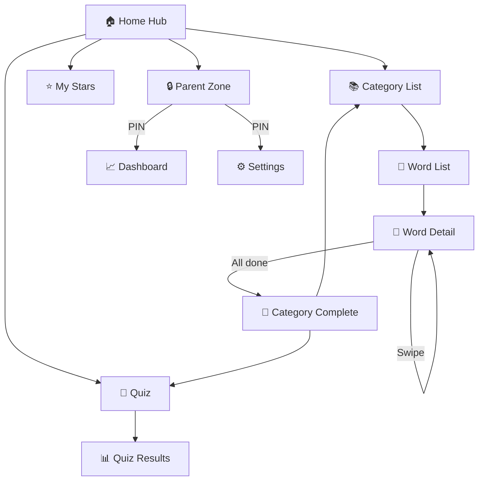
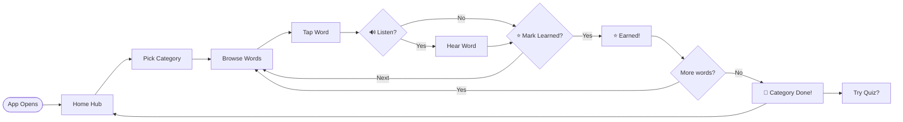
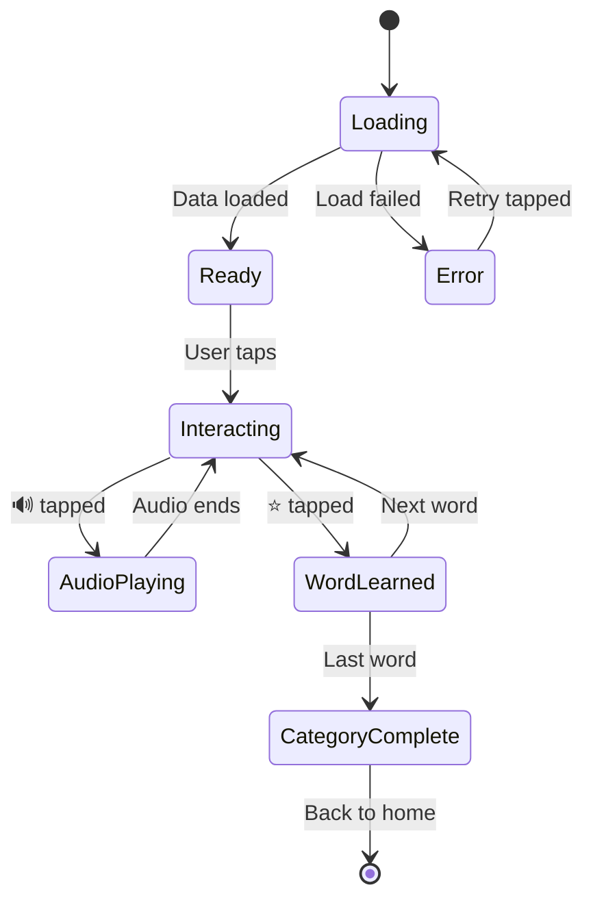

# Phase 3: UX — User Experience & Flow Design

> **Version:** PDF v1.0.0 | **Kit:** Planning Kit
> **Stage:** 2 (Interactive Planning) | **Phase:** 3 of 6
> **Tier:** Standard + Enterprise (Lite skips) | **Duration:** 30 min – 1 hour
> **Prerequisite:** Phase 2 (Strategy) confirmed

---

## Purpose

UX translates requirements into **how the product actually feels to use.** Where Phase 1 defined WHAT the product does, Phase 3 defines HOW users interact with it — screen by screen, tap by tap.

This phase is broken into **6 focused bites.**

**At the end of this phase, you will have:**
- A complete screen map with navigation flow
- User journey flows for each persona
- Wireframe descriptions for key screens
- Interaction patterns and micro-UX decisions
- Empty state and error flow designs
- Visual flowcharts as downloadable HTML files
- An interactive low-fidelity clickable prototype
- Screen size adaptation notes

---

## Phase Structure: 4 Bites

```
BITE 1: Screen Map & Navigation       (10-15 min)
  Map every screen, define navigation relationships
  Output: Screen map + navigation model

BITE 2: User Journey Flows             (10-15 min)
  Walk each persona through their key scenarios
  Output: Step-by-step journey for each persona

BITE 3: Screen Wireframes              (10-15 min)
  Text-based wireframe descriptions for every screen
  2-3 layout options for key screens
  Output: Screen specs ready for UI design

BITE 4: States & Error Flows           (5-10 min)
  Empty states, loading, errors, edge cases
  Output: Complete state coverage

BITE 5: Visual Flowcharts              (5-10 min)
  AI generates Mermaid diagrams rendered as HTML files
  User downloads/previews in browser for visual validation
  Output: Flowchart HTML files for navigation + journeys

BITE 6: Interactive Lo-Fi Prototype    (10-15 min)
  AI generates a clickable HTML mock-up with screen size notes
  User clicks through flows to validate UX decisions
  Output: prototype.html + screen size adaptation notes
```

Each bite follows: **AI Proposes → Human Reviews → AI Refines → Human Confirms → SAVE**.

---

## Bite 1: Screen Map & Navigation

> **Goal:** Map every screen in the app and how they connect.
> **Duration:** 10-15 min

### Screen Discovery Process

```
Step 1: AI EXTRACTS SCREENS FROM REQUIREMENTS
  Go through every FR (functional requirement) and identify 
  which screens are implied.
  
  "FR-01 (browse by category) implies: Home Screen, Category Screen
   FR-02 (view progress) implies: Parent Dashboard Screen
   FR-10 (audio playback) implies: Word Detail Screen has audio controls
   
   I count [N] distinct screens. Let me map them."

Step 2: AI PRESENTS SCREEN MAP
```

### Screen Map Format

The AI presents 2-3 **navigation model options** with comparison:

```
┌────────────────────────────────────────────────────────────┐
│  NAVIGATION MODEL OPTIONS                                  │
│                                                            │
│  Option A: Tab-Based (Bottom Navigation)                   │
│  ✅ Familiar to mobile users                                │
│  ✅ Quick access to key sections                            │
│  ⚠️ Limited to 3-5 top-level sections                      │
│                                                            │
│  [Home] [Learn] [Quiz] [Progress] [Settings]               │
│    │       │       │       │          │                     │
│    └→ Featured words                                       │
│            └→ Category → Word List → Word Detail            │
│                    └→ Quiz Screen → Results                 │
│                            └→ Dashboard → Reports           │
│                                    └→ Profile, Prefs        │
│                                                            │
│  Option B: Hub-and-Spoke (Single Home Screen)              │
│  ✅ Simple, fewer decisions for young users                  │
│  ✅ Parent section clearly separated                         │
│  ⚠️ More taps to reach deep content                        │
│                                                            │
│  [Home Hub] ──→ Learn ──→ Category ──→ Word Detail          │
│      │──→ Quiz ──→ Quiz Screen ──→ Results                  │
│      │──→ My Stars ──→ Progress View                        │
│      └──→ 🔒 Parent Zone (PIN-gated)                        │
│               ├──→ Dashboard                                │
│               ├──→ Settings                                 │
│               └──→ Manage Profiles                          │
│                                                            │
│  Option C: Progressive (Start simple, unlock sections)     │
│  ✅ Reduces overwhelm for first-time users                   │
│  ✅ Natural onboarding                                       │
│  ⚠️ More complex to implement                               │
│                                                            │
│  COMPARISON:                                               │
│                        Tab-Based  Hub-Spoke  Progressive    │
│  Simplicity for kids:  ★★★☆☆      ★★★★★      ★★★★☆         │
│  Quick access:         ★★★★★      ★★★☆☆      ★★★☆☆         │
│  Parent separation:    ★★★☆☆      ★★★★★      ★★★★☆         │
│  Implementation ease:  ★★★★★      ★★★★☆      ★★☆☆☆         │
│                                                            │
│  Recommendation: Option B (Hub-and-Spoke) because:          │
│  - Target users are age 3-5: fewer decisions = better       │
│  - Parent zone is clearly separated with PIN gate           │
│  - Simpler than Progressive, more focused than Tabs         │
│                                                            │
└────────────────────────────────────────────────────────────┘
```

### Screen Map Output

```markdown
## Screen Map — [PROJECT_NAME]

### Navigation Model: [e.g., Hub-and-Spoke]
**Why:** [Rationale from comparison]

### All Screens

| # | Screen | Parent Screen | Access | Persona | Core Requirement |
|---|---|---|---|---|---|
| 1 | Home Hub | — | App launch | Child | — |
| 2 | Category List | Home Hub | Tap "Learn" | Child | FR-01 |
| 3 | Word List | Category List | Tap category | Child | FR-01 |
| 4 | Word Detail | Word List | Tap word | Child | FR-01, FR-10 |
| 5 | Quiz Screen | Home Hub | Tap "Quiz" | Child | FR-06 |
| 6 | Quiz Results | Quiz Screen | Complete quiz | Child | FR-06 |
| 7 | My Stars | Home Hub | Tap "Stars" | Child | FR-02 |
| 8 | Parent Zone Gate | Home Hub | Tap 🔒 | Parent | Security |
| 9 | Parent Dashboard | Parent Zone | After PIN | Parent | FR-02 |
| 10 | Settings | Parent Zone | Tap settings | Parent | FR-20 |
| 11 | Onboarding | — | First launch | Both | Engagement |

### Navigation Rules
- Back button: always returns to parent screen
- Deep links: none for v1.0
- Parent zone: PIN-gated, never accessible to children
- Timeout: return to Home Hub after 5 min inactive
```

---

## Bite 2: User Journey Flows

> **Goal:** Walk each persona through their key scenarios, tap by tap.
> **Duration:** 10-15 min

### Journey Flow Format

For each persona, the AI maps 2-3 key journeys:

```markdown
### Journey: Child Learns a New Word

Persona: Child (age 3-5)
Trigger: Parent opens app, hands device to child
Goal: Learn 5 new words

FLOW:
┌──────────┐    ┌──────────────┐    ┌───────────┐
│ Home Hub │───→│ Category List │───→│ Word List │
│          │    │ "Animals" 🐶  │    │ Dog, Cat, │
│ [Learn]  │    │ "Food" 🍎     │    │ Bird, ... │
│ [Quiz]   │    │ "Colors" 🎨   │    │           │
│ [Stars]  │    │              │    │           │
└──────────┘    └──────────────┘    └─────┬─────┘
                                          │ tap "Dog"
                                    ┌─────▼─────┐
                                    │ Word Detail│
                                    │ 🐶 [image] │
                                    │ "Dog"      │
                                    │ 🔊 [play]  │
                                    │ ⭐ [learn]  │
                                    └───────────┘

MICRO-INTERACTIONS:
- Tap 🔊 → hear "dog" pronounced → button bounces
- Tap ⭐ → star fills in → confetti animation → word marked learned
- Swipe right → next word in category
- All taps have haptic feedback (if device supports)

HAPPY PATH TIME: ~2 minutes per word
SESSION LENGTH: ~10-15 minutes (5-8 words)

DECISION POINTS:
⓵ What happens when all words in a category are learned?
   → Show "🎉 Complete!" screen with celebration
   → Suggest: "Try the quiz!" or "Explore [next category]"

⓶ What if child taps 🔊 repeatedly?
   → Play audio each time (kids love repetition)
   → No cooldown, no "please wait"
```

### Multiple Journeys per Persona

```
Child persona:
  Journey 1: First-time use (onboarding → first word → first star)
  Journey 2: Daily learning (home → category → 5 words → quiz)
  Journey 3: Achievement moment (streak → celebration → share-worthy)

Parent persona:
  Journey 1: Setup (install → onboarding → create profile → hand to child)
  Journey 2: Check progress (PIN → dashboard → see stats → feel good)
  Journey 3: Manage settings (PIN → settings → adjust difficulty)
```

### 🧑 Suggested Human Activities

```
⚡ QUICK
□ Act out the journey yourself
  Pretend you're the user. Mime tapping through the flow on paper.
  Does it feel natural? Where do you hesitate?
  Report any awkward moments to AI.

□ Count the taps
  For the CORE user journey, count: how many taps from app launch 
  to the main action? If it's more than 3, ask AI to simplify.

⏱️ MEDIUM
□ Watch a real user (or child) use a competitor app
  Note: Where do they get stuck? What do they try first?
  This reveals UX assumptions you didn't know you had.

□ Paper prototype
  Draw 4-5 screens on paper/sticky notes.
  Arrange them on a table. "Tap" through the flow.
  Take a photo and share with AI for feedback.
```

---

## Bite 3: Screen Wireframe Descriptions

> **Goal:** Define what every screen contains and how it's laid out.
> **Duration:** 10-15 min

For each screen, the AI presents **2-3 layout options** for key screens (like Home, Detail, Dashboard) and a single proposal for simpler screens.

### Key Screen Comparison (2-3 options)

```
┌────────────────────────────────────────────────────────────┐
│  HOME SCREEN LAYOUT OPTIONS                                │
│                                                            │
│  Option A: Grid of Categories                              │
│  ┌────────────────────────────┐                            │
│  │ 🌟 "Hello [Name]!"        │                            │
│  │ ────────────────────       │                            │
│  │ [🐶 Animals] [🍎 Food]    │  ← 2×3 grid               │
│  │ [🎨 Colors] [🔢 Numbers]  │                            │
│  │ [👕 Clothes] [🏠 Home]    │                            │
│  │ ────────────────────       │                            │
│  │ [🧩 Quiz] [⭐ My Stars]   │  ← Bottom actions          │
│  │ [🔒 Parent]               │                            │
│  └────────────────────────────┘                            │
│  ✅ Clean, scannable, familiar                              │
│  ⚠️ All categories equal visual weight                     │
│                                                            │
│  Option B: Scrollable Cards with Progress                  │
│  ┌────────────────────────────┐                            │
│  │ 🌟 "Hello [Name]!"        │                            │
│  │ 🔥 3-day streak!          │  ← Motivation              │
│  │ ────────────────────       │                            │
│  │ ┌──────────────────┐      │                            │
│  │ │ 🐶 Animals  8/20 │      │  ← Horizontal scroll       │
│  │ │ ████████░░░░░░░░ │      │    with progress bars       │
│  │ └──────────────────┘      │                            │
│  │ ┌──────────────────┐      │                            │
│  │ │ 🍎 Food     3/15 │      │                            │
│  │ │ ████░░░░░░░░░░░░ │      │                            │
│  │ └──────────────────┘      │                            │
│  │ ────────────────────       │                            │
│  │ [🧩 Quiz] [⭐ Stars] [🔒] │                            │
│  └────────────────────────────┘                            │
│  ✅ Shows progress, motivating                              │
│  ✅ Highlights streaks                                      │
│  ⚠️ More complex to build                                  │
│                                                            │
│  COMPARISON:                                               │
│                      Grid      Cards+Progress               │
│  Simplicity:         ★★★★★     ★★★☆☆                       │
│  Motivation:         ★★☆☆☆     ★★★★★                       │
│  Kid-friendly:       ★★★★☆     ★★★★★                       │
│  Build effort:       ★★★★★     ★★★☆☆                       │
│                                                            │
│  Recommendation: Option B because progress visibility       │
│  drives retention (research pain point #3: no tracking).    │
│                                                            │
└────────────────────────────────────────────────────────────┘
```

### Simple Screen Specification (single proposal)

```markdown
### Screen: Word Detail

**Purpose:** Display a single word with image, audio, and learning action
**Requirement:** FR-01, FR-10

**Layout:**
┌────────────────────────────┐
│ ← [Back to {category}]    │  ← Navigation
│                            │
│     ┌────────────────┐     │
│     │                │     │
│     │   [WORD IMAGE]  │     │  ← Large, centered
│     │                │     │
│     └────────────────┘     │
│                            │
│     🐶 "Dog"               │  ← Word, large text
│     "A friendly animal     │
│      that barks"           │  ← Definition
│                            │
│  [🔊 Listen]  [⭐ Learned!] │  ← Action buttons
│                            │
│  ◀ prev          next ▶    │  ← Swipe navigation
│                            │
└────────────────────────────┘

**Interactions:**
- 🔊 Listen: plays pronunciation, button pulses on press
- ⭐ Learned: marks word, fills star, confetti burst
- Swipe left/right: prev/next word in category
- Image: tap to zoom (pinch on tablets)
- Auto-advance: none (child controls pace)

**States:**
- Default: star empty, word not yet learned
- Learned: star filled, subtle glow
- Audio playing: speaker icon animates
- Last word in category: "next" shows "🎉 Complete!"
```

### Screen Wireframe Output

```markdown
## Screen Wireframes — [PROJECT_NAME]

### Screen Index
| # | Screen | Layout Style | Option Chosen | Complexity |
|---|---|---|---|---|
| 1 | Home Hub | Cards + Progress (Option B) | Selected | Medium |
| 2 | Category List | Simple grid | Single proposal | Low |
| 3 | Word List | Scrollable list with thumbnails | Single proposal | Low |
| 4 | Word Detail | Centered image + actions (above) | Single proposal | Low |
| 5 | Quiz Screen | Full-screen question cards | Option A | Medium |
| 6 | Parent Dashboard | Stats with charts | Option B | Medium |

[Detailed spec for each screen follows]
```

---

## Bite 4: States & Error Flows

> **Goal:** Define what EVERY screen looks like in non-happy-path states.
> **Duration:** 5-10 min

### State Checklist (per screen)

The AI walks through each screen and defines these states:

```
For EVERY screen, define:

1. EMPTY STATE (no data yet)
   First launch. No words learned. No progress.
   What does the user see? How do they know what to do?
   
   Example: Home Hub empty state →
   "Welcome! Tap a category to start learning your first words! 🎉"

2. LOADING STATE
   Data is loading. What does the user see?
   Skeleton screens? Spinner? Placeholder animation?
   
   Rule: Never show a blank white screen. Always show SOMETHING.

3. ERROR STATE
   Something went wrong. Audio file missing. Data corrupted.
   What does the user see? How do they recover?
   
   Rule: Never show a technical error message to a child.
   "Oops! Something went wrong. Let's try again! 🔄"

4. FULL STATE
   All words learned. All categories complete. Max progress.
   What happens? New content? Celebration? Reset option?

5. OFFLINE STATE
   No internet. Can the user still do everything?
   What's degraded? What's unavailable?
   
   For offline-first apps: show nothing different.
   For hybrid apps: subtle "offline" indicator, queue syncs.

6. PERMISSION STATE
   Audio permission denied. Storage full. Camera blocked.
   Graceful degradation, not a wall.
```

### State Coverage Output

```markdown
## State Coverage — [PROJECT_NAME]

### Per-Screen States

| Screen | Empty | Loading | Error | Full | Offline |
|---|---|---|---|---|---|
| Home Hub | Welcome message + first category highlighted | Skeleton cards | Retry prompt | "All done!" + suggestion | No change (offline-first) |
| Word List | "No words in this category yet" | Skeleton list | Retry | All words shown | No change |
| Word Detail | n/a (always has data) | Image placeholder until loaded | Fallback: show text only | n/a | Audio cached, works offline |
| Quiz | "Learn 5 words first!" | Loading questions | "Let's try again 🔄" | Harder questions unlocked | No change |
| Parent Dashboard | "No activity yet" | Skeleton charts | "Could not load. Pull to refresh" | Full stats | Last cached data + "offline" badge |

### Global Error Patterns
- **Child-facing:** Friendly, encouraging, never technical
  "Oops! 🙈 Let's try that again!"
- **Parent-facing:** Clear but non-alarming
  "Unable to sync progress. Will retry when connected."
- **Recovery:** Always offer a clear next action (retry, go back, try different)
- **Never:** Show stack traces, error codes, or technical jargon
```

---

## Complete Deliverable

**File:** `docs/ux-flows.md`

```markdown
---
pdf_version: "1.0.0"
project_id: "[project-slug]"
project_name: "[Project Name]"
kit: "planning"
phase: 3
phase_name: "UX"
status: "confirmed"
tier: "standard"
created_at: "YYYY-MM-DD"
confirmed_at: "YYYY-MM-DD"
confirmed_by: "human"
---

# UX Flows — [PROJECT_NAME]

## Screen Map
[From Bite 1 — all screens, navigation model, navigation rules]

## User Journeys
[From Bite 2 — 2-3 journeys per persona with micro-interactions]

## Screen Wireframes
[From Bite 3 — layout specs for every screen, options for key screens]

## State Coverage
[From Bite 4 — empty, loading, error, full, offline for every screen]
```

---

## Bite 5: Visual Flowcharts (Mermaid → HTML)

> **Goal:** Generate visual navigation and journey flowcharts the user can download and preview.
> **Duration:** 5-10 min

Text-based flow descriptions are hard to scan. The AI generates **Mermaid diagrams** rendered inside standalone HTML files that the user can:
- Download and open in any browser
- Preview in canvas/artifacts
- Share with stakeholders for validation
- Print for wall-mounted reference

### What to Generate

The AI creates **3 flowchart files:**

**1. Navigation Map** — all screens and how they connect:


**2. User Journey Flow** — one per key persona:


**3. State Flow** — how the app handles errors and edge cases:


### HTML Rendering Template

The AI wraps each Mermaid diagram in a self-contained HTML file:

```html
<!DOCTYPE html>
<html lang="en">
<head>
  <meta charset="UTF-8">
  <meta name="viewport" content="width=device-width, initial-scale=1.0">
  <title>[PROJECT_NAME] — Navigation Flow</title>
  <style>
    body {
      font-family: -apple-system, BlinkMacSystemFont, 'Segoe UI', sans-serif;
      display: flex;
      flex-direction: column;
      align-items: center;
      padding: 2rem;
      background: #1a1a2e;
      color: #e0e0e0;
    }
    h1 { color: #7c3aed; margin-bottom: 0.5rem; }
    h2 { color: #a78bfa; font-weight: 400; margin-bottom: 2rem; }
    .diagram-container {
      background: #16213e;
      border-radius: 12px;
      padding: 2rem;
      max-width: 900px;
      width: 100%;
      box-shadow: 0 4px 20px rgba(0,0,0,0.3);
    }
    .meta { color: #888; font-size: 0.85rem; margin-top: 2rem; }
  </style>
</head>
<body>
  <h1>[PROJECT_NAME]</h1>
  <h2>Navigation Flow — Phase 3: UX</h2>
  <div class="diagram-container">
    <pre class="mermaid">
      [MERMAID DIAGRAM CODE HERE]
    </pre>
  </div>
  <p class="meta">Generated by Pro Dev Framework v1.0.0 — Phase 3: UX</p>
  <script type="module">
    import mermaid from 'https://cdn.jsdelivr.net/npm/mermaid@11/dist/mermaid.esm.min.mjs';
    mermaid.initialize({ startOnLoad: true, theme: 'dark' });
  </script>
</body>
</html>
```

### Facilitator Instructions

```
After confirming the screen map and user journeys, the AI says:

"I'll now generate visual flowcharts from our confirmed UX decisions.
You'll get 3 HTML files you can preview in your browser:

  1. navigation-flow.html  — All screens and connections
  2. user-journey.html     — Key user flow step by step
  3. state-diagram.html    — How the app handles errors/edge cases

Save these to your docs/ folder. They're standalone — no internet needed."

For IDE agents: Generate the HTML files directly into the project's docs/ folder.
For Cloud AI: Output the HTML code in a code block for the user to save.
```

**Save as:** `docs/diagrams/navigation-flow.html`, `docs/diagrams/user-journey.html`, `docs/diagrams/state-diagram.html`

---

## Bite 6: Interactive Low-Fidelity Prototype

> **Goal:** Generate a clickable HTML mock-up the user can interact with.
> **Duration:** 10-15 min

A text description of UX is useful. A **clickable prototype they can tap through** is 10x better. The AI generates a self-contained HTML file that simulates the app's navigation.

### What the Prototype Includes

```
FEATURES:
✅ Every screen as a styled HTML "page" (shown/hidden via JavaScript)
✅ Clickable navigation between screens (tap buttons to navigate)
✅ Visual screen-size selector (phone / tablet / desktop toggle)
✅ Screen title + breadcrumb showing current location
✅ Placeholder content matching the wireframe specs
✅ Simple transitions between screens (fade or slide)
✅ "Screen Size Notes" panel showing adaptation rules

NOT INCLUDED (this is lo-fi, not a real app):
❌ Real data or functionality
❌ Animations or micro-interactions
❌ Actual audio playback
❌ Backend connectivity
```

### Prototype HTML Structure

```html
<!DOCTYPE html>
<html lang="en">
<head>
  <meta charset="UTF-8">
  <meta name="viewport" content="width=device-width, initial-scale=1.0">
  <title>[PROJECT_NAME] — Lo-Fi Prototype</title>
  <style>
    * { margin: 0; padding: 0; box-sizing: border-box; }
    body {
      font-family: -apple-system, BlinkMacSystemFont, sans-serif;
      background: #0f0f1a;
      color: #fff;
      display: flex;
      justify-content: center;
      padding: 2rem;
    }

    /* Device frame */
    .device-frame {
      border: 3px solid #333;
      border-radius: 24px;
      overflow: hidden;
      transition: all 0.3s ease;
      background: #1a1a2e;
      position: relative;
    }
    .device-frame.phone  { width: 375px; height: 812px; }
    .device-frame.tablet { width: 768px; height: 1024px; }
    .device-frame.desktop { width: 1280px; height: 800px; border-radius: 12px; }

    /* Screen size selector */
    .size-toggle {
      position: fixed; top: 1rem; right: 1rem;
      display: flex; gap: 0.5rem; z-index: 100;
    }
    .size-toggle button {
      padding: 0.5rem 1rem; border: 1px solid #555;
      background: #222; color: #fff; border-radius: 8px;
      cursor: pointer; font-size: 0.85rem;
    }
    .size-toggle button.active { background: #7c3aed; border-color: #7c3aed; }

    /* Screens */
    .screen { display: none; height: 100%; padding: 1.5rem; overflow-y: auto; }
    .screen.active { display: flex; flex-direction: column; }

    /* Screen size notes panel */
    .size-notes {
      position: fixed; bottom: 0; left: 0; right: 0;
      background: #16213e; border-top: 1px solid #333;
      padding: 1rem 2rem; font-size: 0.8rem; color: #aaa;
    }

    /* Navigation elements */
    .nav-btn {
      padding: 1rem; margin: 0.5rem 0;
      background: #16213e; border: 2px solid #333;
      border-radius: 16px; color: #fff; font-size: 1.1rem;
      cursor: pointer; text-align: center;
      transition: all 0.2s;
    }
    .nav-btn:hover { border-color: #7c3aed; background: #1e2a4a; }
    .back-btn {
      color: #7c3aed; background: none; border: none;
      cursor: pointer; font-size: 1rem; padding: 0.5rem 0;
    }
    .breadcrumb { color: #666; font-size: 0.8rem; margin-bottom: 1rem; }
  </style>
</head>
<body>

  <!-- Size Toggle -->
  <div class="size-toggle">
    <button onclick="setSize('phone')" class="active">📱 Phone</button>
    <button onclick="setSize('tablet')">📋 Tablet</button>
    <button onclick="setSize('desktop')">🖥️ Desktop</button>
  </div>

  <div class="device-frame phone" id="device">

    <!-- Screen: Home Hub -->
    <div class="screen active" id="screen-home">
      <h1>🌟 Hello!</h1>
      <p style="color:#888;margin:1rem 0">What do you want to learn today?</p>
      <div class="nav-btn" onclick="goTo('categories')">📚 Learn Words</div>
      <div class="nav-btn" onclick="goTo('quiz')">🧩 Quiz Time</div>
      <div class="nav-btn" onclick="goTo('stars')">⭐ My Stars</div>
      <div class="nav-btn" onclick="goTo('parent-gate')" style="margin-top:auto;
        border-color:#555;font-size:0.9rem">🔒 Parent Zone</div>
    </div>

    <!-- Screen: Categories -->
    <div class="screen" id="screen-categories">
      <button class="back-btn" onclick="goTo('home')">← Back</button>
      <p class="breadcrumb">Home → Learn</p>
      <h2>Categories</h2>
      <div class="nav-btn" onclick="goTo('wordlist')">🐶 Animals (0/20)</div>
      <div class="nav-btn" onclick="goTo('wordlist')">🍎 Food (0/15)</div>
      <div class="nav-btn" onclick="goTo('wordlist')">🎨 Colors (0/12)</div>
      <div class="nav-btn" onclick="goTo('wordlist')">🔢 Numbers (0/10)</div>
    </div>

    <!-- Screen: Word List -->
    <div class="screen" id="screen-wordlist">
      <button class="back-btn" onclick="goTo('categories')">← Back</button>
      <p class="breadcrumb">Home → Learn → Animals</p>
      <h2>🐶 Animals</h2>
      <div class="nav-btn" onclick="goTo('word-detail')">🐕 Dog</div>
      <div class="nav-btn" onclick="goTo('word-detail')">🐈 Cat</div>
      <div class="nav-btn" onclick="goTo('word-detail')">🐦 Bird</div>
      <div class="nav-btn" onclick="goTo('word-detail')">🐟 Fish</div>
    </div>

    <!-- Screen: Word Detail -->
    <div class="screen" id="screen-word-detail">
      <button class="back-btn" onclick="goTo('wordlist')">← Back</button>
      <p class="breadcrumb">Home → Learn → Animals → Dog</p>
      <div style="text-align:center;margin:2rem 0">
        <div style="width:150px;height:150px;background:#16213e;border-radius:20px;
          margin:0 auto;display:flex;align-items:center;justify-content:center;
          font-size:4rem">🐕</div>
        <h1 style="margin-top:1rem">Dog</h1>
        <p style="color:#888">A friendly animal that barks</p>
      </div>
      <div style="display:flex;gap:1rem;justify-content:center">
        <div class="nav-btn" style="flex:1;text-align:center">🔊 Listen</div>
        <div class="nav-btn" style="flex:1;text-align:center">⭐ Learned!</div>
      </div>
      <div style="display:flex;justify-content:space-between;margin-top:auto;
        padding:1rem 0;color:#7c3aed">
        <span>◀ prev</span><span>next ▶</span>
      </div>
    </div>

    <!-- Add more screens: quiz, stars, parent-gate, dashboard, settings -->
    <!-- [AI generates one <div class="screen"> per screen in the map] -->

  </div>

  <!-- Screen Size Notes -->
  <div class="size-notes" id="sizeNotes">
    📱 <strong>Phone (375×812):</strong> Single column, large tap targets (48px min),
    bottom-anchored actions, swipe navigation between words.
  </div>

  <script>
    function goTo(screenId) {
      document.querySelectorAll('.screen').forEach(s => s.classList.remove('active'));
      document.getElementById('screen-' + screenId)?.classList.add('active');
    }
    function setSize(size) {
      const device = document.getElementById('device');
      device.className = 'device-frame ' + size;
      document.querySelectorAll('.size-toggle button').forEach(b => b.classList.remove('active'));
      event.target.classList.add('active');
      const notes = {
        phone: '📱 <strong>Phone (375×812):</strong> Single column, large tap targets (48px min), bottom-anchored actions, swipe navigation between words.',
        tablet: '📋 <strong>Tablet (768×1024):</strong> Two-column layout possible, sidebar category list + word detail. Larger images. Consider landscape orientation.',
        desktop: '🖥️ <strong>Desktop (1280×800):</strong> Three-column layout (categories → word list → detail). Keyboard shortcuts. Hover states. No swipe — click instead.'
      };
      document.getElementById('sizeNotes').innerHTML = notes[size];
    }
  </script>

</body>
</html>
```

### Screen Size Adaptation Notes

The AI includes screen-size-specific design decisions for **every key screen:**

```markdown
## Screen Size Adaptation — [PROJECT_NAME]

### Global Rules
| Rule | Phone (< 480px) | Tablet (480-1024px) | Desktop (> 1024px) |
|---|---|---|---|
| Layout | Single column | Two column possible | Three column |
| Tap targets | 48px minimum | 44px minimum | 36px + hover states |
| Navigation | Bottom nav / back button | Sidebar + back | Sidebar persistent |
| Font base | 16px | 18px | 16px |
| Images | Full width, 1:1 ratio | Medium, 2-column grid | Thumbnail + detail panel |
| Swipe | Primary navigation | Optional | Disabled (click instead) |
| Keyboard | On-screen only | External possible | Full keyboard shortcuts |

### Per-Screen Adaptations

#### Home Hub
| Phone | Tablet | Desktop |
|---|---|---|
| Vertical card stack | 2×3 grid of cards | 3×2 grid with sidebar stats |
| Streak banner top | Streak in sidebar | Streak in top bar |
| Parent 🔒 at bottom | Parent 🔒 in corner | Parent 🔒 in settings menu |

#### Word Detail
| Phone | Tablet | Desktop |
|---|---|---|
| Image above, text below | Image left, text right (split view) | Image left, text center, related right |
| Swipe for next word | Swipe or arrow buttons | Click arrows or keyboard ←→ |
| Full-screen focus | Partial screen (list visible) | List + detail side by side |

#### Parent Dashboard
| Phone | Tablet | Desktop |
|---|---|---|
| Scrollable stat cards | 2-column stat grid | Full dashboard with charts |
| Simple progress bars | Charts + progress bars | Charts + tables + export |
| Minimal data density | Medium density | High density, more metrics |

### Breakpoints
- **Phone:** max-width: 479px
- **Tablet:** 480px – 1023px
- **Desktop:** 1024px+
- **Large Desktop:** 1440px+ (optional: wider content area)
```

### Facilitator Instructions

```
After confirming all wireframes and states, the AI says:

"I'll now generate two things you can interact with:

  1. FLOWCHARTS (Bite 5)
     3 HTML files with Mermaid diagrams you can view in browser.
     Download and open them — no installation needed.

  2. CLICKABLE PROTOTYPE (Bite 6)
     A single HTML file that simulates your app.
     Click through screens, toggle phone/tablet/desktop views,
     and see screen-size adaptation notes for each view.

These help you validate UX decisions before any code is written.
You can also share these with stakeholders for feedback."

For IDE agents: Save files directly to docs/diagrams/ and docs/prototype/
For Cloud AI: Output complete HTML in code blocks for user to save
```

### 🧑 Suggested Human Activities

```
⚡ QUICK
□ Click through the prototype yourself
  Start at Home. Navigate to every screen.
  Count taps to core action. Note any dead ends.

□ Toggle screen sizes
  Switch between phone, tablet, desktop views.
  Does the layout make sense at each size?
  Any screen that feels cramped or empty?

□ Share with 1-2 people
  Send the prototype HTML file. Ask: "Can you figure out 
  how to [core action]?" Watch (or ask) where they get stuck.

⏱️ MEDIUM
□ Test on actual devices
  Open the HTML file on your phone AND tablet.
  Are tap targets big enough? Is text readable?
  Report findings back to AI.

□ Show to a real user in your target audience
  Watch them tap through without guidance.
  Where do they pause? What do they try first?
  This is the cheapest usability test possible.
```

**Save as:** `docs/prototype/prototype.html`, `docs/diagrams/`

**Save-As-You-Go checkpoints:**
```
After Bite 1 → Save screen map section
After Bite 2 → Save user journeys section
After Bite 3 → Save screen wireframes
After Bite 4 → Save state coverage
After Bite 5 → Save docs/diagrams/*.html (3 files)
After Bite 6 → Save docs/prototype/prototype.html + screen size notes
After all    → Save complete docs/ux-flows.md
```

---

## Tier Adjustments

| Aspect | Lite | Standard | Enterprise |
|---|---|---|---|
| This Phase | SKIP ENTIRELY | Full (all 6 bites) | Full + accessibility audit |
| Navigation Options | — | 2 options for key model | 3 options + user testing |
| Journeys | — | 2 per persona | 3 per persona + edge journeys |
| Wireframes | — | Key screens get 2 options | All screens get 2-3 options |
| State Coverage | — | Per-screen table | Per-screen + global patterns |
| Flowcharts | — | Navigation + 1 journey | All flows + state diagrams |
| Prototype | — | Core flow only (4-5 screens) | All screens + 3 sizes |
| Screen Sizes | — | Phone + tablet notes | Phone + tablet + desktop + large |
| Human Activities | — | Paper prototype recommended | Device testing required |
