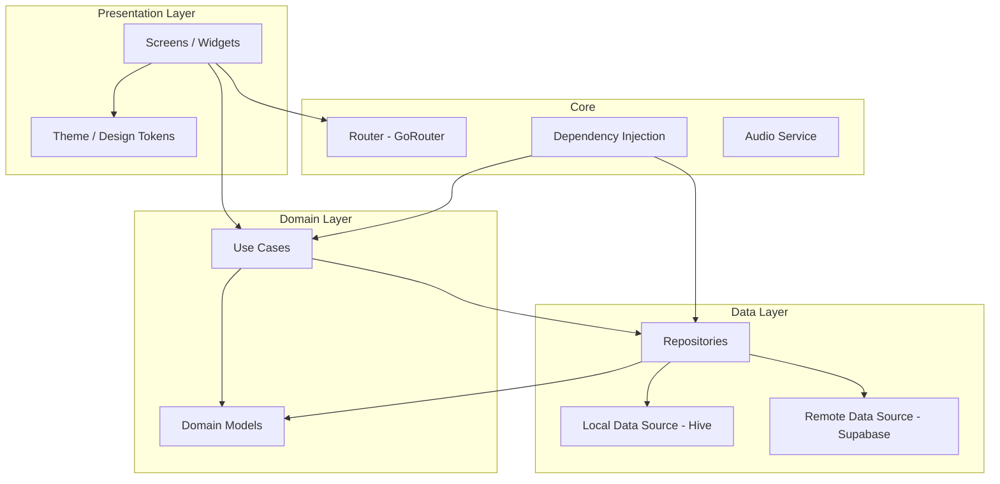
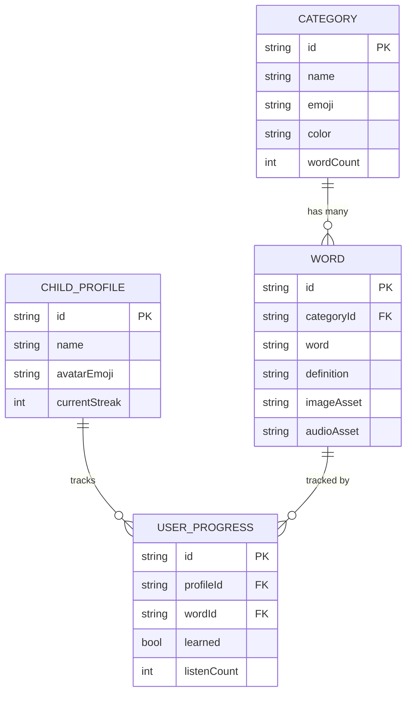

# Phase 5: Architecture — System Design & Walking Skeleton Spec

> **Version:** PDF v1.0.0 | **Kit:** Planning Kit
> **Stage:** 2 (Interactive Planning) | **Phase:** 5 of 6
> **Tier:** All (depth varies) | **Duration:** 30 min – 1 hour
> **Prerequisite:** Phase 2 (Strategy) confirmed, Phase 3 (UX) helpful

---

## Purpose

Architecture translates the technology stack and requirements into a **buildable system design.** This is where the planning phase produces the blueprint that the IDE agent will follow.

This phase is broken into **4 focused bites.**

**At the end of this phase, you will have:**
- A system architecture diagram with component relationships
- A data model with entity definitions and relationships
- A walking skeleton specification (what M1 builds exactly)
- Folder structure and code organization decisions

---

## Phase Structure: 4 Bites

```
BITE 1: System Architecture            (10-15 min)
  High-level components and how they connect
  2-3 architecture pattern options compared
  Output: Architecture diagram + decision log

BITE 2: Data Model                     (10-15 min)
  Entities, attributes, relationships
  2-3 storage approach options compared
  Output: Data model document + schema

BITE 3: Walking Skeleton Spec          (5-10 min)
  Exact M1 specification for the IDE agent
  What the skeleton proves, what it skips
  Output: Walking skeleton spec ready for handoff

BITE 4: Folder Structure & Conventions (5-10 min)
  Project organization, naming, file patterns
  Output: Folder structure + coding convention document
```

Each bite follows: **AI Proposes → Human Reviews → AI Refines → Human Confirms → SAVE**.

---

## Bite 1: System Architecture

> **Goal:** Choose the architecture pattern and define system components.
> **Duration:** 10-15 min

### Architecture Pattern Comparison

The AI proposes 2-3 architecture patterns based on the chosen tech stack:

```
┌────────────────────────────────────────────────────────────┐
│  ARCHITECTURE PATTERN OPTIONS                              │
│                                                            │
│  Option A: Feature-First Clean Architecture                │
│                                                            │
│  lib/                                                      │
│  ├── features/                                             │
│  │   ├── word_learning/                                    │
│  │   │   ├── data/       (repos, data sources)             │
│  │   │   ├── domain/     (models, use cases)               │
│  │   │   └── ui/         (screens, widgets)                │
│  │   ├── quiz/                                             │
│  │   │   ├── data/                                         │
│  │   │   ├── domain/                                       │
│  │   │   └── ui/                                           │
│  │   └── parent_dashboard/                                 │
│  │       ├── data/                                         │
│  │       ├── domain/                                       │
│  │       └── ui/                                           │
│  ├── core/                (shared utilities, theme, routes) │
│  └── main.dart                                             │
│                                                            │
│  ✅ Each feature is self-contained and testable             │
│  ✅ Easy to add new features without touching others        │
│  ✅ Clear dependency direction: UI → Domain → Data          │
│  ⚠️ More folders/files for small projects                  │
│                                                            │
│  Option B: Layer-First (Traditional MVC-like)              │
│                                                            │
│  lib/                                                      │
│  ├── models/         (all data models)                     │
│  ├── screens/        (all UI screens)                      │
│  ├── widgets/        (reusable components)                 │
│  ├── services/       (API, database, audio)                │
│  ├── utils/          (helpers, constants)                  │
│  └── main.dart                                             │
│                                                            │
│  ✅ Simple, familiar structure                              │
│  ✅ Fast to set up                                          │
│  ⚠️ Features are scattered across layers                   │
│  ⚠️ Gets messy as project grows past 20+ screens           │
│                                                            │
│  Option C: Modular Monolith                                │
│                                                            │
│  lib/                                                      │
│  ├── modules/                                              │
│  │   ├── learning/    (complete learning module)            │
│  │   ├── assessment/  (quiz + scoring)                     │
│  │   ├── progress/    (tracking + stats)                   │
│  │   └── settings/    (config + profiles)                  │
│  ├── shared/           (cross-module utilities)            │
│  ├── app/              (routing, theme, DI)                │
│  └── main.dart                                             │
│                                                            │
│  ✅ Module boundaries = team boundaries (scalable)          │
│  ✅ Each module can have its own architecture               │
│  ⚠️ Over-engineered for solo developer                     │
│                                                            │
│  COMPARISON:                                               │
│                      Feature-First  Layer-First  Modular    │
│  Solo dev speed:     ★★★★☆          ★★★★★        ★★★☆☆     │
│  Scalability:        ★★★★★          ★★☆☆☆        ★★★★★     │
│  Testability:        ★★★★★          ★★★☆☆        ★★★★☆     │
│  Learning curve:     ★★★☆☆          ★★★★★        ★★★☆☆     │
│  Code navigation:    ★★★★★          ★★★☆☆        ★★★★☆     │
│                                                            │
│  Recommendation: Option A (Feature-First) because:          │
│  - Each feature maps to a milestone = clean work units     │
│  - Tests are co-located with the code they test            │
│  - Adding features (future update-kit) is modular          │
│  - Clean Architecture is well-documented in Flutter        │
│                                                            │
└────────────────────────────────────────────────────────────┘
```

### State Management & Data Flow Strategy

Before drawing the diagram, the AI proposes 2-3 state management or data flow paradigms (specifically tailored to the chosen tech stack).

```text
┌────────────────────────────────────────────────────────────┐
│  STATE MANAGEMENT OPTIONS (Flutter Example)                │
│                                                            │
│  Option A: Global Reactive State (e.g., Riverpod/Redux)    │
│  ✅ Single source of truth, easy to access anywhere         │
│  ✅ Excellent for reactive UI and caching                   │
│  ⚠️ High boilerplate for very simple screens               │
│                                                            │
│  Option B: Local/Context State (e.g., Provider)            │
│  ✅ Low boilerplate, fast to write                          │
│  ✅ Good for isolated, simple features                      │
│  ⚠️ Messy when sharing data across many distant features   │
│                                                            │
│  Option C: Event-Driven (e.g., BLoC)                       │
│  ✅ Strict separation of events and business logic          │
│  ✅ Extremely testable and scalable                         │
│  ⚠️ Steep learning curve, verbose                          │
│                                                            │
│  Recommendation: Option A (Riverpod). It balances          │
│  scalability with safety, fitting the Clean Architecture.  │
└────────────────────────────────────────────────────────────┘
```

### System Architecture Diagram

After choosing the pattern, the AI generates a Mermaid architecture diagram:



The AI renders this as an HTML file (same pattern as Phase 3, Bite 5).

**Save as:** `p_21_architecture.html`

---

## Bite 2: Data Model

> **Goal:** Define every entity, its attributes, and relationships.
> **Duration:** 10-15 min

### E-R Brainstorming & Data Paradigms

Before generating the final ER diagram, the AI proposes 2-3 conceptual models for how the core data should be structured and related.

```text
┌────────────────────────────────────────────────────────────┐
│  DATA PARADIGM OPTIONS                                     │
│                                                            │
│  Option A: Flat Relational (SQL-style ER Model)            │
│  Categories, Words, and Profiles are separate tables.      │
│  ✅ Highly queryable, easy to join                          │
│  ✅ Strict schema guarantees data integrity                 │
│  ⚠️ Slower reads if joins get complex                       │
│                                                            │
│  Option B: Document/Nested (NoSQL-style)                   │
│  A Category document contains an array of its Words inside.│
│  ✅ Extremely fast reads (get category = get all words)    │
│  ✅ Great for offline-first JSON stores and direct UI feed │
│  ⚠️ Harder to query single words across categories         │
│                                                            │
│  Option C: Graph/Nodes                                     │
│  Words and Categories are nodes, 'learned' are edges.      │
│  ✅ Perfect for recommendation systems and spaced learning  │
│  ⚠️ Overkill for a simple local-first application          │
│                                                            │
│  Recommendation: Option A provides the most robust ER      │
│  mapping, but Option B might be best for local-first apps. │
└────────────────────────────────────────────────────────────┘
```

### Data Model Design

Based on the chosen paradigm, the AI proposes the detailed model entity by entity:

```markdown
## Data Model — [PROJECT_NAME]

### Entity: Category
| Attribute | Type | Required | Description |
|---|---|---|---|
| id | String (UUID) | ✅ | Unique identifier |
| name | String | ✅ | Display name ("Animals") |
| emoji | String | ✅ | Category icon ("🐶") |
| color | String (hex) | ✅ | Category theme color |
| wordCount | int | ✅ | Total words in category |
| sortOrder | int | ✅ | Display order |

### Entity: Word
| Attribute | Type | Required | Description |
|---|---|---|---|
| id | String (UUID) | ✅ | Unique identifier |
| categoryId | String (FK) | ✅ | Parent category |
| word | String | ✅ | The vocabulary word |
| definition | String | ✅ | Kid-friendly description |
| imageAsset | String | ✅ | Path to illustration |
| audioAsset | String | ✅ | Path to pronunciation |
| sortOrder | int | ✅ | Display order in category |

### Entity: UserProgress
| Attribute | Type | Required | Description |
|---|---|---|---|
| id | String (UUID) | ✅ | Unique identifier |
| profileId | String (FK) | ✅ | Child profile |
| wordId | String (FK) | ✅ | Which word |
| learned | bool | ✅ | Has the child marked this learned? |
| learnedAt | DateTime | ❌ | When was it learned? |
| listenCount | int | ✅ | Times audio was played |
| quizAttempts | int | ✅ | Times appeared in quiz |
| quizCorrect | int | ✅ | Times answered correctly |

### Entity: ChildProfile
| Attribute | Type | Required | Description |
|---|---|---|---|
| id | String (UUID) | ✅ | Unique identifier |
| name | String | ✅ | Display name |
| avatarEmoji | String | ✅ | Profile avatar |
| createdAt | DateTime | ✅ | When profile was created |
| currentStreak | int | ✅ | Consecutive days of activity |
| longestStreak | int | ✅ | Best streak ever |
| lastActiveDate | Date | ✅ | Last day of activity |
```

### Relationship Diagram (Mermaid)



### Storage Approach Options

```
┌────────────────────────────────────────────────────────────┐
│  STORAGE APPROACH OPTIONS                                  │
│                                                            │
│  Option A: All Local (Hive / SharedPreferences)            │
│  ✅ Zero network dependency — truly offline                 │
│  ✅ Fastest reads/writes                                    │
│  ✅ Simplest to implement                                   │
│  ⚠️ No cross-device sync                                   │
│  ⚠️ Data lost if app uninstalled                           │
│                                                            │
│  Option B: Local + Cloud Sync (Hive + Supabase)            │
│  ✅ Offline-first with cloud backup                         │
│  ✅ Cross-device sync possible                              │
│  ⚠️ Sync conflict resolution needed                        │
│  ⚠️ More complex, more code                                │
│                                                            │
│  Option C: Local Content + Cloud Progress                  │
│  ✅ Content is bundled (fast, offline)                       │
│  ✅ Progress syncs to cloud (backup only)                   │
│  ✅ Simpler sync (no merge conflicts on progress)           │
│  ⚠️ Requires account creation (parent)                     │
│                                                            │
│  Recommendation for v1.0: Option A (All Local).             │
│  Reason: Risk R1 (sync complexity) is HIGH.                 │
│  Add cloud backup in v1.1 after core is solid.              │
│                                                            │
└────────────────────────────────────────────────────────────┘
```

---

## Bite 3: Walking Skeleton Spec

> **Goal:** Define exactly what the IDE agent builds in Milestone 1.
> **Duration:** 5-10 min

The Walking Skeleton (from ThoughtWorks) is a tiny implementation that spans the full tech stack end-to-end with minimal flesh.

```markdown
## Walking Skeleton — [PROJECT_NAME]

### What It Proves
"After completing this milestone, we know:
  ✅ The framework (Flutter) builds and runs on both platforms
  ✅ Navigation works (GoRouter routes between screens)
  ✅ State management works (Riverpod provides data to UI)
  ✅ Local database works (Hive reads/writes)
  ✅ Asset loading works (images and audio load from assets/)
  ✅ At least 1 test passes
  ✅ The folder structure supports feature-first architecture"

### What It Skips (deliberately)
"The skeleton does NOT include:
  ❌ Real content (uses 3-5 hardcoded words)
  ❌ Polish (no animations, no design tokens)
  ❌ Error handling (happy path only)
  ❌ Progress tracking (no database writes)
  ❌ Quiz feature
  ❌ Parent dashboard
  ❌ Multiple profiles"

### Exact Scope

| Screen | What It Shows | Real or Stub? |
|---|---|---|
| Home Hub | 2 category buttons | Stub (hardcoded) |
| Category List | 3-5 words in selected category | Stub (hardcoded) |
| Word Detail | Image + word + audio play button | Real (loads asset) |

### Files Created

```
lib/
├── main.dart                           ← App entry point
├── core/
│   ├── router.dart                     ← GoRouter routes
│   └── theme.dart                      ← Basic theme (will be replaced)
├── features/
│   └── word_learning/
│       ├── data/
│       │   ├── models/word.dart        ← Word data class
│       │   └── sources/local_data.dart ← Hardcoded stub data
│       ├── domain/
│       │   └── word_provider.dart      ← Riverpod provider
│       └── ui/
│           ├── home_screen.dart        ← Home hub
│           ├── word_list_screen.dart   ← Word list
│           └── word_detail_screen.dart ← Word detail + audio
├── assets/
│   ├── images/dog.png                  ← 1 test image
│   └── audio/dog.mp3                   ← 1 test audio
└── test/
    └── word_learning/
        └── word_model_test.dart        ← 1 model test
```

### Acceptance Criteria for M1

```
M1 is DONE when:
  □ App launches on both iOS simulator and Android emulator
  □ Home screen shows 2 category buttons
  □ Tapping "Animals" navigates to word list
  □ Word list shows 3-5 words with names
  □ Tapping a word navigates to detail screen
  □ Detail screen shows image placeholder
  □ Tapping 🔊 plays the audio file
  □ Back button returns to previous screen
  □ At least 1 unit test passes
  □ Code is committed to Git with meaningful message
```

### 🧑 Suggested Human Activities

```
⚡ QUICK (before handing off to IDE agent)
□ Verify your dev environment
  Can you run `flutter doctor` (or equivalent)?
  All green? If not, fix before starting M1.

□ Prepare 1 test asset
  Find or record 1 word pronunciation ("dog").
  Find or create 1 simple illustration.
  These go into assets/ for the skeleton.
```

---

## Bite 4: Folder Structure & Conventions

> **Goal:** Define project organization and coding conventions.
> **Duration:** 5-10 min

### Folder Structure

```markdown
## Project Structure — [PROJECT_NAME]

[APP_NAME]/
├── lib/
│   ├── main.dart                        ← App entry, DI setup
│   ├── app/
│   │   └── app.dart                     ← MaterialApp / Theme
│   ├── core/
│   │   ├── router.dart                  ← All route definitions
│   │   ├── theme.dart                   ← Design tokens from Phase 4
│   │   ├── constants.dart               ← App-wide constants
│   │   └── extensions/                  ← Dart extension methods
│   ├── features/
│   │   ├── word_learning/               ← Feature: Learn words
│   │   │   ├── data/
│   │   │   │   ├── models/              ← Data classes
│   │   │   │   ├── sources/             ← Local/remote data
│   │   │   │   └── repositories/        ← Repo implementations
│   │   │   ├── domain/
│   │   │   │   ├── providers/           ← Riverpod providers
│   │   │   │   └── use_cases/           ← Business logic
│   │   │   └── ui/
│   │   │       ├── screens/             ← Full-page screens
│   │   │       └── widgets/             ← Feature-specific widgets
│   │   ├── quiz/                        ← Feature: Quiz
│   │   ├── progress/                    ← Feature: Progress tracking
│   │   └── settings/                    ← Feature: Parent zone
│   └── shared/
│       ├── widgets/                     ← Cross-feature widgets
│       ├── services/                    ← Audio, analytics, etc.
│       └── utils/                       ← Helpers, formatters
├── assets/
│   ├── images/                          ← Illustrations (by category)
│   ├── audio/                           ← Word pronunciations
│   ├── fonts/                           ← Custom fonts (Poppins, Baloo 2)
│   └── data/                            ← JSON content files (if applicable)
├── test/
│   ├── features/                        ← Mirror lib/features/
│   └── shared/                          ← Mirror lib/shared/
├── docs/                                ← Planning package lives here
│   ├── requirements.md
│   ├── strategy.md
│   ├── ux-flows.md
│   ├── ui-design-brief.md
│   ├── architecture.md
│   ├── stakeholders/
│   ├── diagrams/
│   └── prototype/
├── AGENT.md                             ← Project brain
├── CLAUDE.md                            ← → AGENT.md
├── AGENTS.md                            ← → AGENT.md
└── pubspec.yaml
```

### Naming Conventions

```markdown
## Naming Conventions

| Element | Convention | Example |
|---|---|---|
| Files | snake_case | `word_detail_screen.dart` |
| Classes | PascalCase | `WordDetailScreen` |
| Variables | camelCase | `currentStreak` |
| Constants | camelCase | `maxWordsPerCategory` |
| Enums | PascalCase + camelCase values | `QuizDifficulty.easy` |
| Directories | snake_case | `word_learning/` |
| Assets | snake_case | `dog_illustration.png` |
| Test files | [file]_test.dart | `word_model_test.dart` |
| Routes | /kebab-case | `/word-detail/:id` |

### File Size Rule
- Max 200 lines per file
- If a file exceeds 200 lines, split into smaller units
- Exception: generated files, data files
```

---

## Complete Deliverable

**File:** `p_20_architecture.md`

```markdown
---
pdf_version: "1.0.0"
project_id: "[project-slug]"
project_name: "[Project Name]"
kit: "planning"
phase: 5
phase_name: "Architecture"
status: "confirmed"
tier: "standard"
created_at: "YYYY-MM-DD"
confirmed_at: "YYYY-MM-DD"
confirmed_by: "human"
---

# Architecture — [PROJECT_NAME]

## System Architecture
[From Bite 1 — pattern choice, component diagram, decision log]

## Data Model
[From Bite 2 — entities, attributes, relationships, ER diagram]

## Walking Skeleton
[From Bite 3 — or link to docs/walking-skeleton-spec.md]

## Project Structure
[From Bite 4 — folder structure, naming, file size rules]
```

**Additional files:**
- `p_23_walking-skeleton-spec.md` — standalone spec for M1
- `p_21_architecture.html` — Mermaid rendered architecture diagram
- `p_22_data-model.html` — Mermaid rendered ER diagram

**Save-As-You-Go checkpoints:**
```
After Bite 1 → Save architecture section + `p_21_architecture.html`
After Bite 2 → Save data model section + `p_22_data-model.html`
After Bite 3 → Save `p_23_walking-skeleton-spec.md`
After Bite 4 → Save project structure section
After all    → Save complete `p_20_architecture.md`
```

---

## Tier Adjustments

| Aspect | Lite | Standard | Enterprise |
|---|---|---|---|
| Architecture Pattern | Simple (layer-first) | 2-3 options compared | 3 options + ADR log started |
| Data Model | 3-5 entities, brief | Full with types and relationships | Full + migration strategy |
| Walking Skeleton | Essential screens only | Full end-to-end proof | Full + CI/CD pipeline |
| Folder Structure | Flat, minimal | Feature-first, documented | Feature-first + module boundaries |
| Conventions | Naming only | Naming + file size + patterns | Full style guide + linting rules |
| Diagrams | None | Architecture + ER diagram | Full + sequence diagrams |
| Human Activities | Verify dev env only | Dev env + 1 test asset | Full spike + team review |
