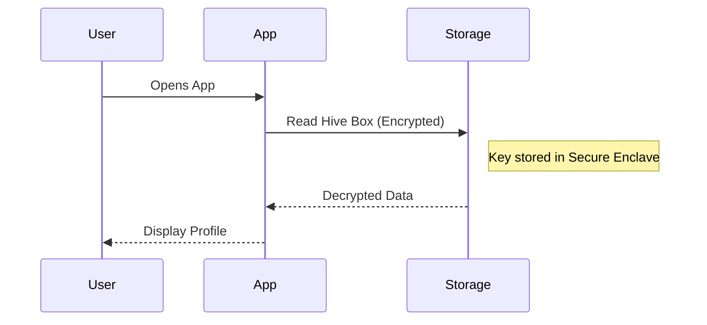

# Phase 6: Security, Compliance & Accessibility — Protecting Users

> **Version:** PDF v1.0.0 | **Kit:** Planning Kit
> **Stage:** 2 (Interactive Planning) | **Phase:** 6 of 6
> **Tier:** All (depth varies) | **Duration:** 30 min – 1 hour
> **Prerequisite:** Phase 5 (Architecture) confirmed

---

## Purpose

The final step of the Interactive Planning stage ensures the project meets all legal, security, and accessibility standards before a single line of production code is written. Fixing compliance issues midway through development is costly; addressing them now is cheap.

This phase is broken into **4 focused bites.**

**At the end of this phase, you will have:**
- A comprehensive data privacy strategy.
- Security controls and threat mitigations mapped out.
- Accessibility standards (WCAG) and responsive design breakpoints defined.
- A legally binding-ready compliance checklist.

---

## Phase Structure: 4 Bites

```
BITE 1: Data Privacy & Handling        (10-15 min)
  PII handling, GDPR/COPPA/CCPA requirements
  2-3 privacy strategy options compared
  Output: Data Privacy Strategy document

BITE 2: Security & Authentication      (10-15 min)
  Auth flows, API security, at-rest encryption
  2-3 authentication options compared
  Output: Security Model document

BITE 3: Accessibility & Constraints    (5-10 min)
  WCAG targets, screen size notes, and offline capabilities
  Output: UX Constraints & Accessibility checklist

BITE 4: Final Compliance Sign-off      (5-10 min)
  Bringing it all together for human review
  Output: Complete docs/compliance.md
```

Each bite follows: **AI Proposes → Human Reviews → AI Refines → Human Confirms → SAVE**.

---

## Facilitator Behavior (AI Rules)

- **DO** actively research relevant laws based on the target audience (e.g., COPPA for kids, HIPAA for health, GDPR for EU).
- **DON'T** provide legal advice. Always caveat that the output is a technical foundation for legal review.
- **DO** assume least privilege architecture by default.
- **DON'T** let the user skip this phase if they are storing PII (Personally Identifiable Information).

---

## Bite 1: Data Privacy & Handling

> **Goal:** Determine how user data (especially PII) is collected, stored, and deleted.
> **Duration:** 10-15 min

### Data Privacy Approach

Based on the Data Model (Phase 5), the AI identifies any PII and proposes 2-3 privacy approaches:

```
┌────────────────────────────────────────────────────────────┐
│  PRIVACY STRATEGY OPTIONS                                  │
│                                                            │
│  Option A: Zero PII / Local Only Strategy                  │
│  ✅ No user accounts, everything stored on device           │
│  ✅ Exempt from most GDPR/COPPA heavy reporting             │
│  ✅ Lowest legal risk                                       │
│  ⚠️ Cannot sync progress across devices                    │
│                                                            │
│  Option B: Minimal PII + Managed Cloud Auth                │
│  ✅ Uses OAuth (Apple/Google) or Supabase Auth              │
│  ✅ We don't store passwords, just a user ID and email      │
│  ✅ Allows cloud sync                                       │
│  ⚠️ Requires Privacy Policy, basic GDPR compliance         │
│                                                            │
│  Option C: Full Custom Auth + Analytics                    │
│  ✅ Full control over the user experience                   │
│  ✅ Granular analytics directly tied to users               │
│  ⚠️ High legal footprint, requires age-gating              │
│  ⚠️ Needs fully audited "Right to be Forgotten" flow       │
│                                                            │
│  COMPARISON:                                               │
│                      Local Only   Min PII     Full Custom  │
│  Legal Risk:         Low          Medium      High         │
│  Dev Effort:         Low          Medium      High         │
│  User Sync:          No           Yes         Yes          │
│                                                            │
│  Recommendation: Option A (Local Only).                    │
│  Reason: Educational app for toddlers. COPPA compliance    │
│  is brutal. Avoid cloud sync for v1.0 to ensure 100%       │
│  child safety with minimal dev overhead.                   │
│                                                            │
└────────────────────────────────────────────────────────────┘
```

**Save as:** `docs/compliance/privacy-strategy.md`

---

## Bite 2: Security & Authentication

> **Goal:** Secure the application against unauthorized access and data breaches.
> **Duration:** 10-15 min

### Security Flow

The AI proposes a Mermaid flow illustrating how security is handled (e.g., API requests or local encryption). 



### Threat Mitigation

The AI lists the top 3-5 threats to the architecture and how to mitigate them:

| Threat | Risk Level | Mitigation Strategy |
|---|---|---|
| Local file tampering | Medium | Encrypt local database (e.g., Hive AES encryption). |
| Bot traffic on APIs | High | Implement rate limiting + reCAPTCHA on public endpoints. |
| Malicious ad SDKs | High | Do not include third-party ad networks (ad-free model). |

**Save as:** `docs/compliance/security-model.md`

---

## Bite 3: Accessibility & Design Constraints

> **Goal:** Ensure the app is usable by everyone, across target devices.
> **Duration:** 5-10 min

### Accessibility (WCAG) Targets

| Component | standard | Implementation |
|---|---|---|
| Screen Readers | WCAG 2.1 AA | `Semantics` widgets in Flutter for all actionable items. |
| Contrast Ratio | WCAG 2.1 AA | Minimum 4.5:1 contrast for text; 3:1 for large text. |
| Touch Targets | Human Interface | All buttons must be minimum 44x44pt. |

### Screen Size Notes (Responsive Breakpoints)

The AI documents adaptation rules for every screen type:

| Breakpoint | Category | Adaptation Rule |
|---|---|---|
| 0 - 599px | Phone (Mobile) | Single column layout. Bottom navigation bar. |
| 600 - 899px | Tablet (Portrait) | Single column, wider margins. Larger tap targets. |
| 900+ px | Tablet (Landscape)/Desktop| Grid layouts (2+ columns). Sidebar navigation instead of bottom bar. |

**Save as:** `docs/compliance/accessibility-constraints.md`

---

## Bite 4: Final Compliance Checklist

> **Goal:** Generate the final legally-binding-ready summary of what M1 needs to implement.
> **Duration:** 5-10 min

The AI groups the decisions into an actionable checklist for the IDE agent.

### Complete Deliverable

**File:** `docs/compliance.md`

```markdown
---
pdf_version: "1.0.0"
project_id: "[project-slug]"
project_name: "[Project Name]"
kit: "planning"
phase: 6
phase_name: "Compliance"
status: "confirmed"
tier: "standard"
created_at: "YYYY-MM-DD"
confirmed_at: "YYYY-MM-DD"
confirmed_by: "human"
---

# Security & Compliance — [PROJECT_NAME]

## Data Privacy
[From Bite 1 — Strategy choice, PII definitions, COPPA/GDPR standing]

## Security Architecture
[From Bite 2 — Threat mitigations, auth options, sequence diagrams]

## Accessibility Constraints
[From Bite 3 — WCAG rules, touch targets, screen size notes]

## Checklists for Implementation Stage
- [ ] Database encryption implemented
- [ ] Screen reader semantics attached to all buttons
- [ ] Responsive breakpoints implemented in Theme
- [ ] Privacy Policy drafted (External Task)
```

**Additional formats generated:**
- `docs/diagrams/security-flow.html` — Interactive sequence diagram.

**Save-As-You-Go checkpoints:**
```
After Bite 1 → Save docs/compliance/privacy-strategy.md
After Bite 2 → Save docs/compliance/security-model.md + diagram HTML
After Bite 3 → Save docs/compliance/accessibility-constraints.md
After Bite 4 → Save complete docs/compliance.md
```

---

## 🧑 Suggested Human Activities

```
⚡ QUICK
□ Read the threat model. Are there any business risks missing?

⏱️ MEDIUM
□ Run a color contrast checker on your brand colors to ensure WCAG 2.1 AA compliance natively.

🔬 DEEP
□ Consult a legal professional with the output data-privacy strategy to draft your actual Privacy Policy.
```

---

## Tier Adjustments

| Aspect | Lite | Standard | Enterprise |
|---|---|---|---|
| Privacy Strategy | Basic local/cloud note | Full option comparison | Dedicated DPO review required |
| Threat Model | Top 3 general threats | Custom threat model | Full STRIDE threat modeling |
| Security Diags | None | 1 Sequence Diagram | Complex system auth flows mapped |
| Accessibility | Basic contrast check | Full WCAG 2.1 AA spec | WCAG 2.2 AAA + audit planning |
| Screen Rules | Phone only | Phone & Tablet | All breakpoints + auto-scaling |
| Human Activity | Quick review | Color contrast check | Legal consultation mandatory |
