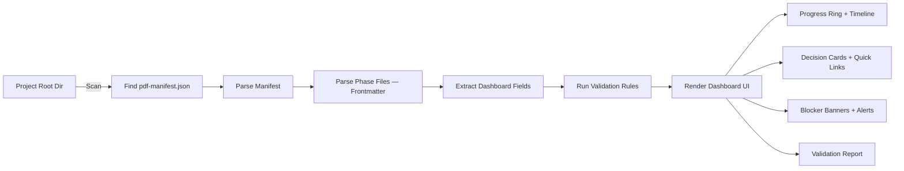

# Planning Kit Output Formats — Deliverable Templates

> **Version:** PDF v1.1.0 | **Kit:** Planning Kit
> **Stage:** Reference | **Category:** Formats
> **Tier:** All
> **Prerequisite:** N/A

---

## Purpose

The Planning Kit requires specific output formats to ensure seamless handoff to the Building Kit (IDE Agents). These files are also the data source for the **PDF Project Dashboard** — a future webapp that tracks every project built with this framework.

This document defines:
1. The **YAML frontmatter** standard (machine-parseable metadata on every file)
2. The **canonical file names** (no variation allowed)
3. The **`pdf-manifest.json`** spec (project-level index for the dashboard webapp)
4. The **exact Markdown templates** for core Phase 1–7 deliverables
5. The **validation rules** a script or webapp can enforce

---

## 1. YAML Frontmatter Standard

Every deliverable file produced by the Planning Kit **MUST** begin with a YAML frontmatter block. This replaces all HTML comments for metadata.

### Required Fields (Identity & Status)

These fields are **mandatory** on every deliverable file. A missing field causes a validation error.

```yaml
---
# ── Identity ───────────────────────────────────────────────
pdf_version: "1.0.0"                    # Framework version that produced this file
project_id: "first-words-app"           # URL-safe slug, unique per project
project_name: "First Words"             # Human-readable project name
kit: "planning"                         # planning | building | content | maintenance
phase: 1                                # Phase number (0-15 for 16 gates), or 0 for pre-phase files
phase_name: "Discovery"                 # Human-readable phase name
status: "confirmed"                     # draft | in-progress | confirmed
tier: "standard"                        # lite | standard | enterprise
created_at: "2026-04-12"               # ISO 8601 date
confirmed_at: "2026-04-12"             # ISO 8601 date, null if not yet confirmed
confirmed_by: "human"                   # human | auto
description: "Short project description"  # One-line summary (used by dashboard)
tech_stack: "Flutter, Hive, Riverpod"     # Comma-separated list of technologies
target_platforms: "iOS, Android"          # Comma-separated list of target platforms
---
```

### Dashboard Fields (Progress & Tracking)

These fields enable **granular progress tracking** in the PDF Project Dashboard. They are **recommended** on all phase deliverables (phases 1–7). A missing dashboard field causes a validation warning (not an error).

```yaml
---
# ... identity fields above ...

# ── Bite-Level Progress ────────────────────────────────────
bites_total: 5                          # Total bites in this phase (from phase guide)
bites_completed: 3                      # Bites with human-confirmed output
current_bite: 4                         # Currently active bite (null if phase confirmed)

# ── Time Tracking ──────────────────────────────────────────
estimated_duration_min: 45              # Expected duration from phase guide
actual_duration_min: 62                 # Real elapsed time, logged at confirmation
revision_count: 2                       # Times human requested refinement before confirm

# ── Outputs Produced ───────────────────────────────────────
linked_assets:                          # Files THIS phase created (relative to docs/)
  - "p_17_prototype.html"
  - "p_14_navigation-flow.html"

# ── Key Decisions (Dashboard Cards) ────────────────────────
key_decisions:                          # Major choices made during this phase
  - label: "Navigation Model"           # Short decision name
    value: "Bottom Tab Bar"             # Chosen option
    bite: 2                             # Which bite produced this decision
  - label: "Prototype Format"
    value: "Interactive HTML"
    bite: 5

# ── Blocker & Human Action Flags ───────────────────────────
needs_human_action: false               # True if phase is blocked on manual work
blocker: null                           # Free text reason, e.g., "Waiting on brand colors"
---
```

### Field Reference Table

| Field | Type | Required | Default | Dashboard Widget |
|---|---|---|---|---|
| `bites_total` | int | Recommended | Phase guide value | Progress bar denominator |
| `bites_completed` | int | Recommended | 0 | Progress bar numerator |
| `current_bite` | int \| null | Recommended | null | "Currently on" label |
| `estimated_duration_min` | int | Recommended | Phase guide value | Time comparison chart |
| `actual_duration_min` | int \| null | Recommended | null (set at confirm) | Time comparison chart |
| `revision_count` | int | Recommended | 0 | Quality signal badge |
| `linked_assets` | list[string] | Recommended | [] | Quick-link buttons |
| `key_decisions` | list[object] | Recommended | [] | Decision cards |
| `key_decisions[].label` | string | Required (if parent exists) | — | Card title |
| `key_decisions[].value` | string | Required (if parent exists) | — | Card value |
| `key_decisions[].bite` | int | Optional | null | Card subtitle |
| `needs_human_action` | bool | Recommended | false | Alert badge (🔴) |
| `blocker` | string \| null | Recommended | null | Blocker banner |

### Rules

- **Identity fields are required.** A missing identity field will cause a validation error.
- **Dashboard fields are recommended.** A missing dashboard field will cause a validation warning.
- `project_id` must be lowercase, kebab-case, and unique across all projects. This is the primary key the dashboard uses.
- `status` transitions: `draft` → `in-progress` → `confirmed`. Once `confirmed`, the file is locked.
- `confirmed_at` is `null` until the human explicitly confirms the phase.
- `bites_completed` must be ≤ `bites_total`. If `status` is `confirmed`, `bites_completed` must equal `bites_total`.
- `current_bite` must be `null` when `status` is `confirmed` (no active bite in a finished phase).
- `actual_duration_min` should be `null` until `status` is `confirmed`.
- `needs_human_action` should be `false` when `status` is `confirmed`.
- `linked_assets` paths are relative to the `docs/` folder and must resolve to existing files.

---

## 2. Canonical File Names

The `docs/` folder inside every project MUST follow this exact structure. All files use the `p_NN_` prefix (file sequence number) for easy sorting and resolution. No renaming, no aliases.

```text
docs/
├── p_30_pdf-manifest.json       ← File 30: Project index (dashboard reads this)
├── p_29_prd.md                  ← File 29: Phase 7: PRD Synthesis (master summary)
├── p_10_requirements.md         ← File 10: Phase 1: Discovery
├── p_11_strategy.md             ← File 11: Phase 2: Strategy
├── p_13_ux-flows.md             ← File 13: Phase 3: UX
├── p_18_ui-design-brief.md      ← File 18: Phase 4: UI Design
├── p_20_architecture.md         ← File 20: Phase 5: Architecture
├── p_23_walking-skeleton-spec.md ← File 23: Phase 5: Sub-deliverable
├── p_27_compliance.md           ← File 27: Phase 6: Security & Compliance
├── diagrams/                    ← Rendered Mermaid visuals
│   ├── p_21_architecture.html
│   ├── p_22_data-model.html
│   ├── p_28_security-flow.html
│   ├── p_14_navigation-flow.html
│   ├── p_15_user-journey.html
│   └── p_16_state-diagram.html
├── prototype/                   ← Interactive HTML prototypes
│   ├── p_17_prototype.html
│   └── p_19_prototype-styled.html
├── compliance/                  ← Phase 6 sub-documents
│   ├── p_24_privacy-strategy.md
│   ├── p_25_security-model.md
│   └── p_26_accessibility-constraints.md
├── stakeholders/                ← Stage 1 outputs
│   ├── p_05_stakeholder-map.md
│   ├── p_06_<role>.md           ← one per identified stakeholder
│   └── p_07_work-streams.md
└── operations/                  ← Post-Launch Kit (OP_1-4)
    ├── p_45_content-audit.md
    ├── p_46_launch-readiness.md
    ├── p_47_ops-manual.md
    └── p_48_maintenance-plan.md
```

### File Name Rules

| Rule | Example | Why |
|---|---|---|
| Prefix with `p_NN_` | `p_10_requirements.md`, `p_21_architecture.html` | Sorts chronologically, easy file discovery |
| All lowercase | `p_13_ux-flows.md` not `p_13_UX-Flows.md` | OS-safe, consistent sorting |
| Kebab-case for descriptors | `p_05_stakeholder-map.md` | URL-friendly, matches `project_id` style |
| `.md` for text, `.html` for visuals | `p_20_architecture.md`, `p_21_architecture.html` | Clear tool chain separation |
| No spaces, no underscores in filenames | `p_18_ui-design-brief.md` | Prevents shell escaping issues |
| Files 1–48 → p_01 to p_48 | `p_01_feasibility-assessment.md` through `p_48_maintenance-plan.md` | Strict sequence, no gaps |

---

## 3. Project Manifest: `pdf-manifest.json`

This is the **single source of truth** the dashboard webapp reads per project. The AI Facilitator generates this file at the end of the Build Handoff (Phase 13).

### Schema

```json
{
  "$schema": "https://prodevframework.dev/schemas/manifest-v1.json",
  "pdf_version": "1.1.0",
  "project_id": "first-words-app",
  "project_name": "First Words",
  "description": "Ad-free vocabulary learning game for toddlers age 3-5.",
  "tier": "standard",
  "tech_stack": ["Flutter", "Hive", "Riverpod", "GoRouter"],
  "target_platforms": ["iOS", "Android"],
  "created_at": "2026-04-12",
  "updated_at": "2026-04-15",

  "phases": {
    "discovery": {
      "phase_number": 1,
      "file": "requirements.md",
      "status": "confirmed",
      "created_at": "2026-04-12",
      "confirmed_at": "2026-04-12"
    },
    "strategy": {
      "phase_number": 2,
      "file": "strategy.md",
      "status": "confirmed",
      "created_at": "2026-04-12",
      "confirmed_at": "2026-04-12"
    },
    "ux": {
      "phase_number": 3,
      "file": "ux-flows.md",
      "status": "confirmed",
      "created_at": "2026-04-13",
      "confirmed_at": "2026-04-13"
    },
    "ui": {
      "phase_number": 4,
      "file": "ui-design-brief.md",
      "status": "in-progress",
      "created_at": "2026-04-14",
      "confirmed_at": null
    },
    "architecture": {
      "phase_number": 5,
      "file": "architecture.md",
      "status": "not-started",
      "created_at": null,
      "confirmed_at": null
    },
    "compliance": {
      "phase_number": 6,
      "file": "compliance.md",
      "status": "not-started",
      "created_at": null,
      "confirmed_at": null
    },
    "prd": {
      "phase_number": 7,
      "file": "prd.md",
      "status": "not-started",
      "created_at": null,
      "confirmed_at": null
    }
  },

  "milestones": {
    "current": "M1",
    "walking_skeleton": "walking-skeleton-spec.md"
  },

  "assets": {
    "diagrams": [
      "p_21_architecture.html",
      "p_22_data-model.html"
    ],
    "prototypes": [
      "p_17_prototype.html",
      "p_19_prototype-styled.html"
    ],
    "stakeholders": [
      "p_05_stakeholder-map.md",
      "p_07_work-streams.md"
    ]
  }
}
```

### Manifest Rules

- The manifest is generated **automatically** by the AI Facilitator at each save checkpoint.
- The `phases` object uses the canonical phase slug as the key (not the number).
- Status values: `not-started` | `draft` | `in-progress` | `confirmed`.
- The `updated_at` field is refreshed every time any phase status changes.
- The dashboard webapp scans a configurable root directory for `**/docs/pdf-manifest.json` files to build its project list.

---

## 4. Phase Deliverable Templates

Below are the exact Markdown structures for the 7 core phase deliverables.

---

### Phase 1: Discovery — `p_10_requirements.md`

```markdown
---
pdf_version: "1.1.0"
project_id: "[project-slug]"
project_name: "[Project Name]"
kit: "planning"
phase: 1
phase_name: "Discovery"
file_sequence: 10
status: "confirmed"
tier: "standard"
created_at: "YYYY-MM-DD"
confirmed_at: "YYYY-MM-DD"
confirmed_by: "human"
---

# Requirements & Scope — [PROJECT_NAME]

## 1. Project Background
[Brief summary of the business need or problem being solved]

## 2. Core Constraints
- Platform(s): [e.g., iOS, Android, Web]
- Tech Stack: [e.g., Flutter, Supabase]
- Hard limitation: [e.g., No cloud sync for v1.0]

## 3. Scope Definition
| Feature | Included in M1 | Description |
|---|---|---|
| [Feature Name] | ✅ / ❌ | [Summary] |

## 4. User Personas
### Persona 1: [Name]
- Goal: [Primary objective]
- Pain Point: [Main frustration]

## 5. Success Metrics
- Technical: [e.g., Crash rate < 1%]
- Product: [e.g., Session duration > 3 min]
```

---

### Phase 2: Strategy — `p_11_strategy.md`

```markdown
---
pdf_version: "1.1.0"
project_id: "[project-slug]"
project_name: "[Project Name]"
kit: "planning"
phase: 2
phase_name: "Strategy"
file_sequence: 11
status: "confirmed"
tier: "standard"
created_at: "YYYY-MM-DD"
confirmed_at: "YYYY-MM-DD"
confirmed_by: "human"
---

# Technical Strategy — [PROJECT_NAME]

## 1. Stack Selection
**Frontend:** [Framework + version]
**Backend:** [BaaS/DB]
**State Management:** [Pattern]

*Reasoning: [Explanation based on Phase 2 comparison]*

## 2. Milestone Roadmap
1. **M1 (Walking Skeleton):** [End-to-end basic proof, 1 week]
2. **M2 (Core Data):** [Offline storage mechanism, 2 weeks]
3. **M3 (Core Feature):** [Feature X implementation, 2 weeks]
4. **M4 (Polish & Security):** [Themes and hardening, 1 week]

## 3. Risk Register
| Risk | Impact | Likelihood | Mitigation |
|---|---|---|---|
| [Risk description] | High/Med/Low | High/Med/Low | [Strategy] |
```

---

### Phase 3: UX — `p_13_ux-flows.md`

```markdown
---
pdf_version: "1.1.0"
project_id: "[project-slug]"
project_name: "[Project Name]"
kit: "planning"
phase: 3
phase_name: "UX"
file_sequence: 13
status: "confirmed"
tier: "standard"
created_at: "YYYY-MM-DD"
confirmed_at: "YYYY-MM-DD"
confirmed_by: "human"
---

# User Experience Flows — [PROJECT_NAME]

## 1. Information Architecture
[Link to docs/diagrams/sitemap.html or markdown list of hierarchy]
- Root
  - Branch 1
  - Branch 2

## 2. Core User Journey
1. **Trigger:** [How user enters]
2. **Action:** [What user does]
3. **Reward:** [Feedback loop]

## 3. Key Screen Requirements
### Screen: [Name]
- **Purpose:** [Goal]
- **Inputs:** [Forms, buttons]
- **Outputs:** [Data displayed]
- **Linked Screens:** [Where user can go next]
```

---

### Phase 4: UI Design — `p_18_ui-design-brief.md`

```markdown
---
pdf_version: "1.1.0"
project_id: "[project-slug]"
project_name: "[Project Name]"
kit: "planning"
phase: 4
phase_name: "UI Design"
file_sequence: 18
status: "confirmed"
tier: "standard"
created_at: "YYYY-MM-DD"
confirmed_at: "YYYY-MM-DD"
confirmed_by: "human"
---

# UI Design Brief & Tokens — [PROJECT_NAME]

## 1. Visual Direction
**Style:** [e.g., Neo-Brutalist, Material 3, Clean/Minimal]
**Vibe:** [3-5 adjectives]

## 2. Design Tokens
### Colors (Hex)
- Primary: `#XXXXXX`
- Secondary: `#XXXXXX`
- Background: `#XXXXXX`
- Text: `#XXXXXX`

### Typography
- Headings: [Font Family]
- Body: [Font Family]
- Scale: Base 16px, h1 32px.

### Spacing & Borders
- Root spacing scale: [e.g., 4px baseline]
- Border Radius: [e.g., 12px]
- Elevation: [Shadow values]

## 3. UI Component Roster
- Primary Button: [Visual rules]
- Card Array: [Visual rules]
```

---

### Phase 5: Architecture — `p_20_architecture.md`

```markdown
---
pdf_version: "1.1.0"
project_id: "[project-slug]"
project_name: "[Project Name]"
kit: "planning"
phase: 5
phase_name: "Architecture"
file_sequence: 20
status: "confirmed"
tier: "standard"
created_at: "YYYY-MM-DD"
confirmed_at: "YYYY-MM-DD"
confirmed_by: "human"
---

# Architecture — [PROJECT_NAME]

## 1. System Architecture
**Pattern:** [e.g., Feature-First Clean Architecture]
[Link to `p_21_architecture.html`]

## 2. Data Model
| Entity | Attributes | Relationships |
|---|---|---|
| [Name] | [Fields] | [Links] |

[Link to `p_22_data-model.html`]

## 3. Project Structure
**Root Structure:**
```
[Folder map]
```

**Naming Conventions:**
- Files: snake_case
- Classes: PascalCase

## 4. Walking Skeleton
See: `docs/p_23_walking-skeleton-spec.md`
```

---

### Phase 6: Compliance — `p_27_compliance.md`

```markdown
---
pdf_version: "1.1.0"
project_id: "[project-slug]"
project_name: "[Project Name]"
kit: "planning"
phase: 6
phase_name: "Compliance"
file_sequence: 27
status: "confirmed"
tier: "standard"
created_at: "YYYY-MM-DD"
confirmed_at: "YYYY-MM-DD"
confirmed_by: "human"
---

# Security & Compliance — [PROJECT_NAME]

## 1. Data Privacy
**Strategy:** [e.g., Local Only]
**PII Handled:** [List of PII if any, or "None"]
**Regulatory Standing:** [e.g., COPPA compliant via local storage]

## 2. Security Architecture
**Threats Mitigated:**
1. [Threat] -> [Mitigation]

## 3. Accessibility
- **Color Contrast:** [Target ratio]
- **Touch Targets:** [Size rules]
- **Device Scaling:**
  - Phone: [Rule]
  - Tablet: [Rule]

## 4. Final Implementation Checklist
- [ ] Checklist item 1
- [ ] Checklist item 2
```

---

### Phase 7: PRD Synthesis — `p_29_prd.md`

```markdown
---
pdf_version: "1.1.0"
project_id: "[project-slug]"
project_name: "[Project Name]"
kit: "planning"
phase: 7
phase_name: "PRD Synthesis"
file_sequence: 29
status: "confirmed"
tier: "standard"
created_at: "YYYY-MM-DD"
confirmed_at: "YYYY-MM-DD"
confirmed_by: "human"
---

# Product Requirements Document — [PROJECT_NAME]

## 1. Executive Summary
[One paragraph: What is this product, who is it for, and why does it matter?]

## 2. Problem & Opportunity
- **Problem:** [Core pain point from p_10_requirements.md]
- **Opportunity:** [Market gap or user need]
- **Validation:** [Key evidence from idea validation]
→ Full details: `docs/p_10_requirements.md`

## 3. Target Users
| Persona | Goal | Pain Point |
|---|---|---|
| [Name] | [Primary objective] | [Main frustration] |

→ Full details: `docs/p_10_requirements.md` § User Personas

## 4. Scope & Features
| Feature | Priority | Description |
|---|---|---|
| [Feature Name] | Must / Should / Could | [Summary] |

→ Full details: `docs/p_10_requirements.md` § Scope Definition

## 5. Technical Strategy
- **Stack:** [Frontend + Backend + State Management]
- **Architecture:** [Pattern, e.g., Feature-First Clean Architecture]
- **Rationale:** [One sentence explaining WHY this stack]

→ Full details: `docs/p_11_strategy.md`, `docs/p_20_architecture.md`

## 6. User Experience
- **Core Journey:** [Trigger → Action → Reward summary]
- **Key Screens:** [List of 3-5 primary screens]
- **Navigation Model:** [Tab / Drawer / Stack]

→ Full details: `docs/p_13_ux-flows.md`

## 7. Visual Design
- **Style:** [e.g., Neo-Brutalist, Material 3]
- **Primary Color:** `#XXXXXX`
- **Typography:** [Heading + Body fonts]

→ Full details: `docs/p_18_ui-design-brief.md`

## 8. Security & Compliance
- **Data Strategy:** [Local Only / Cloud / Hybrid]
- **Regulations:** [COPPA, GDPR, etc.]
- **Key Constraint:** [Most important security rule]

→ Full details: `docs/p_27_compliance.md`

## 9. Milestone Roadmap
| Milestone | Scope | Duration |
|---|---|---|
| M1 (Walking Skeleton) | [Scope summary] | [Time] |
| M2 | [Scope summary] | [Time] |
| M3 | [Scope summary] | [Time] |

→ Full details: `docs/p_11_strategy.md` § Milestone Roadmap

## 10. Success Metrics
- **Technical:** [e.g., Crash rate < 1%]
- **Product:** [e.g., Session duration > 3 min]
- **Business:** [e.g., 1000 downloads in first month]

→ Full details: `docs/p_10_requirements.md` § Success Metrics

## 11. Risks & Mitigations
| Risk | Impact | Mitigation |
|---|---|---|
| [Risk] | High/Med/Low | [Strategy] |

→ Full details: `docs/p_11_strategy.md` § Risk Register

## 12. Approval
- **Prepared by:** [AI Facilitator / Human name]
- **Reviewed by:** [Stakeholder name(s)]
- **Status:** Approved / Pending
- **Date:** YYYY-MM-DD
```

---

## 5. Validation Rules

A validation script (or the future dashboard webapp) checks:

### File-Level Checks (Identity)
| Check | Rule | Severity |
|---|---|---|
| Frontmatter exists | File starts with `---` block | ❌ Error |
| `pdf_version` present | Must be a valid semver string | ❌ Error |
| `project_id` matches manifest | Frontmatter `project_id` == `pdf-manifest.json` `project_id` | ❌ Error |
| `status` valid | One of: `draft`, `in-progress`, `confirmed` | ❌ Error |
| `confirmed_at` set when confirmed | If status is `confirmed`, `confirmed_at` must be non-null | ⚠️ Warning |
| H1 heading exists | File must have exactly one `# ` heading | ⚠️ Warning |
| Required sections present | Each phase has expected `## ` headings (see templates above) | ⚠️ Warning |

### File-Level Checks (Dashboard Fields)
| Check | Rule | Severity |
|---|---|---|
| `bites_total` present | Must be a positive integer | ⚠️ Warning |
| `bites_completed` ≤ `bites_total` | Cannot complete more bites than exist | ❌ Error |
| `bites_completed` = `bites_total` when confirmed | If `status` is `confirmed`, all bites must be done | ❌ Error |
| `current_bite` null when confirmed | If `status` is `confirmed`, `current_bite` must be null | ⚠️ Warning |
| `current_bite` in range | Must be between 1 and `bites_total` (or null) | ⚠️ Warning |
| `estimated_duration_min` present | Must be a positive integer | ⚠️ Warning |
| `actual_duration_min` set when confirmed | If `status` is `confirmed`, should be non-null | ⚠️ Warning |
| `revision_count` non-negative | Must be ≥ 0 | ⚠️ Warning |
| `linked_assets` files exist | Every path in `linked_assets` must resolve in `docs/` | ⚠️ Warning |
| `key_decisions` structure valid | Each entry must have `label` (string) and `value` (string) | ⚠️ Warning |
| `needs_human_action` false when confirmed | Confirmed phases cannot be blocked | ⚠️ Warning |
| `blocker` null when confirmed | Confirmed phases cannot have active blockers | ⚠️ Warning |

### Manifest-Level Checks
| Check | Rule | Severity |
|---|---|---|
| Manifest exists | `docs/pdf-manifest.json` must be present | ❌ Error |
| Valid JSON | Must parse without error | ❌ Error |
| All phase files exist | Every `file` in `phases` must exist on disk | ❌ Error |
| No orphan files | No `.md` in `docs/` without a manifest reference | ⚠️ Warning |
| Status consistency | Manifest phase status must match frontmatter status | ❌ Error |
| Sequential confirmation | Phase N cannot be `confirmed` if Phase N-1 is not `confirmed` | ⚠️ Warning |

### Cross-File Checks
| Check | Rule | Severity |
|---|---|---|
| Tech stack consistency | `strategy.md` stack matches `architecture.md` references | ⚠️ Warning |
| All diagrams referenced | Diagrams listed in manifest exist in `diagrams/` | ⚠️ Warning |
| Walking skeleton references architecture | `walking-skeleton-spec.md` file pattern matches `architecture.md` | ⚠️ Warning |
| Linked assets cross-check | All `linked_assets` across phases are unique (no duplicates) | ⚠️ Warning |
| Decision consistency | `key_decisions` in `strategy.md` don't contradict `architecture.md` | ⚠️ Warning |

---

## 6. Dashboard Webapp Integration

The **PDF Project Dashboard** reads frontmatter to power the following widgets:

### Widget → Frontmatter Mapping

| Dashboard Widget | Data Source | Frontmatter Fields Used |
|---|---|---|
| **Phase Progress Ring** | Each phase file | `status`, `bites_completed`, `bites_total` |
| **Phase Timeline Stepper** | Each phase file | `status`, `phase`, `phase_name`, `current_bite` |
| **Key Decision Cards** | Each phase file | `key_decisions[].label`, `key_decisions[].value` |
| **Milestone Roadmap Bar** | `pdf-manifest.json` | `milestones.current` |
| **Risk Heat Strip** | `strategy.md` body | Parsed from `## Risk Register` section |
| **Validation Health Badge** | Validation engine | All identity + dashboard fields |
| **Quick Link Buttons** | Each phase file | `linked_assets[]` |
| **Time Tracking Chart** | Each phase file | `estimated_duration_min`, `actual_duration_min` |
| **Blocker Banner** | Each phase file | `needs_human_action`, `blocker` |
| **Quality Signal** | Each phase file | `revision_count` |

### Dashboard Capabilities

1. **Scan** a configurable root directory for `**/docs/pdf-manifest.json` files.
2. **Parse** each manifest and display a project card with:
   - Project name, tier badge, tech stack tags
   - Phase progress ring (7 phases, color-coded by status)
   - Bite-level progress bars within each phase
   - Key decision summary cards
   - Current milestone indicator
   - Blocker alerts and human-action flags
   - Last updated timestamp
3. **Deep link** into individual phase files and linked assets for review.
4. **Validate** all projects against the rules above and flag issues.
5. **Aggregate** cross-project metrics (total planning time, avg revisions, common blockers).

### Dashboard Data Flow



---

## Facilitator Review

Before moving to the Build Handoff Phase, the AI MUST verify:
1. All 7 phase files exist in the `docs/` folder with valid YAML frontmatter.
2. The `status: confirmed` tag is present in all frontmatter blocks.
3. The `pdf-manifest.json` file is generated and all phase references resolve.
4. No contradiction exists between files (e.g., Architecture specifies PostgreSQL, but Strategy specifies Local Storage).
